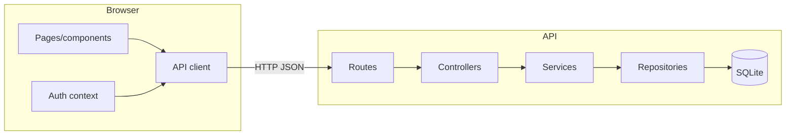

# System Architecture and Design Patterns

## ARCH-SYSTEM — Two-application architecture

```yaml artifact
id: ARCH-SYSTEM
type: architecture
title: Two-application architecture
module: system
owner: pollpulse-team
knowledge_status: approved
implementation_status: implemented
satisfies: [REQ-AUTH, REQ-POLL-CREATE, REQ-POLL-BROWSE, REQ-POLL-VOTE, REQ-POLL-CLOSE]
realized_by: [CMP-API-BOOTSTRAP, CMP-WEB-SHELL]
depends_on: [ARCH-API-LAYERS, ARCH-WEB-LAYERS, ARCH-DATA-ACCESS, SEC-JWT]
```

PollPulse is a modular monolith split into a browser application and one HTTP API. The browser never reads the database or implements authorization rules. The API owns authentication, business invariants, and persistence.



## ARCH-API-LAYERS — API controller-service-repository pattern

```yaml artifact
id: ARCH-API-LAYERS
type: architecture-pattern
title: API controller-service-repository pattern
module: api
owner: pollpulse-team
knowledge_status: approved
implementation_status: implemented
realized_by: [CMP-AUTH-CONTROLLER, CMP-AUTH-SERVICE, CMP-USERS-REPOSITORY, CMP-POLLS-CONTROLLER, CMP-POLLS-SERVICE, CMP-POLLS-REPOSITORY, CMP-VOTES-REPOSITORY]
```

Routes bind transport paths. Controllers translate HTTP input/output and errors. Services enforce use-case and domain rules. Repositories isolate SQL and row access. Dependencies flow inward from route to controller to service to repository; repositories do not call services.

JavaScript does not declare formal interfaces here, so the method contracts in `contracts/service-interfaces.md` are the stable behavioral interfaces. They prevent an implementation file from existing without being represented in the blueprint.

## ARCH-WEB-LAYERS — Web page-client pattern

```yaml artifact
id: ARCH-WEB-LAYERS
type: architecture-pattern
title: Web page-client pattern
module: web
owner: pollpulse-team
knowledge_status: approved
implementation_status: implemented
realized_by: [CMP-WEB-SHELL, CMP-WEB-API, CMP-WEB-AUTH, CMP-WEB-POLLS, CMP-WEB-POLL-VIEWS]
```

Route pages coordinate interactions, reusable components render UI, the auth context owns session state, and the API client is the only HTTP boundary. The UI may validate for usability, but the API repeats and owns every enforceable rule.

## ARCH-DATA-ACCESS — SQLite persistence boundary

```yaml artifact
id: ARCH-DATA-ACCESS
type: architecture-pattern
title: SQLite persistence boundary
module: data
owner: pollpulse-team
knowledge_status: approved
implementation_status: implemented
realized_by: [CMP-DATABASE, CMP-USERS-REPOSITORY, CMP-POLLS-REPOSITORY, CMP-VOTES-REPOSITORY]
uses: [DATA-SQLITE]
```

A single database module initializes schema and exposes the active connection. Repositories issue SQL. Multi-row poll creation is transactional, foreign keys are enabled, and database indexes back identity, ownership, listing, and one-vote invariants.

## Architectural dependency rules

- `apps/api/src/modules/*/*.routes.js` may depend on controllers and middleware.
- Controllers may depend on services and transport error translation.
- Services may depend on repositories, domain rules, and external libraries; they must not depend on Express request/response objects.
- Repositories may depend on `database.js`; they must not encode HTTP behavior.
- Web pages and components may use `core/api.js` and `core/authContext.jsx`; direct fetches outside the API client are prohibited.
- Changes to layer direction, authentication boundary, or persistence strategy require an architecture change and ADR.
