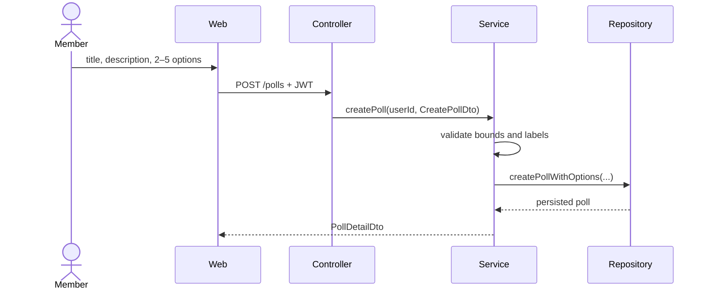

# Context Pack — TASK-POLLS-EDIT-01

> Generated. Source hash: `90331d9a16ae8129ced38317ccc2b442c3e8f98f8fe6dadd6798a64016e7d23d`. Estimated tokens: 5207/24000.

## Execution contract

- **Objective:** Finalize the poll-edit contract and execution design
- **Skill:** `design-contracts`
- **Allowed code:** `../apps/api/src/modules/polls/polls.routes.js`, `../apps/api/src/modules/polls/polls.controller.js`, `../apps/api/src/modules/polls/polls.service.js`, `../apps/api/src/modules/polls/polls.repository.js`, `../apps/web/src/pages/PollDetailPage.jsx`
- **Outputs:** Approved EditPollDto and HTTP endpoint delta, Service and repository interface delta, Executable implementation task split
- **Commands:** `node ../engine-1.3-sdlc-concept2/bin/royascaff13.js validate project .`, `npm --prefix ../apps/web run build`
- **Constraints:** Do not edit canonical knowledge during task implementation.; Reject editing once any vote exists, including concurrent first votes.; Reuse creation bounds unless the approved change explicitly replaces them.
- **Invariant:** implementation tasks do not edit canonical project knowledge.

## Required canonical context

> Source: `requirements/product.md` · hash `7947929c8b45c7db2b02d867657b9144cdcd0f6acf09969f020abd6052090a60` · direct task requirement

## REQ-SCOPE — Product boundary

```yaml artifact
id: REQ-SCOPE
type: constraint
title: Product boundary
module: system
owner: pollpulse-team
knowledge_status: approved
implementation_status: not-applicable
```

English-only operation is in scope. Email verification, password reset, OAuth, anonymous voting, administrative user management, WebSocket updates, and poll editing are outside the current system. Poll editing is represented only as an active v1.3 example change until implemented and reconciled.

---

> Source: `domain/model.md` · hash `1d12f5799ee150fe03a8849ce18fbadf6d36e0f245ea1bea0c9468803d39b09d` · direct task requirement

## DOM-POLL — Poll

```yaml artifact
id: DOM-POLL
type: aggregate-root
title: Poll
module: polls
owner: pollpulse-team
knowledge_status: approved
implementation_status: implemented
constrained_by: [REQ-POLL-CREATE, REQ-POLL-CLOSE]
maps_to: [DATA-POLLS, CTR-POLL-DETAIL]
```

The Poll aggregate owns its options and governs creation, voting availability, and closure. Its status is `open` or `closed`; its creator is the only member allowed to close it.

---

> Source: `architecture/system.md` · hash `84ed43d17858fc01a06d45a62d3e21bdc10e40d04eecc3de91d38fdfeb344a92` · direct task requirement

## ARCH-API-LAYERS — API controller-service-repository pattern

```yaml artifact
id: ARCH-API-LAYERS
type: architecture-pattern
title: API controller-service-repository pattern
module: api
owner: pollpulse-team
knowledge_status: approved
implementation_status: implemented
realized_by: [CMP-AUTH-CONTROLLER, CMP-AUTH-SERVICE, CMP-USERS-REPOSITORY, CMP-POLLS-CONTROLLER, CMP-POLLS-SERVICE, CMP-POLLS-REPOSITORY, CMP-VOTES-REPOSITORY]
```

Routes bind transport paths. Controllers translate HTTP input/output and errors. Services enforce use-case and domain rules. Repositories isolate SQL and row access. Dependencies flow inward from route to controller to service to repository; repositories do not call services.

JavaScript does not declare formal interfaces here, so the method contracts in `contracts/service-interfaces.md` are the stable behavioral interfaces. They prevent an implementation file from existing without being represented in the blueprint.

---

> Source: `contracts/http-api.md` · hash `3d7fb1ac23684473849e5a3fdd29ac3ea1290469ccc51d76cedf6ebb4a7e4c0c` · direct task requirement

## CTR-HTTP-API — PollPulse HTTP API

```yaml artifact
id: CTR-HTTP-API
type: interface
title: PollPulse HTTP API
module: api
owner: pollpulse-team
knowledge_status: approved
implementation_status: implemented
uses: [CTR-REGISTER, CTR-LOGIN, CTR-AUTH-RESPONSE, CTR-USER, CTR-CREATE-POLL, CTR-VOTE, CTR-POLL-DETAIL, CTR-PAGINATED-POLLS, CTR-ERROR]
implemented_by: [CMP-API-BOOTSTRAP, CMP-AUTH-CONTROLLER, CMP-POLLS-CONTROLLER]
```

All bodies are JSON. Protected routes require a bearer JWT. Error status is expressed by HTTP status and the `CTR-ERROR` envelope.

| Method | Route | Auth | Request | Success |
|---|---|---|---|---|
| GET | `/health` | public | — | `200 {status: "ok"}` |
| POST | `/auth/register` | public | `CTR-REGISTER` | `201 CTR-AUTH-RESPONSE` |
| POST | `/auth/login` | public | `CTR-LOGIN` | `200 CTR-AUTH-RESPONSE` |
| GET | `/auth/me` | bearer | — | `200 CTR-USER` |
| POST | `/polls` | bearer | `CTR-CREATE-POLL` | `201 CTR-POLL-DETAIL` |
| GET | `/polls?page&limit` | bearer | query | `200 CTR-PAGINATED-POLLS` |
| GET | `/polls/:id` | bearer | path | `200 CTR-POLL-DETAIL` |
| POST | `/polls/:id/vote` | bearer | `CTR-VOTE` | `200 CTR-POLL-DETAIL` |
| POST | `/polls/:id/close` | bearer | path | `200 CTR-POLL-DETAIL` |

---

> Source: `contracts/http-api.md` · hash `47b6fdecabf86832f93e8d82fa42253f224a5dad308e02a265ff6a1b03713d35` · direct task requirement

## CTR-CREATE-POLL — CreatePollDto

```yaml artifact
id: CTR-CREATE-POLL
type: request-dto
title: CreatePollDto
module: polls
owner: pollpulse-team
knowledge_status: approved
implementation_status: implemented
maps_to: [DOM-POLL]
```

`{ title: string, description?: string, options: string[] }`. Options contain 2–5 non-empty labels.

---

> Source: `contracts/service-interfaces.md` · hash `81d06f627ccf63d02aeeeddafc17140c569aab2cbf5c6f13d41d8857c4f8e976` · direct task requirement

## IFACE-POLLS-SERVICE — Polls service interface

```yaml artifact
id: IFACE-POLLS-SERVICE
type: service-interface
title: Polls service interface
module: polls
owner: pollpulse-team
knowledge_status: approved
implementation_status: implemented
satisfies: [REQ-POLL-CREATE, REQ-POLL-BROWSE, REQ-POLL-VOTE, REQ-POLL-CLOSE]
uses: [CTR-CREATE-POLL, CTR-VOTE, CTR-POLL-DETAIL, CTR-PAGINATED-POLLS, IFACE-POLLS-REPOSITORY, IFACE-VOTES-REPOSITORY]
realized_by: [CMP-POLLS-SERVICE]
```

| Operation | Input | Output | Principal rules |
|---|---|---|---|
| `createPoll(userId, dto)` | authenticated user, `CreatePollDto` | `PollDetailDto` | title/description bounds, 2–5 options |
| `listPolls(query)` | page and limit strings | paginated polls | page ≥ 1; limit 1–50 |
| `getPoll(id, userId)` | poll and viewer | `PollDetailDto` | poll must exist |
| `castVote(userId, pollId, dto)` | member, poll, `VoteDto` | updated `PollDetailDto` | open poll, owned option, no earlier vote |
| `closePoll(userId, pollId)` | member and poll | updated `PollDetailDto` | creator only, idempotent |

---

> Source: `contracts/service-interfaces.md` · hash `afcff3b4fab2cf01781b41b2b500bb10a323b5b9cf82746fc2e860d91eabfe86` · direct task requirement

## IFACE-POLLS-REPOSITORY — Polls repository interface

```yaml artifact
id: IFACE-POLLS-REPOSITORY
type: repository-interface
title: Polls repository interface
module: polls
owner: pollpulse-team
knowledge_status: approved
implementation_status: implemented
uses: [DATA-POLLS, DATA-POLL-OPTIONS, DATA-VOTES]
realized_by: [CMP-POLLS-REPOSITORY]
```

Exports `createPollWithOptions(poll, options)`, `findAll({page,limit})`, `findById(id)`, `updateStatus(id,status,closedAt)`, and `mapPollDetail(result,userId,userVote)`. Creation is atomic across the poll and its options.

---

> Source: `workflows/polls.md` · hash `888e6532499d877d248cb64f3b66444f70b5c8d0ad361cd3351db0ed7de8ed90` · direct task requirement

## WF-CREATE-POLL — Create a poll

```yaml artifact
id: WF-CREATE-POLL
type: workflow
title: Create a poll
module: polls
owner: pollpulse-team
knowledge_status: approved
implementation_status: implemented
satisfies: [REQ-POLL-CREATE]
uses: [CTR-CREATE-POLL, CTR-POLL-DETAIL]
implemented_by: [CMP-POLLS-CONTROLLER, CMP-POLLS-SERVICE, CMP-POLLS-REPOSITORY, CMP-WEB-POLLS]
```



---

> Source: `implementation/components.md` · hash `d269fbbd86de4fa9fd4d6f43313e54fb0bcaf58e82bc4756c221473c0d049c22` · direct task requirement

## CMP-POLLS-CONTROLLER — Poll routes and controller

```yaml artifact
id: CMP-POLLS-CONTROLLER
type: component
title: Poll routes and controller
module: polls
owner: pollpulse-team
knowledge_status: approved
implementation_status: implemented
implements: [ARCH-API-LAYERS, CTR-HTTP-API]
uses: [IFACE-POLLS-SERVICE, SEC-JWT]
depends_on: [CMP-POLLS-SERVICE]
```

Owns protected poll routes and translates request principals, parameters, query strings, bodies, responses, and errors.

---

> Source: `implementation/components.md` · hash `8ae940b1fe65afd0fa872e951c73544eb2d6a84b5120ef070f6d0a248a67bbc5` · direct task requirement

## CMP-POLLS-SERVICE — Polls service

```yaml artifact
id: CMP-POLLS-SERVICE
type: service
title: Polls service
module: polls
owner: pollpulse-team
knowledge_status: approved
implementation_status: implemented
implements: [IFACE-POLLS-SERVICE]
depends_on: [CMP-POLLS-REPOSITORY, CMP-VOTES-REPOSITORY]
```

Enforces poll creation, listing bounds, voting invariants, results lookup, and owner-only idempotent closure.

---

> Source: `implementation/components.md` · hash `53e98c6956181d9a60b354f0715a3e9c7802967e890ed3a24516a08bec834bd8` · direct task requirement

## CMP-POLLS-REPOSITORY — Polls repository

```yaml artifact
id: CMP-POLLS-REPOSITORY
type: repository
title: Polls repository
module: polls
owner: pollpulse-team
knowledge_status: approved
implementation_status: implemented
implements: [IFACE-POLLS-REPOSITORY, ARCH-DATA-ACCESS]
depends_on: [CMP-DATABASE]
```

Persists poll aggregates transactionally, queries lists and details, updates status, and maps aggregate results with percentages.

---

> Source: `implementation/components.md` · hash `d242b38a67c347a199776a183340a0d2e5126b5894dc36cf6583c5c98faa98e6` · direct task requirement

## CMP-WEB-POLLS — Web polls feature

```yaml artifact
id: CMP-WEB-POLLS
type: component
title: Web polls feature
module: polls
owner: pollpulse-team
knowledge_status: approved
implementation_status: implemented
implements: [ARCH-WEB-LAYERS]
uses: [CTR-CREATE-POLL, CTR-VOTE, CTR-POLL-DETAIL, CTR-PAGINATED-POLLS]
depends_on: [CMP-WEB-API, CMP-WEB-POLL-VIEWS]
```

Owns dashboard, poll list, creation, and detail interaction pages.

---

> Source: `implementation/test-intents.md` · hash `b786b4df986e03a18f72bbda7deaea8a2c2be8b40f9a4a92fe01bdcbf0a389ad` · direct task requirement

## TEST-POLLS — Poll verification intent

```yaml artifact
id: TEST-POLLS
type: test-intent
title: Poll verification intent
module: polls
owner: pollpulse-team
knowledge_status: approved
implementation_status: planned
verifies: [REQ-POLL-CREATE, REQ-POLL-BROWSE, REQ-POLL-VOTE, REQ-POLL-CLOSE, WF-CREATE-POLL, WF-VOTE, WF-CLOSE-POLL, IFACE-POLLS-SERVICE]
```

Automate creation bounds, pagination limits, detail/results mapping, wrong-poll option rejection, closed-poll rejection, duplicate/concurrent vote rejection, non-owner closure rejection, owner closure, and idempotent repeated closure. Add browser paths for route protection, creation, voting, results, and close visibility.

---

> Source: `requirements/product.md` · hash `673309d6b47596b7dc9f6497a71274c800a2cd1b203eb558d98a8ce6fa1e242a` · required by DOM-POLL.constrained_by

## REQ-POLL-CREATE — Create a poll

```yaml artifact
id: REQ-POLL-CREATE
type: requirement
title: Create a poll
module: polls
owner: pollpulse-team
knowledge_status: approved
implementation_status: implemented
realized_by: [WF-CREATE-POLL]
implemented_by: [CMP-POLLS-SERVICE, CMP-WEB-POLLS]
verified_by: [TEST-POLLS]
```

An authenticated member can create an open poll with a title of 1–200 characters, an optional description of at most 1000 characters, and 2–5 non-empty answer labels.

---

> Source: `requirements/product.md` · hash `781a4384bca85a47a233adab8f9a75054e3b45746414eb6f13c6a70ff5a7495b` · required by DOM-POLL.constrained_by

## REQ-POLL-CLOSE — Close an owned poll

```yaml artifact
id: REQ-POLL-CLOSE
type: requirement
title: Close an owned poll
module: polls
owner: pollpulse-team
knowledge_status: approved
implementation_status: implemented
realized_by: [WF-CLOSE-POLL]
implemented_by: [CMP-POLLS-SERVICE, CMP-WEB-POLLS]
verified_by: [TEST-POLLS]
```

Only the creator can close a poll. Closing records `closed_at`, prevents later voting, and is idempotent when the poll is already closed.

---

> Source: `data/sqlite.md` · hash `d59edf16f5e42357a9c93a50661817c89fb4a21107cdc05e5300db2510a9bd80` · required by DOM-POLL.maps_to

## DATA-POLLS — polls table

```yaml artifact
id: DATA-POLLS
type: data-model
title: polls table
module: polls
owner: pollpulse-team
knowledge_status: approved
implementation_status: implemented
maps_to: [DOM-POLL]
depends_on: [DATA-USERS]
```

Columns: `id` TEXT primary key; `title` required; nullable `description`; `status` constrained to `open|closed` and defaulting to `open`; `created_by` required foreign key to users; `created_at` required; nullable `closed_at`. Indexes cover `status` and `created_by`.

---

> Source: `contracts/http-api.md` · hash `bac3a015db3ba93a9a24677bcbccb2d4437ea1a3c5a000deed1975f1825046df` · required by DOM-POLL.maps_to

## CTR-POLL-DETAIL — PollDetailDto

```yaml artifact
id: CTR-POLL-DETAIL
type: response-dto
title: PollDetailDto
module: polls
owner: pollpulse-team
knowledge_status: approved
implementation_status: implemented
maps_to: [DOM-POLL, DOM-POLL-OPTION, DOM-VOTE]
```

Contains poll identity, title, optional description, status, creator summary, timestamps, total votes, current user's vote, and ordered options with `id`, `label`, `sortOrder`, `voteCount`, and `percentage`.

---

> Source: `implementation/components.md` · hash `adfcd593e8ab0d43be6b8d7462c67e3edc5abfc6542e9b0745c54b922219bd1c` · required by CTR-HTTP-API.implemented_by

## CMP-API-BOOTSTRAP — API bootstrap and common transport

```yaml artifact
id: CMP-API-BOOTSTRAP
type: component
title: API bootstrap and common transport
module: api
owner: pollpulse-team
knowledge_status: approved
implementation_status: implemented
implements: [ARCH-SYSTEM, CTR-HTTP-API]
depends_on: [CMP-DATABASE, CMP-AUTH-CONTROLLER, CMP-POLLS-CONTROLLER]
```

Loads configuration, initializes the database, configures CORS and JSON parsing, mounts health/auth/polls routes, translates `AppError`, and starts Express.

---

> Source: `implementation/components.md` · hash `7d4c5636a6fc298445648308dc8ff2660cb13651e7609f5fd0af4d5a82870b66` · required by CTR-HTTP-API.implemented_by

## CMP-AUTH-CONTROLLER — Auth routes and controller

```yaml artifact
id: CMP-AUTH-CONTROLLER
type: component
title: Auth routes and controller
module: auth
owner: pollpulse-team
knowledge_status: approved
implementation_status: implemented
implements: [ARCH-API-LAYERS, CTR-HTTP-API]
uses: [IFACE-AUTH-SERVICE, SEC-JWT]
depends_on: [CMP-AUTH-SERVICE]
```

Owns `/auth/register`, `/auth/login`, `/auth/me`, request translation, response status, and bearer authentication middleware integration.

---

> Source: `requirements/product.md` · hash `d82cba2a58c419fad2aa1f2d03527c34404424de11c6bb74c63176235763ceaf` · required by IFACE-POLLS-SERVICE.satisfies

## REQ-POLL-BROWSE — Browse polls and results

```yaml artifact
id: REQ-POLL-BROWSE
type: requirement
title: Browse polls and results
module: polls
owner: pollpulse-team
knowledge_status: approved
implementation_status: implemented
implemented_by: [CMP-POLLS-SERVICE, CMP-WEB-POLLS, CMP-WEB-POLL-VIEWS]
verified_by: [TEST-POLLS]
```

Authenticated members can browse paginated open and closed polls, open poll detail, and see per-option counts and percentages. Percentages are rounded to one decimal place; all options show zero percent when there are no votes.

---

> Source: `requirements/product.md` · hash `6aa7771e0139c38e546be162fe37538c1509597a3adef1617817356eeef7bf33` · required by IFACE-POLLS-SERVICE.satisfies

## REQ-POLL-VOTE — Cast one immutable vote

```yaml artifact
id: REQ-POLL-VOTE
type: requirement
title: Cast one immutable vote
module: polls
owner: pollpulse-team
knowledge_status: approved
implementation_status: implemented
realized_by: [WF-VOTE]
implemented_by: [CMP-POLLS-SERVICE, CMP-VOTES-REPOSITORY, CMP-WEB-POLLS]
verified_by: [TEST-POLLS]
```

An authenticated member can vote for an option belonging to an open poll. Each member can vote at most once per poll and cannot change the vote. Both service rules and the database uniqueness constraint protect this invariant.

---

> Source: `architecture/system.md` · hash `7b72fe69431530393a9ad31e58ba53a7f101660bc22b19c9a828da490e5f5db7` · required by CMP-POLLS-REPOSITORY.implements

## ARCH-DATA-ACCESS — SQLite persistence boundary

```yaml artifact
id: ARCH-DATA-ACCESS
type: architecture-pattern
title: SQLite persistence boundary
module: data
owner: pollpulse-team
knowledge_status: approved
implementation_status: implemented
realized_by: [CMP-DATABASE, CMP-USERS-REPOSITORY, CMP-POLLS-REPOSITORY, CMP-VOTES-REPOSITORY]
uses: [DATA-SQLITE]
```

A single database module initializes schema and exposes the active connection. Repositories issue SQL. Multi-row poll creation is transactional, foreign keys are enabled, and database indexes back identity, ownership, listing, and one-vote invariants.

---

> Source: `architecture/system.md` · hash `a7aa51d975378c74ffa1998990636d731ae9838588edaeaac5738eca36764ded` · required by CMP-WEB-POLLS.implements

## ARCH-WEB-LAYERS — Web page-client pattern

```yaml artifact
id: ARCH-WEB-LAYERS
type: architecture-pattern
title: Web page-client pattern
module: web
owner: pollpulse-team
knowledge_status: approved
implementation_status: implemented
realized_by: [CMP-WEB-SHELL, CMP-WEB-API, CMP-WEB-AUTH, CMP-WEB-POLLS, CMP-WEB-POLL-VIEWS]
```

Route pages coordinate interactions, reusable components render UI, the auth context owns session state, and the API client is the only HTTP boundary. The UI may validate for usability, but the API repeats and owns every enforceable rule.

## Optional context

> Source: `decisions/ADR-001-layered-modular-monolith.md` · hash `ffc21b0d8205c87fdaf9d8d5cc0c77488ea9921df8c646fc5d5b9c182e8b8ab3` · optional task context

## ADR-LAYERED — Layered modular monolith

```yaml artifact
id: ADR-LAYERED
type: decision
title: Layered modular monolith
module: system
owner: pollpulse-team
knowledge_status: approved
implementation_status: not-applicable
affects: [ARCH-SYSTEM, ARCH-API-LAYERS, ARCH-WEB-LAYERS]
```

**Decision:** Keep one deployable Express API organized into auth and polls modules, with controller → service → repository dependencies, plus one React client.

**Why:** The reference product is small and benefits from explicit boundaries without distributed-system overhead. Services remain visible contracts rather than undocumented implementation files.

**Consequences:** Deployment and local learning are simple. Modules still share a process and database, so future independent scaling would require another architecture decision and migration.

---

> Source: `data/sqlite.md` · hash `25d2c972ae6f21d7f08f4265be2e2d43dccb6396feae0f31e394c79bf3c7a719` · optional task context

## DATA-POLL-OPTIONS — poll_options table

```yaml artifact
id: DATA-POLL-OPTIONS
type: data-model
title: poll_options table
module: polls
owner: pollpulse-team
knowledge_status: approved
implementation_status: implemented
maps_to: [DOM-POLL-OPTION]
depends_on: [DATA-POLLS]
```

Columns: `id` TEXT primary key; `poll_id` required cascading foreign key; `label` required; `sort_order` required integer. An index covers `poll_id`.

---

> Source: `contracts/http-api.md` · hash `7737464f6889086455cd5a21b7d2d95705f09894d2aa8361cec0cfe99c9c3a3e` · optional one-hop from CTR-HTTP-API.uses

## CTR-REGISTER — RegisterDto

```yaml artifact
id: CTR-REGISTER
type: request-dto
title: RegisterDto
module: auth
owner: pollpulse-team
knowledge_status: approved
implementation_status: implemented
maps_to: [DOM-USER]
```

`{ name: string, email: string, password: string }`. Name and email are required; password has a minimum length of eight.

---

> Source: `contracts/http-api.md` · hash `5dc8f868dacc336836dab5639564cac8ebcebc5886a855359f4f899f98d3e890` · optional one-hop from CTR-HTTP-API.uses

## CTR-LOGIN — LoginDto

```yaml artifact
id: CTR-LOGIN
type: request-dto
title: LoginDto
module: auth
owner: pollpulse-team
knowledge_status: approved
implementation_status: implemented
```

`{ email: string, password: string }`.

---

> Source: `contracts/http-api.md` · hash `ce34da2161fc99ae81e396fc92788fdd04b625bc3ddceaa7a5b7eac75dc22ff8` · optional one-hop from CTR-HTTP-API.uses

## CTR-AUTH-RESPONSE — AuthResponse

```yaml artifact
id: CTR-AUTH-RESPONSE
type: response-dto
title: AuthResponse
module: auth
owner: pollpulse-team
knowledge_status: approved
implementation_status: implemented
uses: [CTR-USER]
```

`{ token: string, user: UserDto }`.

---

> Source: `contracts/http-api.md` · hash `0586cdb64419ff4f72f355d84ee149cbe609d3e15a23c0d1aa53a43dbe4a1b53` · optional one-hop from CTR-HTTP-API.uses

## CTR-USER — UserDto

```yaml artifact
id: CTR-USER
type: response-dto
title: UserDto
module: auth
owner: pollpulse-team
knowledge_status: approved
implementation_status: implemented
maps_to: [DOM-USER]
```

`{ id: string, name: string, email: string, createdAt: string }`. The password hash is never part of this contract.

---

> Source: `contracts/http-api.md` · hash `209f8e43cd5882fc9e6c53d74ed28d49c7ae59231576ef8b2ba873cee97222eb` · optional one-hop from CTR-HTTP-API.uses

## CTR-VOTE — VoteDto

```yaml artifact
id: CTR-VOTE
type: request-dto
title: VoteDto
module: polls
owner: pollpulse-team
knowledge_status: approved
implementation_status: implemented
maps_to: [DOM-VOTE]
```

`{ optionId: string }`.

---

> Source: `contracts/http-api.md` · hash `04d965ecc7f00f4b473d8187db88384f1de8e8c7c9c7208373a2764a13a696b5` · optional one-hop from CTR-HTTP-API.uses

## CTR-PAGINATED-POLLS — PaginatedPollsResponse

```yaml artifact
id: CTR-PAGINATED-POLLS
type: response-dto
title: PaginatedPollsResponse
module: polls
owner: pollpulse-team
knowledge_status: approved
implementation_status: implemented
uses: [CTR-POLL-DETAIL]
```

`{ data: PollSummaryDto[], page: number, limit: number, total: number }` where each summary exposes identity, title, status, creator, timestamps, and total vote count.

---

> Source: `contracts/http-api.md` · hash `07920aa82ab237a2e53c187d4f04acfc78fe3a841a2d8f030a3495105b038b3e` · optional one-hop from CTR-HTTP-API.uses

## CTR-ERROR — ErrorResponse

```yaml artifact
id: CTR-ERROR
type: response-dto
title: ErrorResponse
module: common
owner: pollpulse-team
knowledge_status: approved
implementation_status: implemented
```

`{ error: string }`. Validation and domain violations use 400, authentication uses 401, ownership uses 403, missing resources use 404, duplicates use 409, and unexpected failures use 500.

---

> Source: `contracts/service-interfaces.md` · hash `866f1e9cde2814961c91e09942ac3f94d1bef5d7af0cdc3c086598817dbf7a82` · optional one-hop from IFACE-POLLS-SERVICE.uses

## IFACE-VOTES-REPOSITORY — Votes repository interface

```yaml artifact
id: IFACE-VOTES-REPOSITORY
type: repository-interface
title: Votes repository interface
module: polls
owner: pollpulse-team
knowledge_status: approved
implementation_status: implemented
uses: [DATA-VOTES]
realized_by: [CMP-VOTES-REPOSITORY]
```

Exports `create({pollId,optionId,userId})` and `findByPollAndUser(pollId,userId)`. Database uniqueness remains the final concurrency-safe guard for one vote per member and poll.

---

> Source: `data/sqlite.md` · hash `c9db36d7e09260239c9191f3b8f56626f7d7dff17c618affb965dc867dc50583` · optional one-hop from IFACE-POLLS-REPOSITORY.uses

## DATA-VOTES — votes table

```yaml artifact
id: DATA-VOTES
type: data-model
title: votes table
module: polls
owner: pollpulse-team
knowledge_status: approved
implementation_status: implemented
maps_to: [DOM-VOTE]
depends_on: [DATA-POLLS, DATA-POLL-OPTIONS, DATA-USERS]
```

Columns: `id` TEXT primary key; `poll_id`, `option_id`, and `user_id` required foreign keys; `created_at` required. The unique index on `(poll_id, user_id)` enforces one vote. Cascades remove votes when their poll or option is deleted.

---

> Source: `architecture/security.md` · hash `d021e6fe5a5ba43b180ffb2b12b2a3b8f82a48d4a773eb5bb300adfc6cf28ea2` · optional one-hop from CMP-POLLS-CONTROLLER.uses

## SEC-JWT — Bearer JWT authentication

```yaml artifact
id: SEC-JWT
type: security-control
title: Bearer JWT authentication
module: auth
owner: pollpulse-team
knowledge_status: approved
implementation_status: implemented
satisfies: [REQ-AUTH]
realized_by: [CMP-AUTH-SERVICE, CMP-AUTH-CONTROLLER, CMP-WEB-API, CMP-WEB-AUTH]
depends_on: [ADR-JWT]
```

The API signs seven-day JWTs whose payload contains `sub` and `email`. Protected routes require `Authorization: Bearer <token>`. The browser stores the token in local storage and the central API client attaches it. Invalid or expired tokens return 401.

Passwords are bcrypt hashes with cost 10. API responses are allow-listed DTOs that never include `password_hash`. Login failures use a generic response. The creator identity used to close a poll comes from the verified token, never the request body.

Known demo limitation: local-storage tokens are exposed to successful cross-site scripting. Production adoption should evaluate secure cookies, CSRF controls, rate limiting, secret rotation, and structured security logging.

---

> Source: `implementation/components.md` · hash `bfcf4db5a4273e4976c6209261a45ad9753706eddc45161959ef17f21c0b0708` · optional one-hop from CMP-POLLS-SERVICE.depends_on

## CMP-VOTES-REPOSITORY — Votes repository

```yaml artifact
id: CMP-VOTES-REPOSITORY
type: repository
title: Votes repository
module: polls
owner: pollpulse-team
knowledge_status: approved
implementation_status: implemented
implements: [IFACE-VOTES-REPOSITORY, ARCH-DATA-ACCESS]
depends_on: [CMP-DATABASE]
```

Creates immutable votes and finds a member's existing vote for a poll.

---

> Source: `implementation/components.md` · hash `10cce3ed8647c5e12575643825cadcc7b731ebfb1cb9d2439c3a2a9af6105774` · optional one-hop from CMP-POLLS-REPOSITORY.depends_on

## CMP-DATABASE — Database initializer

```yaml artifact
id: CMP-DATABASE
type: component
title: Database initializer
module: data
owner: pollpulse-team
knowledge_status: approved
implementation_status: implemented
implements: [ARCH-DATA-ACCESS, DATA-SQLITE]
```

Creates the SQLite directory, connection, schema, constraints, and indexes, and exposes the initialized connection to repositories.

---

> Source: `implementation/components.md` · hash `04ea19879d03cc0cef34624919c893abc562efd0f4a1fa71e493eae1ef9fb8db` · optional one-hop from CMP-WEB-POLLS.depends_on

## CMP-WEB-API — Web API client

```yaml artifact
id: CMP-WEB-API
type: adapter
title: Web API client
module: web
owner: pollpulse-team
knowledge_status: approved
implementation_status: implemented
implements: [ARCH-WEB-LAYERS, CTR-HTTP-API]
```

Centralizes the base URL, JSON transport, bearer token attachment, and error decoding for every browser HTTP call.

---

> Source: `implementation/components.md` · hash `e4a35ce4ec97a7b22d961b875669bfb5c209c218e8bedb2d3e67f841ae18114f` · optional one-hop from CMP-WEB-POLLS.depends_on

## CMP-WEB-POLL-VIEWS — Poll presentation components

```yaml artifact
id: CMP-WEB-POLL-VIEWS
type: component
title: Poll presentation components
module: polls
owner: pollpulse-team
knowledge_status: approved
implementation_status: implemented
implements: [ARCH-WEB-LAYERS]
uses: [CTR-POLL-DETAIL]
```

Renders poll cards and per-option result bars with counts and percentages.

## Code locations

- `../apps/api/src/modules/polls/polls.routes.js`
- `../apps/api/src/modules/polls/polls.controller.js`
- `../apps/api/src/modules/polls/polls.service.js`
- `../apps/api/src/modules/polls/polls.repository.js`
- `../apps/web/src/pages/PollDetailPage.jsx`
