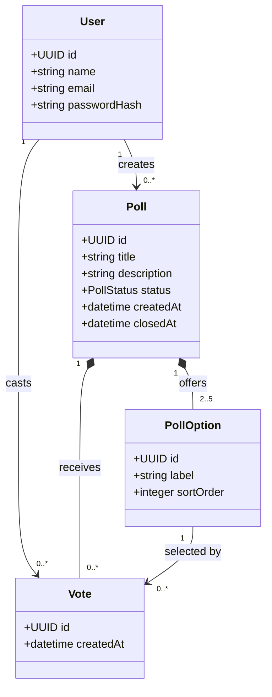

# Conceptual Domain Model



## DOM-USER — User

```yaml artifact
id: DOM-USER
type: domain-entity
title: User
module: auth
owner: pollpulse-team
knowledge_status: approved
implementation_status: implemented
maps_to: [DATA-USERS, CTR-USER]
```

An authenticated team member. Email is the normalized unique identity; `passwordHash` is private persistence state. A user may create polls and cast votes.

## DOM-POLL — Poll

```yaml artifact
id: DOM-POLL
type: aggregate-root
title: Poll
module: polls
owner: pollpulse-team
knowledge_status: approved
implementation_status: implemented
constrained_by: [REQ-POLL-CREATE, REQ-POLL-CLOSE]
maps_to: [DATA-POLLS, CTR-POLL-DETAIL]
```

The Poll aggregate owns its options and governs creation, voting availability, and closure. Its status is `open` or `closed`; its creator is the only member allowed to close it.

## DOM-POLL-OPTION — Poll option

```yaml artifact
id: DOM-POLL-OPTION
type: domain-entity
title: Poll option
module: polls
owner: pollpulse-team
knowledge_status: approved
implementation_status: implemented
owned_by: [DOM-POLL]
maps_to: [DATA-POLL-OPTIONS]
```

An ordered answer label owned by one poll. A poll contains two through five options, and a vote can select only an option owned by its target poll.

## DOM-VOTE — Vote

```yaml artifact
id: DOM-VOTE
type: domain-entity
title: Vote
module: polls
owner: pollpulse-team
knowledge_status: approved
implementation_status: implemented
constrained_by: [REQ-POLL-VOTE]
maps_to: [DATA-VOTES]
depends_on: [DOM-USER, DOM-POLL, DOM-POLL-OPTION]
```

An immutable selection by one user in one poll. The `(poll, user)` pair is unique. A vote records the selected option and creation time.
