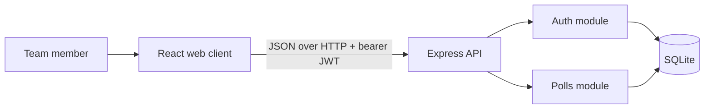

# PollPulse System Map

## SYS-POLLPULSE — PollPulse system

```yaml artifact
id: SYS-POLLPULSE
type: system
title: PollPulse system
module: system
owner: pollpulse-team
knowledge_status: approved
implementation_status: implemented
uses:
  - ARCH-SYSTEM
  - DOM-POLL
  - WF-VOTE
  - CTR-HTTP-API
  - DATA-SQLITE
  - CMP-API-BOOTSTRAP
  - CMP-WEB-SHELL
```

PollPulse lets authenticated team members create polls, cast one immutable vote per poll, inspect calculated results, and close polls they created.



## Canonical navigation

| Concern | Canonical source |
|---|---|
| Product scope and invariants | `requirements/product.md` |
| Concepts and relationships | `domain/model.md` |
| Boundaries and patterns | `architecture/system.md` |
| Security | `architecture/security.md` |
| Behavior sequences | `workflows/*.md` |
| HTTP interfaces and DTOs | `contracts/http-api.md` |
| Persistence | `data/sqlite.md` |
| Services and components | `implementation/components.md` |
| Every significant source file | `implementation/code-map.md` |
| Design rationale | `decisions/*.md` |
| Current proposals | `changes/active/` |

`indexes/` is generated navigation, not a second source of truth.
