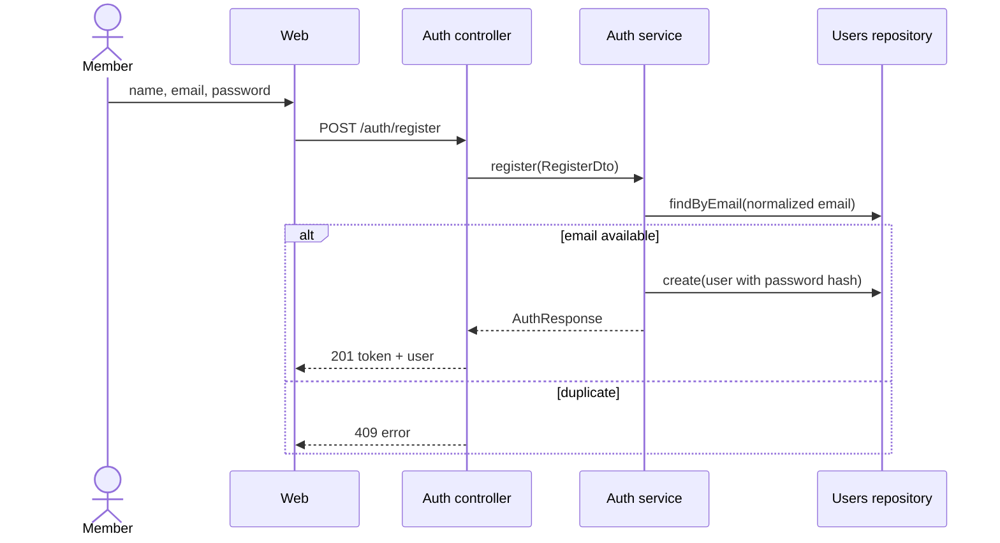
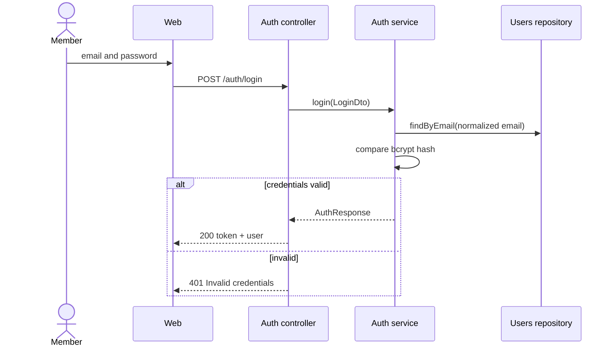

# Authentication Workflows

## WF-REGISTER — Register a member

```yaml artifact
id: WF-REGISTER
type: workflow
title: Register a member
module: auth
owner: pollpulse-team
knowledge_status: approved
implementation_status: implemented
satisfies: [REQ-AUTH]
uses: [CTR-REGISTER, CTR-AUTH-RESPONSE]
implemented_by: [CMP-AUTH-CONTROLLER, CMP-AUTH-SERVICE, CMP-USERS-REPOSITORY, CMP-WEB-AUTH]
```



## WF-LOGIN — Log in a member

```yaml artifact
id: WF-LOGIN
type: workflow
title: Log in a member
module: auth
owner: pollpulse-team
knowledge_status: approved
implementation_status: implemented
satisfies: [REQ-AUTH]
uses: [CTR-LOGIN, CTR-AUTH-RESPONSE]
implemented_by: [CMP-AUTH-CONTROLLER, CMP-AUTH-SERVICE, CMP-USERS-REPOSITORY, CMP-WEB-AUTH]
```


