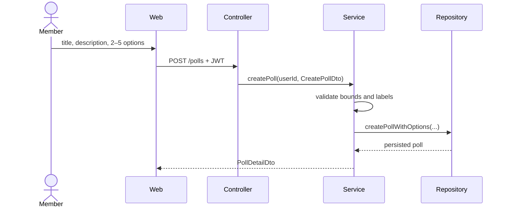
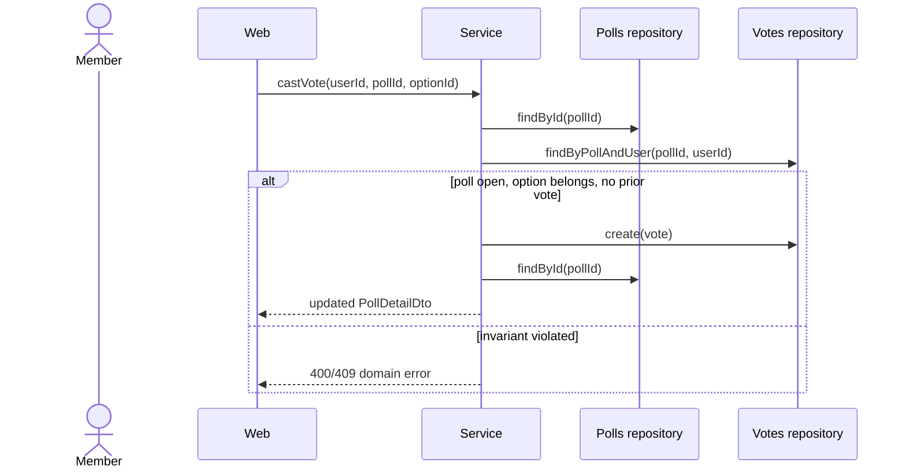

# Poll Workflows

## WF-CREATE-POLL — Create a poll

```yaml artifact
id: WF-CREATE-POLL
type: workflow
title: Create a poll
module: polls
owner: pollpulse-team
knowledge_status: approved
implementation_status: implemented
satisfies: [REQ-POLL-CREATE]
uses: [CTR-CREATE-POLL, CTR-POLL-DETAIL]
implemented_by: [CMP-POLLS-CONTROLLER, CMP-POLLS-SERVICE, CMP-POLLS-REPOSITORY, CMP-WEB-POLLS]
```



## WF-VOTE — Vote in a poll

```yaml artifact
id: WF-VOTE
type: workflow
title: Vote in a poll
module: polls
owner: pollpulse-team
knowledge_status: approved
implementation_status: implemented
satisfies: [REQ-POLL-VOTE]
uses: [CTR-VOTE, CTR-POLL-DETAIL]
implemented_by: [CMP-POLLS-CONTROLLER, CMP-POLLS-SERVICE, CMP-POLLS-REPOSITORY, CMP-VOTES-REPOSITORY, CMP-WEB-POLLS]
```



## WF-CLOSE-POLL — Close a poll

```yaml artifact
id: WF-CLOSE-POLL
type: workflow
title: Close a poll
module: polls
owner: pollpulse-team
knowledge_status: approved
implementation_status: implemented
satisfies: [REQ-POLL-CLOSE]
uses: [CTR-POLL-DETAIL]
implemented_by: [CMP-POLLS-CONTROLLER, CMP-POLLS-SERVICE, CMP-POLLS-REPOSITORY, CMP-WEB-POLLS]
```

The service loads the poll, verifies `created_by` equals the authenticated user, and—unless already closed—sets status to `closed` with the current timestamp. It returns fresh poll detail in both the new-close and already-closed cases.
