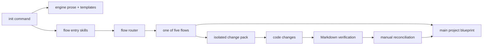

# Current Engine and Proposal Review

## Reviewed scope

This review covers the shipped v1.2.5 product and its active contract:

- `bin/royascaff.js` and package metadata;
- `engine/flow.md`, conventions, project layout, rules, templates, and all five flow files;
- all six skills under `skills/`;
- `example-v1.2/`;
- the referenced blueprint revision and the two existing v1.3 plan suites.

## What the engine is today

The CLI installs prose procedures and templates. An AI agent interprets them to create and maintain `project/`. There is no metadata parser, workflow runtime, deterministic project validator, context resolver, migration engine, or automated conformance suite in the shipped product.

The simplicity is a strength, but it means correctness currently depends on a model following long prose exactly.

## Advantages to preserve

### Change isolation

In-flight implementation belongs to the pack and does not silently rewrite the main blueprint. Main updates after verification and an explicit merge. This is the engine's strongest control.

### Vertical slices

Initial Build divides work by dependency-aware capability/module slices instead of generating all backend and then all frontend code. This is suitable for iterative delivery and bounded AI tasks.

### One implementation lifecycle

REQ-INIT and REQ-R packs reuse Change Mode implementation, verification, and merge. New workflows should continue to converge on one lifecycle rather than create new code-writing paths.

### Stable identity and traceability

`SVC-*`, `EP-*`, `PG-*`, and `VW-*` IDs create more durable references than names alone. Datetime pack IDs avoid sequential-counter collisions.

### Resume artifacts

Pack folders, the build program, change log, and status dashboard provide cross-session state without relying on a conversation transcript.

### Human control

The flows require explicit confirmation for important scope and merge decisions; silence is not approval.

### Engine purity and repository portability

Reusable method stays in `engine/`; project-specific facts stay in `project/`. Markdown can be reviewed in Git without a proprietary service.

### Reverse-engineering entry

Existing systems are supported as first-class inputs. The current implementation is too broad, but the product decision is correct.

### Rebuild intent

The requirement that `project/` should explain/rebuild the implemented system is a valuable acceptance principle. v1.3 should expand it to business meaning, architecture, contracts, quality, and operations.

## Disadvantages and risks

| Area | Current problem | Consequence |
|------|-----------------|-------------|
| SDLC coverage | The official chain begins at persistence: Data Model → Services → Endpoints → Pages/Views | AI must infer business meaning, workflows, requirements, and architecture each session |
| Runtime model | First-class records are service-centric | repositories, policies, guards, jobs, event handlers, mappers, stores, adapters, and platform code can become orphans |
| Contract model | DTOs/interfaces/events are names embedded in service/endpoint prose | boundary changes are hard to review, version, or validate |
| Architecture | Generic backend/frontend rules stand in for project-specific architecture | selected boundaries, exceptions, deployment shape, and dependency rules are not canonical |
| Quality | Verification is primarily a Markdown assertion | PASS may have no fresh command, test, inspection, or file-scope evidence |
| Context | Flows/skills instruct the agent to read broad “relevant” files | success depends on context-window size and discovery skill |
| Status | State is copied into request, pack status, change log, build program, indexes, and dashboard | stale state and merge conflicts are expected rather than exceptional |
| Main semantics | Main includes approved planned backlog but is also described as implemented reality | readers cannot distinguish knowledge approval from implementation progress without interpreting one overloaded status |
| History | Merged pack deltas remain near active work | old after-states may compete with canonical current truth |
| Genericity | Core conventions assume REST/JWT/API/web/mobile and controller→service→repository | CLI, library, worker, event, data, embedded, and ML projects fit poorly |
| Flow coverage | Refactor, migration, architecture change, reconciliation, release, and operations are not explicit intents | unlike work is forced into generic Change Mode or handled inconsistently |
| Reverse engineering | The flow asks for a deep scan of every app and contains framework appendices in core | large repos exhaust context and inferences can be overconfident |
| Skills | Six skills duplicate flow summaries and numbered steps | engine and skills can drift; capabilities are not reusable atomic procedures |
| CLI quality | The shipped CLI is a direct installer with destructive `--force` replacement and no visible automated test suite | future parser/validator work lacks a protected baseline and recoverability expectations |
| Example integrity | Some example change packs do not contain the blueprint material implied by the pack contract | it cannot be assumed to be a fully valid migration fixture without classification/repair |
| Full lifecycle | Release, deployment, observability, runbooks, recovery, and incident learning are mostly absent | the “living plan” can stop at code instead of covering operated software |

## Honest score against the stated purposes

Scale: 1 = poor, 10 = excellent.

| Purpose | Score | Reason |
|---------|:-----:|--------|
| Standard SDLC with documents | 5 | Strong build/change control; incomplete business analysis, design, quality, and operations layers |
| AI creates design and action plan | 6 | Impact/delta packs help, but architecture/contracts/tasks are under-specified |
| Code sticks to the action plan | 7 | Isolation is strong; scope and evidence enforcement are weak |
| Features keep plan/workflows current | 5 | action specs can be updated; workflows and domain meaning are not first-class |
| Small context/model independence | 4 | pack load sets help; context discovery and reverse engineering remain broad |
| Understand from files/UML then go deeper | 4 | registries exist, but there is no L0 system map or UML-driven reading path |

## Review of the referenced blueprint revision

The referenced revision is directionally strong and should be accepted as a design input.

### Strong recommendations to retain

- Concept before storage.
- Separate conceptual, domain, persistence, transport, integration, and view models.
- Components rather than treating every runtime responsibility as a service.
- First-class contracts for DTOs, interfaces, events, and provider boundaries.
- A durable code map so changed files do not disappear from the blueprint after merge.
- Project-specific architecture and selective ADRs/pattern records.
- Risk-based gates, evidence-backed PASS, single-source state, and incremental migration.
- Inventory/evidence/confidence rules for Reverse Engineer.

### Gaps to close in the new plan

1. **Requirements need a first-class layer.** Concepts and use cases are not a substitute for BRD/SRS, requirement priority, acceptance, source, and NFRs.
2. **The quality lifecycle is too late and too narrow.** Test strategy, requirement-to-test coverage, release readiness, and operational validation need durable ownership.
3. **Operations are under-modeled.** Deployable systems need conditional deployment, observability, SLO, recovery, runbook, and incident knowledge.
4. **The action plan needs an execution contract.** A list of pack files is insufficient for a weaker implementer; tasks need preconditions, allowed scope, outputs, checks, and rollback.
5. **“Every file” needs a threshold.** Significant runtime files require owners; trivial support/generated/vendor files need classifications to avoid documentation explosion.
6. **Context quality needs an explicit failure policy.** A context builder must fail/split rather than silently omit required information.
7. **Success must be evaluated across model capability.** The release should include scenario-based model-independence tests, not only document acceptance.

## Review of the existing detailed v1.3 plan suite

The existing “Markdown-first knowledge compiler” plan has a sound long-term architecture: typed artifact graph, generated indexes, context manifests, workflow/skill contracts, deterministic validation, adapters, and atomic reconciliation.

Its main delivery risk is scope. Parser/schema work, graph/indexing, context policy, workflow runtime, dozens of atomic skills, reconciliation, migration, adapters, CI, and model evaluation form a new application platform. Treating all of that as one release path delays the user-visible SDLC improvements and increases schema churn.

This new plan resolves that risk by dividing delivery into:

- a **minimum reliable core** that includes schemas, layered knowledge, validation, evidence, generated indexes, and exact-reference context building;
- later v1.3.x capability for semantic impact inference, additional adapters, richer automation, and advanced collaboration.

## Root conclusion

v1.2 is already a useful **change-control engine**. v1.3 should add a complete, progressively readable **SDLC knowledge system** and deterministic safety rails without discarding the existing control loop.

