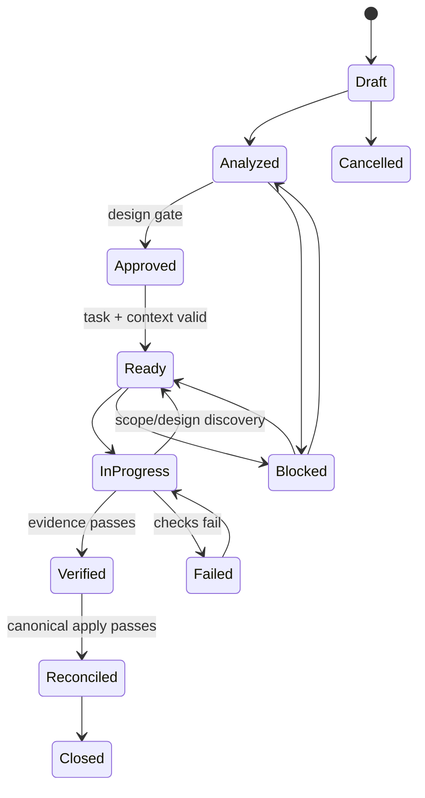

# Flow Review and Target Flow Model

## Summary

The current router and five flows are coherent around isolation, but they mix orchestration, policy, document schemas, framework discovery, and detailed procedures. v1.3 should preserve their entry points for compatibility while making them thin compositions of shared skills and deterministic actions.

## Router review

### Advantages

- Short intent table and clear prerequisites.
- Explicit resume order.
- One route for greenfield and one for existing code.
- Change, polish, and bug work require an established blueprint.

### Problems

- Intent alone determines process; risk is absent.
- Refactor, migration, architecture change, security remediation, documentation-only reconciliation, release, and incident follow-up have no precise route.
- The router names a service/endpoint/page chain that encodes one architecture family.
- Context selection after routing is still manual and broad.

### Target

```text
intent × risk × project profile × current state
  → workflow
  → required knowledge layers
  → skill sequence
  → approval/evidence policy
```

## Initial Build review

### Keep

- Bootstrap on demand; no placeholder files.
- Confirmed profile.
- Phase order before implementation.
- Planned main blueprint followed by vertical REQ-INIT packs.
- Dependency-aware pack order and hard stop after a pack.
- System-level verification after scoped verification.

### Change

- The current design begins with modules/rules/persistence and then service actions. Insert business, requirements, domain/workflows, and solution design before persistence/components.
- Do not require the entire product's detailed action map before the first implementation. Establish an approved roadmap, then fully design/materialize the next ready slice.
- The build program currently copies main slices into pack blueprints. Replace copies with a Slice Manifest plus explicit change deltas.
- Add test strategy, operational needs, release constraints, and NFRs before task planning when triggered.
- Use risk gates per slice rather than one global ceremony level.

### Target greenfield order

```text
Discover/profile
  → business brief (BRD)
  → requirements + NFRs
  → domain concepts/workflows
  → solution outline
  → roadmap
  → fully design next vertical slice
  → task plan + context pack
  → implement/verify/reconcile
  → repeat
```

## Change Mode review

### Keep

- Pack isolation and recorded baseline.
- Discovery before design.
- Impact analysis.
- After-state deltas rather than imperative merge notes.
- Implementation from the pack, verification, then reconciliation.
- Dependency metadata for multi-part work.

### Change

- Fast-track criteria currently emphasize size/file count. Replace with risk and public-behavior criteria.
- Impact must evaluate every SDLC layer as `changed`, `referenced`, `unchanged`, or `not-applicable`.
- Add requirement/workflow/design and operational impact before code files.
- Separate **design approval**, **task readiness**, **verification**, and **reconciliation**. They answer different questions.
- Pack status has multiple owners. Use one metadata record and derived views.
- Implementation discovery is not permission to change the plan. Unexpected design scope returns to analysis.
- Merge should become atomic reconciliation with a preview and post-apply validation.

## Polish review

### Keep

- A special low-ceremony path for truly presentation-only work.
- Scope expansion routes to Change Mode.
- Visual verification.

### Change

Use three profiles:

| Profile | Examples | Required artifacts |
|---------|----------|--------------------|
| Micro | copy, token-consistent spacing, small style correction | compact change metadata, targeted visual/check evidence |
| Interface | page/screen interaction or meaningful layout change | requirements/UX delta, affected UI action/component, accessibility/responsive evidence |
| System | design system, navigation, global theme, cross-app behavior | normal Change workflow with architecture/component impact |

Polish must not be determined only by “no endpoint changed.” A change to accessibility behavior, navigation meaning, or data visibility may be behavior/risk even if it touches CSS/markup only.

## Bug Fix review

### Keep

- Root-cause documentation before modification.
- Direct path for a local correction that does not change intended behavior.
- Escalation to a normal pack when blueprint impact appears.

### Change

- Current Path A/B routing is based mostly on blueprint change, module count, and migration. Add mandatory escalation for security/privacy, money, data corruption, public contract, irreversible side effects, and production-wide behavior.
- A direct fix requires a regression test or a reason plus compensating evidence.
- The expected behavior must link to a canonical requirement/workflow; if none exists, create or correct it through the change path.
- Add rollout/production validation/rollback fields when the bug exists in an operated system.
- Post-fix confirmation is not a substitute for evidence.

## Reverse Engineer review

### Keep

- Read-only discovery before remediation.
- Actual code as evidence.
- Main blueprint synthesis and REQ-R packs for gaps.
- Explicit uncertainty markers.

### Change

- “Scan every application deeply” is incompatible with bounded context. Start with inventory and work app/module checkpoints.
- The current order starts with schemas and service files, then infers the product. Use two passes:
  1. physical inventory/code map and observed entry points;
  2. evidence-backed synthesis of behavior, requirements, domain, and design.
- Every extracted claim records evidence, confidence, and review state.
- Framework detection patterns move from the core flow into adapters.
- Completion is incremental: one module can be reconciled while others remain inventoried/unreviewed.
- Generated docs must not label inferred intent `approved` or `verified`.

## Missing intents

v1.3 should explicitly route these intents without necessarily creating a separate long flow file for each:

| Intent | Why it differs | Target handling |
|--------|----------------|-----------------|
| Refactor | Behavior should remain unchanged | characterization evidence + component/code-map design; requirements marked unchanged |
| Architecture or migration | Boundaries/data/runtime topology change | Change workflow with mandatory architecture, compatibility, rollout, rollback gates |
| Reconcile drift | Code and blueprint disagree | inventory/diff → decide intended truth → reconcile or create remediation pack |
| Documentation/requirement only | No code planned | canonical knowledge change + semantic/traceability review; no implementation task |
| Release/deployment | Code may already be verified | release readiness, deployment, rollback, smoke/operational evidence |
| Incident follow-up | Production learning changes controls | incident record → corrective requirements/tasks/ADRs/runbooks |

## Common v1.3 lifecycle

All behavior-changing workflows should reuse this state machine:



`implemented` is not the same as `verified`; `verified` is not the same as `reconciled`; and `reconciled` is not necessarily `released`.

## Flow file responsibilities in v1.3

A flow file should contain only:

- entry conditions and routing;
- ordered skill/action references;
- state transitions;
- gate policy;
- required outputs;
- stop/resume rules;
- terminal conditions.

Templates own schemas. Skills own procedures. Validators own deterministic checks. Adapters own technology detection. This removes the current duplication and makes flow changes testable.

