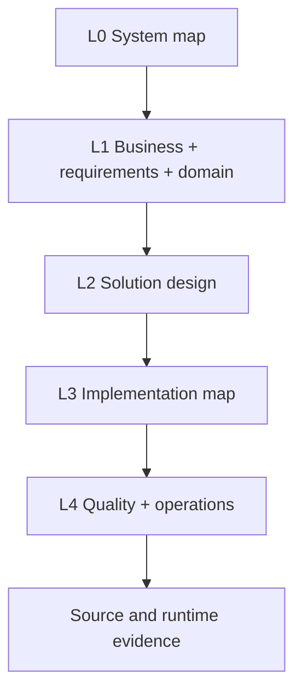

# Layered SDLC Blueprint

## Design intent

The blueprint should let a person or AI move from purpose to detail without opening the repository:



These are knowledge layers, not sequential delivery freezes. A vertical feature change may update a requirement, one workflow, one contract, two components, tests, and a runbook in the same pack.

## Layer ownership

### L0 — System map

Audience: anyone, including a new AI session.

`system-map.md` contains:

- product purpose and outcomes;
- actors/external systems;
- application/runtime boundaries;
- module/capability map;
- the most important workflows;
- deployment/operational outline when relevant;
- current release/implementation posture from generated counts;
- links to deeper canonical artifacts.

Target size: approximately 2–5k tokens. It is a map, not a second BRD/design document.

Required diagrams:

- system context;
- module/container map when more than one meaningful runtime/module exists;
- links to important workflow diagrams.

### L1 — Business, requirements, and domain

This is the BRD/SRS reasoning layer.

| Area | Owns | Does not own |
|------|------|--------------|
| Business (`01-business`) | problem, outcomes, stakeholders, scope, capabilities, business glossary, constraints | technical architecture, database fields |
| Requirements (`02-requirements`) | functional requirements, use cases, acceptance criteria, NFRs, priority/source, out-of-scope | implementation tasks and code paths |
| Domain (`03-domain`) | concepts, value rules, invariants, policies, states, events, context boundaries, workflows | transport/persistence shapes |

Required fields for a requirement:

- stable ID and statement;
- source/stakeholder;
- rationale/business outcome;
- priority;
- acceptance criteria;
- affected actors/capability/domain IDs;
- quality/security classification;
- knowledge and implementation status.

Complex workflows receive their own file when they involve multiple actors/apps, more than three meaningful states, approvals, asynchronous work, retries/timeouts, compensation, sensitive transitions, or important business value.

### L2 — Solution design

This layer records how the approved behavior will be realized.

| Design area | Trigger |
|-------------|---------|
| Architecture overview and module boundaries | always; compact for trivial projects |
| Security/privacy | authentication/authorization, sensitive data, trust boundaries, abuse/compliance risk |
| Data | persistence, data lifecycle, migration, lineage, retention, consistency |
| Contracts | public/shared/versioned boundaries, interfaces/ports, events, provider payloads, CLI/public API |
| Experience/interface | interactive UI, user journey, navigation, accessibility, content rules |
| Integration | external services or cross-system messaging |
| Quality constraints/design | identify design effects of NFRs; canonical strategy and coverage live in L4 quality |
| Runtime/deployment architecture | deployable/operated systems, jobs, scaling, topology, failure boundaries; procedures/signals live in L4 operations |
| ADRs | lasting decision, important tradeoff, exception, or supersession |

Architecture records describe the selected project, not generic advice. Generic advice stays in engine core/adapters.

### L3 — Implementation map

This layer connects design to physical software:

- component registry;
- action catalog;
- code map;
- configuration/wiring ownership;
- test catalog/mapping;
- generated/vendor/support classifications.

A **component** is a responsibility or replaceable boundary, not necessarily a class or service. An **action** is an externally or internally triggerable behavior: endpoint, command, event handler, job, workflow step, public function, page/screen interaction, migration, or pipeline stage.

A file needs its own component record when it owns business/security behavior, persistence, I/O, a public/cross-module interface, runtime entry, async behavior, replaceable infrastructure, or independent responsibility. Small private helpers attach to an owner using `supports`.

### L4 — Quality and operations

Quality is not only a temporary verification report. Durable quality knowledge includes:

- test strategy and levels;
- requirement/invariant-to-test mapping;
- quality gates and required commands;
- performance/accessibility/security/reliability targets;
- known accepted risks and quality debt.

Conditional operations knowledge includes:

- deployment and rollback strategy;
- environments/configuration ownership;
- observability/signals/alerts;
- SLOs and recovery objectives;
- runbooks;
- data backup/restore;
- release records;
- incident findings and corrective links.

## Recommended physical tree

```text
project/
  system-map.md
  profile.md

  knowledge/
    01-business/
      brd.md
      glossary.md
    02-requirements/
      requirements.md
      nfr.md
    03-domain/
      model.md
      workflows/
        <workflow>.md
    04-design/
      architecture/
        overview.md
        security.md
        decisions/
          ADR-<id>-<slug>.md
      data/
        model.md
        migrations.md
      contracts/
        <app-or-boundary>/<module>.md
      experience/
        journeys.md
      integrations.md
    05-implementation/
      components/
        <app>/<module>.md
      actions/
        <app>/<module>.md
      code-map/
        <app>/<module>.md
      tests/
        <module>.md
    06-quality/
      strategy.md
      accepted-risks.md
    07-operations/
      deployment.md
      observability.md
      runbooks/

  changes/
    active/<change-id>/
    archive/<change-id>/
  releases/
  incidents/
  generated/
    artifacts.json
    artifacts.md
    traceability.md
    status.md
    changes.md
```

The numbered directory names express reading order. Their content remains semantic and can be linked directly. If compatibility cost proves too high during schema prototyping, the same layer contract may be implemented with the existing top-level names; the ownership model is more important than the exact folder spelling.

## Compact, modular, and federated profiles

The file model must scale without forcing document noise.

| Profile | When | Split rule |
|---------|------|------------|
| Compact | small product/library, one team, few workflows | one file per layer/area; records are sections with IDs |
| Modular | multiple modules/apps or files exceed the context budget | split by module/bounded context; keep generated index |
| Federated | several teams/repositories with independent ownership | split by context/app/owner; system map and graph connect them |

Automatic/declared split triggers:

- canonical file exceeds the configured token budget;
- two different owners need independent review;
- a module has a separate release/deployment boundary;
- a context contains distinct terminology/invariants;
- parallel changes repeatedly conflict in the same file.

Do not split only to create a file per record.

## UML and diagram policy

Diagrams are navigation and validation aids, not decoration.

| Location | Preferred diagram | Required when |
|----------|-------------------|---------------|
| `system-map.md` | context/container/module map | always context; module/container when non-trivial |
| domain workflow | activity/state/sequence | complex-workflow trigger applies |
| architecture overview | component/dependency/deployment | multiple boundaries/runtimes or non-trivial dependencies |
| data design | ER/lineage | relational/linked data or pipeline lineage is important |
| security | trust-boundary/data-flow | sensitive/high-risk flow |
| operations | deployment/sequence | multi-stage deployment, failover, or recovery |

Rules:

- use Mermaid in canonical Markdown unless an adapter/tool explicitly supports another portable source;
- every diagram node maps to a canonical ID or named boundary;
- text immediately below explains non-obvious semantics;
- generated pictures are views; diagram source remains reviewable;
- validators check syntax and unresolved referenced IDs where possible;
- diagrams receive the same change impact/reconciliation treatment as prose.

## Standard SDLC without document theater

The engine enforces required facts, not ceremonial filenames. A regulated organization can export BRD/SRS/design/test/release packages. A small open-source library may keep compact Markdown sections. Both use the same IDs, relations, statuses, gates, and evidence model.

## Legacy path mapping

| v1.2 | v1.3 canonical destination |
|------|----------------------------|
| `description.md` | seed for business + requirements; legacy file becomes a pointer/superseded source after confirmed migration |
| `plan/modules.md` | capabilities/domain contexts + architecture module map |
| `plan/data-model.md` | persistence data design, linked to domain concepts |
| `rules.md` | classified into requirements, invariants, security, architecture, quality, or adapter config |
| `actions/services` | component records + operation contracts; IDs preserved |
| `actions/endpoints` | transport actions/contracts; IDs preserved |
| `actions/pages/views` | interface components/actions + experience/workflow links; IDs preserved |
| status/indexes | generated views |
