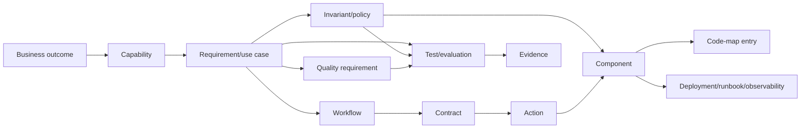

# Blueprint Types, State, and Traceability

## Three blueprint types

### Main Blueprint

The Main Blueprint is the approved current knowledge repository, entered through `project/system-map.md`.

It may contain approved work that is not implemented, so it must expose two separate state dimensions:

```yaml
knowledge_status: draft | in-review | approved | deprecated | superseded
implementation_status: not-planned | planned | partial | implemented | verified | not-applicable
```

Main owns durable facts. It does not own in-flight speculative deltas, task instructions, or historical narratives.

Approved roadmap requirements may live in Main with `implementation_status: planned`. Once an active change claims and refines one of those requirements, the change's detailed proposed after-state remains in the change overlay until reconciliation; Main continues to show the last reconciled state plus the roadmap link. This preserves both roadmap visibility and in-flight isolation.

### Slice Blueprint (Slice Manifest)

A slice is a reference-based selection across Main for one capability, workflow, change, onboarding topic, or task.

It contains:

- slice ID/purpose;
- root artifact IDs;
- selected related IDs/sections and inclusion reason;
- selected code paths/symbols/tests;
- context policy and budget;
- canonical revision/hashes;
- explicit exclusions and unresolved dependencies.

It does not own copied canonical facts. The stored Context Pack generated from it is a reproducible execution view and may be deleted/rebuilt.

### Change Blueprint

A Change Blueprint is a temporary overlay against a recorded Main baseline:

```text
request/outcome
  + affected artifact IDs
  + per-layer impact
  + proposed after-state deltas
  + decisions/compatibility/migration
  + acceptance criteria
  + execution plan
  + verification evidence
```

After verification, reconciliation applies the accepted after-state to Main. A knowledge-only change may reconcile after its required semantic/traceability review without pretending that code evidence exists. The archived change retains provenance, decisions, evidence, and links, but its deltas are excluded from normal current-state context.

## Source-of-truth rules

1. Each durable fact has one owning artifact/section.
2. Change deltas never become current merely because code was written.
3. Slice/Context Packs never become canonical.
4. Generated views declare their generator/version/source revision and reject manual canonical edits.
5. Historical packs and superseded artifacts are excluded from default resolution.
6. Developer corrections are applied to the canonical owner or recorded as an unresolved proposed change.

## Common artifact metadata

Canonical records should support:

```yaml
id: REQ-POLLS-014
kind: requirement
title: Poll creator can close voting
schema_version: 1
knowledge_status: approved
implementation_status: planned
owners: [team-polls]
reviewers: [product-owner]
relations:
  realizes: [CAP-POLLS-01]
  constrained_by: [INV-POLLS-03]
  described_by: [WF-POLLS-02]
source:
  type: developer-decision
  reference: DEC-20260820-04
updated_at: 2026-08-20T12:00:00+03:00
```

Records may live as addressable sections in a module file; YAML front matter belongs at the file/container level, with structured record blocks/tables below. The exact serialization must be prototyped before schema freeze so that Markdown remains pleasant to edit.

## Traceability graph

The current single chain becomes a directional graph:



Example:

```text
OUT-POLLS-01 informed group decisions
  → REQ-POLLS-014 creator closes a poll
    → INV-POLLS-03 only the creator may close it
    → WF-POLLS-02 vote and close lifecycle
    → CTR-POLLS-07 ClosePollCommand / response
    → ACT-POLLS-05 close-poll action (legacy EP-POLLS-05 may remain)
    → CMP-POLLS-03 PollPolicy + CMP-POLLS-04 PollService
    → code paths + tests
    → evidence on the verified revision
```

## Minimum integrity rules

- Every approved functional requirement maps to at least one workflow/action/component or has `implementation_status: not-planned` with rationale.
- Every critical invariant maps to an enforcing component and a test/evaluation.
- Every public/shared contract has owners, consumers, compatibility/version policy, and implementation links.
- Every implemented/verified component maps to source/config/test paths.
- Every significant runtime file has a blueprint owner or allowed classification.
- Every verified requirement/NFR maps to fresh evidence.
- Every changed canonical artifact records provenance through a change/reconciliation record.
- Every operationally critical component maps to signals/runbook/recovery knowledge when applicable.

## ID policy

Preserve existing v1.2 IDs. Add only IDs that unlock traceability.

| Kind | Prefix | Initial release |
|------|--------|-----------------|
| Business outcome/capability | `OUT-`, `CAP-` | optional for compact projects; at least stable named records |
| Requirement/use case | `REQ-`, `UC-` | required for behavior-changing scope |
| Concept/invariant/workflow | `CON-`, `INV-`, `WF-` | required where the artifact exists |
| Contract/component/action | `CTR-`, `CMP-`, `ACT-` | required for public/shared boundaries and blueprint-worthy runtime units |
| Legacy service/endpoint/page/view | `SVC-`, `EP-`, `PG-`, `VW-` | preserved and accepted as specialized action/component IDs |
| Decision/rule/test | `ADR-`, `RULE-`, `TEST-` | conditional/required by use |
| Change/task/evidence | `CHG-`, `TASK-`, `EVD-` | lifecycle scope |

Compact projects need not assign separate IDs to every glossary term, actor, or trivial inline contract. The traceability validator should require an ID only when the record is referenced, independently owned, public/shared, risk-critical, or implementation-bearing.

## Significant-file coverage

Code-map classifications:

| Relationship/class | Meaning |
|--------------------|---------|
| `implements` | primary implementation of an artifact |
| `defines` | contract/schema/configuration definition |
| `supports` | private helper owned by an artifact |
| `configures` | wiring, routing, dependency injection, bootstrap |
| `verifies` | test/evaluation evidence source |
| `migrates` | data/schema/system migration |
| `generated` | reproducible generated artifact with generator owner |
| `vendor` | third-party checked-in material |
| `excluded` | allowed non-runtime category declared by profile/adapter |

An unexplained created/changed runtime file is a verification failure. A generated/vendor/excluded classification without a matching profile/adapter rule is also a failure.

## Change status model

Use one canonical change metadata block:

```text
draft → analyzed → approved → ready → in-progress → verified → reconciled → closed
```

Side states: `blocked`, `failed`, `cancelled`.

The active change index, build program, dashboards, and PR summaries are generated from this record. No second status file may own a conflicting value.

## Baseline and freshness

Each change/context/evidence record includes:

- canonical blueprint revision/hash;
- source revision/hash;
- adapter/schema/validator version;
- selected artifact hashes;
- creation and verification timestamps.

If a required artifact or source baseline changes, context/evidence becomes stale and must be rebuilt/reverified.
