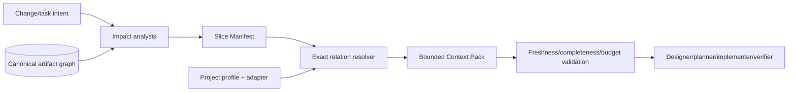

# Smart Context and Executable Action Plan

## Goal

The engine should let a modest model produce dependable code because the difficult decisions, relevant facts, constraints, and checks are already compiled into a bounded task—not because the model can read the whole repository.

```text
Better result = explicit approved design
              + complete bounded context
              + executable task contract
              + deterministic constraints
              + independent evidence
```

Prompt cleverness alone is not the strategy.

## Context pipeline



## Slice Manifest contract

A manifest records selection policy, not copied knowledge:

```yaml
id: SLICE-POLLS-CLOSE-01
purpose: implement TASK-POLLS-103
role: implementer
baseline_revision: <revision>
root_ids: [TASK-POLLS-103, REQ-POLLS-014]
required_relations:
  - constrained_by
  - described_by
  - accepts
  - returns
  - realized_by
  - implemented_by
  - verified_by
include_paths:
  - apps/api/src/modules/polls/**
exclude_history: true
max_tokens: 12000
overflow: fail-and-split
```

The default token budget is configurable. The important rule is: **required content is never silently truncated**.

## Context bands

| Band | Meaning | Agent behavior |
|------|---------|----------------|
| Must read | required to perform the task safely | included verbatim/precisely; absence blocks task |
| On demand | useful for an anticipated branch | summarized/indexed with exact retrieval pointer |
| Excluded | unrelated, historical, superseded, or prohibited scope | omitted and listed so omission is visible |

Every included artifact/section has an inclusion reason. Every required relation that cannot resolve is a validation error.

## Context Pack format

A generated Context Pack should contain:

1. integrity header: manifest ID, task/change, baseline/source hashes, schema/adapter versions;
2. objective and non-goals;
3. acceptance criteria and critical invariants;
4. relevant workflow/diagram excerpt;
5. approved design and decisions;
6. affected contracts/components/actions;
7. exact code paths/symbol anchors and code-map relationships;
8. applicable rules/NFR/security/quality/operations constraints;
9. task steps and allowed scope;
10. required commands/tests/evidence;
11. unresolved/conditional references and stop conditions;
12. sources/inclusion/exclusion manifest.

It must not contain unrelated module documentation, full historical packs, or broad framework guidance already selected by the adapter unless the task uses it.

## Role-specific context policies

The same change produces different views:

| Role | Needs | Should normally exclude |
|------|-------|-------------------------|
| Analyst | business sources, current requirements, workflows, stakeholder decisions | implementation details outside feasibility evidence |
| Designer | requirements, invariants, architecture boundaries, NFRs, current components/contracts | task-by-task code instructions |
| Planner | approved design, code map, dependencies, tests, rollout constraints | unrelated business history |
| Implementer | one task, exact contracts/constraints/paths/tests | broad roadmap, other ready tasks, archived changes |
| Verifier | acceptance/invariants/NFRs, task scope, changed files, test policy | implementer's reasoning narrative |
| Reconciler | approved deltas, evidence summary, current canonical owners, baseline | unrelated source implementation details |

## Executable action plan contract

The action plan is the primary handoff to another developer/session/model. It must be sufficient without the design chat.

### Plan header

- change ID and baseline;
- outcome/non-goals;
- intent/risk and required reviewers;
- affected canonical IDs;
- assumptions and approved decisions;
- dependencies and environment/tool prerequisites;
- Context Manifest ID;
- release/migration/rollback requirement.

### Task record

Each task contains:

| Field | Meaning |
|-------|---------|
| `TASK-*` and title | stable execution identity |
| Goal | one observable result |
| Preconditions | artifacts/dependencies/state that must exist |
| Inputs | exact IDs, code symbols/paths, fixtures |
| Allowed changes | files/areas/artifacts the task may modify |
| Forbidden inventions | public contracts, dependencies, architecture, behavior that require replanning |
| Steps | ordered implementation operations at useful granularity |
| Outputs | code/config/tests/docs/migrations expected |
| Checks | exact commands/inspections and expected evidence |
| Done when | objective task completion conditions |
| Failure/recovery | rollback, safe partial state, escalation trigger |
| Handoff | next task/state and produced references |

Example shape:

```md
### TASK-POLLS-103 — Enforce creator-only close

- Goal: close action rejects non-creators and persists `closedAt` once.
- Inputs: REQ-POLLS-014, INV-POLLS-03, WF-POLLS-02, CTR-POLLS-07, CMP-POLLS-03..04.
- Allowed paths: polls policy/service/repository, close endpoint wiring, named tests.
- Forbidden: new role model, response-shape change, unrelated poll edit behavior.
- Preconditions: migration task TASK-POLLS-102 verified in this baseline.
- Steps: add policy check; add idempotent transition; map defined domain errors; update tests.
- Checks: targeted unit/integration commands from profile; changed-file scope validator.
- Done when: AC-1..4 pass; INV-POLLS-03 maps to a passing test; no unexplained file.
- Recovery: revert task files/migration transaction; return to design if close semantics differ.
```

## Plan conformance policy

During implementation:

- a file outside `allowed changes` blocks verification until the plan is amended or the file is reverted;
- a new public contract, dependency, architecture boundary, migration, security rule, or user-visible behavior returns the change to analysis/design;
- implementation may choose local code mechanics only inside declared constraints;
- discoveries are recorded as findings, not silently solved by widening scope;
- task completion does not change canonical implementation status until verification/reconciliation.

## Overflow and missing-context behavior

If the required context exceeds budget:

1. remove only optional/on-demand material;
2. split the task along a stable boundary;
3. create dependency tasks and manifests;
4. revalidate both packs;
5. block if a safe split is impossible.

The builder must never summarize away exact contract fields, critical invariants, security rules, migration constraints, or acceptance criteria to meet a number.

## Minimum v1.3 context builder

v1.3.0 does not need semantic search or automatic architecture inference. It needs a reliable exact-reference builder:

- parse stable IDs and typed relations;
- select exact sections and declared code-map paths;
- apply role relation policies;
- include source hashes and reasons;
- count/estimate budget;
- fail on unresolved required relations or overflow;
- exclude archived/superseded material by default.

Semantic impact suggestions may be added later, but they should propose manifest additions for review rather than silently decide scope.

## Why this improves low-model results

A weaker implementer no longer needs to:

- reconstruct business rules from schemas;
- infer architecture from folder names;
- guess DTO shapes from call sites;
- remember decisions from previous chats;
- search the full blueprint for dependencies;
- decide its own definition of done.

Its job becomes bounded execution plus reporting unexpected facts. Stronger models remain valuable for analysis/design/review, but the engine no longer requires their context window for every implementation step.

