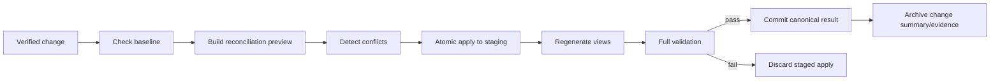

# Validation, Evidence, and Reconciliation

## Quality model

v1.3 uses three distinct checks:

```text
Structural/deterministic validity
  + execution evidence
  + semantic review
  = eligible for verification
```

Semantic confidence cannot override a deterministic failure. A passing command cannot prove that the wrong requirement was designed. Both are necessary where applicable.

## Deterministic validation groups

### Metadata and structure

- schema/version valid;
- IDs unique and allowed for artifact kind;
- required fields present;
- canonical/generated/historical path rules honored;
- no duplicate source-of-truth field.

### References and traceability

- typed relations resolve to compatible kinds;
- required requirement→design→implementation→test links exist;
- public contracts have consumers/owners/version policy;
- critical invariants/NFRs have verification links;
- no superseded/historical artifact used as current unless explicitly requested.

### State and dependency

- lifecycle transition legal;
- required approvals/reviews exist for risk level;
- dependencies are in an allowed state and code is available in the baseline;
- active artifact/path ownership does not conflict;
- context/evidence/reconciliation baseline is fresh.

### Context

- all root IDs and required relations resolve;
- selected sections/code paths exist;
- inclusion/exclusion reasons are present;
- budget is met without silent removal;
- artifact/source hashes match;
- role policy and prohibited history rules hold.

### Plan and code scope

- every changed file is allowed by a task or explicitly approved plan amendment;
- every changed runtime file has a code-map owner/classification;
- generated/vendor/excluded claims match adapter/profile rules;
- expected files/outputs exist;
- public contract/schema/migration/dependency changes are declared;
- architecture dependency rules pass available static checks.

### Evidence

- every required check has a result and evidence record;
- command exit status, revision, timestamp, scope, and tool/version are present;
- evidence matches current source/task/contract hashes;
- skipped checks include reason, compensating evidence, and accepted risk;
- Overall PASS is impossible with a blocking failure or undisposed blocking finding.

### Generated views

- indexes/status/traceability/change lists match canonical metadata;
- generated markers/version/hash valid;
- stale generated views fail validation or are regenerated.

## Evidence record

Each evidence item should capture:

```yaml
id: EVD-POLLS-220
check: TEST-POLLS-09
result: pass
revision: <source-revision>
task: TASK-POLLS-103
command: <command-id or redacted command>
exit_code: 0
started_at: <timestamp>
finished_at: <timestamp>
environment: local-test
tool_versions: {...}
artifact: evidence/<file-or-log>
summary: 14 tests passed
redactions: [tokens, personal-data]
```

Do not store secrets or uncontrolled full logs by default. Store a concise result and an artifact reference/hash; adapters may define safe capture.

Inspection/manual evidence records actor, checklist/version, inspected scope, findings, and timestamp. Screenshots include scenario, viewport/device/direction/theme, expected result, and image link/hash.

## Evidence matrix

`verify-change` produces a matrix such as:

| Requirement/invariant/NFR | Check | Result | Evidence | Fresh? | Reviewer |
|---------------------------|-------|--------|----------|--------|----------|
| REQ-POLLS-014 AC-1 | TEST-POLLS-09 | PASS | EVD-POLLS-220 | yes | verifier-id |
| INV-POLLS-03 | TEST-POLLS-10 | PASS | EVD-POLLS-221 | yes | verifier-id |
| NFR-SEC-02 | authorization inspection | PASS | EVD-POLLS-222 | yes | security-reviewer |

Coverage is more important than a list of unrelated passing commands.

## Semantic review

AI/human reviewers evaluate:

- requirement clarity/completeness and contradictions;
- workflow states/failures/compensation;
- domain invariants and ownership;
- architecture suitability and boundary leakage;
- security/privacy/abuse concerns;
- contract compatibility and data semantics;
- usability/accessibility and operational readiness;
- task plan completeness and maintainability.

Findings use severity, affected IDs, rationale, recommendation, owner, and disposition:

```text
open | accepted-risk | fixed | false-positive | deferred-with-owner
```

High/critical findings block the relevant gate unless an authorized developer/owner records risk acceptance according to policy.

## Verification result rules

| Result | Meaning |
|--------|---------|
| PASS | all blocking deterministic checks pass; required evidence fresh; blocking semantic findings resolved/accepted by authorized owner |
| FAIL | any blocking check/evidence/finding fails |
| INCOMPLETE | required check could not run or evidence is missing; not equivalent to PASS |

“Not applicable” must be justified by artifact/project profile. “Skipped” is not automatically non-blocking.

## Reconciliation pipeline

Reconciliation is a controlled canonical update, not an append/copy operation.



### Preview contains

- canonical files/record IDs to add/change/deprecate;
- before/after hashes and semantic summary;
- status transitions;
- generated views to rebuild;
- conflicts/stale baselines;
- unresolved manual decisions;
- archive/release links.

### Apply rules

1. Re-check verified source and canonical baseline.
2. Apply after-state to a staging copy/in-memory model.
3. Never append duplicate sections when a stable record owner exists.
4. Preserve IDs and record supersession/deprecation.
5. Refresh code-map/test/operations links.
6. Generate all views.
7. Run full project validation.
8. Publish all canonical changes atomically or none.
9. Mark change `reconciled` only after success.

## Plan/code drift handling

Drift categories:

| Category | Default response |
|----------|------------------|
| Code exists, blueprint missing | inventory evidence; decide whether to adopt or remediate |
| Blueprint approved, code differs | defect/change assessment; never silently rewrite requirement |
| Generated view stale | regenerate; no semantic approval needed |
| Unmerged pack implemented | resume/repair lifecycle and baseline; do not edit Main directly |
| Historical delta contradicts Main | Main wins if reconciliation provenance is valid; archive excluded |
| Ambiguous intent | developer/owner decision required |

## CLI surface for the minimum reliable core

Recommended commands:

```text
royascaff validate project
royascaff validate change <id>
royascaff validate context <manifest>
royascaff index
royascaff context build <manifest>
royascaff change transition <id> <state>
royascaff reconcile preview <id>
royascaff reconcile apply <id>
```

Commands must provide stable machine-readable output plus concise human diagnostics with artifact/path references.

## Security and safety requirements

- safe YAML parsing; no executable object construction;
- exact workspace/path boundary validation;
- command execution uses explicit profile commands, no untrusted interpolation;
- evidence redaction for secrets/PII;
- staged migration/reconciliation and recoverable failure;
- no automatic source deletion;
- diagnostics must not leak environment values/tokens;
- generated files clearly marked to avoid accidental canonical edits.

