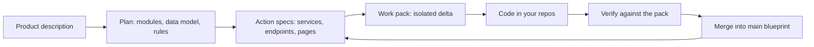

# RoyaScaff Documentation

Everything about the AI-Control engine: what it is, why it exists, how to run it, and the exact contracts it enforces.

RoyaScaff is a **control tool for AI-assisted software development**. Instead of prompting a model to "build the app," you drive it through a fixed path — product description, plan, action specs, code, verification — and the plan stays in sync with the code on every change. The whole engine is markdown. There is no runtime, no lock-in, and nothing to learn beyond the flows.

## The control loop

The loop is the product. Every flow — greenfield build, new feature, polish, bug fix, legacy onboarding — enters this loop at a different point and obeys the same isolation and verification rules.

## Reading paths

### Evaluating RoyaScaff

Start here if you want to know whether this is worth adopting.

1. [What is RoyaScaff](overview/01-what-is-royascaff.md)
2. [Why it exists](overview/02-why-it-exists.md)
3. [Benefits](overview/03-benefits.md)
4. [When to use it](overview/04-when-to-use-it.md)

### Using RoyaScaff

Start here if you have decided to build with it.

1. [Install](guides/01-install.md)
2. [Quickstart](guides/02-quickstart.md)
3. [Daily workflow](guides/03-daily-workflow.md)
4. Then the flow you need, from [flows/](#flows)

### Extending RoyaScaff

Start here if you are modifying the engine itself or need the exact contracts.

1. [Concepts and glossary](reference/01-concepts-and-glossary.md)
2. [Engine architecture](contributing/01-engine-architecture.md)
3. [Extending and releasing](contributing/02-extending-and-releasing.md)

## Full index

### Overview

| Document | What it covers |
|----------|----------------|
| [What is RoyaScaff](overview/01-what-is-royascaff.md) | Definition, the engine/project split, the five flows, the traceability chain |
| [Why it exists](overview/02-why-it-exists.md) | The failure mode of unguided AI coding and the four mechanisms that prevent it |
| [Benefits](overview/03-benefits.md) | Each benefit paired with the engine mechanism that delivers it |
| [When to use it](overview/04-when-to-use-it.md) | Good fit, poor fit, and how it differs from prompting, rules files, and spec tools |

### Guides

| Document | What it covers |
|----------|----------------|
| [Install](guides/01-install.md) | `npx royascaff init`, flags, resulting tree, local dry-run |
| [Quickstart](guides/02-quickstart.md) | Your first greenfield session end to end |
| [Daily workflow](guides/03-daily-workflow.md) | Picking a flow, the gate rhythm, resuming across chats |
| [Onboarding legacy code](guides/04-onboarding-legacy-code.md) | Running Phase R on a codebase that has no blueprint |
| [Working as a team](guides/05-working-as-a-team.md) | Parallel packs, dependencies, branches, merge hygiene |
| [Troubleshooting and FAQ](guides/06-troubleshooting-faq.md) | Common failure modes and how to recover |

### Flows

| Document | Phase | What it covers |
|----------|-------|----------------|
| [Flow router](flows/00-flow-router.md) | — | How the engine decides which flow to load, and the six slash commands |
| [Initial build](flows/01-initial-build.md) | 0–4 | Greenfield: design on main, implement via REQ-INIT packs, verify |
| [Change mode](flows/02-change-mode.md) | 5 | Features and plan-impacting work, standard and fast-track |
| [Polish](flows/03-polish.md) | P | Visual, style, and copy changes only |
| [Bug fix](flows/04-bug-fix.md) | 6 | Triage into a change pack or a direct fix |
| [Reverse engineer](flows/05-reverse-engineer.md) | R | Document an existing codebase and queue the gaps |
| [Flow UML diagrams](flows/06-flow-uml-diagrams.md) | All | Mermaid UML maps for routing, gates, branches, pack states, and handoffs |

### Reference

| Document | What it covers |
|----------|----------------|
| [Concepts and glossary](reference/01-concepts-and-glossary.md) | Engine vs project, packs, main, indexes, the rebuild test, all terms |
| [Project layout](reference/02-project-layout.md) | Bootstrap gate, full generated tree, pack layout, when each file appears |
| [Status and IDs](reference/03-status-and-ids.md) | Artifact status, pack status, bug status, rollups, ID schemes |
| [Conventions](reference/04-conventions.md) | API and frontend defaults every spec inherits |
| [Templates](reference/05-templates.md) | All 21 templates and 13 reference guides |
| [Engine rules](reference/06-engine-rules.md) | Backend and frontend coding conventions the engine enforces |
| [CLI](reference/07-cli.md) | `royascaff init` reference and package contents |
| [Verification checks](reference/08-verification-checks.md) | The 15 consistency checks, pack verification, drift reports |

### Contributing

| Document | What it covers |
|----------|----------------|
| [Engine architecture](contributing/01-engine-architecture.md) | How engine files reference each other, and the purity rule |
| [Extending and releasing](contributing/02-extending-and-releasing.md) | Adding flows, templates, and skills, plus the publish checklist |

## Source of truth

These docs describe the engine; they are not the engine. When the two disagree, the engine files win:

- [engine/flow.md](../engine/flow.md) — the router
- [engine/conventions.md](../engine/conventions.md) — global defaults
- [engine/project-layout.md](../engine/project-layout.md) — the blueprint contract
- [engine/flows/](../engine/flows/) — the five phase flows
