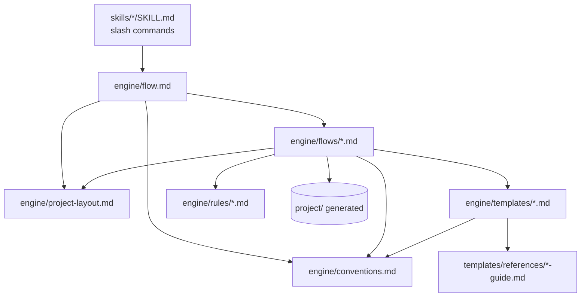

# Engine architecture

How the engine's files relate to each other, and the invariants that hold them together. Read this before modifying anything in `engine/`.

## Repository layout

```text
royascaff-v1/
  bin/royascaff.js            # the CLI - copies engine/ and skills/
  engine/
    flow.md                   # the router - entry point for every task
    conventions.md            # global defaults every spec inherits
    project-layout.md         # the blueprint contract
    flows/
      initial-build.md        # Phases 0-4
      change-mode.md          # Phase 5
      polish.md               # Phase P
      bug-fix.md              # Phase 6
      reverse-engineer.md     # Phase R
    templates/                # 21 templates
      references/             # 13 verbose guides
    rules/
      backend-rule.md
      frontend-rule.md
  skills/                     # 6 Cursor slash commands
  docs/                       # this documentation
  package.json · LICENSE · README.md
```

## How the files reference each other



Every arrow is a real reference in the files, not a conceptual one. The dependency direction matters: **flows depend on the layout contract, conventions, templates, and rules — never the reverse.** A template never tells you which flow to run.

### The four load-bearing files

| File | Role | Referenced by |
|------|------|---------------|
| [flow.md](../../engine/flow.md) | Routes to a flow; states preconditions and the resume rule | Every skill, and the AI on every task |
| [project-layout.md](../../engine/project-layout.md) | What to create and where; bootstrap gate; pack layout; ID rules | Every flow, before writing any `project/` file |
| [conventions.md](../../engine/conventions.md) | Global defaults; status model; main versus pack versus index | Every flow and most templates |
| [change-mode.md](../../engine/flows/change-mode.md) | The implementation lifecycle from Step 5.4 to 5.6 | Phase 3.x and Phase 6 Path A delegate to it |

The last one is worth calling out. Change mode is not just one of five flows — it is the **single implementation path**. The initial build flow states it directly: packs created under `REQ-INIT` or `REQ-R` use this same lifecycle, and you must not invent a second implementation path. If you are adding a flow that writes code, it should delegate here rather than duplicate it.

## The invariants

Four rules hold the design together. Breaking any of them breaks something downstream that is not obvious at the time.

### 1. Engine purity

No system-specific data may enter `royascaff/engine/`: no repository names, brand colors, framework versions, product nouns, or paths particular to one system. Those live only in generated `project/profile.md`.

Verification check 14 tests this. It is also what makes `npx royascaff init --force` a safe upgrade — the engine can be replaced wholesale because it never held anything about your system.

When you are tempted to write a concrete example in a flow or template, use a placeholder shape (`<api-app-key>`, `EP-<MODULE>-NN`) or a clearly generic illustration (`Auth`, `Users`, `Billing`) rather than a real product's names.

### 2. Two zones, one direction

The engine generates and maintains `project/`. `project/` never reaches back into the engine except to reference `engine/rules/`. A `project/` document may cite the backend or frontend rule; it may not cite a flow file, because the blueprint should be readable without the engine present. That is the rebuild test.

### 3. The isolation invariant

Implementation edits packs, not main. Any new flow that writes code must obey this: draft into `blueprint/`, verify against the pack, merge in place at an explicit gate.

### 4. Deviation-only specs

Templates and flows assume [conventions.md](../../engine/conventions.md). A spec documents a value only when it deviates. When adding a template, do not restate the route prefix, envelope, auth model, or UI states — inherit them.

## The template and guide pattern

Templates come in pairs, and the split is deliberate.

| | Template | Reference guide |
|---|----------|-----------------|
| **Location** | `engine/templates/` | `engine/templates/references/` |
| **Contains** | The schema, a short field reference, one worked example | Section-by-section instructions, field dictionaries, extended formats, completion checklists |
| **Length** | Short enough to read in full while filling it in | As long as it needs to be |
| **Copied into `project/`** | Its *output shape* is | No — it stays in the engine |

The reason for the split is context economy. The AI loads the template every time it creates that file; it loads the guide only when the template is not sufficient. Putting everything in one file would mean paying for the verbose version on every use.

Eight templates are self-contained and have no guide: `index`, `change-log`, `change-status`, `change-blueprint-index`, `build-program`, `merge-report`, `status`, and `bug-report`. These are mostly tables with fixed columns, where the schema *is* the instruction.

## The skills layer

Each `skills/<name>/SKILL.md` is a thin Cursor entry point with frontmatter and a short body. Its job is to name the phase, state the preconditions, and load the matching engine flow.

```yaml
---
name: flow
description: >-
  Index of all AI-Control Engine flow commands for this project. Use when the
  user types /flow or asks which flow command to use...
---
```

Skills deliberately duplicate a small amount of flow content — the triage table, the isolation rule, the pack lifecycle — because they need to be useful before the flow file is loaded. Keep that duplication minimal and keep it in sync: when a flow's step numbering or gates change, check whether its skill mentions them.

`/flow` is the odd one out. It executes nothing; it lists the commands and the triage so a user who does not know which flow to use can find out.

## Design decisions worth understanding

**Why markdown and not code?** The consumer is a language model. Markdown is what it reads best, what a human can review in a pull request, and what survives any tooling change. There is no parser to keep working.

**Why hard stops after every merge?** Context size is the main determinant of model accuracy. A hard stop forces the next session to start from a small, well-defined load set instead of an ever-growing transcript.

**Why datetime IDs?** Sequential counters collide across branches. Hashes are not sortable or readable. A local timestamp is unique in practice, sorts correctly, and tells you when the work started.

**Why does Phase R exist separately instead of being a mode of initial build?** It writes different statuses (`done` and `partial`, never `planned`), runs a different final check (drift analysis rather than greenfield verification), and produces one extra document (`roles-and-authorization.md`). Merging the two would mean conditionals throughout both.

**Why is polish a full pack rather than a quick edit?** Because unrecorded change is invisible to the next session. The polish pack is deliberately thin — abbreviated impact, minimal blueprint, no discovery interview — but it keeps the work in the change-log and keeps the page specs true.

**Why does the engine refuse to seed placeholder files?** So that the existence of a file is information. If `project/status.md` exists, a dashboard was generated. If it does not, none has been.

## Related

- [Extending and releasing](02-extending-and-releasing.md)
- [Concepts and glossary](../reference/01-concepts-and-glossary.md)
- [Project layout](../reference/02-project-layout.md)
- [Templates](../reference/05-templates.md)
