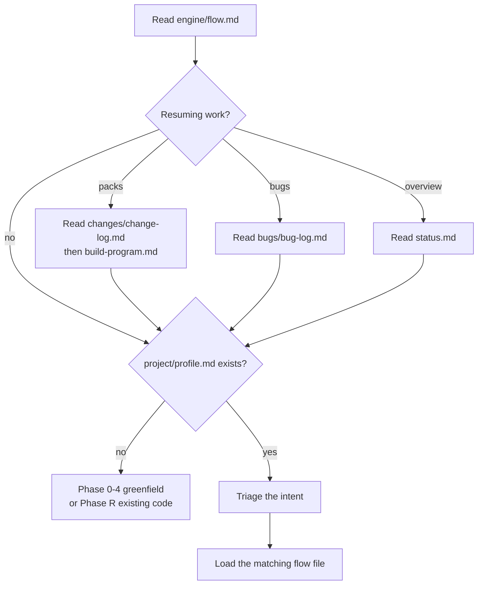

# Flow router

[engine/flow.md](../../engine/flow.md) is the entry point for every task. The engine's instruction is to read it first, every time, before doing anything else.

## What the router does

It answers one question — which flow file should be loaded — and gives the assistant the few facts it needs before it can write anything.



## Phase routing

| Phase | Purpose | Flow file |
|-------|---------|-----------|
| 0–4 | Initial build — design plus REQ-INIT packs | [engine/flows/initial-build.md](../../engine/flows/initial-build.md) |
| 5 | Change mode — features and plan-impacting work | [engine/flows/change-mode.md](../../engine/flows/change-mode.md) |
| P | Polish — visual, style, and copy only | [engine/flows/polish.md](../../engine/flows/polish.md) |
| 6 | Bug fix | [engine/flows/bug-fix.md](../../engine/flows/bug-fix.md) |
| R | Reverse-engineer an existing codebase | [engine/flows/reverse-engineer.md](../../engine/flows/reverse-engineer.md) |

## Quick triage

| Intent | Phase |
|--------|-------|
| New or changed capability, fields, endpoints, pages with behavior | 5 |
| Style, spacing, copy, or button look only | P |
| Something broken versus expected behavior | 6 |
| Onboard existing code | R |
| Greenfield from description | 0–4 |

## Preconditions the router enforces

**No blueprint yet.** If `project/profile.md` is missing, the only valid entry points are Phase 0–4 (greenfield) or Phase R (existing code). Phases 5, P, and 6 stop and route you there rather than inventing product facts.

**Resuming packs.** Read `project/changes/change-log.md` first, and `project/changes/build-program.md` when REQ-INIT or REQ-R packs exist. Then open the pack. Bugs start from `project/bugs/bug-log.md`.

**Resuming an overview.** If `project/status.md` exists, it gives `done`, `partial`, `planned`, and `deferred` state on main.

**Greenfield implementation is packs, not a monolith.** Phase 0–2 design on main with status `planned`; Phase 3 is a queue of REQ-INIT work packs. Phase R documents on main, then queues REQ-R packs for the gaps.

## Before writing any `project/` file

The router lists four steps, in order:

1. Load [engine/project-layout.md](../../engine/project-layout.md).
2. Run the bootstrap gate there — create the root directories if missing, and never seed placeholder READMEs.
3. Create each file only when its flow step runs, from the matching template.
4. For Phase 5, P, 6 Path A, Init 3.x, and REQ-R packs, write in-flight work only inside the change work pack, and merge to main after verification.

## The two zones

| Zone | Contents |
|------|----------|
| `royascaff/engine/` | The product: the router, flows, templates, rules, and the layout contract |
| `project/` | The generated living blueprint. Main is implemented reality; `changes/` holds in-flight packs. |

## Project files quick reference

These paths exist only after the engine has generated them.

| Purpose | Path |
|---------|------|
| In-flight changes index | `project/changes/change-log.md` |
| Build program | `project/changes/build-program.md` |
| Build state dashboard | `project/status.md` |
| System identity | `project/profile.md`, `project/description.md` |
| Planning on main | `project/plan/modules.md`, `data-model.md`, `roles-and-authorization.md` |
| Business rules | `project/rules.md` |
| Backend and client specs | `project/actions/<app>/…` |
| Work packs | `project/changes/change-<ID>-<slug>/` |
| Bugs index | `project/bugs/bug-log.md` |

## The traceability chain

```text
Data Model -> Services -> Endpoints -> Pages/Views
```

- **Generation order:** services first, then endpoints, then client specs.
- **Dependency direction:** pages depend on endpoints, endpoints on services, services on repositories and providers.

## Slash commands

`npx royascaff init` installs six Cursor skills into `.cursor/skills/`. Each is a thin entry point that loads the matching engine flow.

| Command | Skill folder | Loads | Phase |
|---------|--------------|-------|-------|
| `/flow` | `skills/flow/` | [engine/flow.md](../../engine/flow.md) | Index |
| `/initial-build` | `skills/initial-build/` | `engine/flows/initial-build.md` | 0–4 |
| `/change-mode` | `skills/change-mode/` | `engine/flows/change-mode.md` | 5, and pack implementation for 3.x and 6 Path A |
| `/polish` | `skills/polish/` | `engine/flows/polish.md` | P |
| `/bug-fix` | `skills/bug-fix/` | `engine/flows/bug-fix.md` | 6 |
| `/reverse-engineer` | `skills/reverse-engineer/` | `engine/flows/reverse-engineer.md` | R |

`/flow` is the meta-index: it lists the commands and the triage without executing anything. Use it when you are not sure which flow applies.

The skills are convenience wrappers. Any assistant that can read files can follow `royascaff/engine/flow.md` directly.

## Global conventions

Every spec inherits defaults from [engine/conventions.md](../../engine/conventions.md) — route prefix, auth model, response envelopes, pagination, UI states, build status, and pack status. A spec documents a value only when it **deviates** from that file. See [Conventions](../reference/04-conventions.md).

## Related

- [Initial build](01-initial-build.md)
- [Change mode](02-change-mode.md)
- [Polish](03-polish.md)
- [Bug fix](04-bug-fix.md)
- [Reverse engineer](05-reverse-engineer.md)
- [Project layout](../reference/02-project-layout.md)
