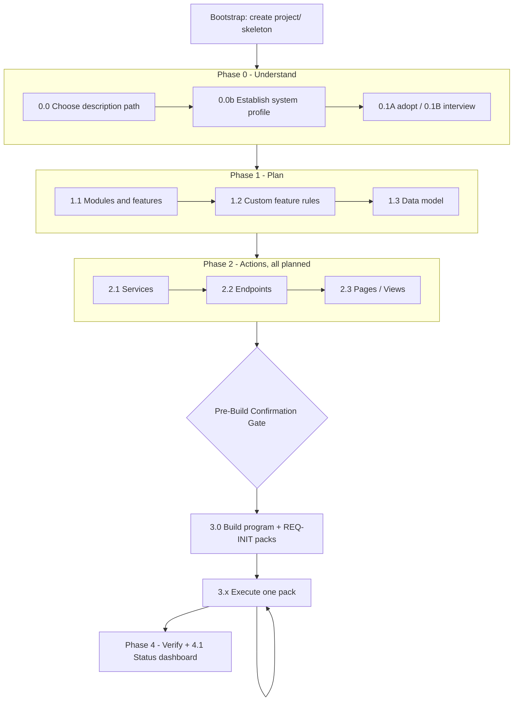

# Initial build (Phases 0–4)

Source: [engine/flows/initial-build.md](../../engine/flows/initial-build.md) · Command: `/initial-build`

Run this flow once, to go from a product description to a fully built, verified application. Every step declares its inputs, template, output, and done-when criteria.

## Prerequisites

None. This flow bootstraps everything, including the blueprint root. `project/` is not pre-seeded — the bootstrap gate creates it.

## Shape of the flow



## The invariant

> Phase 0–2 write the full intent to **main** with artifact status `planned`. Implementation edits happen only inside change packs; main artifact status flips to `done`/`partial` at **merge**.

Phase 3 uses the same lifecycle as Phase 5. There is no second implementation path.

## Bootstrap — create the blueprint root

| | |
|---|---|
| **Input** | [engine/project-layout.md](../../engine/project-layout.md) |
| **Output** | `project/` root skeleton — directories only |
| **Done when** | The blueprint root exists and is ready for Phase 0 writes |

Creates `plan/`, `actions/`, `changes/`, `bugs/`, `verify/`, and `docs/`. No placeholder READMEs, no empty stub files. Each real file is created only when its phase step runs, from the matching template.

## Phase 0 — Understand

Goal: a complete, unambiguous product specification in `project/description.md` and a confirmed system profile in `project/profile.md`.

### Step 0.0 — Choose description path

| Path | When |
|------|------|
| **A — Full description** | `project/description.md` exists with substantive content: product purpose, primary user, core workflow, core features, and key entities all described, and no `[placeholder]` or `TBD` remains |
| **B — Step-by-step** | Any of the above is false, or the file does not exist |

### Step 0.0b — Establish system profile

| | |
|---|---|
| **Input** | Existing repos and code if any, plus the description |
| **Template** | `templates/profile-template.md` |
| **Output** | `project/profile.md` |
| **Done when** | The file exists, the template checklist is satisfied, and it lists apps, repos, stack, brand, environments, and integrations |

For existing codebases, derive from the actual repositories; for greenfield, fill in intended choices.

> Get the **Applications** table right first. Its **Key** column defines `target-app` values and the `project/actions/<key>/` folder names.

### Step 0.1A — Adopt full description (Path A)

The existing description is authoritative. Run the done-when checklist and fix only gaps, ambiguities, or formatting. Do not replace it with the template layout unless explicitly asked.

**Done when:** purpose clear, primary user and workflow described, core features listed, key entities identified, integrations and constraints documented, no `TBD` placeholders.

### Step 0.1B — Build description step-by-step (Path B)

| | |
|---|---|
| **Template** | `templates/description-template.md` |
| **Output** | `project/description.md`, built section by section |

Walk template sections 1–11 with the user: ask, draft, confirm, proceed. Do not skip to Phase 1 until the template's Completion Checklist is satisfied. Final pass reviews for consistency and removes leftover placeholders.

## Phase 1 — Plan

| Step | Input | Template | Output |
|------|-------|----------|--------|
| **1.1** Modules and features map | `description.md` | `modules-template.md` | `project/plan/modules.md` |
| **1.2** Custom feature rules | `description.md`, `modules.md` | `custom-feature-rules-template.md` | `project/rules.md` |
| **1.3** Data model | `description.md`, `modules.md`, `rules.md` | `data-model-template.md` | `project/plan/data-model.md` |

**1.1 done when:** all business capabilities grouped into named modules; each module declares backend and frontend scope and dependencies; all features listed under the correct module with visibility (`frontend`, `backend-only`, `both`); feature names stable and reusable; no orphaned features.

**1.2 done when:** project-specific rules documented (AI usage, integrations, async jobs, security); each rule references a specific module and feature; provider requirements explicit; forbidden behaviors clear; generic rules remain in [engine/rules/](../../engine/rules/) only.

**1.3 done when:** all persistent entities defined with schema shapes for the project's database; field types, required flags, and constraints documented; relationships explicit as references or embedded; index recommendations provided; enums declared; validation rules stated.

## Phase 2 — Actions

Goal: the service map, endpoint specs, and client specs on **main** under `project/actions/<app-key>/`. This is the product intent backlog.

**Call chain:**

```text
<app>/pages/ -> <api-app>/endpoints/ -> <api-app>/services/ -> repositories / external providers
```

Services before endpoints, endpoints before client specs.

**Status at spec time:** every artifact starts `planned` — no code exists yet. Each `_index.md` registry records the per-module rolled-up status and `Done/Total`, which at this phase is `planned` with `0/N`.

| Step | Output | Template |
|------|--------|----------|
| **2.1** Services map | `actions/<api-app>/services/_index.md` + per-module files | `services-template.md` |
| **2.2** Endpoints specification | `actions/<api-app>/endpoints/_index.md` + per-module files | `endpoints-template.md` |
| **2.3** Client specifications | `actions/<app-key>/pages/` (web) or `views/` (mobile), one per frontend app | `pages-template.md` / `views-template.md` |

**2.1 done when:** every backend-relevant feature is covered by at least one internal service; services grouped by module; each declares type (`internal` or `external`), public methods, and dependencies; internal services own business logic; external services wrap third-party integrations per the backend rule; all referenced entities and DTOs exist in `data-model.md`; every external API has a corresponding external service.

**2.2 done when:** every backend-relevant feature has at least one endpoint; endpoints grouped by module; each declares method, route, auth, input, output, and constraints; each declares which services it calls, and those services exist; endpoints do not call repositories or external providers directly; CRUD patterns follow the backend rule; custom feature rules reflected; all referenced DTOs and entities exist.

**2.3 done when:** every frontend-visible feature has at least one page or view in the relevant app; grouped by module; each declares route, components, frontend services, models, and endpoints used; pages call frontend HTTP services only, never backend services directly; UI states documented (loading, empty, error, success); patterns follow the frontend rule; all referenced endpoints exist.

## Phase 3 — Build, via work packs

Goal: implement the Phase 2 planned blueprint **one work pack at a time** — never the whole system in one session.

### Pre-Build Confirmation Gate (mandatory)

Before creating the build program or writing any code, the flow presents four things for approval:

1. **What will be packed** — modules and slices from Phase 2, not "build everything now"
2. **Proposed pack order** — foundation, then auth, then modules by dependency, then cross-cutting
3. **Target repos and folders** — from `project/profile.md`
4. **Frontend visual approach** — design system and brand tokens from the profile

It ends with: **"Can I proceed with creating the build program and work packs?"**

> Wait for explicit confirmation. Silence is not confirmation.

### Step 3.0 — Create the build program

| | |
|---|---|
| **Input** | `plan/modules.md`, main `actions/**` (all `planned`), `profile.md` |
| **Template** | `build-program-template.md` |
| **Output** | `changes/build-program.md` with `request-id: REQ-INIT`, materialized pack folders, rows in `change-log.md` |

Actions, in order:

1. Create `change-log.md` from its template if missing.
2. Slice **vertical packs per module** — that module's data-model slice, then services, endpoints, and pages or views.
3. Order the packs: foundation and shared infrastructure first, then auth, then remaining modules by dependency from `modules.md`, then cross-cutting concerns such as jobs and integrations.
4. For each pack, mint a unique datetime `<ID>` (`YYYYMMDD-HHMMSS`, never sequential) and create `changes/change-<ID>-init-<slug>/` containing:
   - `change-request.md` — `change-type: new-module` or `new-feature`; `request-id: REQ-INIT`; `part: N/M`; `depends-on`; `pack-status: drafted` or `blocked`
   - `blueprint/` — copy or slice **only** that module's specs from main
   - `status.md` and `blueprint/_index.md`, with artifacts starting `planned`
   - `impact.md` — abbreviated create list for code files
   - A row in `change-log.md`
5. Write `build-program.md` with the ordered table, Progress, and **Next pack**.
6. **Stop.** Present the program and ask which pack to run, defaulting to the first unblocked one.

### Step 3.x — Execute one pack

For the chosen pack only:

1. **Dependency gate** — if `depends-on` is not `verified` or `merged`, set the pack `blocked`, update the change-log, and stop.
2. **Implement, verify, merge** — follow [change mode](02-change-mode.md) from Step 5.4 through Step 5.6. The pack blueprint was already drafted in 3.0.
   - Implementer load set: `change-request.md`, `blueprint/`, `impact.md`, `status.md`, plus a minimal read-only look at main for that module if needed
   - Do not load unrelated modules or implement other packs in the same session
3. **On merge:** main artifact statuses for owned IDs become `done`, `partial`, or `deferred`; main `_index.md` and `project/status.md` refresh; `build-program.md` Progress and Next pack update.
4. **Hard stop** after merge, or after verification if the user defers the merge. The next chat resumes from the change-log and build program.

### Phase 3 exit criteria

- All non-`deferred` REQ-INIT packs are `merged`, **or**
- The user explicitly pauses: remaining packs stay `drafted` or `blocked`, main keeps those artifacts `planned`, and `project/status.md` **Next Up** lists them.

> Do not run a monolith "generate all backend then all frontend" pass.

## Phase 4 — Verify

Goal: consistency checks across documents and code for the merged system, plus the remaining `planned` backlog.

**When to run it:** when the build program is complete (all non-deferred packs `merged`), or when the user requests a mid-stream audit. Each pack already carries its own scoped `verify-code.md`; Phase 4 is the system-level gate.

### The 15 cross-document consistency checks

1. Module-to-feature coverage
2. Feature-to-service coverage
3. Feature-to-endpoint coverage
4. Endpoint-to-service linking
5. Feature-to-page coverage
6. Entity consistency
7. Endpoint-to-page linking
8. Auth coverage
9. Custom rules compliance
10. UI state coverage
11. Path and naming consistency
12. Code layering compliance
13. Frontend third-party isolation — zero tolerance
14. Self-contained blueprint
15. Build status coverage

Each check is explained in [Verification checks](../reference/08-verification-checks.md).

### Step 4.1 — Generate the status dashboard

| | |
|---|---|
| **Template** | `status-template.md` |
| **Output** | `project/status.md` |
| **Done when** | The file exists and its counts match every `_index.md` |

Rolls per-artifact statuses and `_index.md` counts into a per-app snapshot, a per-module table, **In Progress** (`partial`), **Next Up** (ordered roadmap of `planned` work in build order), and **Deferred** with reasons. This is the file a future model reads first.

### Verification report

Written to `project/verify/verification-report.md` with an overall status of `PASS` or `ISSUES FOUND`, a mark per check, and a summary with recommended fixes.

## Done

When Phase 3 exit criteria are met and Phase 4 passes — or the user paused with a clear Next Up — you have:

- A confirmed system profile in `project/profile.md`
- Complete planning and action specs on main; implemented artifacts `done`, backlog possibly still `planned`
- `changes/build-program.md` plus REQ-INIT packs registered in `change-log.md`
- Code in the repositories listed in the profile
- A verification report in `project/verify/` when Phase 4 ran
- A build-status dashboard in `project/status.md`

Further product work goes through [change mode](02-change-mode.md). Unfinished REQ-INIT packs resume via the change-log and build program.

## Related

- [Quickstart](../guides/02-quickstart.md)
- [Change mode](02-change-mode.md)
- [Verification checks](../reference/08-verification-checks.md)
- [Templates](../reference/05-templates.md)
