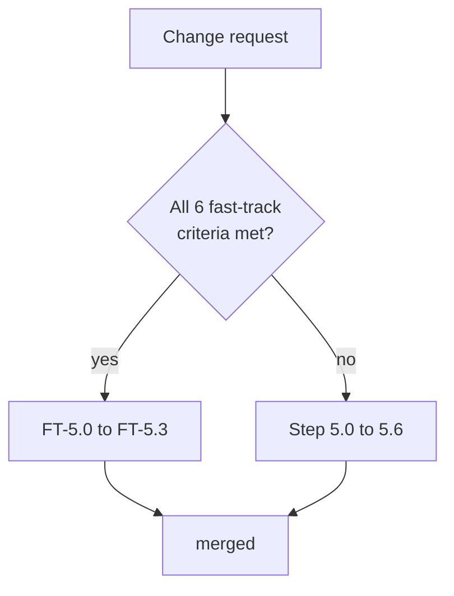
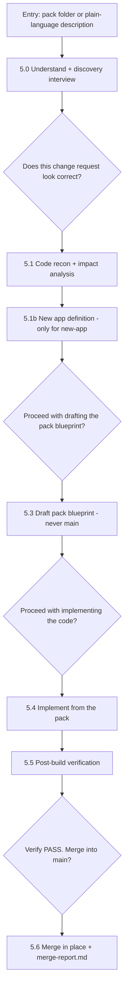

# Change mode (Phase 5)

Source: [engine/flows/change-mode.md](../../engine/flows/change-mode.md) · Command: `/change-mode`

Incrementally add or modify features while keeping the **main** blueprint equal to implemented code only. This is the flow you will use most, and it is also the implementation engine for Phase 3.x packs and Phase 6 Path A.

## Prerequisites

`project/profile.md` must exist. If it is missing, the flow stops and routes you to Phase 0–4 or Phase R.

Phase 5 is independent of Phases 0–4 — use it any time after a blueprint exists, whether it came from an initial build or from reverse-engineering.

**UI polish only?** Use [Phase P](03-polish.md) instead.

## The isolation invariant

> Do **not** edit main `project/plan/`, `project/actions/`, `project/rules.md`, `project/profile.md`, or `project/description.md` until **Step 5.6 Merge**. All in-flight specs live in the change work pack under `blueprint/`.

This is the rule the entire flow is built around.

## Work pack layout

```text
project/changes/change-<ID>-<slug>/
  change-request.md
  impact.md
  status.md                 # change-status-template.md
  blueprint/
    plan/                   # touched slices only
    actions/…               # per-module delta specs
    _index.md               # change-blueprint-index-template.md
  verify-plan.md            # optional
  verify-code.md
  merge-report.md           # after merge
```

`<ID>` is the local datetime `YYYYMMDD-HHMMSS` at creation. Never a sequential counter. Register every pack in `change-log.md` immediately.

## Index sync (mandatory)

On every `pack-status` transition, update the **same row** in `project/changes/change-log.md` plus the `pack-status` in `change-request.md` and the pack's `status.md`.

| pack-status | When |
|-------------|------|
| `drafted` | Folder, request, and possibly blueprint created; code not started |
| `in-progress` | Implementation started |
| `verified` | `verify-code.md` overall PASS |
| `merged` | Main blueprint updated |
| `cancelled` | Abandoned; main never touched |
| `blocked` | `depends-on` not yet `verified` or `merged` |

Mirror **Artifacts done** — the `Done/Total` from `blueprint/_index.md` — into the In flight table.

## Flow selection

### Fast-track criteria — all must be true

1. The change touches at most one module
2. No new data model entities or fields
3. No new services or endpoints — modifying existing ones is fine
4. Frontend-only or backend-only, not both, unless the endpoint already exists
5. The user provides a clear, complete change description
6. It is not `polish`, and not multi-part with unmet dependencies

If **all** are met, run the fast-track flow. If **any** fails, or the user says "use full flow," run the standard flow.



## Fast-track flow

Same isolation, fewer steps.

| Step | What happens |
|------|--------------|
| **FT-5.0 Understand** | Read the description or `change-request.md`; resolve `target-app` against the profile; create the pack folder; set `pack-status: drafted`; register in the change-log. If `depends-on` is unmet, set `blocked` and stop. |
| **FT-5.1 Quick recon + impact** | Write an abbreviated `impact.md`. Load only the relevant main `_index.md` and module files, read-only. List the pack blueprint files to create — not main files. |
| **FT-5.2 Draft + implement** | **Gate:** present the pack blueprint and code file list, ask **"Can I proceed?"** Then write specs only under `blueprint/`, plus `status.md` and `blueprint/_index.md`; set the index to `in-progress`; implement from the pack blueprint; update pack artifact statuses. Do not edit main. |
| **FT-5.3 Verify + merge** | Write `verify-code.md` against the pack blueprint and acceptance criteria. On PASS set `verified`. **Gate:** ask **"Verify PASS. Merge into main blueprint?"** On yes, apply the Step 5.6 merge rules and set `merged`. If the user defers, leave it at `verified` with main unchanged. |

## Standard flow



### Entry point

Either create `project/changes/change-<ID>-<slug>/` from `change-request-template.md`, or describe the change in plain language and let Step 5.0 do it.

### Step 5.0 — Understand the change

**Output:** a confirmed `change-request.md` plus a change-log row at `drafted`.

**5.0.1 Read and resolve scope**

1. Read the request; note `change-type`, `target-app`, `request-id`, `depends-on`, `affected-repos`.
2. Resolve apps and repos against `project/profile.md`.
3. If `depends-on` is set, check that pack's status in the change-log. If it is not `verified` or `merged`, set this pack `blocked` and stop, or wait.
4. Read the relevant main plan and actions **read-only** for context.
5. If the description is thin, run the discovery interview.

**5.0.2 Discovery interview** — asked section by section, waiting for answers.

| Section | Always? | Skipped when |
|---------|---------|--------------|
| 1 — Business context | Always | — |
| 2 — Type-specific technical details | Always | — |
| 3 — Data and integrations | Conditional | `modify-page` or `modify-endpoint` that is I/O only, `refactor` |
| 4 — Security and permissions | Conditional | Auth unchanged **and** no new endpoints |
| 5 — Edge cases and errors | Conditional | Pure UI |
| 6 — Frontend style | Conditional | Only when the frontend is touched |

Section 1 covers motivation, who is affected, the outcome, what is out of scope, constraints, and priority — plus the multi-pack `request-id`, `part`, and `depends-on` if the work is being split. Section 6 covers pages, design system, screenshots or Figma links, layout, states, and RTL.

**5.0.3 Draft the change request** — create the folder, draft `change-request.md` with all metadata including `pack-status: drafted`, register the row in the change-log (creating the log from its template if missing), and write acceptance criteria as numbered testable outcomes.

**5.0.4 Confirmation gate** — present the drafted request and ask: **"Does this change request look correct? Please confirm to proceed."** Silence is not confirmation.

### Step 5.1 — Code recon and impact analysis

Runs **before** any pack blueprint is finalized. Skipped for `change-type: new-app`.

| | |
|---|---|
| **Input** | Scope, repos, and main plan and actions (read-only) |
| **Template** | `impact-template.md` |
| **Output** | Pack `impact.md` |
| **Scope rule** | Load only affected module files, found via main `_index.md` |

**5.1.1 Code reconnaissance** — search the affected modules in **actual code**, following schema, repository, service, controller, frontend service, page. Record the feature state as `none`, `partial`, or `complete`. Record plan-versus-code drift on main for awareness, to be fixed at this pack's merge rather than by editing main early. Produce a ripple map, reuse opportunities, and risks such as auth, async work, or migrations.

**5.1.2 Impact classification** — classify as **create**, **complete in place**, or **modify**, plus ripple. Then map `change-type` to the blueprint slices needed:

| Change type | pack `plan/` | `services/` | `endpoints/` | `pages/` or `views/` | rules/description slices |
|-------------|:---:|:---:|:---:|:---:|:---:|
| `new-app` | maybe | — | — | yes | maybe |
| `new-module` | yes | yes | yes | maybe | maybe |
| `new-feature` | maybe | maybe | maybe | maybe | maybe |
| `modify-*` | as touched | as touched | as touched | as touched | as touched |
| `bug-fix` | as needed | as needed | as needed | as needed | as needed |
| `general` | assess | assess | assess | assess | assess |

**Done when:** every pack file and code location is identified and dependencies are recorded.

### Step 5.1b — New app definition

Only when `change-type` is `new-app`; skipped otherwise.

Resolve modules and features against main `modules.md` read-only. Draft the new app's client specs under `blueprint/actions/<app-key>/pages/` or `views/` — not main. Note profile additions inside the pack, for example `blueprint/plan/profile-delta.md`, to be applied to main `profile.md` only at merge. Flag any new endpoints needed in the pack's `endpoints/` blueprint.

### Step 5.2 — Pack confirmation gate

Present four things: the impact summary of which pack blueprint files will be created, the code impact of which files will be created or modified, ripple effects, and dependency status.

Ask: **"Can I proceed with drafting the change pack blueprint?"** Wait for explicit confirmation.

### Step 5.3 — Draft the pack blueprint

Write specs **only** under `change-<ID>-<slug>/blueprint/`.

> Never edit main plan or action files here. Never append `change-<ID>` sections to main files.

**Templates:** the existing services, endpoints, pages, views, modules, and data-model templates scoped to delta content, plus `change-blueprint-index-template.md` and `change-status-template.md`.

**Delta writing rules:**

- **Data model** — after-state of the affected entity plus a `## Delta` listing what was added or changed
- **Services, endpoints, pages** — only artifacts owned by this change, as complete after-state entries
- New artifacts start with status `planned` inside the pack
- Fill `blueprint/_index.md` and the pack's `status.md`; the change-log stays `drafted` until code starts
- Honor the impact verdict — create, complete, modify, ripple — all represented in the pack

**Optional pre-build pack verification:** if the pack is complex (three or more blueprint layers, or new entities), check coverage inside the pack and write `verify-plan.md` if useful.

**Done when:** the pack blueprint is internally consistent and the index still reads `drafted`, or `blocked` if dependencies are unmet.

### Step 5.4 — Code confirmation gate and implementation

**Dependency gate:** if `depends-on` is not `verified` or `merged`, set `blocked`, update the change-log, and stop.

**Gate:** present the code file list and pack blueprint summary. Ask: **"Can I proceed with implementing the code?"**

**Implement:**

- Set `pack-status: in-progress` in the change-log, the request, and the pack status
- Implement from the **pack blueprint** plus [engine/rules/](../../engine/rules/) and main `project/rules.md`, read-only
- Backend: `controller -> service -> repository`, with integrations isolated
- Frontend: pages call app services only, with no hardcoded external URLs
- Update pack artifact statuses and `blueprint/_index.md` `Done/Total`; mirror into the change-log's Artifacts done
- Do not write main plan or actions

**UI screenshot review** is optional: if screenshots are submitted, check them against the pack's page and view specs.

**Done when:** the code compiles, pack statuses are accurate, and the change-log reads `in-progress` with a current `Done/Total`.

### Step 5.5 — Post-build code verification

| | |
|---|---|
| **Input** | Code, the **pack** blueprint, and acceptance criteria |
| **Template** | `verification-template.md` |
| **Output** | Pack `verify-code.md` |

Checks, scoped to the pack:

1. Endpoints in code match the pack
2. Pages and views in code match the pack
3. Backend layering, frontend isolation, and auth are as declared in the pack
4. Acceptance criteria are met, or explicitly deferred in the pack
5. UI screenshots, if any

On PASS, set `pack-status: verified` in all three places. **Do not merge yet** — merging is a separate gate.

**Done when:** `verify-code.md` shows **Overall: PASS** and the index says `verified`.

### Step 5.6 — Merge into the main blueprint

**Merge gate:** ask **"Verify PASS. Merge this pack into the main blueprint?"** Wait for explicit confirmation.

**Merge actions:**

1. Apply pack deltas **in place** into main — `project/plan/*`, `project/actions/**`, `project/rules.md`, `project/description.md`, `project/profile.md`, as listed in the pack
2. Refresh main `_index.md` rollups and `project/status.md`, reflecting merged reality only
3. Write `merge-report.md` from `merge-report-template.md`
4. Set `pack-status: merged` and move the change-log row to Completed with the merged date
5. Never leave appended change sections at the bottom of main files

**Done when:** main matches implemented code for this pack, the change-log shows `merged`, and the pack is retained as a record.

If the user declines the merge, the pack stays at `verified` and main is unchanged.

## Multi-part features

- Share a `request-id` such as `REQ-7` across packs, with an optional `part: 2/3`
- Each part has its own folder, its own change-log row, and its own blueprint
- Respect `depends-on`; filter the change-log by `request-id` to see the whole feature

## Done

When Step 5.6 or the FT-5.3 merge completes:

- Main matches the code for the merged work
- The pack holds its request, impact, blueprint, verification, and merge report
- `change-log.md` shows `merged`

To continue, create the next pack — or the next `request-id` part — and start Phase 5 again.

## Related

- [Daily workflow](../guides/03-daily-workflow.md)
- [Initial build](01-initial-build.md) — Phase 3.x uses this flow from Step 5.4
- [Bug fix](04-bug-fix.md) — Path A uses this flow from Step 5.0
- [Working as a team](../guides/05-working-as-a-team.md)
