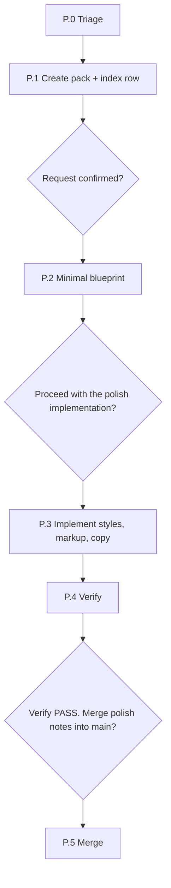

# Polish (Phase P)

Source: [engine/flows/polish.md](../../engine/flows/polish.md) · Command: `/polish`

Visual, style, copy, spacing, and layout tweaks that do **not** change product behavior, data, or APIs.

Polish is not a bug — nothing is broken — and not a full feature change. It still uses a change work pack and the live change-log index so the work is trackable across chats.

## Prerequisites

`project/profile.md` must exist. Main plan and actions stay untouched until merge.

## When to use it, and when not to

| Situation | Route |
|-----------|-------|
| Spacing, colors, typography, copy, button look, layout alignment only | **This flow** |
| Behavior wrong versus expected or specced | [Phase 6 bug fix](04-bug-fix.md) |
| New or changed capability, fields, endpoints, services, business rules | [Phase 5 change mode](02-change-mode.md) |

### Hard forbidden in polish

- Data-model changes
- New or modified endpoints or services, beyond cosmetic client display of data that already exists
- Auth or permission changes
- New business rules

### If scope grows

Stop. Set `change-type` to the appropriate Phase 5 type, **keep the same folder and `request-id`**, and continue in change mode from Step 5.1. Do not start a new pack.

## Shape of the flow



## Pack layout

```text
project/changes/change-<ID>-polish-<slug>/
  change-request.md      # change-type: polish
  impact.md              # abbreviated - pages, components, files only
  status.md
  blueprint/
    actions/<web>/pages/<module>.md   # or views/ - UI notes and target states
    _index.md
  verify-code.md
  merge-report.md
```

Register it in `change-log.md` with type `polish`, and sync `pack-status` on every transition using the same rules as Phase 5.

## P.0 — Triage

| | |
|---|---|
| **Input** | The user's description — "make the button larger," "fix spacing on settings" |
| **Done when** | Polish is confirmed and the target surfaces are listed |

1. Confirm the polish criteria: no API, data, or behavior change.
2. If it fails, redirect to Phase 5 or Phase 6 and do not continue here.
3. Identify the app key, the pages or views, and the components and files.

## P.1 — Create the pack and the index row

| | |
|---|---|
| **Output** | `change-<ID>-polish-<slug>/change-request.md` plus a `change-log.md` row |

1. Mint a datetime `<ID>` (`YYYYMMDD-HHMMSS`). Create the change-log from its template if missing.
2. Fill metadata: `change-type: polish`, `pack-status: drafted`, scope limited to pages and views.
3. Write acceptance criteria as **observable visual outcomes** — for example, "primary CTA uses the brand token," "form fields aligned."
4. Optionally add screenshot or Figma links in Notes.

**Gate:** present the request and ask for confirmation.

**Done when:** the user confirmed and the index shows `drafted`.

## P.2 — Minimal blueprint

| | |
|---|---|
| **Output** | `blueprint/actions/<app>/pages/<module>.md` or `views/`, plus `_index.md`, `status.md`, and a short `impact.md` |

1. Read the main page or view spec **read-only** for context.
2. In the pack blueprint, document after-state UI notes — layout, tokens, copy, states. Use a `## Delta` section for what changes visually.
3. List the code files to touch in `impact.md`: components, stylesheets, templates.
4. Artifacts start `planned` in the pack status.

**Done when:** the pack is enough for another chat to implement without prior context.

## P.3 — Implement

**Gate:** ask **"Can I proceed with the polish implementation?"**

- Set `pack-status: in-progress`
- Change styles, markup, and copy only; follow the brand tokens from `project/profile.md` when present
- Update pack artifact statuses and the change-log's Artifacts done
- Do not edit main plan or actions yet

**Done when:** the UI changes are applied and pack statuses are current.

## P.4 — Verify

| | |
|---|---|
| **Output** | `verify-code.md` |

Check the acceptance criteria, and screenshots if any were provided. On PASS, set `pack-status: verified`.

**Done when:** overall PASS and the index says `verified`.

## P.5 — Merge

**Gate:** ask **"Verify PASS. Merge polish notes into main page/view specs?"**

1. Merge the blueprint page or view notes into main `project/actions/.../pages|views/<module>.md` in place — usually the Notes or UI state lines. If the pack only changed code and the main notes are unchanged, still record a one-line Notes update when it is useful.
2. Refresh main `_index.md` and `project/status.md` **only if** the artifact status on main changed. For pure CSS work it usually has not.
3. Write `merge-report.md`, set `pack-status: merged`, and move the change-log row to Completed.
4. **Main plan, data model, services, and endpoints must remain untouched.**

**Done when:** the index shows `merged` and the pack is retained as a record.

## Done

The polish pack is merged, or left at `verified` if the user deferred the merge. For another polish task, create the next `change-<ID>-polish-<slug>/` pack.

## Why polish has its own flow

It would be easy to treat a color change as a trivial edit and skip the pack. The reason not to: polish still changes the product, and a change that is not recorded is a change that the next session cannot see. The pack here is deliberately thin — an abbreviated impact, a minimal blueprint, no discovery interview — but it keeps three properties that matter: the work is in the change-log so a new chat can find it, main is only updated after verification, and the page and view specs stay true.

## Related

- [Change mode](02-change-mode.md) — where polish escalates when scope grows
- [Bug fix](04-bug-fix.md) — when behavior is actually wrong
- [Daily workflow](../guides/03-daily-workflow.md)
- [Engine rules](../reference/06-engine-rules.md) — frontend conventions and UI states
