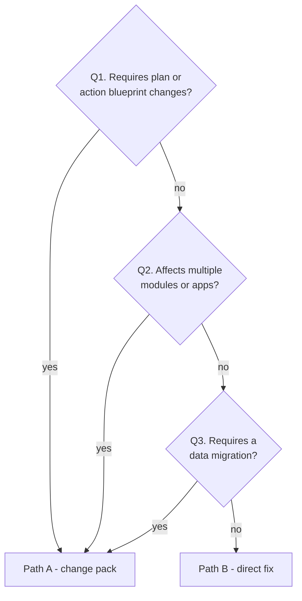

# Bug fix (Phase 6)

Source: [engine/flows/bug-fix.md](../../engine/flows/bug-fix.md) · Command: `/bug-fix`

A lightweight process that routes each bug to one of two paths: a full change work pack when the fix has architectural impact, or a direct code fix when it is an isolated correction.

**Key principle:** bugs that touch the plan become isolated change packs. Pure code corrections stay on Path B.

## Prerequisites

`project/profile.md` must exist. If it is missing, the flow stops and routes you to Phase 0–4 or Phase R. `project/bugs/` and `bug-log.md` are created as needed.

**Style-only tweak with nothing broken?** Use [Phase P](03-polish.md) instead.

## The bug log

`project/bugs/bug-log.md` is a live index, created on the first bug:

```md
# Bug Log

| ID | Date | Severity | Area | Summary | Status | File / Change pack |
|----|------|----------|------|---------|--------|--------------------|
| 20260726-093015 | 2026-07-26 | high | auth | login 500 | PENDING | `bug-20260726-093015-login-500.md` |
| 20260726-101122 | 2026-07-26 | medium | billing | wrong total | ESCALATED | `change-20260726-101122-bug-fix-billing-total/` (pack-status: in-progress) |
```

Statuses are `PENDING`, `DONE`, and `ESCALATED`. Keep the row updated on every transition. For `ESCALATED`, link the change pack folder and optionally note its `pack-status` from the change-log.

IDs use the local datetime `YYYYMMDD-HHMMSS`, the same rules as change packs. Never allocate sequential bug numbers.

## Entry point

Either the user describes the bug in plain language, or a bug report file already exists at `project/bugs/bug-<ID>-<slug>.md` from `bug-report-template.md`. Either way, start at Step 6.0.

## Step 6.0 — Triage

1. Gather what is broken, where, the expected behavior, reproduction steps, and severity.
2. Identify the affected applications, modules, and files.
3. If this is visual polish with correct behavior, redirect to Phase P.
4. Run the decision tree.

### Decision tree



**Q1 — Does the fix require plan or action blueprint changes?** New entity fields, new endpoints, new pages, new services, new integrations, or modified business logic affecting other features. Yes routes to Path A.

**Q2 — Does the fix affect multiple modules or apps?** More than one module or app. Yes routes to Path A.

**Q3 — Does the fix require a data migration?** Schema changes, data transformations, backfill. Yes routes to Path A; no routes to Path B.

## Path A — escalate to a change work pack

When any question answers yes:

1. Create or update the row in `bug-log.md` with status **`ESCALATED`**. A `bug-<ID>-…md` stub is optional; at minimum the log row exists.
2. Create the work pack `project/changes/change-<ID>-bug-fix-<slug>/`, minting a new datetime `<ID>`.
3. Set `change-type: bug-fix` in `change-request.md` and `pack-status: drafted`; register it in `change-log.md`.
4. Link the bug-log's **File / Change pack** column to that folder.
5. Proceed with [Phase 5](02-change-mode.md) from Step 5.0. **Isolation applies** — main plan and actions stay untouched until the pack merges at Step 5.6.
6. The bug is resolved when the change pack is `merged`, meaning verification passed and the merge gate was approved. Then set the bug-log status to **`DONE`** and note the merged date.

**Done when:** the bug-log reads `DONE`, or still `ESCALATED` while the pack is in flight, and the change-log tracks the pack status.

## Path B — direct fix

When all three questions answer no, meaning there is no blueprint impact.

> Do **not** edit main `project/plan/` or `project/actions/`. If the fix reveals plan drift, escalate to Path A.

### Step 6.1 — Create the bug log entry

| | |
|---|---|
| **Template** | `bug-report-template.md` |
| **Output** | `project/bugs/bug-<ID>-<slug>.md` plus a bug-log row at `PENDING` |

### Step 6.2 — Investigate and document the root cause

Trace the code, document the root cause, and propose the minimal fix. **No code yet.**

**Done when:** the root cause and the proposed files are documented.

### Step 6.3 — Pre-fix confirmation gate

Present the summary, root cause, proposed fix, and files. Ask: **"Can I proceed with applying the changes?"**

Silence is not confirmation.

### Step 6.4 — Implement the fix

Apply a minimal, isolated fix following [engine/rules/](../../engine/rules/) and `project/rules.md`. Finalize the Fix Applied and Related Files sections in the bug file.

**Done when:** the code is fixed and basic verification passes.

### Step 6.5 — Post-fix confirmation gate

Ask: **"Can you confirm this resolves the issue so I can mark it as DONE?"**

### Step 6.6 — Mark as done

1. Set the bug file status to `DONE`, confirm the date, and check the verification boxes.
2. Update the bug-log row to `DONE`.
3. Path B does **not** merge blueprint packs. The one exception: if the fix completes a known `partial` on main that already matched the intended behavior, you may correct that artifact's status on main — but do not invent new plan content. Prefer Path A when unsure.

**Done when:** the bug-log reads `DONE`.

## Summary

| Decision | Path | Outputs |
|----------|------|---------|
| Needs a blueprint change, is multi-module, or needs a migration | **A — change pack** | `change-<ID>-bug-fix-<slug>/` plus a change-log row; bug-log goes `ESCALATED` then `DONE` after merge |
| Isolated code fix | **B — direct fix** | `bug-<ID>-<slug>.md`; bug-log goes `PENDING` then `DONE`; no main plan edits |

## Choosing the right path

The decision tree exists because the two failure modes are asymmetric.

Taking Path B when you should have taken Path A leaves main describing a system that no longer exists — the code changed, the blueprint did not, and nothing recorded the divergence. That is exactly the drift the engine is built to prevent.

Taking Path A when Path B would have done costs you some ceremony and nothing else.

So the tie-break rule in Step 6.6 is explicit: **prefer Path A when unsure.** And if a Path B fix turns out mid-investigation to reveal plan drift, escalate rather than pushing through.

## Related

- [Change mode](02-change-mode.md) — Path A runs this flow from Step 5.0
- [Polish](03-polish.md) — for visual issues where nothing is broken
- [Daily workflow](../guides/03-daily-workflow.md)
- [Status and IDs](../reference/03-status-and-ids.md)
