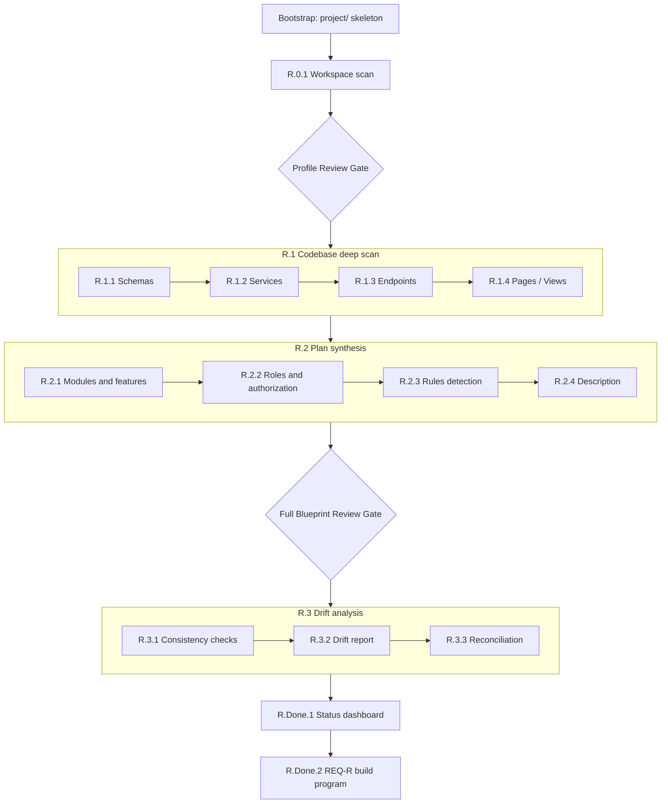

# Reverse engineer (Phase R)

Source: [engine/flows/reverse-engineer.md](../../engine/flows/reverse-engineer.md) · Command: `/reverse-engineer`

Reads an existing or legacy codebase and generates the full `project/` blueprint from it. This is the onboarding counterpart to [initial build](01-initial-build.md): where Phases 0–4 assume you are *describing* a new application, Phase R *reads* the code that already exists and produces the same artifacts.

## When to use it

- An existing codebase has no `project/` blueprint yet
- A legacy system is being onboarded into the AI-Control framework
- A team inherits a codebase and needs full documentation before making changes

Run it once per codebase. Do not re-run it unless you are onboarding a different codebase.

## What makes it different

Phase R does **not** generate code, and it does not run the standard verification — those apply to greenfield builds. Instead, Phase R.3 runs a **drift analysis** that validates the generated blueprint against the actual code.

It also produces one document that initial build does not: `plan/roles-and-authorization.md`. Reverse-engineering adds it because auth patterns can be extracted from existing code.

## Shape of the flow



## Bootstrap

Same as initial build: load [engine/project-layout.md](../../engine/project-layout.md), and if `project/` is missing create `plan/`, `actions/`, `changes/`, `bugs/`, `verify/`, and `docs/`. No placeholder READMEs.

## Phase R.0 — Discovery and workspace mapping

### Step R.0.1 — Workspace scan

| | |
|---|---|
| **Input** | The workspace root — all repositories and folders |
| **Template** | `profile-template.md` |
| **Output** | `project/profile.md` |

1. Scan the workspace root for repositories, monorepo packages, and standalone applications.
2. Read configuration files to detect applications: `package.json`, `angular.json`, `nx.json`, `turbo.json`, `lerna.json`, `tsconfig*.json`, `nest-cli.json`, `Dockerfile`, `docker-compose.yml`, `.env*`, `Procfile`, `serverless.yml`, `vercel.json`, `netlify.toml`.
3. Classify each application as **API**, **Web**, **Mobile**, **Worker**, or **Shared**.
4. Extract framework, language, database, auth strategy, UI library, and build tool using Appendix A's detection heuristics.
5. Identify integrations from dependencies and environment variables — payment, email, storage, AI, messaging, and other third-party SDKs.
6. Populate the profile, getting the **Applications** table right first: each row's **Key** becomes the `project/actions/<key>/` folder name.
7. Handle monorepo versus multi-repo per Appendix B.

**Done when:** the profile exists and its Completion Checklist is satisfied; all applications are listed with correct types, frameworks, and repo paths; all integrations documented; databases and auth strategy identified; the Applications table has stable Key values.

### Confirmation gate — profile review (mandatory)

Present five things: the discovered applications table, the tech stack summary, the integrations, the architecture type (monorepo versus multi-repo and shared libraries), and any unknowns the scan could not auto-detect.

End with: **"Does this profile look correct? Please confirm or correct before I scan the codebase."**

Wait for explicit confirmation. Do not interpret silence or ambiguous replies as confirmation. If corrections are requested, update the profile and re-present.

## Phase R.1 — Codebase deep scan

This phase **reads** code; it does not generate or modify it. All outputs are documentation.

**Scan order,** following the traceability chain:

```text
Data Model -> Services -> Endpoints -> Pages/Views
```

API applications first, then frontend applications — so that when frontend apps are scanned, the backend endpoints they call are already documented.

**Scope discipline:** resolve modules from the code's folder structure, create one file per module, and register every file in the subdirectory's `_index.md`.

**Spec defaults:** all generated specs inherit [engine/conventions.md](../../engine/conventions.md). Only document values that **deviate**.

**Status from code:** every extracted artifact is `done` when fully implemented or `partial` when incomplete — a `TODO`, a `NotImplementedException`, empty method bodies, missing UI states.

> Never use `planned` here — if there is no code, there is no artifact to extract.

| Step | Output | Template |
|------|--------|----------|
| **R.1.1** Schema and model extraction | `project/plan/data-model.md` | `data-model-template.md` |
| **R.1.2** Service discovery | `actions/<api-app>/services/<module>.md` + `_index.md` | `services-template.md` |
| **R.1.3** Endpoint extraction | `actions/<api-app>/endpoints/<module>.md` + `_index.md` | `endpoints-template.md` |
| **R.1.4** Frontend page discovery, per app | `actions/<app-key>/pages/<module>.md` or `views/` | `pages-template.md` / `views-template.md` |

**R.1.1** identifies the schema directory pattern (`src/modules/*/schemas/`, `src/entities/`, `src/models/`, `prisma/schema.prisma`), then extracts entity name, collection or table name, fields with types and defaults, relationships as refs or embedded, indexes, enums, validators, timestamps, and discriminators. DTOs are scanned for `Create*Dto` and `Update*Dto` patterns and validation decorators.

**R.1.2** classifies each service as `internal` (business logic, uses repositories) or `external` (wraps a third-party API or SDK), and extracts class name, module, public methods with parameters and return types, dependencies, repositories used, and external APIs called. Layering violations found here are recorded, not fixed — they feed the drift analysis.

**R.1.3** extracts HTTP method, full route path including controller prefix and params, auth requirements from guards and decorators, input and output shapes, services called, business rules, and middleware. Global prefixes such as `app.setGlobalPrefix('api/v1')` and versioning strategy are identified. Only deviations from convention are documented — if auth matches the global default, it is not repeated; only `@Public()` and custom guards are noted.

**R.1.4** repeats per frontend app, extracting route paths or navigation targets, components, frontend services, API calls matched against `endpoints/`, UI states, auth guards, and forms. Shared layout components and state management are identified. Frontend isolation violations feed the drift analysis.

## Phase R.2 — Plan synthesis

| Step | Output | Template |
|------|--------|----------|
| **R.2.1** Module and feature mapping | `project/plan/modules.md` | `modules-template.md` |
| **R.2.2** Roles and authorization | `project/plan/roles-and-authorization.md` | — |
| **R.2.3** Rules detection | `project/rules.md` | `custom-feature-rules-template.md` |
| **R.2.4** Description generation | `project/description.md` | `description-template.md` |

**R.2.1** uses folder structure as the primary signal for module boundaries — backend folders under `src/modules/`, frontend feature modules and lazy-loaded routes — then cross-references service dependencies to validate them. Special modules are marked `infrastructure` (auth, core, shared) or `integration` (external providers). Endpoints and pages are grouped into features inline, each with visibility (`frontend`, `backend-only`, `both`).

**R.2.2** detects roles from enums, constants, and decorator arguments; detects the auth strategy and token flow; maps role-to-endpoint and role-to-page access; detects ownership rules such as `ownerId === userId`, workspace scoping, and tenant isolation; and notes special guards.

**R.2.3** detects integration providers, async jobs and queues, security patterns, logging and observability, and caching. Auth rules are not duplicated here — they reference `roles-and-authorization.md`. Generic rules stay in [engine/rules/](../../engine/rules/) only.

**R.2.4** synthesizes the description from the plan documents plus any README: product summary, primary users from the roles document, core workflow from page flows and endpoint chains, core features from modules, key entities from the data model, integrations, and constraints. Uncertain sections are marked `[INFERRED]`.

### Confirmation gate — full blueprint review (mandatory)

Present ten things: the product summary, modules with scope, features per module with visibility, the data model summary, roles and auth strategy, service counts split internal versus external, endpoint counts per module, page and view counts per module per app, rules covering integration providers and async jobs, and gaps marked `[INFERRED]` or uncertain.

End with: **"This is the synthesized blueprint from your codebase. Please review and confirm before I run the drift analysis, or tell me what to correct."**

Wait for explicit confirmation.

## Phase R.3 — Drift analysis and reconciliation

### Step R.3.1 — Cross-document consistency

Runs the same [15 checks](../reference/08-verification-checks.md) as initial build Phase 4, adapted for reverse-engineering. The focus shifts: **does the generated plan accurately reflect the code?**

### Step R.3.2 — Drift report

| | |
|---|---|
| **Output** | `project/verify/reverse-engineer-report.md` |

Scans for five drift categories:

| Category | What it finds |
|----------|---------------|
| **Undocumented code** | Controllers not in `endpoints/`, services not in `services/`, schemas not in `data-model.md`, pages not in `pages/`, unaccounted utilities, middleware, guards, pipes, interceptors |
| **Incomplete features** | `TODO`, `NotImplementedException`, empty service methods, placeholder pages, unused imports, dead code paths |
| **Architecture violations** | Controllers calling repositories directly, frontend pages making direct HTTP calls, frontend calling external APIs, business logic in controllers, circular dependencies |
| **Stale or dead code** | Unused exports, dead routes, stale schema fields, commented-out blocks, deprecated endpoints |
| **Configuration drift** | Env vars referenced but missing, defined but unused, hardcoded secrets, mismatches across environments |

The report's overall status is `CLEAN`, `DRIFT DETECTED`, or `SIGNIFICANT DRIFT`. Its nine sections are cross-document consistency, documented and implemented counts, undocumented code, incomplete features, architecture violations with severity from `CRITICAL` to `LOW`, stale and dead code, configuration drift, a reconciliation summary, and recommended next steps.

### Step R.3.3 — Reconciliation recommendations

Each drift item gets exactly one recommended action:

| Action | Meaning |
|--------|---------|
| **Add to plan** | The code is valid and belongs in the blueprint — applied immediately |
| **Fix in code** | Violates [engine/rules/](../../engine/rules/) — becomes a Phase 5 change request |
| **Remove from code** | Dead or stale — becomes a Phase 5 change request |
| **Mark as tech debt** | Known but not urgent — documented in the report only |

Recommendations are presented to the user. "Add to plan" items are applied immediately, updating the affected module files and their `_index.md` registries. "Fix in code" and "remove from code" items are noted as future Phase 5 change requests. The report records the final disposition of every item.

## Phase R.Done — Handoff

Phase R documents existing code on **main**, which is correct. It does not implement fixes in a giant loop. Incomplete work and drift become work packs under `request-id: REQ-R`, with the same isolation as Phase 5.

### Step R.Done.1 — Status dashboard

| | |
|---|---|
| **Template** | `status-template.md` |
| **Output** | `project/status.md` |

Rolls up per-artifact statuses from R.1 plus incomplete findings from R.3 into Snapshot, By Module, In Progress (`partial`), Next Up, and Deferred.

### Step R.Done.2 — REQ-R build program

| | |
|---|---|
| **Input** | `status.md`, the drift report, `partial` and `planned` artifacts on main |
| **Template** | `build-program-template.md` |
| **Output** | `changes/build-program.md` with `request-id: REQ-R`, plus pack folders and change-log rows |

1. Create `change-log.md` if missing.
2. From incomplete features and drift items marked "fix in code" or "add to plan then implement," create one pack per coherent slice — preferring vertical module slices, grouping tiny fixes only when tightly related. `change-type` is `bug-fix`, `modify-*`, or `new-feature` as appropriate. Folders follow `change-<ID>-r-<slug>/`. Slice each pack's `blueprint/` from main for the artifacts it owns, and register it as `drafted` or `blocked`.
3. Write `build-program.md` with ordered packs, Progress, and **Next pack**.
4. **Do not implement packs inside Phase R.** Never "fix all drift now" in one session.
5. Present the handoff: documentation is complete, and implementation continues via Phase 5 packs.

**Done when:** the REQ-R program exists — or is explicitly empty if the codebase is clean — and the user knows the next pack or that none are needed.

## Output summary

| Document | Path | Source step |
|----------|------|-------------|
| System profile | `project/profile.md` | R.0 |
| Product description | `project/description.md` | R.2.4 |
| Modules and features | `project/plan/modules.md` | R.2.1 |
| Data model | `project/plan/data-model.md` | R.1.1 |
| Roles and authorization | `project/plan/roles-and-authorization.md` | R.2.2 |
| Custom rules | `project/rules.md` | R.2.3 |
| Services, endpoints, pages, views | `project/actions/…` | R.1.* |
| Status dashboard | `project/status.md` | R.Done.1 |
| Drift report | `project/verify/reverse-engineer-report.md` | R.3 |
| Build program for gaps | `project/changes/build-program.md` | R.Done.2 (`REQ-R`) |

## Handoff to other flows

| Need | Flow |
|------|------|
| Complete a REQ-R pack | [Change mode](02-change-mode.md) from Step 5.4 on that pack |
| New feature | Change mode, new pack |
| Bug | [Bug fix](04-bug-fix.md) |
| UI polish only | [Polish](03-polish.md) |

Leave the `[INFERRED]` markers in `description.md` and any "investigate" drift items open until the team decides. They are the honest record of what code alone could not reveal.

## Appendices in the flow file

The flow ships four appendices worth knowing about:

- **Appendix A — framework detection patterns.** Signals for NestJS, Express, Fastify, Angular, React, Vue, Mongoose, TypeORM, Prisma, and Sequelize.
- **Appendix B — monorepo versus multi-repo.** Detection signals and how each is mapped into a single profile with multiple applications.
- **Appendix C — low-quality code guidance.** How to handle missing types, poor naming, mixed patterns, scattered business logic, undocumented env vars, and raw SQL. The rule throughout: document what the code does, mark inferences, and flag violations separately.
- **Appendix D — the `project/actions/` folder structure.** One subfolder per application keyed by the profile's Key column; API apps get `services/` and `endpoints/`, web apps get `pages/`, mobile apps get `views/`, and shared libraries get no `actions/` folder at all.

## Related

- [Onboarding legacy code](../guides/04-onboarding-legacy-code.md) — the practical walkthrough
- [Verification checks](../reference/08-verification-checks.md)
- [Change mode](02-change-mode.md)
- [Engine rules](../reference/06-engine-rules.md)
