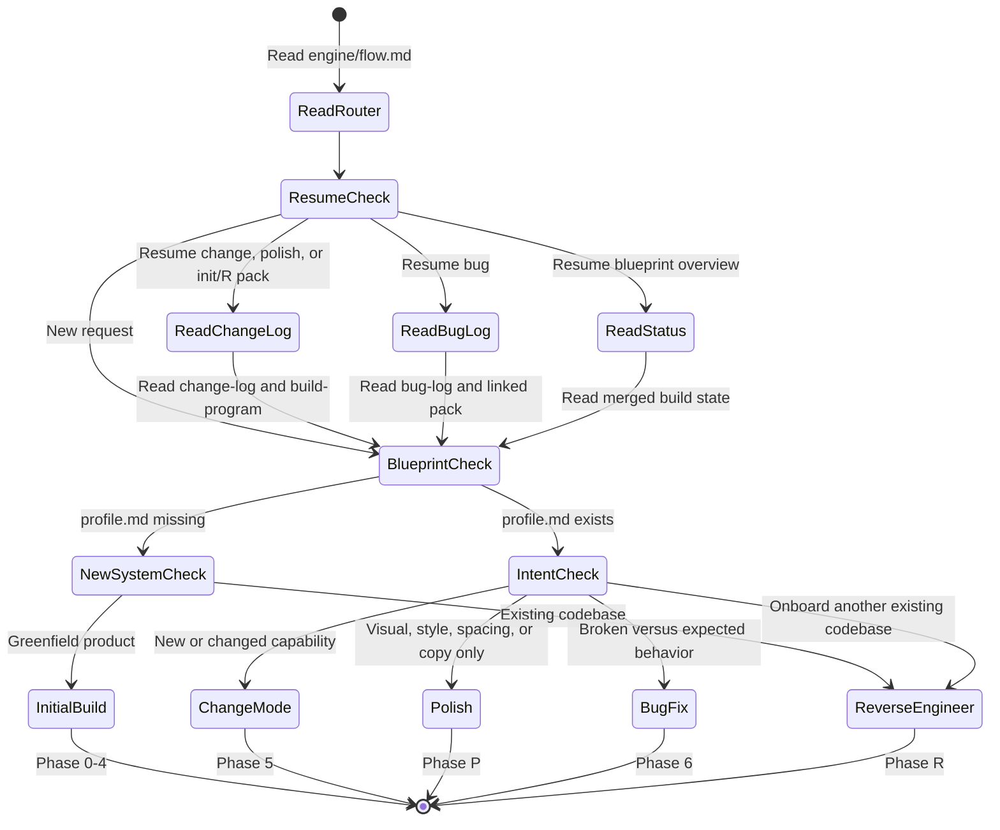
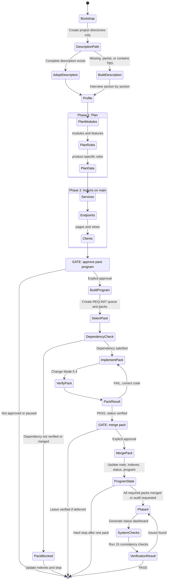
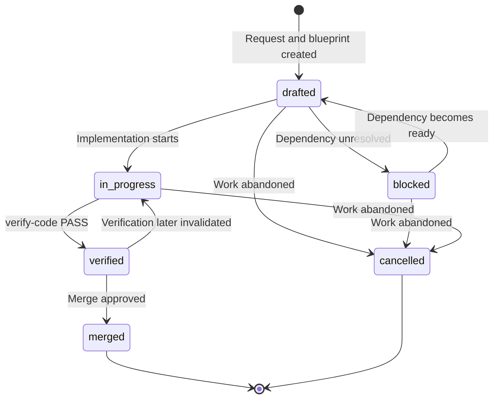
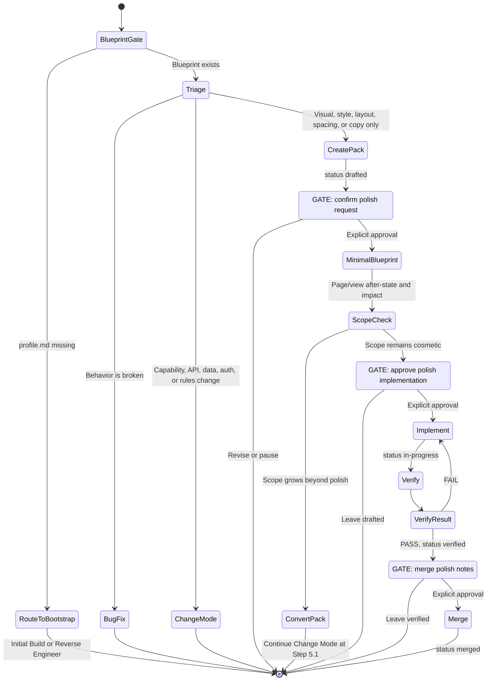
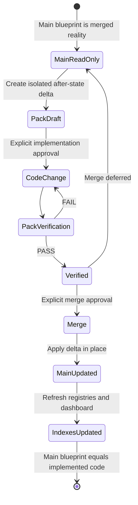

# Flow UML diagrams

This document is a visual map of the five RoyaScaff engine flows and the router that selects between them. The diagrams use Mermaid UML state diagrams and summarize the normative instructions in [`engine/flow.md`](../../engine/flow.md) and [`engine/flows/`](../../engine/flows/).

The engine files remain the source of truth. A confirmation gate marked with `GATE` requires explicit user approval; silence is not approval.

## Flow router

The router decides which flow owns the request and prevents change, polish, and bug work from starting without an existing blueprint.

## Initial Build — Phases 0–4

Initial Build writes product intent to the main blueprint as `planned`, then implements one vertical REQ-INIT pack at a time. It never builds the whole application in one Phase 3 session.

## Change Mode — Phase 5

Change Mode owns features and any work that changes the plan, data, API, behavior, or multiple applications. Main blueprint files are read-only until Step 5.6.

```mermaid
stateDiagram-v2
    [*] --> BlueprintGate
    state BlueprintGate <<choice>>
    BlueprintGate --> RouteToBootstrap: profile.md missing
    BlueprintGate --> ResumeOrCreate: Blueprint exists
    RouteToBootstrap --> [*]: Use Initial Build or Reverse Engineer

    ResumeOrCreate --> ReadIndexes: Read change-log and build-program
    ReadIndexes --> TrackChoice
    state TrackChoice <<choice>>
    TrackChoice --> FastTrack: Small, low-risk, self-contained change
    TrackChoice --> Understand: Standard change

    state "Fast-track" as FastTrack {
        [*] --> FTRequest
        FTRequest --> FTImpact: Confirm request
        FTImpact --> FTImplementGate: Minimal blueprint and impact
        FTImplementGate --> FTImplement: Explicit approval
        FTImplement --> FTVerify: status in-progress
        FTVerify --> FTMergeGate: PASS and status verified
        FTMergeGate --> FTMerge: Explicit approval
        FTMerge --> [*]: status merged
    }

    Understand --> DependencyGate: Step 5.0 interview and request
    state DependencyGate <<choice>>
    DependencyGate --> Blocked: Dependency unresolved
    DependencyGate --> RequestGate: Dependency ready
    Blocked --> [*]: status blocked

    state "GATE: confirm request" as RequestGate
    RequestGate --> Recon: Explicit approval
    RequestGate --> [*]: Revise or pause
    Recon --> NewAppCheck: Code reconnaissance and impact

    state NewAppCheck <<choice>>
    NewAppCheck --> NewAppDefinition: change-type new-app
    NewAppCheck --> BlueprintGate2: Other change type
    NewAppDefinition --> BlueprintGate2

    state "GATE: approve blueprint drafting" as BlueprintGate2
    BlueprintGate2 --> DraftBlueprint: Explicit approval
    BlueprintGate2 --> [*]: Revise or pause
    DraftBlueprint --> CodeGate: Pack-only after-state delta

    state "GATE: approve implementation" as CodeGate
    CodeGate --> Implement: Explicit approval
    CodeGate --> [*]: Leave drafted
    Implement --> Verify: status in-progress
    Verify --> VerifyResult

    state VerifyResult <<choice>>
    VerifyResult --> Implement: FAIL
    VerifyResult --> MergeGate: PASS, status verified

    state "GATE: merge into main" as MergeGate
    MergeGate --> Merge: Explicit approval
    MergeGate --> [*]: Leave verified
    Merge --> [*]: status merged; main equals code
```

### Change pack status lifecycle

## Polish — Phase P

Polish permits presentation-only changes. If data, API, authorization, business rules, or behavior enter scope, the existing pack is converted to Change Mode.

## Bug Fix — Phase 6

Bug Fix uses Path A when the correction affects the blueprint, multiple modules/apps, or data. Only a truly isolated code correction uses Path B.

```mermaid
stateDiagram-v2
    [*] --> BlueprintGate
    state BlueprintGate <<choice>>
    BlueprintGate --> RouteToBootstrap: profile.md missing
    BlueprintGate --> Triage: Blueprint exists
    RouteToBootstrap --> [*]: Initial Build or Reverse Engineer

    state Triage <<choice>>
    Triage --> Polish: Nothing broken; cosmetic request
    Triage --> BlueprintImpact: Confirmed bug
    Polish --> [*]

    state BlueprintImpact <<choice>>
    BlueprintImpact --> Escalate: Blueprint change required
    BlueprintImpact --> MultiScope: No blueprint change

    state MultiScope <<choice>>
    MultiScope --> Escalate: More than one module or app
    MultiScope --> Migration: One module and app

    state Migration <<choice>>
    Migration --> Escalate: Data migration required
    Migration --> DirectFix: No migration

    state "Path A: Escalated change pack" as Escalate {
        [*] --> BugEscalated: bug-log ESCALATED
        BugEscalated --> ChangePack: Create bug-fix pack
        ChangePack --> ChangeLifecycle: Run Change Mode 5.0-5.6
        ChangeLifecycle --> BugDone: Pack merged
        BugDone --> [*]: bug-log DONE
    }

    state "Path B: Direct fix" as DirectFix {
        [*] --> BugReport: Create report and PENDING row
        BugReport --> Investigate: Root cause; no code yet
        Investigate --> FixGate
        state "GATE: approve fix" as FixGate
        FixGate --> ApplyFix: Explicit approval
        ApplyFix --> ConfirmGate: Minimal code fix and verification
        state "GATE: confirm resolution" as ConfirmGate
        ConfirmGate --> MarkDone: Explicit confirmation
        MarkDone --> [*]: bug-log DONE
    }

    Escalate --> [*]
    DirectFix --> [*]
```

## Reverse Engineer — Phase R

Reverse Engineer documents existing code on main. It does not repair every discovered problem during extraction; gaps and drift become isolated REQ-R packs for Change Mode.

```mermaid
stateDiagram-v2
    [*] --> Bootstrap
    Bootstrap --> WorkspaceScan: Create project directories only

    state "R.0: Discovery" as Discovery {
        WorkspaceScan --> DetectApps
        DetectApps --> DraftProfile
    }

    DraftProfile --> ProfileGate
    state "GATE: approve discovered profile" as ProfileGate
    ProfileGate --> DeepScan: Explicit approval
    ProfileGate --> Discovery: Revise profile

    state "R.1: Codebase deep scan" as DeepScan {
        [*] --> ExtractSchemas
        ExtractSchemas --> ExtractServices
        ExtractServices --> ExtractEndpoints
        ExtractEndpoints --> ExtractClients
        ExtractClients --> [*]
    }

    DeepScan --> Synthesize
    state "R.2: Plan synthesis on main" as Synthesize {
        [*] --> MapModules
        MapModules --> MapAuthorization
        MapAuthorization --> DetectRules
        DetectRules --> GenerateDescription
        GenerateDescription --> [*]
    }

    Synthesize --> BlueprintReviewGate
    state "GATE: approve full blueprint" as BlueprintReviewGate
    BlueprintReviewGate --> DriftAnalysis: Explicit approval
    BlueprintReviewGate --> Synthesize: Revise blueprint

    state "R.3: Drift analysis" as DriftAnalysis {
        [*] --> ConsistencyChecks
        ConsistencyChecks --> DriftReport
        DriftReport --> Reconcile
        Reconcile --> [*]
    }

    DriftAnalysis --> ReconciliationAction
    state ReconciliationAction <<choice>>
    ReconciliationAction --> UpdatePlan: Valid undocumented code
    ReconciliationAction --> QueueFix: Fix or remove code
    ReconciliationAction --> RecordDebt: Known technical debt

    UpdatePlan --> StatusDashboard
    QueueFix --> StatusDashboard
    RecordDebt --> StatusDashboard
    StatusDashboard --> BuildProgram: Generate merged reality dashboard
    BuildProgram --> ProgramResult: Create REQ-R packs for gaps and drift

    state ProgramResult <<choice>>
    ProgramResult --> [*]: No actionable gaps
    ProgramResult --> ChangeMode: Packs queued; do not implement in Phase R
    ChangeMode --> [*]: Continue each pack at Change Mode 5.4+
```

## Shared isolation and merge model

Initial Build packs, Change Mode, Polish, and escalated bugs all converge on the same controlled merge model.

## Source flow files

| Diagram | Normative source |
|---------|------------------|
| Router | [`engine/flow.md`](../../engine/flow.md) |
| Initial Build | [`engine/flows/initial-build.md`](../../engine/flows/initial-build.md) |
| Change Mode | [`engine/flows/change-mode.md`](../../engine/flows/change-mode.md) |
| Polish | [`engine/flows/polish.md`](../../engine/flows/polish.md) |
| Bug Fix | [`engine/flows/bug-fix.md`](../../engine/flows/bug-fix.md) |
| Reverse Engineer | [`engine/flows/reverse-engineer.md`](../../engine/flows/reverse-engineer.md) |
