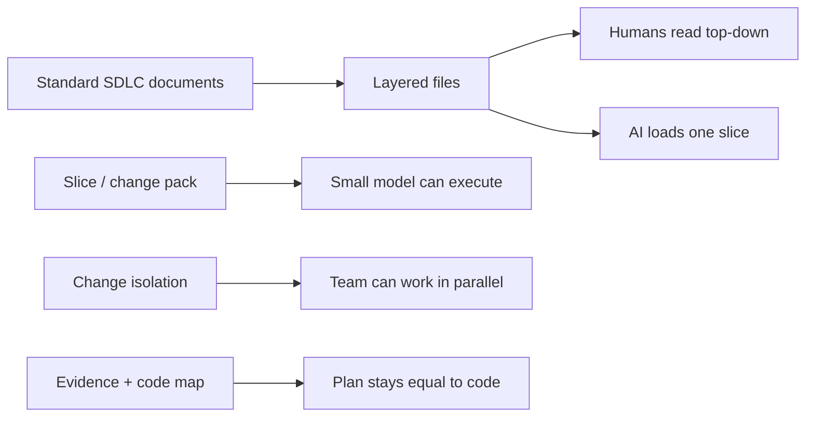

# Purpose and success criteria

The engine is not a code generator. It is a control system that lets a developer and an AI follow a standard software lifecycle, keep the written plan equal to the shipped product, and do that without depending on a huge context window or one expensive model.

## The six purposes

| # | Purpose | What “good” looks like | What v1.2 actually does |
|---|---------|------------------------|-------------------------|
| 1 | Developers build with AI **through a standard SDLC**, including the documents that process requires | A new reader can walk BRD → design → action plan → code → evidence | Starts at modules, persistence, and services. No BRD, no conceptual model, no project architecture, no contract catalog |
| 2 | AI builds the **design and the action plan** that apply the concepts | Design is explicit, approved, and small enough to review before code | Design is implicit inside service/endpoint/page text. Action plan is a pack queue, not a task contract |
| 3 | Implementation **sticks to the action plan** | Code changes are traceable to approved after-state; unexplained files fail | Pack isolation is strong. Verification can still be a checkbox with no proof |
| 4 | New features keep the **plan up to date**, and developers can edit the workflows | After merge, main is current; a workflow change is a first-class edit, not tribal knowledge | Merge updates services/endpoints/pages. Workflows and business meaning are not files, so they rot first |
| 5 | AI does **not need a big context window or a specific model** | A weaker model can implement a pack if the pack is complete | Implementer load set is the right idea. Discovery still says “read the relevant files.” Reverse Engineer asks for a whole-codebase deep scan |
| 6 | A person can **understand the app and its workflows from a few files with UMLs**, then go deeper | Layer 0 is a map. Each next folder is a deeper SDLC concern | `status.md` and indexes help navigation. There is no system map, no UML-first workflow view, and no “next layer” contract |

## How the purposes constrain the design

These purposes conflict if you treat them as “write more documents.”

Rules that follow:

1. **Every durable fact has one home.** Indexes, dashboards, and slice packs are views.
2. **Depth is optional.** A small product can keep one file per layer. A large product splits by module. The model does not change.
3. **Ceremony matches risk.** A copy change must not pay for an architecture RFC.
4. **The action plan is a contract.** Another chat, another person, or a weaker model must be able to implement it without inventing architecture.
5. **Understanding is a reading path, not a dump.** UML and a system map first. Code last.

## Success criteria for this improvement

The engine is successful when all of the following are true.

### For the developer

- I can explain the product from `system-map.md` and one or two workflow diagrams without opening a schema.
- If I need more, I know which next folder to open: concept, architecture, contracts, or implementation.
- I can add a feature and see the affected workflow, contract, and files before code is written.
- I can hand a pack to a teammate and they do not need the previous chat.

### For the AI

- The router classifies intent and risk, then loads only the files that layer needs.
- Design happens before code and produces an after-state the user can approve.
- Implementation is not allowed to invent new public contracts or architecture.
- Verification cannot say PASS without commands, tests, or inspection evidence.
- A smaller model can execute a well-written pack. A larger model is used for design and review when the team wants that, not because the engine requires it.

### For the team

- Two people can design or implement different changes without editing the same status table by hand.
- Ownership of a module or layer is visible.
- Main never silently becomes a mix of hope and history.
- A new teammate can onboard from the map, not from folklore.

### For genericity

- The same engine can describe an API product, a web+mobile system, a CLI, a library, a worker, or a data pipeline.
- Framework folder layouts live in adapters, not in the core methodology.
- If a project has no HTTP endpoints, it is not forced to invent fake services and pages.

## Anti-goals

Do not optimize for these:

- A graph database or visual modeling product
- One giant blueprint file
- Documenting every private helper as its own spec
- Waterfall gates that block a vertical slice until every layer is “finished for the whole product”
- Replacing human approval on money, security, or public-contract decisions
- Making v1.3 unusable until a CLI compiler exists

Waterfall is the **reading and design order**. Vertical packs remain the **delivery order**.
