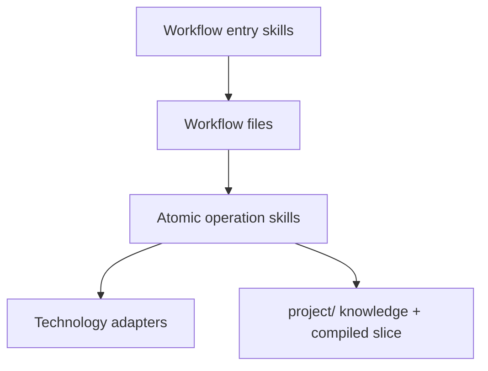

# Skills review

Skills live in `skills/<name>/SKILL.md` and are copied to `.cursor/skills/` or `.claude/skills/`. They are the human and agent entry points. The flows are the normative procedures.

## What the skill layer is today

| Skill | Role | First action |
|-------|------|--------------|
| `/flow` | Index only | Lists commands and triage |
| `/initial-build` | Orchestrate Phases 0–4 | Read layout, maybe change-log, then the whole initial-build flow |
| `/change-mode` | Orchestrate Phase 5 | Require blueprint, redirect polish, read change-log, then the whole change-mode flow |
| `/polish` | Orchestrate Phase P | Same pattern |
| `/bug-fix` | Orchestrate Phase 6 | Same pattern |
| `/reverse-engineer` | Orchestrate Phase R | Read layout, then the whole reverse-engineer flow |

Each skill is a thin wrapper: frontmatter, a phase table, a few mandatory rules, and “read the flow in full.”

## Advantages

1. **Discoverable.** `/flow` answers “which command?” without executing work.
2. **Correct dependency.** Skills point at flows. They do not invent a second process.
3. **Preconditions are stated.** Missing `profile.md` stops change/polish/bug. That prevents the agent from improvising a blueprint.
4. **Isolation is repeated** in change-mode and polish. That repetition is intentional: the skill must be useful before the long flow is loaded.
5. **Handoff language is consistent.** Init and reverse-engineer both say “implementation continues in change-mode.”
6. **Agent-portable in principle.** The files are Markdown. Cursor vs Claude is a copy target, not a different method.

## Disadvantages

### 1. Skills are summaries, not operations

They restate step numbers and pack-status tables. They do not do one job such as “classify impact,” “compile the files for this task,” or “reconcile the pack into main.” A model that only reads the skill will under-specify. A model that always reads the full flow will blow the context window. There is no middle.

### 2. Duplication will drift

`docs/contributing/01-engine-architecture.md` already admits this: keep skill duplication minimal and sync it when gates change. Nothing enforces that. v1.3 will change step numbers. The skills will become the wrong router.

### 3. No standard skill contract

A skill does not declare:

- required inputs
- allowed writes
- stop / gate conditions
- failure modes
- what it must not do (for example: implement during reverse-engineer)
- maximum context budget

Without that contract, skills cannot be tested and cannot be composed.

### 4. No context-building skill

Every flow skill says, in effect, “load the flow, then find the relevant project files.” That is the opposite of purpose 5. The missing skill is:

```text
given intent + risk + pack or task
    resolve affected IDs
        emit a manifest
            load only those sections
```

Until that exists, small-model success is accidental.

### 5. No verification or reconciliation skill

The same session that implements also checks the boxes. For low-risk work that is fine. For high-risk work, verification should be a separate procedure with an evidence table and a file-classification pass.

### 6. Technology knowledge is buried in one flow

Reverse Engineer’s appendices are Nest/Express/Angular/React detection heuristics. They are useful and they do not belong inside a generic skill. They should be adapters the reverse-engineer skill *selects*.

### 7. Install surface is agent-shaped, method is not

The CLI copies skills into Cursor or Claude folders. The method should stay agent-neutral. Packaging is an adapter. If a third agent appears, the engine should not grow a third copy of the procedure.

## Target skill architecture

Split three kinds of files.



### Workflow entry skills (keep, make thinner)

`/flow`, `/initial-build`, `/change-mode`, `/polish`, `/bug-fix`, `/reverse-engineer`, plus later `/refactor` if needed.

These only:

- choose the workflow
- state preconditions
- name the first atomic skill
- forbid the usual mistakes (edit main, monolith build, implement during Phase R)

They must not copy the numbered lifecycle.

### Atomic operation skills (add)

| Skill | Job |
|-------|-----|
| Classify request | Intent + risk + suggested workflow |
| Analyze impact | Layer-by-layer `changed` / `unchanged` + file list |
| Model concept | Actors, use cases, invariants, workflows |
| Draft architecture / ADR | Only when the change needs it |
| Draft contracts | DTOs, ports, events |
| Compile context | Manifest + bounded pack under a token budget |
| Plan tasks | Ordered action plan another model can execute |
| Implement from pack | Code only against approved after-state |
| Verify with evidence | Commands, tests, code-map, acceptance |
| Reconcile | Apply delta to main; archive; refresh generated indexes |

One capable agent may run several roles. High-risk verification should still be a distinct pass.

### Technology adapters (move out of core)

Detection patterns, folder conventions, test commands, generated/vendor exclusions. Selected by `project/profile.md`. Unknown stacks fall back to “inspect and ask.”

## Skill quality bar

A skill is ready when:

- it can be followed without reading a 400-line flow
- it names exact inputs and write locations
- it has a stop condition
- it does not contain product knowledge
- it does not duplicate another skill’s procedure
- a context-limited model can finish it from the compiled slice plus the skill

## What to do with the current six files

| Current skill | v1.3 fate |
|---------------|-----------|
| `/flow` | Keep as index; add intent × risk table |
| `/initial-build` | Keep as entry; body becomes “run classify → concept → design → program → one pack” |
| `/change-mode` | Keep as entry; body points at impact → context → plan → implement → verify → reconcile |
| `/polish` | Keep; add micro / page / system |
| `/bug-fix` | Keep; add risk override to Path A |
| `/reverse-engineer` | Keep as entry; body becomes inventory-first loop; appendices move to adapters |

Do not delete the current skills in the first patch. Thin them as the atomic skills appear, so installed projects do not break.
