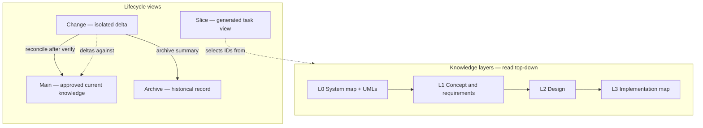
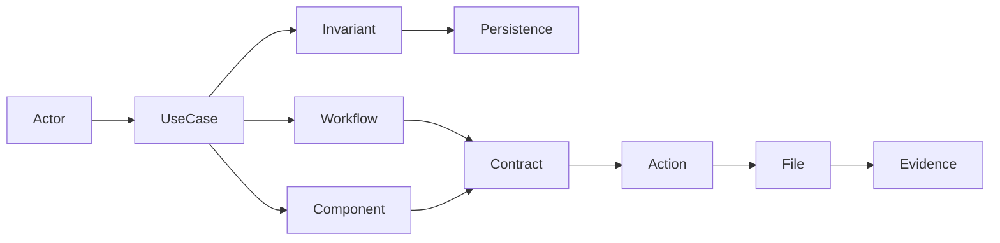

# Layered blueprint target

This is the recommended knowledge model. It takes the v1.3 proposal’s concept / architecture / contracts / code-map idea and places it in an SDLC reading order. The goal is not more files for their own sake. The goal is **one fact, one home, many views**.

## The problem the layers solve

A developer should understand the product the way a good team already thinks:

```text
What is this product?
    Who uses it and what must be true?
        How is it designed?
            What should we build next?
                Which files did we actually change?
                    How do we know it is done?
```

v1.2 jumps to “what tables and services exist?” A senior engineer can reconstruct the rest. A small model cannot. A new teammate should not have to.

Waterfall is used here as a **layering of documents**, not as a project-management religion. Delivery stays iterative and vertical.

## Two axes

| Axis | Question | Examples |
|------|----------|----------|
| **Knowledge layer** | What do we know? | concept, requirements, architecture, workflows, data, contracts, implementation |
| **Lifecycle view** | Why are we looking at a subset? | main (current), slice (task view), change (proposed delta), archive (history) |

v1.2 mixes these. A REQ-INIT pack copies planned main artifacts and becomes a competing document. v1.3 must stop that.



## Progressive disclosure

This is purpose 6, stated as a rule.

| Depth | Reader | Opens | Typical size |
|-------|--------|-------|--------------|
| L0 | Anyone, including a new AI session | `system-map.md` | 2–5k tokens. Product in one sitting. Context diagram, module map, key workflows |
| L1 | Product, BA, anyone changing meaning | `concept/`, requirements | Language, actors, capabilities, use cases, invariants |
| L2 | Designer / architect / tech lead | architecture, workflows, data, contracts, security | How the system is shaped |
| L3 | Implementer | components, actions, code-map | What to build and which files own it |
| Task | The agent doing *this* job | Generated slice + change pack | Only affected IDs |

If a person or model needs more, they go to the next layer. They do not load the repository.

### UML policy

UMLs belong at L0 and on complex L1/L2 workflows. They are navigation, not decoration.

| File | Diagram | When required |
|------|---------|----------------|
| `system-map.md` | Context (actors ↔ apps) | Always |
| `system-map.md` | Module map | Always when more than one module exists |
| `concept/workflows/<name>.md` | State and/or sequence | When the workflow is complex (see rule below) |
| `architecture/overview.md` | Allowed dependency directions | When more than one layer or app exists |
| Action specs | Optional sequence | Only if a single endpoint or page hides a multi-step dance |

Complex workflow rule — create a workflow file when any of these is true:

- more than three meaningful states
- approval or rejection
- async, retry, timeout, or compensation
- multiple actors or applications
- security-sensitive transitions

Do not require a diagram for “list polls.”

## Recommended tree

Small projects keep **one file per layer**. Split by module only when a file is too large or two teams own different parts.

```text
project/
  system-map.md                 # L0 entry — humans and agents start here
  profile.md                    # identity, apps, stack, adapters
  description.md                # narrative BRD; may stay as the interview output

  concept/
    _index.md
    domain.md                   # language, actors, capabilities, concepts, invariants
    workflows/                  # only complex workflows + UML

  requirements/                 # optional split when domain.md is no longer enough
    product.md
    non-functional.md
    modules/<module>.md

  architecture/
    overview.md                 # this project's style and dependency rules
    security.md
    patterns.md                 # only patterns actually chosen
    decisions/ADR-*.md          # only lasting decisions
    components/<app>/<module>.md
    code-map/<app>/<module>.md

  contracts/
    <app>/<module>.md           # interfaces, DTOs, events, provider payloads

  plan/                         # keep during migration
    modules.md
    data-model.md               # persistence only; maps to concept IDs
    roles-and-authorization.md

  actions/                      # keep IDs; treat as the public action catalog
    <app>/services|endpoints|pages|views/

  changes/
    active/change-<ID>-<slug>/
    archive/<year>/
  bugs/
  indexes/                      # generated
  verify/
```

`description.md` stays. It is the story. `concept/` is the model. They must not contradict each other; the model is canonical for IDs and invariants.

## Layer contents

### L0 — System map

Answers: what is this, where are the boundaries, where do I go next?

Must include:

- one-paragraph product purpose
- actors
- applications and integrations
- module list with one-line purpose
- links into L1–L3
- two or three mermaid diagrams
- generated counts (done / partial / planned) — not hand-edited

Must not include: field lists, DTO tables, file paths, change history.

### L1 — Concept and requirements (the BRD layer)

Answers: what business world are we in?

`concept/domain.md` recommended sections:

1. Ubiquitous language
2. Actors and goals
3. Capabilities
4. Use cases
5. Concepts (including ones that are not tables)
6. Relationships
7. Invariants
8. Domain events
9. Context boundaries

Rules:

- No database types, HTTP routes, class names, or source paths.
- Every persistence entity later points at one or more concept IDs.
- A concept does not need a table. “Vote uniqueness” is a concept/invariant, not a column.

This is the layer the v1.3 proposal named `concept/`. It is the most important missing piece for purposes 1, 2, 4, and 6.

### L2 — Design

Answers: how will we realize that world?

| Concern | File | Notes |
|---------|------|-------|
| Architecture style and boundaries | `architecture/overview.md` | Record what *this* project uses |
| Security | `architecture/security.md` | Authn/z, tenancy, threat notes |
| Workflows | `concept/workflows/` or `workflows/` | Design of the business process |
| Persistence | `plan/data-model.md` | Storage shape only |
| Transport and ports | `contracts/` | Request/response, events, provider payloads |
| Lasting choices | `decisions/ADR-*` | Only when the choice has consequences |

Distinguish model kinds. Do not put them in one “data model”:

| Kind | Meaning | Home |
|------|---------|------|
| Conceptual | A Customer places Orders | `concept/` |
| Domain / invariant | An order cannot be paid twice | `concept/` |
| Persistence | `orders.status`, keys, indexes | `plan/data-model.md` |
| Transport | `CreateOrderDto` | `contracts/` |
| Integration | Stripe payload | `contracts/` |
| View | `OrderListItem` | `contracts/` or page spec |

### L3 — Implementation map

Answers: what runtime units exist, and which files are they?

A **component** is a runtime unit with a responsibility. It does not have to be named `*Service`. Guards, repositories, jobs, adapters, stores, and page feature services are components when they meet the blueprint-worthy test from the v1.3 proposal.

**Actions** (endpoints, pages, views, CLI commands, jobs that are user-visible) stay. They are how the system is used. They reference components and contracts.

**Code map** is the durable bridge to disk. Every significant created or modified file is:

1. mapped to a component, contract, action, or persistence entity, or
2. attached as `supports` / `configures` / `verifies` / `migrates`, or
3. generated, with its generator named, or
4. excluded by a repository pattern (build output, vendor).

An unexplained runtime file fails verification.

Supporting files (a private formatter, a local constant) do **not** get their own spec. That is how the model stays small.

## The three blueprint kinds

This is the part of v1.2 that must survive.

### Main blueprint

Approved current understanding. Entry point: `system-map.md`.

Main may contain approved-but-not-built work, but every artifact has two statuses:

```yaml
knowledge_status: draft | approved | deprecated | superseded
implementation_status: planned | partial | implemented | verified | not-applicable
```

“Is this the real design?” and “is this in the repo?” are different questions. v1.2 collapses them into one `status`.

### Slice blueprint

A slice is a **view**, not a vault.

It selects IDs across layers for one capability, workflow, or task:

```text
WF-POLLS-01 Place vote
  ← UC-POLLS-02
  ← INV-POLLS-01 one vote per user
  → CTR-POLLS-03 CastVoteRequest
  → EP-POLLS-03
  → CMP-POLLS-API-02 VoteService
  → src/modules/polls/vote.service.ts
  → test/polls/vote.spec.ts
```

The slice does not copy those documents. A context compiler (human-written at first, then CLI) gathers the needed sections into a bounded pack. That is how a small model reaches a large-model result: the thinking was done at design time; implementation time only sees the contract.

Compatibility alias: today’s REQ-INIT pack `blueprint/` folder. In v1.3 that folder should become “delta + pointers,” not a second full spec tree.

### Change blueprint

Temporary overlay against a recorded baseline:

```text
request
  + impact (per layer changed/unchanged)
  + after-state deltas
  + execution plan
  + acceptance criteria
  + verification evidence
```

After verify and merge, deltas are reconciled into main. The change is archived. Agents must not treat archived deltas as current truth.

## Traceability graph

Replace the single chain with a graph that still has a direction:



Integrity rules:

- every feature maps to a capability or use case
- every business rule maps to an invariant or project rule
- every action maps to components and contracts
- every `done` / `partial` component maps to files
- every significant runtime file maps back to an owner
- every critical invariant maps to an enforcing component and a test

## Genericity

The core defines artifact types, relations, statuses, isolation, and validation. It does **not** define REST, React, or `src/modules`.

`profile.md` selects adapters:

| Adapter provides | Examples |
|------------------|----------|
| Discovery patterns | Nest controllers, FastAPI routers, Cobra commands |
| Default architecture | layered API, hexagonal, feature-first frontend, CLI |
| Contract extractors | OpenAPI, proto, JSON Schema, CLI flags |
| Check commands | `npm test`, `go test`, `pytest` |
| Exclusions | `dist/`, `node_modules/`, `.next/` |

Project kinds the core must accept without fake pages:

- api, web, mobile
- cli, library
- worker / scheduler
- data pipeline
- mixed

If there are no HTTP endpoints, the action catalog is commands, jobs, or public functions.

## How this uses the v1.3 proposal — and where it differs

| Proposal idea | This plan |
|---------------|-----------|
| `concept/` before storage | Adopt. This is the BRD layer. |
| Components, not filename conventions | Adopt. |
| First-class contracts | Adopt. Simple DTOs may stay inline until they are shared or public. |
| Code map and no orphan files | Adopt. |
| Architecture as a project decision | Adopt. Patterns only when real. |
| Progressive detail | Adopt as a hard rule. |
| Isolation until merge | Keep unchanged. |
| Risk-based gates | Adopt. |
| Evidence-based PASS | Adopt. |
| Many ID prefixes on day one | Reject. Start with CON/UC/INV/WF, CTR, CMP, existing SVC/EP/PG/VW, ADR. Add more only when a layer exists. |
| Code-map first for everyone | Reject for greenfield. Correct for reverse-engineer. |
| Full knowledge compiler in v1.3 | Defer. Schema + generated indexes first. Compiler when the schema stops moving. |
| `actions/` deleted immediately | Reject. Keep action IDs. Grow components beside them. Migrate when validators exist. |

## What a small model does with this

Example: add “poll close.”

1. Router: change, medium risk.
2. Resolver: UC close-poll, INV only-creator, EP close, page detail, tests.
3. Slice stays inside a token budget.
4. Design skill writes the after-state for those IDs only.
5. Human approves the rule “only creator.”
6. Planner writes tasks another model can execute.
7. Implementer never opens `data-model.md` for Users.
8. Verifier checks files against the code-map and runs the named tests.
9. Reconciler updates main. Six months later a reader opens `system-map.md` and `workflows/vote-and-close.md`, not the old pack.

That is the engine reaching a high-model result with a low-model implementer: **the quality is in the compiled plan, not in the window.**
