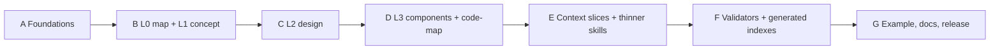

# Improvement plan

This is the delivery plan. It is written so the engine stays generic, stays Markdown-first, and gets better for developers, AI, and teams without a rewrite.

## Design stance

1. **Preserve the control loop.** Isolation, vertical packs, gates, rebuild test, engine purity.
2. **Add SDLC knowledge in reading order.** Map → concept → design → implementation → evidence.
3. **Hide mechanics behind views.** People write records. Indexes, status, and slices are generated or validated.
4. **Ship increments that a v1.2 project can adopt.** No flag day that invalidates PollPulse IDs.
5. **Do not wait for a compiler to start being useful.** Layer files and templates first. CLI next. Fancy resolution last.



Phases A–D can land as `v1.3.0`. E–F may spill into `v1.3.x` if the schema is not yet stable. Do not announce v1.3 until a greenfield project and a migrated PollPulse both work.

---

## Phase A — Foundations (no new layers yet)

**Goal:** stop the worst drift without asking teams to learn new folders.

### Work

- Add YAML front matter to `change-request.md` as the **only** canonical pack state: id, request_id, status, risk, depends_on, base_revision, timestamps.
- Teach flows: `change-log.md` and pack `status.md` must match that block. Prefer “generate or overwrite the log” over three-way human edits.
- Split artifact status in conventions:
  - `knowledge_status`
  - `implementation_status`
- Document the three blueprint kinds in `engine/project-layout.md` using the words teams already know: main, slice, change.
- Add intent × risk to `engine/flow.md`. Do not add new flow files yet. Route unknown intents to Change Mode with a risk note.
- State the generic-core rule: `engine/conventions.md` REST/JWT defaults are **web-api adapter defaults**, not universal law.

### Exit

- A pack has one status owner.
- Docs no longer say “main is only implemented reality” without mentioning planned backlog.
- Router mentions risk.

---

## Phase B — L0 system map and L1 concept

**Goal:** a person can understand the product, and Initial Build starts with meaning.

This is the highest-value phase for your six purposes. Do it before a general component registry.

### Work

- New templates:
  - `system-map-template.md` (purpose, actors, apps, modules, mermaid context + module map, links)
  - `concept-domain-template.md`
  - `concept-index-template.md`
  - `workflow-template.md` (trigger, states, transitions, invariants, events, UML, owners)
- Layout: allow `project/system-map.md` and `project/concept/`.
- Initial Build:
  - After description + profile, write concept (and workflows when the rule fires).
  - Gate: “Does this language and these use cases look correct?”
  - Modules and data model must cite concept IDs.
- Change Mode impact: first question is “does meaning or a workflow change?”
- Reverse Engineer: infer concept **after** a module inventory, with `confidence` and `evidence`. Do not mark inferred language `done`.
- Polish and bug-fix stay out of concept unless Path A / system polish needs it.

### Progressive detail

| Project size | Files |
|--------------|-------|
| Tiny (PollPulse) | `system-map.md` + `concept/domain.md` |
| Medium | add `concept/workflows/*.md` |
| Large | split domain by bounded context; keep the index |

### Exit

- Greenfield can produce a map and a concept layer.
- Every `data-model` entity in new work references a concept.
- A reader can explain PollPulse from two files plus one vote-state diagram.

---

## Phase C — L2 project design

**Goal:** the project records *its* architecture and *its* contracts.

### Work

- Templates: architecture overview, security, pattern record (conditional), ADR (conditional), contract record.
- `architecture/overview.md` is required once there is more than a single trivial app. It states style, boundaries, and allowed dependency directions.
- `contracts/` is required for:
  - public API request/response
  - shared or versioned DTOs
  - ports / interfaces
  - events
  - provider payloads
- Simple, single-endpoint DTOs may remain inline until they are reused or public. This avoids a contract explosion.
- Endpoints and services in new work reference `CTR-*` when a contract file exists.
- Engine rules split:
  - `engine/rules/core.md` — tech-independent (boundaries, no business logic in transport, isolation of integrations)
  - `engine/rules/adapters/web-api.md`, `web-ui.md`, later `cli.md`, `worker.md`
- Profile selects adapters.

### Exit

- A new project has a project-specific architecture page.
- Public inputs/outputs are findable without opening implementation.
- A CLI-only profile is not forced to create `pages/`.

---

## Phase D — L3 components and code map

**Goal:** no significant file is an orphan after merge.

### Work

- Component template and “blueprint-worthy” rule from the v1.3 proposal (business rule, security, persistence, I/O, public interface, entry point, replaceable boundary). Everything else `supports` an owner.
- Code-map template per app/module.
- Pack verification: collect created/modified files; every one classified; unexplained runtime file → FAIL.
- Keep `SVC-*` / `EP-*` / `PG-*` / `VW-*`. A service becomes a component kind. Do not rename existing IDs.
- Merge copies pack code-map rows into main.

### Exit

- Reverse Engineer and Change Mode can account for a guard, job, or repository without calling it a service.
- PollPulse (or a migrated copy) has a code-map that covers runtime source.

---

## Phase E — Context slices and skills

**Goal:** a small model implements from a compiled view.

### Work

- Slice manifest format: list of IDs, reason for inclusion, token budget, excluded layers.
- Context pack: generated Markdown the implementer loads instead of “the relevant files.”
- First implementation may be **agent-assembled from a checklist** (read these IDs, copy these sections). CLI compiler comes in Phase F.
- Execution plan inside the change: ordered tasks with allowed files and forbidden inventions.
- Thin the six skills. Add atomic skills listed in [04-skills-review](04-skills-review.md).
- Polish sizes: micro / page / system.
- Add thin workflows: refactor, reconcile. They still implement through Change Mode.

### Exit

- The implementer load set is: change request, execution plan, context pack, impact, pack status.
- Skills no longer duplicate Phase 5 step numbers.

---

## Phase F — Validators and generated indexes

**Goal:** machines catch the errors humans and models will not.

### Deterministic checks (CLI)

1. IDs unique; references resolve
2. Illegal status transitions
3. Generated index stale vs pack front matter
4. Unexplained changed files
5. Verification PASS without evidence table
6. Persistence entity missing concept link (new work)
7. Adapter exclusions honored

### Semantic review (AI, separate pass)

- Use-case completeness
- Invariant coverage
- Workflow vs implementation
- Security/authorization sense

PASS = deterministic results + evidence. Semantic findings are findings, not a substitute.

### Generated views

- `indexes/changes.md` / `changes.json` from pack front matter
- `indexes/status.md` from artifact metadata
- `system-map.md` counts
- Optional `artifacts.json` for lookup

Manual edits to generated summaries are rejected or overwritten.

### Exit

- Two branches can merge without hand-merging `change-log.md` as the source of truth.
- `royascaff validate pack` and `royascaff validate project` exist, even if small.

---

## Phase G — Migration, example, documentation

### v1.2 → v1.3 adoption (incremental)

| Stage | Action |
|-------|--------|
| 1 | Add `system-map.md` and a derived `concept/` from description, modules, rules |
| 2 | Extract contracts from endpoint/service text |
| 3 | Inventory files → code-map; queue orphans as REQ-R |
| 4 | Write architecture overview from what the code already does; ADRs only for real decisions |

Do not rename existing action IDs.

### PollPulse

Migrate `example-v1.2` (or a v1.3 copy) until it passes the new validators and a stranger can understand voting from the map + one workflow file.

### Docs

Rewrite overview so the loop is:

```text
Concept → Design → Action plan → Code → Evidence → Main
```

Keep the current flow guides; add the new layers and the reading path. Do not leave `docs/` describing a service-only chain after the engine has moved.

---

## Flow and skill changes by phase

| Phase | Flows | Skills |
|-------|-------|--------|
| A | Router gains intent × risk | `/flow` table only |
| B | Initial Build inserts concept; Change impact asks about meaning; RE infers concept late | Entry skills mention the new first files |
| C | Design steps write architecture/contracts when needed | No new entry command |
| D | Verify includes code-map classification | Verify skill starts to exist |
| E | Thin refactor/reconcile; polish sizes | Atomic skills; entry skills shrink |
| F | Verify requires CLI output in the evidence table | Verify skill calls CLI |

---

## What we will not do in v1.3

- Graph database or hosted service
- One file per artifact
- Mandatory ADR and pattern records for every pack
- Deleting `actions/` before validators exist
- Making Waterfall block a vertical slice of the whole product
- Requiring a large model
- Expanding Reverse Engineer’s “scan everything” behavior

---

## Team cooperation (built into the phases)

| Need | Mechanism | Phase |
|------|-----------|-------|
| Parallel work without colliding IDs | Datetime IDs (already shipped) | — |
| Parallel work without colliding the log | Canonical front matter + generated change index | A, F |
| Handoff | Execution plan + compiled slice | E |
| Review at the plan | Gates remain; risk reduces pointless ones | A, E |
| Ownership | Module/layer owner on records | C |
| Shared understanding | L0 map + UMLs | B |
| Merge hygiene | In-place reconcile; archive old deltas | D, E |
| Independent check | Deterministic validate + optional second-pass review | F |

Agree as a team (engine-suggested, not enforced):

- one pack per branch
- code and blueprint reconcile in the same PR
- review the change request before the diff
- never edit main outside reconcile

---

## Suggested ID set for v1.3.0

Keep it small on purpose.

| Kind | Prefix | Layer |
|------|--------|-------|
| Concept | `CON-` | L1 |
| Use case | `UC-` | L1 |
| Invariant | `INV-` | L1 |
| Workflow | `WF-` | L1/L2 |
| Requirement (if split from concept) | `REQ-` | L1 — optional |
| Contract | `CTR-` | L2 |
| Component | `CMP-` | L3 |
| Service / endpoint / page / view | `SVC-` `EP-` `PG-` `VW-` | L3 — existing |
| Decision | `ADR-` | L2 — conditional |
| Rule | `RULE-` | existing |

Defer `ACT-`, `CAP-`, `EVT-`, `PAT-` as first-class prefixes until a project is large enough. They can live as rows inside `domain.md` without a global ID scheme.

---

## Open decisions (defaults this plan picks)

If you accept this plan, these are the defaults. Change them explicitly.

| Topic | Default |
|-------|---------|
| Concept file split | One `domain.md` until it is too large |
| Metadata | YAML front matter in Markdown |
| Services vs components | Services remain; they are a component kind |
| Simple DTOs | Inline until shared or public |
| Default code-map exclusions | build output, dependencies, caches, generated client SDKs listed in profile |
| High-risk trigger | authz, money, personal data, public contract, migration, irreversible, cross-app |
| Dependent implementation | Allowed on `verified` only if both packs share the working tree; otherwise require merged dependency code |
| v1.3 CLI | validate + later compile-context; init stays |
| Generated docs | indexes and counts; prose layers stay hand-authored |

---

## Acceptance — v1.3.0 is done when

1. A new reader explains the product from `system-map.md` and concept/workflow UMLs without opening schemas.
2. Initial Build produces concept before persistence, then design, then a vertical pack — never a monolith.
3. A change can update a workflow file and the main blueprint stays the home of that workflow after merge.
4. Every significant new runtime file has a code-map owner or an explicit exclusion.
5. Public contracts are referenced by ID from actions.
6. Architecture overview can be checked against declared dependency rules.
7. `verify-code.md` without evidence is invalid.
8. A pack can be implemented from a slice/context pack without loading the whole project.
9. Two developers can work two packs without treating `change-log.md` as a hand-merged source of truth.
10. A non-API project can use the engine without fake pages.
11. A v1.2 project can add layers without renaming `SVC-*` / `EP-*`.
12. PollPulse (or its v1.3 successor) demonstrates the reading path and passes validators that exist at ship time.

---

## Recommended first implementation slice

If work starts tomorrow, do **not** start with a compiler or a component taxonomy.

1. Phase A front matter + two-status model + intent/risk in the router
2. Phase B `system-map.md` + `concept/` + Initial Build order change
3. Phase D code-map on packs (closes orphans even before the full component catalog)
4. Then contracts and architecture
5. Then generated indexes and CLI

That order matches how humans learn the product (B) and how AI leaks quality (orphans and unevidenced PASS). The v1.3 proposal’s “code-map first” is right for **legacy onboarding**. For the engine itself and for greenfield users, **concept first** is the purpose-aligned order.

---

## Approval

Approving this folder authorizes implementation of Phases A–D toward v1.3.0, with E–F as soon as the file schema is stable. It does not authorize an npm publish.

Review these boxes before implementation starts:

- [ ] SDLC layers are the reading model; vertical packs remain the delivery model
- [ ] Main / slice / change stay; slice is a view
- [ ] Concept lands before persistence on greenfield
- [ ] ID set stays small
- [ ] Core stays tech-independent; adapters carry Nest/React/REST
- [ ] Ceremony follows risk
- [ ] No rewrite of v1.2 in one PR
