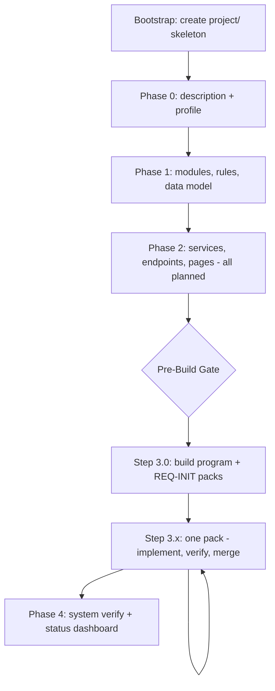
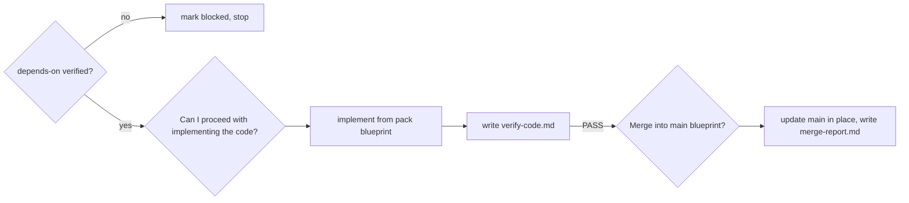

# Quickstart

Your first greenfield session, from an empty directory to a merged first feature. This walks the same path as [the initial build flow](../flows/01-initial-build.md), with commentary on what to expect and where to pay attention.

## Before you start

```bash
npx royascaff init
```

Have a rough idea of the product in your head. You do not need a written spec — Phase 0 will interview you if you do not have one.

## The shape of the session



Phases 0 through 2 are one sitting. Phase 3 is deliberately many sittings — one pack each.

## Step 1: Start the flow

```text
/initial-build
```

The AI reads [engine/flows/initial-build.md](../../engine/flows/initial-build.md) and runs the bootstrap gate, creating the blueprint root:

```text
project/
  plan/
  actions/
  changes/
  bugs/
  verify/
  docs/
```

Directories only. No files yet.

## Step 2: Phase 0 — description and profile

The AI first decides whether you already have a usable description.

- **Path A** — `project/description.md` exists with real content (purpose, primary user, core workflow, features, key entities, no `TBD`). It is treated as authoritative and only gaps are fixed.
- **Path B** — anything less. The AI walks you through the description template section by section, confirming each one.

Expect Path B on a fresh project. It is an interview: product summary, core workflow, features, entities, roles, integrations, constraints, business rules, out of scope, success criteria.

In parallel it establishes `project/profile.md` — your applications, repositories, tech stack, brand tokens, environments, and integrations.

> **Get the Applications table right.** Its **Key** column becomes the `target-app` value used by every future change request and the folder name under `project/actions/<key>/`. Changing it later means renaming folders. Spend the extra minute here.

**Output:** `project/description.md`, `project/profile.md`

## Step 3: Phase 1 — the plan

Three documents, in order, each feeding the next:

| Step | Output | What it captures |
|------|--------|------------------|
| 1.1 | `project/plan/modules.md` | Modules with scope, dependencies, and every feature tagged `frontend` / `backend-only` / `both` |
| 1.2 | `project/rules.md` | Project-specific rules: AI usage, integrations, async jobs, storage, security. Each references a module and feature. |
| 1.3 | `project/plan/data-model.md` | Entities, fields with types and constraints, relations, indexes, enums |

Generic conventions do not go in `project/rules.md` — those already live in [engine/rules/](../../engine/rules/). This file is only for things that are true about *your* product.

Read `modules.md` carefully when it appears. Module boundaries determine how work gets sliced into packs later, and fixing them now is far cheaper than after specs are written.

## Step 4: Phase 2 — action specs

Now the engine writes the full action layer on main, in dependency order.

| Step | Output |
|------|--------|
| 2.1 | `project/actions/<api-app>/services/_index.md` plus one file per module |
| 2.2 | `project/actions/<api-app>/endpoints/_index.md` plus one file per module |
| 2.3 | `project/actions/<app-key>/pages/` (web) or `views/` (mobile), one per frontend app |

Every artifact gets a stable ID (`SVC-AUTH-01`, `EP-AUTH-01`, `PG-AUTH-01`) and **status `planned`**, because no code exists yet. Each `_index.md` shows `planned` with `0/N` done.

This is your backlog written as specifications. Nothing has been built.

## Step 5: The Pre-Build Confirmation Gate

Before any code, the flow stops and presents four things:

1. What will be packed — the modules and slices from Phase 2
2. Proposed pack order — foundation, then auth, then modules by dependency, then cross-cutting
3. Target repos and folders, from your profile
4. Frontend visual approach — design system and brand tokens

It ends with: **"Can I proceed with creating the build program and work packs?"**

This is the most important review point in the whole flow. You are approving the shape of the build. Silence is not confirmation — the flow waits.

## Step 6: Step 3.0 — the build program

On approval, the engine slices Phase 2 into vertical packs (one module's data-model slice, services, endpoints, and pages together) and materializes them:

```text
project/changes/
  build-program.md                              # request-id: REQ-INIT, ordered queue, Next pack
  change-log.md                                 # live index of every pack
  change-20260804-141002-init-foundation/
  change-20260804-141005-init-auth/
  change-20260804-141008-init-projects/
```

Each pack folder contains `change-request.md`, a `blueprint/` sliced from main, `status.md`, `blueprint/_index.md`, and an abbreviated `impact.md`.

Pack IDs are local datetimes, never counters — see [Status and IDs](../reference/03-status-and-ids.md) for why.

Then it **stops** and asks which pack to run, defaulting to the first unblocked one.

## Step 7: Step 3.x — run one pack

This is where code gets written. Each pack follows the change-mode lifecycle from Step 5.4 onward:



The implementer's load set is fixed and small: the pack's `change-request.md`, `blueprint/`, `impact.md`, and `status.md`. Unrelated modules are not loaded, and other packs are not implemented in the same session.

On merge, main artifact statuses flip from `planned` to `done` or `partial`, the `_index.md` rollups and `project/status.md` refresh, and `build-program.md` advances its "Next pack."

Then the flow **hard stops**. That is by design. The next chat resumes from `change-log.md` and `build-program.md`.

## Step 8: Repeat, then Phase 4

Run packs one at a time until all non-deferred REQ-INIT packs are `merged`, or until you pause — in which case remaining packs stay `drafted` or `blocked`, main keeps those artifacts `planned`, and `project/status.md` lists them under **Next Up**.

When the program is complete (or you ask for a mid-stream audit), Phase 4 runs the [15 cross-document consistency checks](../reference/08-verification-checks.md) and writes:

- `project/verify/verification-report.md` — `PASS` or `ISSUES FOUND`, with a mark per check
- `project/status.md` — the system dashboard, via Step 4.1

## What you have at the end

```text
project/
  profile.md · description.md · rules.md · status.md
  plan/       modules.md · data-model.md
  actions/    per-app services, endpoints, pages, views + _index.md registries
  changes/    build-program.md · change-log.md · merged pack folders
  verify/     verification-report.md
```

Plus working code in the repositories listed in your profile.

From here, all further work goes through [Change mode](../flows/02-change-mode.md), [Polish](../flows/03-polish.md), or [Bug fix](../flows/04-bug-fix.md). You never run initial build again.

## Three habits worth forming now

1. **Resume by reading indexes, not code.** `change-log.md`, then `build-program.md`, then `status.md`.
2. **Never let the AI edit main during implementation.** If you see it proposing edits to `project/actions/` mid-pack, stop it. Deltas go in the pack `blueprint/`.
3. **Take the gates seriously.** They are cheap to answer and expensive to skip.

## Related

- [Initial build flow](../flows/01-initial-build.md)
- [Daily workflow](03-daily-workflow.md)
- [Project layout](../reference/02-project-layout.md)
- [Troubleshooting and FAQ](06-troubleshooting-faq.md)
