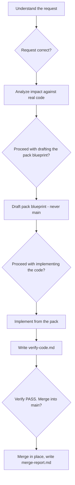

# Daily workflow

How to work in a RoyaScaff project once the blueprint exists: choosing a flow, moving through the gates, and picking work back up in a new chat.

## Every session starts the same way

Open a chat and either name the flow or describe the task. The engine's own instruction is to read [engine/flow.md](../../engine/flow.md) first on every task, which routes to the correct flow file.

If you are continuing existing work rather than starting something new, the resume protocol comes first — see [Resuming](#resuming-work) below.

## Choosing a flow

The router's triage table, verbatim:

| Intent | Phase | Command |
|--------|-------|---------|
| New or changed capability, fields, endpoints, pages with behavior | 5 | `/change-mode` |
| Style, spacing, copy, or button look only | P | `/polish` |
| Something broken versus expected behavior | 6 | `/bug-fix` |
| Onboard existing code | R | `/reverse-engineer` |
| Greenfield from description | 0–4 | `/initial-build` |

Two distinctions cause most of the confusion:

**Polish versus bug fix.** Polish means nothing is broken — you just want it to look different. Bug fix means behavior does not match the spec. "The button is the wrong shade of blue" is polish. "The button does not submit the form" is a bug.

**Polish versus change mode.** Polish is hard-limited to visuals. The moment a change needs a new field, an endpoint change, an auth change, or a new business rule, it is Phase 5. If you discover this mid-polish, the flow has a defined escape: stop, change `change-type` to the appropriate Phase 5 type, keep the same folder and `request-id`, and continue in change mode from Step 5.1.

If you are unsure, `/flow` lists the commands and the triage.

## The gate rhythm

Every flow that writes code follows the same beat: **understand, analyze, draft, implement, verify, merge** — with an approval gate between most of them.



At each gate the flow stops and waits. The engine states repeatedly that **silence is not confirmation** — an ambiguous reply is not approval either. Answer explicitly.

The gate prompts are fixed, so you learn to recognize them:

| Gate | Prompt |
|------|--------|
| Change request | "Does this change request look correct? Please confirm to proceed." |
| Pack blueprint | "Can I proceed with drafting the change pack blueprint?" |
| Code | "Can I proceed with implementing the code?" |
| Merge | "Verify PASS. Merge this pack into the main blueprint?" |
| Pre-fix (bug Path B) | "Can I proceed with applying the changes?" |
| Post-fix (bug Path B) | "Can you confirm this resolves the issue so I can mark it as DONE?" |

### When to use fast-track

Change mode offers a compressed path (FT-5.0 through FT-5.3) when **all six** of these hold:

1. The change touches at most one module
2. No new data model entities or fields
3. No new services or endpoints — modifying existing ones is fine
4. Frontend-only or backend-only, not both, unless the endpoint already exists
5. You provided a clear, complete description
6. It is not polish, and not a multi-part change with unmet dependencies

Fast-track keeps the same isolation and the same merge rules; it just merges several steps and skips the discovery interview. If any criterion fails, or you say "use full flow," it runs the standard path.

## One pack at a time

The strongest habit in a RoyaScaff project: finish or park a pack before starting another.

- The flow hard-stops after merge, deliberately, so the next session starts with a clean load set.
- The implementer's load set is fixed: `change-request.md`, `blueprint/`, `impact.md`, `status.md`, plus a minimal read-only look at main for context.
- Do not load unrelated modules and do not implement two packs in one session.

This is not ceremony. It is what keeps the context small enough that the model stays accurate.

## Resuming work

The resume rule is fixed and ordered:

1. **`project/changes/change-log.md`** — the live index of every pack and its `pack-status`. Read this first, always.
2. **`project/changes/build-program.md`** — if REQ-INIT or REQ-R packs exist, this holds the ordered queue and the "Next pack" pointer.
3. **`project/status.md`** — merged reality: what is done, in progress, next up, and deferred.
4. **`project/bugs/bug-log.md`** — if you are working on bugs. An `ESCALATED` row points at a change pack.

Only then open the pack folder.

A useful way to phrase the opening message of a resumed session:

```text
/change-mode
Resume. Read change-log.md and build-program.md first, then tell me the state before doing anything.
```

## Reading the state at a glance

| Question | File |
|----------|------|
| What is in flight right now? | `changes/change-log.md` |
| What should I build next? | `changes/build-program.md` (Next pack) or `status.md` (Next Up) |
| Is this endpoint built? | `actions/<app>/endpoints/<module>.md` — the per-artifact status is the source of truth |
| How far along is this module? | The module's `_index.md` row: rolled-up status and `Done/Total` |
| Where does the whole system stand? | `status.md` |
| Why was this postponed? | `status.md` Deferred section — `deferred` always carries a reason |
| What bugs are open? | `bugs/bug-log.md` |

## Keeping the indexes honest

The engine calls index sync mandatory, and it is the one piece of discipline that everything else depends on.

- Creating a pack folder adds its row to `change-log.md` immediately, as `drafted`.
- Every `pack-status` transition updates the **same row**, plus the `pack-status` in `change-request.md` and the pack's `status.md`.
- The pack's `Done/Total` from `blueprint/_index.md` is mirrored into the change-log's "Artifacts done" column.
- Main `status.md` reflects merged work only. In-flight state lives in the change-log and the pack.

If you ever find the change-log disagreeing with a pack's `status.md`, the pack is the source of truth for in-flight work. Fix the index.

## Working across branches

Packs are the unit of parallel work and they are branch-safe by construction, because IDs are timestamps rather than counters. See [Working as a team](05-working-as-a-team.md) for dependency handling and merge hygiene.

## Related

- [Flow router](../flows/00-flow-router.md)
- [Change mode](../flows/02-change-mode.md)
- [Working as a team](05-working-as-a-team.md)
- [Troubleshooting and FAQ](06-troubleshooting-faq.md)
