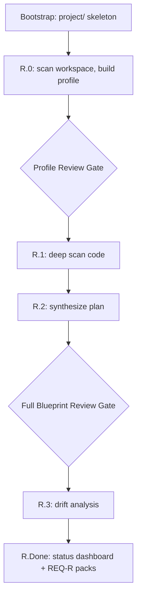

# Onboarding legacy code

Phase R reads an existing codebase and generates the full blueprint from it — the same artifacts a greenfield build produces, plus a roles and authorization document it can extract because the auth patterns are already in the code.

Phase R never writes application code. Its output is documentation plus a queue of work.

## When to run it

- An existing codebase has no `project/` blueprint
- A legacy system is being brought under AI-Control
- Your team inherited a codebase and needs documentation before touching it

Run it once per codebase. After it completes, all further work goes through Phase 5, P, or 6. The flow says so explicitly: do not re-run Phase R unless you are onboarding a different codebase.

## What you get

| Document | Produced by |
|----------|-------------|
| `project/profile.md` | R.0 |
| `project/plan/data-model.md` | R.1.1 |
| `project/actions/<api>/services/` + `_index.md` | R.1.2 |
| `project/actions/<api>/endpoints/` + `_index.md` | R.1.3 |
| `project/actions/<app>/pages/` or `views/` | R.1.4 |
| `project/plan/modules.md` | R.2.1 |
| `project/plan/roles-and-authorization.md` | R.2.2 |
| `project/rules.md` | R.2.3 |
| `project/description.md` | R.2.4 |
| `project/verify/reverse-engineer-report.md` | R.3 |
| `project/status.md` | R.Done.1 |
| `project/changes/build-program.md` (`REQ-R`) | R.Done.2 |

## The session

```bash
npx royascaff init
```

```text
/reverse-engineer
```



### R.0 — discovery, then a mandatory gate

The AI scans the workspace root for repositories, monorepo packages, and standalone apps, reading `package.json`, `angular.json`, `nx.json`, `turbo.json`, `nest-cli.json`, Dockerfiles, `.env` files, and deployment configs. It classifies each application as API, Web, Mobile, Worker, or Shared, then detects frameworks, database, auth strategy, UI library, and integrations.

Then it stops:

> "Does this profile look correct? Please confirm or correct before I scan the codebase."

**Spend real time here.** Everything downstream is keyed off this table, and the **Key** column becomes your `project/actions/<key>/` folder names. Items the scan could not determine are marked with a question mark — answer them.

### R.1 — deep scan, in traceability order

```text
Data Model -> Services -> Endpoints -> Pages/Views
```

API applications are processed first so that when frontend apps are scanned, the endpoints they call are already documented.

The critical rule in this phase: **status comes from the code**. Every extracted artifact is recorded as `done` (fully implemented) or `partial` (a `TODO`, a `NotImplementedException`, an empty method body, a missing UI state). Never `planned` — as the flow puts it, *"if there is no code, there is no artifact to extract."*

Specs inherit defaults from [engine/conventions.md](../../engine/conventions.md) and only record deviations. If your auth matches the global default, the spec does not repeat it; it notes the `@Public()` routes and custom guards instead.

Layering and isolation violations spotted during the scan are not fixed here. They are recorded and fed into the drift analysis.

### R.2 — synthesis, then a second mandatory gate

The raw extraction becomes higher-level planning documents: modules with features inline, roles and authorization (roles table, auth flow, endpoint access matrix, page access matrix, ownership and scoping rules), detected rules (integrations, async jobs, security, observability, caching), and a product description.

Anything the code could not fully reveal is marked `[INFERRED]`.

Then it stops again and presents a ten-part summary — product, modules, features, data model, roles, service counts, endpoint counts, page counts, rules, and gaps:

> "This is the synthesized blueprint from your codebase. Please review and confirm before I run the drift analysis, or tell me what to correct."

This is where your knowledge matters most. The code can show what happens; it cannot always show why, or what the product intent was. Correct the inferences now.

### R.3 — the drift report

Phase R does not run the standard verification, because there is no greenfield spec to check against. It runs a drift analysis instead: does the generated blueprint accurately reflect the code, and where does the code violate the engine's own rules?

It runs the [15 consistency checks](../reference/08-verification-checks.md) and then scans for five categories of drift:

| Category | Examples |
|----------|----------|
| Undocumented code | Controllers not in `endpoints/`, schemas not in `data-model.md`, orphaned guards and interceptors |
| Incomplete features | `TODO`, `NotImplementedException`, empty methods, placeholder pages, dead paths |
| Architecture violations | Controllers hitting repositories, frontend making direct HTTP or third-party calls, business logic in controllers, circular dependencies |
| Stale or dead code | Unused exports, dead routes, stale schema fields, commented-out blocks, deprecated endpoints |
| Configuration drift | Env vars referenced but missing, defined but unused, hardcoded secrets, mismatches across environments |

The report at `project/verify/reverse-engineer-report.md` carries an overall status of `CLEAN`, `DRIFT DETECTED`, or `SIGNIFICANT DRIFT`, plus per-violation severity from `CRITICAL` to `LOW`.

Each drift item gets exactly one recommended action:

| Action | Meaning |
|--------|---------|
| **Add to plan** | The code is valid and should be documented — applied to the blueprint immediately |
| **Fix in code** | Violates the engine rules — becomes a Phase 5 change request |
| **Remove from code** | Dead or stale — becomes a Phase 5 change request |
| **Mark as tech debt** | Known, not urgent — documented in the report only |

### R.Done — dashboard and handoff

Step R.Done.1 rolls everything into `project/status.md`. Step R.Done.2 turns incomplete features and "fix in code" items into a REQ-R build program: one pack per coherent slice, preferring vertical module slices, in folders named `change-<ID>-r-<slug>/`.

Then it stops. The flow is explicit: **do not implement packs inside Phase R**, and never try to fix all drift in one session.

## What to expect on a messy codebase

Legacy code is why [Appendix C](../../engine/flows/reverse-engineer.md) exists. The flow's guidance:

- **Missing types or `any`** — infer from usage, mark `[INFERRED]`, note in the drift report
- **Poor naming, no comments** — read the body and the calling context, mark `[INFERRED]`
- **Mixed patterns** — document what the code *does*, not what it should do; flag the violation separately
- **Scattered business logic** — document under the closest service, flag as a violation
- **Undocumented env vars** — scan all `process.env.*` and config reads, add to the profile, flag in the report
- **Raw SQL** — extract entity shapes from the queries, document them, flag in the report

The principle throughout: the blueprint records reality, and the drift report records the gap between reality and the standard. Never blend the two.

## Monorepos and multi-repos

A monorepo is detected from `workspaces` in `package.json`, `lerna.json`, `nx.json`, `turbo.json`, `pnpm-workspace.yaml`, multiple `angular.json` projects, or multiple `nest-cli.json` projects.

Either way you get **one profile with multiple applications**. Each app gets its own `project/actions/<app-key>/` folder. Shared packages under `packages/` or `libs/` are listed as type `Shared` and have no `actions/` folder — their exports are documented in the consuming app's files.

## After Phase R

| Need | Where to go |
|------|-------------|
| Complete a REQ-R pack | [Change mode](../flows/02-change-mode.md) from Step 5.4 on that pack |
| New feature | Change mode, new pack |
| Bug | [Bug fix](../flows/04-bug-fix.md) |
| UI polish only | [Polish](../flows/03-polish.md) |

Leave the `[INFERRED]` markers in `description.md` until the team confirms them. They are honest signposts, and removing them without confirming is how a blueprint starts lying.

## Related

- [Reverse engineer flow](../flows/05-reverse-engineer.md)
- [Verification checks](../reference/08-verification-checks.md)
- [Daily workflow](03-daily-workflow.md)
- [Engine rules](../reference/06-engine-rules.md)
