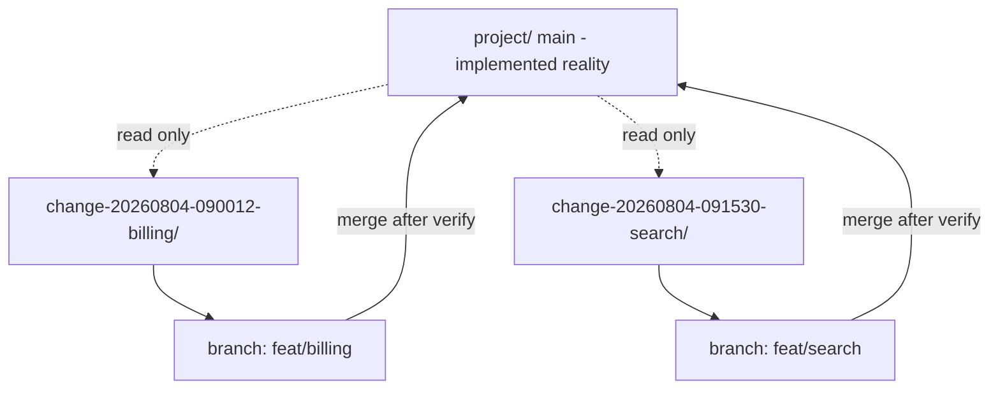

# Working as a team

Work packs are the unit of parallel work. Everything in this guide follows from one property: while a pack is in flight, it touches only its own folder.

## Why packs are branch-safe



Two developers on two packs write to two disjoint directories. Neither edits `project/plan/`, `project/actions/`, `project/rules.md`, `project/profile.md`, or `project/description.md` until their own merge step. There is nothing to conflict over until merge, and at merge each pack applies a small, known set of deltas.

## Never use sequential IDs

This is the rule that makes the above work, and the layout contract states it as mandatory:

> **Never use sequential counters** (`001`, `002`, `change-02`, `bug-01`). Parallel branches allocate the same next number and collide on merge.

Instead, `<ID>` is the local clock at creation time, formatted `YYYYMMDD-HHMMSS`:

```text
change-20260804-125201-billing-api/
bug-20260804-130044-login-500.md
```

Timestamps are lexicographically sortable, human-readable, and unique across branches without any shared counter. If two packs are created in the same second, the ID gets four lowercase hex characters appended: `20260804-125201-a3f2`.

Two corollaries:

- **Never read the "next number" from `change-log.md` or `bug-log.md`.** Those counters were removed on purpose.
- **Never renumber legacy folders.** Existing `change-<NNN>-*` folders from older projects stay valid. New work always uses datetime IDs.

## Splitting a feature across packs

Large features become multiple packs sharing a `request-id`.

```md
## Metadata
- **request-id**: REQ-7
- **part**: 2/3
- **depends-on**: change-20260804-090012
- **blocks**: change-20260804-093000
```

| Field | Purpose |
|-------|---------|
| `request-id` | Shared identifier across all parts. Filter `change-log.md` by it to see the whole feature. |
| `part` | This pack's position, as `N/M` |
| `depends-on` | Must be `verified` or `merged` before this pack may implement |
| `blocks` | Optional reverse hint, for readability |

Each part gets its own folder, its own change-log row, and its own blueprint. Independent parts run in parallel. Dependent parts stay `blocked`.

### The dependency gate

Before implementing, every flow checks dependencies. If `depends-on` is not yet `verified` or `merged`, the pack is set to `blocked`, the change-log is updated, and the flow **stops**. It does not build on an unmerged assumption.

This check runs at pack creation (FT-5.0, Step 5.0.1) and again before implementation (Step 5.4), because a dependency's status can change between drafting and building.

Dependencies are referenced by folder stem or ID — `change-20260804-125201` or the full `change-20260804-125201-init-auth`.

## Slicing work into packs

When you are the one deciding how to split, follow the same heuristics the build program uses:

- **Prefer vertical slices.** One module's data-model slice, services, endpoints, and pages together — not "all backend" then "all frontend."
- **Order by dependency.** Foundation and shared infrastructure first, then auth, then modules in dependency order from `modules.md`, then cross-cutting concerns like jobs and integrations last.
- **Group tiny related fixes**, but keep unrelated work in separate packs.

A pack should be small enough that one person finishes it in one or two sessions, and self-contained enough that a different person could implement it from the pack alone.

## Merge hygiene

The merge step is where main changes, and it has strict rules.

**Apply deltas in place.** The pack's after-state entries are merged into the corresponding main files. Never append a `change-<ID>` section to the bottom of a main file — main must read as a description of the system, not a changelog.

| Layer | In the pack | On merge into main |
|-------|-------------|--------------------|
| Data model | After-state of the affected entity plus a short `## Delta` note | In-place update of that entity |
| Services, endpoints, pages | Only artifacts this pack owns, as complete after-state entries | Rows merged into the main module files; `_index.md` refreshed |
| Unchanged main content | Not copied into the pack | Untouched |

**Refresh the rollups.** After merging module files, update the affected `_index.md` (status and `Done/Total`) and then `project/status.md`.

**Write the merge report.** `merge-report.md` records the merged date, who verified, which main files were updated, and what was skipped.

**Move the change-log row.** Set `pack-status: merged` and move the row to the Completed table with a merged date. The pack folder is retained as the historical record — it is not deleted.

## Handling git conflicts

Conflicts in `project/` should be rare and mechanical when they happen.

| Conflicting file | Why | Resolution |
|------------------|-----|------------|
| `changes/change-log.md` | Two branches added rows | Keep both rows. Row order is not meaningful. |
| `actions/**/_index.md` | Two merges updated counts | Recompute from the module files, which are the source of truth. |
| `status.md` | Two merges refreshed the dashboard | Regenerate from the `_index.md` files rather than hand-merging. |
| A module spec file | Two packs owned artifacts in the same module | Keep both artifact entries — they have distinct IDs. If they genuinely overlap, the packs were sliced wrong. |

Pack folders themselves should never conflict. If they do, two people were working the same pack.

## Handing a pack to someone else

The pack is designed to be portable. The implementer load set is fixed:

```text
change-<ID>-<slug>/
  change-request.md     # what and why, acceptance criteria, metadata
  impact.md             # code recon: files to create and modify, ripple, risk
  blueprint/            # the specs to implement from
  status.md             # per-artifact progress
```

Plus a minimal read-only look at main for the affected module if context is needed. Nothing else. If the next person needs more than this, the pack is underspecified — that is a defect in the pack, and Step 5.3's done-when criterion covers it: the pack must be enough for another chat to implement without prior context.

## Conventions worth agreeing on as a team

The engine does not enforce these, but they reduce friction:

- **One pack per branch**, named after the pack slug.
- **Merge the pack and the code together.** The blueprint update and the code that justifies it belong in the same pull request.
- **Review the change request before the code.** That is the point of the gates; extend it to human review.
- **Never edit main `project/` files outside a merge step.** If you catch a diff that touches main plan or action files from a branch that has not merged its pack, that is the bug.

## Related

- [Daily workflow](03-daily-workflow.md)
- [Change mode](../flows/02-change-mode.md)
- [Status and IDs](../reference/03-status-and-ids.md)
- [Project layout](../reference/02-project-layout.md)
