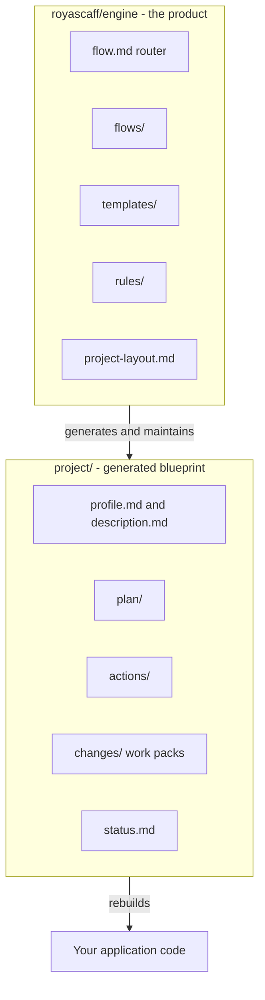
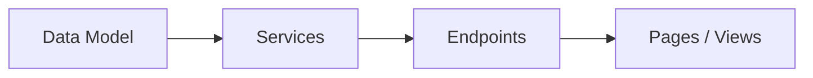
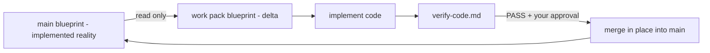

# What is RoyaScaff

RoyaScaff is a markdown engine that drives an AI coding assistant along a fixed, auditable path from product description to verified code, and keeps the written plan equal to the shipped code forever after.

## The one-sentence version

You do not prompt the AI to build your app. You point it at a flow, and the flow tells it exactly what to read, what to write, where to write it, when to stop and ask you, and how to prove the result matches the spec.

## Two zones

The single most important idea in RoyaScaff is that there are exactly two kinds of files, and they never mix.

| Zone | Shipped with RoyaScaff | Role |
|------|------------------------|------|
| `royascaff/engine/` | Yes — this is the product | **How** to build: flows, templates, rules, layout contract |
| `project/` | No — generated by the engine | **What** this system is: the living blueprint |

The engine is generic. It contains no repository names, no brand colors, no framework versions, no product nouns. Those facts live only in the generated `project/profile.md`. This is called **engine purity**, and it is enforced by a verification check.

`project/` is the opposite: it is entirely about your system. It is generated on demand — there is no empty skeleton shipped in the package, and no placeholder READMEs. The engine creates each file the moment its flow step runs, from the matching template.

## The rebuild test

The blueprint has one acceptance criterion that everything else serves: **after a merge, copying `project/` alone must be enough to understand and rebuild the implemented app.**

If a fact about your system exists only in a chat transcript, a teammate's head, or the code itself, the blueprint has failed. This is why the engine writes so much down, and why it refuses to let specs reference engine internals or vice versa.

## The five flows

Every task enters through one of five flows. The router in [engine/flow.md](../../engine/flow.md) picks the right one.

| Flow | Phase | Use it when | Slash command |
|------|-------|-------------|---------------|
| [Initial build](../flows/01-initial-build.md) | 0–4 | Greenfield: you have a product idea and no code | `/initial-build` |
| [Change mode](../flows/02-change-mode.md) | 5 | New or changed capability, fields, endpoints, behavior | `/change-mode` |
| [Polish](../flows/03-polish.md) | P | Spacing, colors, typography, copy — nothing behavioral | `/polish` |
| [Bug fix](../flows/04-bug-fix.md) | 6 | Something is broken relative to expected behavior | `/bug-fix` |
| [Reverse engineer](../flows/05-reverse-engineer.md) | R | You inherited a codebase with no blueprint | `/reverse-engineer` |

Phases 5, P, and 6 all require an existing blueprint. If `project/profile.md` is missing, the engine stops and routes you to Phase 0–4 or Phase R instead of guessing.

## The traceability chain

Specs are generated in one direction and depend on each other in the other. This is not stylistic — it is what makes the blueprint checkable.

- **Generation order:** data model first, then services, then endpoints, then client specs.
- **Dependency direction:** pages depend on endpoints, endpoints depend on services, services depend on repositories and providers.

Every artifact carries a stable ID (`SVC-USERS-01`, `EP-USERS-01`, `PG-USERS-01`, `VW-USERS-01`) so a page can cite the exact endpoint it calls and a verification pass can confirm that endpoint exists. See [Status and IDs](../reference/03-status-and-ids.md).

## Work packs

Design can be written to the main blueprint. **Implementation never is.**

All in-flight implementation work lives in an isolated **work pack** under `project/changes/change-<ID>-<slug>/`, containing its own delta specs, its own status dashboard, and its own verification report. Main is updated only at merge, after verification passes and you approve.

That single rule is what makes parallel work safe, makes any chat resumable, and guarantees that `project/` on main always describes reality rather than intention.

## What ships

The npm package `royascaff` contains `bin/`, `engine/`, `skills/`, the README, and the license. Running `npx royascaff init` copies `engine/` into `royascaff/engine/` and the skills into `.cursor/skills/` (or `.claude/skills/` with `--claude`). It deliberately does not create `project/`.

See [Install](../guides/01-install.md) and the [CLI reference](../reference/07-cli.md).

## Related

- [Why it exists](02-why-it-exists.md)
- [Benefits](03-benefits.md)
- [Concepts and glossary](../reference/01-concepts-and-glossary.md)
- [Project layout](../reference/02-project-layout.md)
