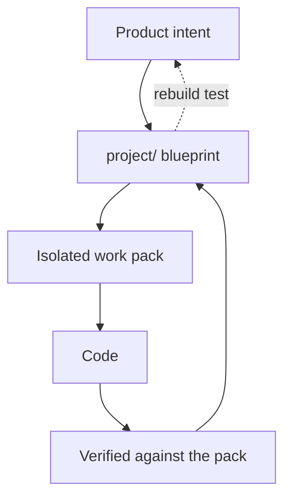

# Why RoyaScaff exists

AI can write a convincing first version of almost any application. The problem starts at the second feature.

## The failure mode

Generating an app from a prompt works because the model holds the whole thing in one context window and invents the missing decisions as it goes. Nothing is wrong with the code it produces. What is missing is everything around it:

- **No record of intent.** Why does the invoice total round down? Nobody wrote it down, so the next session picks a different rule.
- **No shared vocabulary.** The chat called it a "workspace," the schema calls it a "tenant," the UI calls it an "org." Each new session picks one at random.
- **No boundary.** A request to add a filter to one list rewrites four unrelated files, because the model has no way to know what is out of scope.
- **No memory.** A new chat starts from zero. It re-derives the architecture from the code, gets it 80 percent right, and the drift compounds.
- **No proof.** "It compiles" is the only verification. Whether the code matches what you asked for is checked by reading it, if at all.

Teams paper over this with a rules file or a long system prompt. That helps with style. It does not help with state — the model still does not know which of your fifty endpoints exist, which are half-built, and which were deliberately postponed.

The result is a system where **the plan and the code diverge immediately and permanently**. After a few weeks the documentation is a liability, so people stop reading it, so it drifts faster.

## What the engine does instead

RoyaScaff treats the plan as an artifact with the same rigor as the code: it is versioned, it is checked, and it has a definition of correct.



Four mechanisms carry the weight.

### 1. The blueprint is the single source of truth

Before any code exists, the engine writes down modules, features, the data model, business rules, services, endpoints, and pages — each with a stable ID and a status. Specs inherit global defaults from [engine/conventions.md](../../engine/conventions.md) and only document values where they **deviate**, so the documents stay short enough to actually read.

The acceptance criterion is the **rebuild test**: copying `project/` alone must be enough to rebuild the implemented app. Not the chat history. Not the code comments. The blueprint.

### 2. Implementation is isolated in work packs

Phase 0–2 write the roadmap to main. Every line of implementation, though, happens inside a work pack — a self-contained folder with delta specs, an impact analysis, a status dashboard, and a verification report.

```text
project/changes/change-20260729-125201-billing-api/
  change-request.md
  impact.md
  status.md
  blueprint/          <- implement from here, not from main
  verify-code.md
  merge-report.md
```

Main is never edited while a pack is in flight. The consequences are large:

- Two people can work on two packs on two branches without touching the same files.
- An abandoned pack leaves main untouched — it is simply marked `cancelled`.
- The implementer's load set is small and fixed: `change-request.md`, `blueprint/`, `impact.md`, `status.md`. No need to load the whole system.
- Main always describes what is actually built, never what someone hoped to build.

### 3. Every artifact carries a status

Each service, endpoint, page, and view is `planned`, `partial`, `done`, or `deferred`. `deferred` requires a written reason. Module-level `_index.md` files roll these up with a `Done/Total` count, and `project/status.md` rolls those up into a system dashboard.

This is the part that makes a fresh chat useful. A model that reads `status.md` and `change-log.md` knows in seconds what is built, what is half-built, what is queued, and what was postponed on purpose — without re-reading the codebase and guessing.

### 4. Gates stop the AI before it commits you

At every consequential moment the flow stops and asks. The engine says it plainly in several places: **silence is not confirmation.**

| Moment | The question |
|--------|--------------|
| Before creating the build program | "Can I proceed with creating the build program and work packs?" |
| After drafting a change request | "Does this change request look correct? Please confirm to proceed." |
| Before drafting a pack blueprint | "Can I proceed with drafting the change pack blueprint?" |
| Before writing code | "Can I proceed with implementing the code?" |
| After verification passes | "Verify PASS. Merge this pack into the main blueprint?" |

You review a plan, not a diff of four hundred files.

## The design constraints behind it

A few rules exist specifically to prevent known ways this breaks down.

**No monolith passes.** Greenfield implementation is a queue of REQ-INIT packs, not one "generate all backend then all frontend" session. The initial-build flow states it directly: *"Do not run a monolith 'generate all backend then all frontend' pass."*

**No sequential IDs.** Pack and bug IDs are local datetimes (`20260729-125201`), never counters. Two branches allocating "change-003" collide on merge; two branches allocating a timestamp do not.

**No placeholder files.** The engine never seeds empty stubs or folder READMEs. A file exists only when a step created it with real content, so the presence of a file is itself information.

**No engine contamination.** System-specific facts may never enter `royascaff/engine/`. That keeps the engine reusable across products and lets you upgrade it without losing your blueprint.

## Related

- [What is RoyaScaff](01-what-is-royascaff.md)
- [Benefits](03-benefits.md)
- [When to use it](04-when-to-use-it.md)
- [Verification checks](../reference/08-verification-checks.md)
