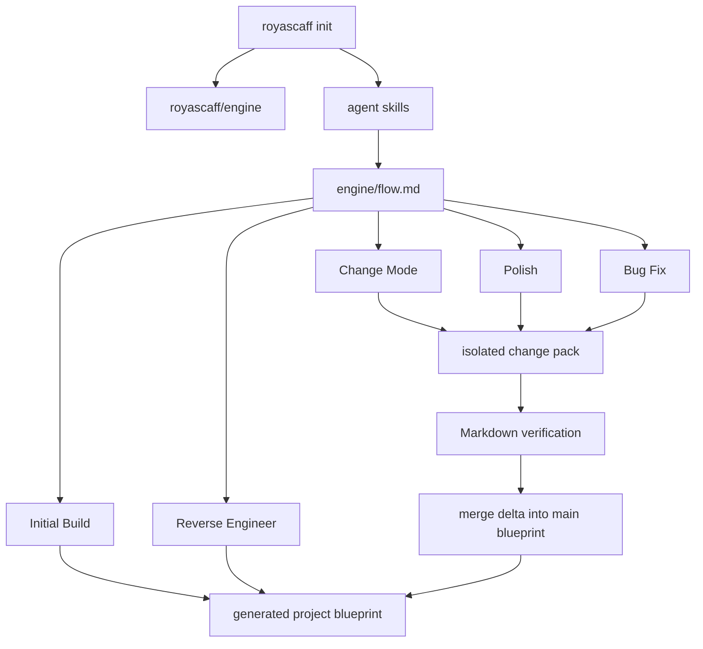
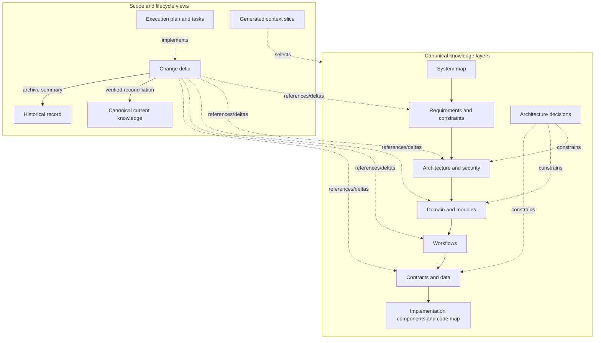
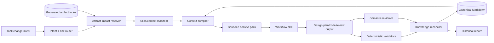

# RoyaScaff v1.3 Target Architecture

> Plan component 1 of 6. See [plan index](00-v1.3-plan-index.md). This document selects one target architecture; it does not modify the engine.

## 1. Current v1.2.5 reconstruction

The current product has two shipped runtime elements:

- `bin/royascaff.js` copies `engine/` and `skills/` into a target project.
- The Markdown engine instructs an AI agent how to generate and maintain `project/`.

There is no workflow runtime, metadata parser, schema validator, context resolver, or test harness. Correctness depends on an agent reading prose, producing the expected Markdown, and synchronizing repeated state.




### Current knowledge model

Canonical project knowledge currently consists of:

- profile and product description;
- modules/features and project rules;
- persistence data model;
- services, endpoints, pages, and views;
- artifact/index/system status;
- verification reports.

Current change scope consists of:

- `change-request.md`;
- `impact.md`;
- a sliced `blueprint/` delta;
- pack status and index entries;
- verification and merge reports.

Current Initial Build “slices” are REQ-INIT change packs. Slice Blueprint is not a separately defined engine concept; it is an implicit vertical copy of planned main artifacts into a pack.

### Current source-of-truth tension

The engine says main should equal implemented reality, but Initial Build writes the entire planned backlog to main before implementation. In practice, main is:

```text
implemented current state + approved planned backlog
```

This is useful, but it must be named honestly. A reader needs separate knowledge status and implementation status rather than one overloaded status.

## Target goals and design principles

The target architecture is evaluated against these product goals:

- recognizable professional SDLC discipline without a Waterfall document factory;
- progressive conversion of a concept into requirements, design, plan, code, tests, and reconciled knowledge;
- implementation constrained by an approved executable plan;
- safe evolution across thousands of changes without historical deltas competing with current truth;
- small, sufficient context that works with weak/local models as well as frontier models;
- progressive human understanding from system map to code;
- parallel team and multi-agent collaboration;
- technology-independent core methodology.

Its design principles are:

1. progressive disclosure;
2. one canonical home for every important fact;
3. stable traceability from requirement to code/test;
4. context locality and explicit budgets;
5. plans as executable contracts;
6. verified changes reconcile into current state;
7. skills contain procedure while blueprints contain project knowledge;
8. deterministic guarantees before semantic judgment;
9. human control at material product/architecture/risk decisions;
10. generic core plus technology adapters;
11. explicit ambiguity and bounded tasks for weak-model success;
12. every artifact must justify its maintenance cost.


## 2. Current strengths to preserve

1. **Isolation before reconciliation** — a change does not rewrite canonical knowledge until verified.
2. **Vertical delivery** — Initial Build is divided into module/capability packs.
3. **Resume artifacts** — logs, pack state, and build program enable cross-session continuation.
4. **Human control** — material planning and merge decisions require approval.
5. **Stable cross-references** — services, endpoints, pages, and views use IDs.
6. **Rebuild intent** — the project knowledge should be sufficient to understand and rebuild the system.
7. **Reverse-engineering path** — existing code can enter the methodology.
8. **Engine purity** — reusable method stays outside product-specific knowledge.
9. **Readable repository artifacts** — no external database is required to understand the system.


## 3. Current problems and missing pieces


| Problem                                    | Current evidence                                                                       | Consequence                                                                                                              |
| ------------------------------------------ | -------------------------------------------------------------------------------------- | ------------------------------------------------------------------------------------------------------------------------ |
| Knowledge layers are incomplete            | Planning starts with modules/rules/persistence and actions                             | Business requirements, conceptual domain, workflows, architecture, contracts, security, NFRs, and decisions are implicit |
| Runtime model is service-centric           | First-class actions are services/endpoints/pages/views                                 | Repositories, guards, adapters, jobs, stores, mappers, middleware, and interfaces can become blueprint orphans           |
| Context construction is procedural prose   | Skills say which broad files to read                                                   | Large projects require manual discovery and large context windows                                                        |
| Status is duplicated                       | Pack status appears in request, status file, change log, build program, and indexes    | Drift and branch merge conflicts                                                                                         |
| Verification is declarative                | Markdown checkboxes can be marked PASS                                                 | No guarantee that tests or plan/code reconciliation occurred                                                             |
| Flows and skills repeat logic              | Skills summarize numbered flow steps                                                   | Updates can make entry points disagree with normative flows                                                              |
| Change history competes with current state | Completed packs retain full deltas indefinitely                                        | Agents may load historical facts that canonical docs superseded                                                          |
| Parallel changes edit central files        | Every branch updates `change-log.md`                                                   | IDs avoid folder collision but not shared-index conflicts                                                                |
| Genericity is incomplete                   | Core rules assume API/controller/service/repository and web/mobile structures          | CLI tools, libraries, data systems, embedded, event-only, and AI systems fit poorly                                      |
| Flow coverage is incomplete                | No explicit refactor, migration, architecture-change, incident, or reconciliation flow | Teams force unlike work through Change Mode                                                                              |
| Reverse engineering is unbounded           | It asks to scan every application deeply                                               | Context exhaustion and unqualified inferences                                                                            |
| Main semantics are ambiguous               | Planned and implemented artifacts coexist                                              | “What exists now?” and “what is approved next?” require status interpretation                                            |


## 4. Current concept disposition


| Current concept                | Decision              | v1.3 definition                                                                                                                |
| ------------------------------ | --------------------- | ------------------------------------------------------------------------------------------------------------------------------ |
| Main Blueprint                 | **KEEP BUT REDEFINE** | `system-map.md` plus canonical layered knowledge representing approved current understanding; implementation state is explicit |
| Slice Blueprint                | **KEEP BUT REDEFINE** | Generated reference manifest/context pack selecting artifacts across layers; never a source of truth                           |
| Change Blueprint               | **KEEP BUT REDEFINE** | Temporary proposed delta overlay against a recorded canonical baseline                                                         |
| Build Program                  | **MERGE**             | Becomes an execution plan made of ordered tasks and dependency-aware change units                                              |
| `actions/services`             | **SPLIT**             | Components for runtime responsibility; contracts for public method boundaries                                                  |
| `actions/endpoints`            | **MERGE**             | API and transport contracts                                                                                                    |
| `actions/pages/views`          | **SPLIT**             | UI components plus workflow/requirement links                                                                                  |
| Main status dashboard          | **KEEP BUT REDEFINE** | Generated view of canonical metadata, never hand-authored state                                                                |
| Change log                     | **REPLACE**           | Generated active/history indexes from change metadata                                                                          |
| Pack status files              | **MERGE**             | One canonical change metadata block plus generated views                                                                       |
| Verification report            | **KEEP BUT REDEFINE** | Evidence-backed deterministic results plus separate semantic findings                                                          |
| Generic backend/frontend rules | **SPLIT**             | Technology-independent core constraints plus selectable technology adapters                                                    |
| Flow files                     | **KEEP BUT REDEFINE** | Declarative workflow orchestration over atomic skills                                                                          |
| Flow-specific skills           | **SPLIT**             | Atomic procedural skills with a common contract; thin workflow entry skills may remain                                         |
| Reverse-engineer appendices    | **REPLACE**           | Adapter-owned detection rules, inventory-first workflow, evidence/confidence metadata                                          |


## 5. Selected v1.3 architecture


### 5.1 The two axes




Knowledge layers answer **what is known**. Lifecycle views answer **why this subset exists now**.

### 5.2 Canonical knowledge repository

The canonical repository is the approved best current understanding of the system. It may include approved-but-not-yet-implemented requirements, but every artifact has two separate dimensions:

```yaml
knowledge_status: draft | approved | deprecated | superseded
implementation_status: planned | partial | implemented | verified | not-applicable
```

This removes the false choice between “main is implemented only” and “main contains the roadmap.” A query can select either.

### 5.3 Main Blueprint

“Main Blueprint” remains as a user-facing term, but its concrete entry point becomes `project/system-map.md`.

The Main Blueprint is:

- a 2–5k-token human and agent entry point;
- the product summary, system boundaries, major actors, applications, modules, workflows, integrations, and architecture shape;
- a navigation map to canonical deeper artifacts;
- generated/validated summary counts and current implementation posture.

It is not:

- the only blueprint file;
- a copy of every requirement or contract;
- a history of every change;
- an execution plan;
- a place for in-flight deltas.


### 5.4 Slice Blueprint

Rename the implementation concept to **Slice Manifest** while keeping “slice blueprint” as a compatibility alias.

A Slice Manifest:

- describes one capability, workflow, module segment, or execution task;
- contains IDs and reasons for inclusion, not copied artifact bodies;
- can cut across requirements, architecture, domain, workflow, contracts, data, components, tests, and code;
- is generated from the artifact graph;
- may be stored with a change for reproducibility;
- is never canonical knowledge.

The Context Compiler turns a Slice Manifest into a bounded Context Pack containing the actual sections needed by an agent.

### 5.5 Change Blueprint

A Change Blueprint is a temporary, reviewable overlay:

```text
baseline revision
  + requested outcome
  + affected artifact IDs
  + after-state deltas
  + compatibility/migration decisions
  + acceptance criteria
  + execution plan
```

It becomes `reconciled` only after implementation and verification. Reconciliation applies the approved after-state to canonical knowledge. The archived change keeps request, decisions, verification evidence, and links, but agents do not read archived deltas for current truth.

### 5.6 Artifact graph

The graph is lightweight and repository-native:

- canonical Markdown documents contain YAML front matter and stable IDs;
- relations use typed ID lists;
- a generated JSON index accelerates lookup;
- a generated Markdown index supports humans;
- no graph server or database is required.

Core relation example:

```text
REQ-ORDERS-014
  → WF-ORDERS-007
  → CTR-ORDERS-API-012
  → CMP-ORDERS-API-006
  → code:src/orders/approval.service.ts
  → TEST-ORDERS-201
```

Useful relation types:

- `satisfies`, `constrained_by`, `realized_by`, `exposes`, `accepts`, `returns`;
- `depends_on`, `implements`, `verified_by`, `maps_to`, `supersedes`;
- `owned_by`, `affects`, `supports`, `configures`, `migrates`.


### 5.7 Knowledge compiler components




## 6. Proposed documentation hierarchy

```text
project/
  system-map.md
  profile.md

  requirements/
    _index.md
    product.md
    non-functional.md
    modules/<module>.md

  architecture/
    overview.md
    security.md
    applications/<app-key>.md
    modules/<module>.md
    patterns.md

  domain/
    glossary.md
    contexts.md
    modules/<module>.md

  workflows/
    _index.md
    <module>/<workflow>.md

  contracts/
    _index.md
    <app-key>/<module>.md

  data/
    conceptual.md
    <app-key>/<module>.md

  implementation/
    components/<app-key>/<module>.md
    code-map/<app-key>/<module>.md

  decisions/
    _index.md
    ADR-<ID>-<slug>.md

  changes/
    active/change-<ID>-<slug>/
      change.md
      impact.md
      delta/                 # mirrors only affected canonical paths
      execution/
        plan.md
        tasks/<task>.md
        context/<task>-manifest.md
        context/<task>-pack.md
      verification.md
      reconciliation.md
    archive/<year>/change-<ID>-<slug>/

  bugs/
    active/
    archive/<year>/

  indexes/
    artifacts.md             # generated human index
    artifacts.json           # generated machine index
    changes.md               # generated active/history view
    status.md                # generated current-state view

  verify/
    latest-system-report.md
```

The exact split threshold is progressive:

- a small system may keep one Markdown file per layer;
- split by module when a file exceeds the configured size/token threshold or ownership boundary;
- never split merely to create one file per artifact.


## 7. SDLC mapping


| SDLC concern                  | Canonical artifact                             | Temporary workflow artifact           |
| ----------------------------- | ---------------------------------------------- | ------------------------------------- |
| Business/product requirements | `requirements/product.md`, module requirements | change request and requirement delta  |
| Functional requirements       | `requirements/modules/*.md`                    | affected requirement list             |
| Non-functional requirements   | `requirements/non-functional.md`               | NFR delta/risk assessment             |
| Architecture/system design    | `architecture/`                                | architecture delta/RFC section        |
| Domain design                 | `domain/`                                      | domain delta                          |
| Data design                   | `data/`                                        | schema/migration delta                |
| Workflows                     | `workflows/`                                   | workflow after-state delta            |
| API/interfaces/events/DTOs    | `contracts/`                                   | contract delta and compatibility plan |
| Security                      | `architecture/security.md` plus SEC IDs        | threat/risk delta                     |
| Implementation design         | `implementation/components/` and code map      | execution plan/tasks                  |
| Testing intent                | requirement acceptance and TEST links          | test tasks and verification evidence  |
| Deployment considerations     | architecture/app records and ADRs              | rollout/rollback plan                 |
| Architecture decisions        | `decisions/`                                   | proposed ADR in change delta          |
| Change management             | canonical result after reconciliation          | active/archived change records        |


Persistent knowledge records current approved truth. Temporary artifacts coordinate proposed and executing work.

## 8. Genericity boundary

The core methodology defines:

- artifact types and relations;
- lifecycle states;
- change isolation and reconciliation;
- context compilation;
- validation contracts;
- workflow and skill interfaces.

It does not define REST, controllers, services, SQL, React, or a specific repository layout.

Technology adapters define:

- source discovery patterns;
- architecture conventions;
- contract extractors;
- relevant test/typecheck/build commands;
- generated/vendor exclusions;
- framework-specific templates.

A project profile selects adapters. Unknown stacks fall back to generic inspection and project-declared commands.

## 9. Current flow review and target direction


| Work type           | v1.2 issue                                                                                        | v1.3 direction                                                                                   |
| ------------------- | ------------------------------------------------------------------------------------------------- | ------------------------------------------------------------------------------------------------ |
| Greenfield          | Persistence/action design before explicit requirements/architecture; all packs materialized early | Requirements → architecture/domain/workflows/contracts → adaptive initial execution plan         |
| New feature         | Strong isolation but weak context selection and contract modeling                                 | Resolve graph impact, compile context, approve after-state, execute bounded tasks                |
| Modify feature      | Same generic flow regardless of risk                                                              | Intent + risk classification, compatibility/migration analysis                                   |
| Bug fix             | Scope-based Path A/B ignores severity and regression proof                                        | Risk-based triage, root cause, required regression evidence, reconcile only if knowledge changes |
| Refactor            | Forced through general change; behavior-preservation not explicit                                 | Dedicated refactor workflow with characterization tests and architecture target                  |
| Architecture change | No RFC/migration orchestration across slices                                                      | ADR/RFC proposal, dependency graph, staged migration changes, compatibility gates                |
| Reverse engineer    | Whole-codebase scan can be unbounded                                                              | Inventory-first, module checkpoints, evidence/confidence, resumable extraction                   |
| Reconcile docs      | Only implicit at merge                                                                            | Explicit deterministic reconciliation workflow                                                   |


Detailed workflows are specified in [03-v1.3-workflows-and-skills-plan.md](03-v1.3-workflows-and-skills-plan.md).

## 10. Skills review

Current skills are good lightweight entry points, but they mostly summarize large phase flows. They are not atomic, independently testable procedures and have no standard mutation or failure contract.

v1.3 separates:

- **workflow entry skills** — choose/orchestrate a workflow;
- **atomic operation skills** — analyze impact, model workflow, compile context, plan tasks, verify, reconcile;
- **technology adapters** — framework-specific discovery and validation.


## Detailed comparison: v1.2.5 versus v1.3


| Concern                | v1.2.5                                                       | Target v1.3                                                                                   |
| ---------------------- | ------------------------------------------------------------ | --------------------------------------------------------------------------------------------- |
| Product entry point    | Router plus several independent blueprint files              | 2–5k-token system map into layered canonical knowledge                                        |
| Knowledge hierarchy    | Description → plan/data → actions                            | Requirements → architecture/security → domain → workflows → contracts/data → components/code  |
| Main Blueprint         | Implemented and planned facts distributed across `project/`  | Precisely defined canonical repository with separate knowledge/implementation status          |
| Slice                  | Copied vertical specs inside Initial Build pack              | Reference-only manifest generated across knowledge layers                                     |
| Change                 | Self-contained pack delta retained indefinitely              | Temporary baseline-aware delta reconciled then archived as history                            |
| Requirements           | Features and acceptance criteria embedded in modules/changes | Stable REQ/NFR/SEC artifacts with owners and links                                            |
| Architecture           | Generic engine rules and inferred layering                   | Project-specific boundaries, components, patterns, security, and ADRs                         |
| Runtime artifacts      | Services/endpoints/pages/views                               | Generic component types plus contracts and complete code map                                  |
| DTOs/interfaces/events | Names embedded in specs                                      | First-class typed contract artifacts                                                          |
| Context                | Agent reads indexes and relevant files manually              | Resolver builds bounded, reproducible Context Manifest/Pack                                   |
| Skills                 | Six flow wrappers summarizing large flows                    | Atomic, composable, schema-validated procedural skills plus workflow entry aliases            |
| Workflows              | Five prose flows                                             | Declarative orchestration for build/change/bug/refactor/architecture/reverse/verify/reconcile |
| State                  | Repeated manually across request/status/log/program/index    | Canonical metadata with generated views and validated transitions                             |
| Verification           | Markdown checklist and subjective PASS                       | Deterministic evidence plus structured semantic findings                                      |
| Reconciliation         | Manual merge of pack specs into main                         | Baseline-aware atomic preview/apply/validate/archive operation                                |
| Parallel work          | Unique folders but shared log conflicts                      | Per-change ownership and generated registries/conflict detection                              |
| Historical truth       | Full merged packs remain near active work                    | Archive excluded from current context; ADRs preserve durable rationale                        |
| Genericity             | API/web-oriented default core                                | Technology-independent methodology with adapters                                              |
| Reverse engineering    | Whole-codebase framework-guided scan                         | Inventory-first, bounded module extraction with evidence/confidence                           |
| Tooling                | Installer only                                               | Installer, validator, indexer, context compiler, lifecycle and reconciler commands            |


Skills contain procedure. Canonical project knowledge and task context remain in `project/`.

## 11. Evaluation matrix

Score definition: 1 is poor; 10 is excellent. For “complexity/cognitive load,” 10 means the system is easy to understand and carries low unnecessary cognitive load.


| Criterion                       | v1.2.5 | Why                                                                                                  | Proposed v1.3 | Expected improvement / remaining limit                                                        |
| ------------------------------- | ------ | ---------------------------------------------------------------------------------------------------- | ------------- | --------------------------------------------------------------------------------------------- |
| SDLC completeness               | 5      | Planning/actions/code/verify exist; requirements, architecture, contracts, NFRs, deployment are weak | 8             | Adds persistent layers without full Waterfall bureaucracy                                     |
| Requirement traceability        | 5      | Feature-to-service/action links exist, requirements do not have first-class IDs                      | 9             | Requirement graph reaches tests and code                                                      |
| Architecture clarity            | 4      | Generic rules exist; project architecture is not modeled                                             | 8             | Project-specific boundaries, components, patterns, ADRs                                       |
| Progressive disclosure          | 5      | Indexes exist but broad flow reads are common                                                        | 9             | System map → layer/module → artifact → code                                                   |
| AI context efficiency           | 4      | Agent manually discovers relevant files                                                              | 9             | Context compiler builds bounded task packs                                                    |
| Small-model usability           | 4      | Correctness relies on reading and retaining many prose contracts                                     | 8             | Explicit plan contracts and selected context; semantic work still model-dependent             |
| Model independence              | 6      | Markdown is portable, skill installs target agents                                                   | 9             | Core manifests/skills are agent-neutral; adapters handle target packaging                     |
| Change safety                   | 8      | Isolation and verify-before-merge are strong                                                         | 9             | Retains isolation and adds deterministic checks/risk gates                                    |
| Drift resistance                | 4      | Many manually synchronized summaries and subjective PASS                                             | 8             | Generated indexes, file maps, freshness/reconciliation validation                             |
| Team collaboration              | 6      | Packs/dependencies help, but branch process is incomplete                                            | 8             | Ownership, baseline revisions, generated logs, conflict detection                             |
| Parallel development            | 5      | Datetime IDs help; central logs still conflict                                                       | 8             | Per-change metadata and generated indexes remove central hot spots                            |
| Human readability               | 8      | Markdown and straightforward flow language are strong                                                | 8             | Better navigation, but more concepts require careful templates                                |
| Genericity                      | 5      | API/web and common JS framework assumptions are prominent                                            | 8             | Generic core plus selectable adapters                                                         |
| Maintainability                 | 5      | Duplicated flow/skill/docs content and no automated tests                                            | 8             | Schemas, generation, contract tests; implementation adds code to maintain                     |
| Complexity/cognitive simplicity | 7      | Easy concepts but repetitive operational ceremony                                                    | 7             | More architecture concepts, offset by system map, generated views, and progressive disclosure |


The target deliberately does not score 10. Artifact modeling, context resolution, and validation introduce real complexity. The design is successful only if tooling hides routine mechanics from developers.

## 12. Architecture test scenario

The target passes when a small model can handle this without loading the entire project:

> Add two-level partial-refund approval to a three-year-old Payments system.

Required behavior:

1. Router classifies feature change with money/security risk.
2. Resolver finds refund requirements, approval workflow, Payments domain, authorization constraints, relevant ADRs, provider contract, data records, components, tests, and code paths.
3. Context Compiler builds a bounded pack within the configured budget.
4. Design skill produces explicit requirement/workflow/contract/data/component deltas.
5. Human approves material policy, authorization, and compatibility decisions.
6. Planner produces tasks another model can execute without inventing architecture.
7. Validators compare changed files/contracts/tests against the approved plan.
8. Semantic reviewer checks business completeness.
9. Reconciler updates canonical current state and archives the change.
10. Six months later, a reader starts at system map and current refund workflow—not the historical change.

The concrete Orders version is worked through in [06-v1.3-end-to-end-example.md](06-v1.3-end-to-end-example.md).

## Final recommended architecture

Build v1.3 as a Markdown-first layered knowledge repository with a lightweight artifact graph, generated indexes, temporary change overlays, reference-based slices, bounded context compilation, composable procedural skills, deterministic validation, semantic review, and explicit reconciliation.

Do not build a graph database, a visual modeling suite, or a large agent hierarchy. Do not preserve v1.2 file compatibility when it creates competing sources of truth; provide migration tooling instead.