# RoyaScaff v1.3 Knowledge and Context Plan

> Plan component 2 of 6. See [plan index](00-v1.3-plan-index.md) and [target architecture](01-v1.3-target-architecture.md).

## 1. Objective

Make repository knowledge sufficient for a developer or AI agent to reconstruct the smallest correct context for one task without depending on a large context window, one conversation, one model vendor, or undocumented memory.

The design has four parts:

1. canonical layered Markdown;
2. structured artifact metadata and typed relations;
3. generated indexes and impact resolution;
4. Context Manifests and compiled Context Packs.

## 2. Progressive-disclosure levels

| Level | Reader question | Primary artifact | Typical size target |
|-------|-----------------|------------------|---------------------|
| 0 | What is this system? | `system-map.md` | 2–5k tokens |
| 1 | What does it need to do? | product/module requirements and NFRs | 1–4k per file |
| 2 | How is it structured? | architecture overview/app/module/security docs | 1–4k per file |
| 3 | What does this domain/module mean? | glossary, context, module domain docs | 1–4k per file |
| 4 | How does this behavior work? | workflow and contract docs | 0.5–3k per file |
| 5 | Which runtime parts realize it? | components and code map | 0.5–3k per file |
| 6 | What code and tests implement it? | source/test locations from code map | loaded selectively |

Files above the configured threshold should split by ownership or module. Files below it should not be fragmented into one-artifact documents unless an ADR or complex workflow needs an independent lifecycle.

## 3. Canonical document contract

Every canonical file uses YAML front matter followed by human-readable Markdown.

```yaml
---
schema: royascaff/artifact-file/v1
file_id: FILE-WF-ORDERS
layer: workflow
module: orders
owner: team-commerce
artifacts:
  - WF-ORDERS-007
knowledge_status: approved
updated_at: 2026-08-20T10:00:00+03:00
updated_by: change-20260820-090000-order-approval
---
```

An artifact section has structured metadata in a fenced YAML block or consistent heading block:

````md
## WF-ORDERS-007 — Order approval

```yaml artifact
id: WF-ORDERS-007
type: workflow
knowledge_status: approved
implementation_status: verified
satisfies: [REQ-ORDERS-014, REQ-ORDERS-015]
constrained_by: [SEC-AUTHZ-003, ADR-20260820-approval-policy]
realized_by: [CMP-ORDERS-API-006, CMP-ORDERS-WEB-004]
verified_by: [TEST-ORDERS-201, TEST-ORDERS-202]
```
````

The implementation may choose an equivalent front-matter-per-file schema if parsing section metadata proves too fragile. The invariant is more important than the exact syntax: metadata is structured, content remains readable, and an artifact has one canonical home.

## 4. Artifact identity

### 4.1 ID families

| Prefix | Artifact type | Example |
|--------|---------------|---------|
| `REQ` | Functional/product requirement | `REQ-ORDERS-014` |
| `NFR` | Non-functional requirement | `NFR-PERF-003` |
| `SEC` | Security constraint | `SEC-AUTHZ-003` |
| `ARCH` | Current architecture rule/boundary | `ARCH-DATA-004` |
| `ADR` | Architecture decision record | `ADR-20260820-approval-policy` |
| `DOM` | Domain concept, invariant, policy, event | `DOM-ORDERS-011` |
| `WF` | Workflow/state machine | `WF-ORDERS-007` |
| `CTR` | API/interface/DTO/event/provider contract | `CTR-ORDERS-API-012` |
| `DATA` | Persistence/data artifact | `DATA-ORDERS-005` |
| `CMP` | Runtime component | `CMP-ORDERS-API-006` |
| `TEST` | Test intent/suite linkage | `TEST-ORDERS-201` |
| `CHG` | Change | `CHG-20260820-090000` |
| `TASK` | Execution task | `TASK-CHG-20260820-03` |

IDs are stable and never renumbered. A removed artifact becomes deprecated or superseded. Human names may change without breaking relations.

### 4.2 Required common metadata

```yaml
id: REQ-ORDERS-014
type: requirement
title: Orders above threshold require approval
module: orders
owner: team-commerce
knowledge_status: approved
implementation_status: verified
depends_on: []
related: []
supersedes: []
tags: [approval, order]
```

Required fields vary by artifact type, but all share identity, ownership, lifecycle, module/scope, and relations.

### 4.3 Typed relation rules

| Source | Relation | Valid target |
|--------|----------|--------------|
| Requirement | `realized_by` | workflow, contract, component |
| Requirement | `constrained_by` | NFR, security, ADR, architecture rule |
| Workflow | `satisfies` | requirement |
| Workflow | `uses` | domain, contract, component |
| Contract | `maps_to` | domain, data, other contract |
| Contract | `implemented_by` | component |
| Component | `implements` | contract/workflow responsibility |
| Component | `depends_on` | component/contract/architecture rule |
| Data artifact | `represents` | domain concept |
| Test | `verifies` | requirement/workflow/contract/component |
| ADR | `affects` | architecture/domain/data/contract/component |
| Change | `affects` | any canonical artifact |
| Task | `implements` | change delta artifacts |

The schema rejects invalid target types and missing IDs.

## 5. Document ownership and lifecycle

| Document | Purpose and owner | Source of truth | Lifecycle | Read/update behavior |
|----------|-------------------|-----------------|-----------|----------------------|
| `system-map.md` | Product/architecture map; product + architecture owners | Generated/validated summary of canonical layers | Current, never historical | All agents read summary; reconciler regenerates |
| `profile.md` | Repositories, apps, stacks, commands, adapters; platform owner | Canonical configuration knowledge | Current | Router/context/compiler read; approved changes update |
| `requirements/product.md` | Product outcomes, actors, scope; product owner | Canonical product intent | Approved/deprecated/superseded | Analysts read/update via approved change |
| `requirements/modules/*.md` | Functional requirements and acceptance intent; product/module owner | Canonical requirements | Same | Resolver selects affected modules |
| `requirements/non-functional.md` | Performance, reliability, compliance, usability constraints; architecture/product | Canonical cross-cutting constraints | Same | Included by typed relevance and risk |
| `architecture/overview.md` | System style, boundaries, dependency direction; architect | Canonical current architecture | Current | All design tasks read summary; change only through reviewed delta |
| `architecture/security.md` | Threat boundaries and security constraints; security/architecture | Canonical security architecture | Current | High-risk tasks include relevant SEC IDs |
| `architecture/applications/*.md` | App topology, responsibilities, runtime/deployment; app owner | Canonical app design | Current | Context selected by target app |
| `architecture/modules/*.md` | Module boundaries and dependency rules; module owner | Canonical logical architecture | Current | Impact resolver follows dependencies |
| `architecture/patterns.md` | Patterns actually used and participants; architect | Canonical pattern registry | Current | Included only for participant scope |
| `domain/glossary.md` | Ubiquitous language; product/domain owner | Canonical definitions | Current | Search/index summaries always available |
| `domain/contexts.md` | Bounded contexts/module ownership and translations; domain architect | Canonical domain boundaries | Current | Design and impact skills read affected entries |
| `domain/modules/*.md` | Concepts, invariants, policies, events; domain owner | Canonical domain design | Current | Selected by requirement/workflow relations |
| `workflows/<module>/*.md` | State transitions and multi-step behavior; product/module owner | Canonical current behavior | Current | Feature/bug/refactor context includes relevant workflows |
| `contracts/<app>/<module>.md` | APIs, DTOs, ports, events, provider contracts; app/module owner | Canonical boundaries | Versioned/current | Planner/implementer reads exact referenced sections |
| `data/<app>/<module>.md` | Persistence and mapping model; data/module owner | Canonical stored shape | Current | Included for affected DATA IDs/migrations |
| `implementation/components/**` | Runtime responsibilities and dependencies; engineering owner | Canonical logical implementation map | Current | Used by planner and architecture validator |
| `implementation/code-map/**` | Source/test locations mapped to owners; engineering owner/tool | Canonical code navigation | Generated/validated current | Compiler uses paths; reconciler updates from verified change |
| `decisions/ADR-*.md` | Durable rationale and consequences; decision owner | Canonical historical/current decision | proposed/accepted/superseded/rejected | Resolver includes accepted decisions affecting selected artifacts |
| Active change directory | Proposed delta and execution record; change owner | Canonical for in-flight proposal only | Temporary active | Workflow agents read/write within allowed mutations |
| Archived change directory | Request, decisions, evidence, reconciliation summary | Historical record, not current truth | Immutable except metadata correction | Excluded from normal context; read for audit only |
| Generated indexes | Navigation and lookup | Derived, never canonical fact | Regenerated | Humans/agents read; tools write |

## 6. Index architecture

`royascaff index` scans canonical Markdown and active change metadata to produce:

### `indexes/artifacts.json`

Machine lookup:

```json
{
  "generatedAt": "2026-08-20T10:00:00+03:00",
  "sourceRevision": "abc123",
  "artifacts": {
    "WF-ORDERS-007": {
      "path": "workflows/orders/approval.md",
      "heading": "Order approval",
      "module": "orders",
      "relations": {
        "satisfies": ["REQ-ORDERS-014"],
        "realized_by": ["CMP-ORDERS-API-006"]
      }
    }
  }
}
```

### `indexes/artifacts.md`

Human lookup grouped by layer, module, owner, and implementation state.

### `indexes/status.md`

Generated current-state dashboard, including approved backlog, partial implementation, verified implementation, deprecated items, and stale evidence.

### `indexes/changes.md`

Generated from per-change metadata. Parallel branches create/change their own directories rather than editing this shared file.

Generated files carry a source hash. Validation fails when they are stale.

## 7. Context architecture

### 7.1 Manifest versus pack

| Artifact | Contains | Purpose |
|----------|----------|---------|
| **Slice Manifest** | Artifact IDs, relation reasons, code globs, exclusions | Stable scope view across knowledge layers |
| **Context Manifest** | Ordered required/optional sections, budgets, task instructions, source revisions | Recipe for one agent task |
| **Context Pack** | Compiled source excerpts plus citations and execution contract | Direct input for the agent/model |

The manifest is authoritative for selection. The pack is reproducible compiled output.

### 7.2 Context-building pipeline

```mermaid
flowchart LR
    T[Task + change] --> Seed[Resolve seed artifacts]
    Seed --> Graph[Traverse typed relations]
    Graph --> Policy[Apply workflow/risk policies]
    Policy --> Rank[Rank required and optional context]
    Rank --> Budget[Fit token/file budget]
    Budget --> Manifest[Write context manifest]
    Manifest --> Compile[Extract source sections]
    Compile --> Pack[Write bounded context pack]
    Pack --> Validate[Validate references, hashes, completeness]
```



### 7.3 Resolution algorithm

1. Seed from change `affects`, task `implements`, target module/app, and acceptance criteria.
2. Always include task objective, allowed mutations, change baseline, acceptance criteria, and relevant project profile commands.
3. Traverse required relation policies for the workflow:
   - implementation: requirement → workflow/contract/component → code/test;
   - design: requirement → architecture/domain/workflow/contract/data;
   - bug: observed code → component/workflow/requirement/test;
   - refactor: component/code → architecture/ADR/contracts/tests.
4. Add cross-cutting constraints only when scope/risk/tags match; security constraints are mandatory for auth, money, PII, tenant, and external-boundary changes.
5. Prefer exact artifact sections over full files.
6. Add one-hop summaries for affected dependencies; expand deeper only when a dependency is modified or its contract is required.
7. Exclude archived changes by default.
8. Rank required before optional; drop optional examples before canonical constraints.
9. If required context exceeds budget, split the task. Never silently omit a required artifact.
10. Record source revision and content hashes so stale packs can be rejected.

### 7.4 Context completeness policies

Each atomic skill declares relation policies, for example:

```yaml
context_policy:
  seeds: [task.implements, change.affects]
  required_relations:
    requirement: [constrained_by, realized_by]
    workflow: [satisfies, uses]
    contract: [implemented_by, maps_to]
    component: [implements]
  optional_relations:
    component: [depends_on]
  include_code: true
  include_tests: true
  exclude: [changes/archive/**]
```

The Context Compiler, not the model, applies this policy.

## 8. Context Manifest schema

```yaml
schema: royascaff/context-manifest/v1
id: CTX-TASK-CHG-20260820-03
task: TASK-CHG-20260820-03
workflow: implement-change
skill: implement-task
source_revision: abc123
budget:
  max_tokens: 18000
  max_files: 24
required:
  - id: REQ-ORDERS-014
    reason: acceptance target
    sections: [requirement, acceptance]
  - id: WF-ORDERS-007
    reason: changed workflow
  - id: ADR-20260820-approval-policy
    reason: approved architecture decision
optional:
  - id: ARCH-AUDIT-002
    reason: one-hop dependency summary
code:
  include:
    - src/orders/approval/**
    - test/orders/approval/**
  exclude:
    - dist/**
    - node_modules/**
commands:
  - npm test -- orders/approval
constraints:
  - Do not edit canonical project knowledge during implementation
  - Modify only task-owned files unless escalation is recorded
outputs:
  - code changes
  - task result metadata
  - test evidence
```

## 9. Context Pack format

The generated pack is Markdown so any agent can consume it:

```md
# Context Pack — TASK-CHG-20260820-03

## Execution contract
- Objective
- Allowed mutations
- Forbidden mutations
- Expected outputs
- Required commands
- Failure/escalation conditions

## Acceptance criteria
[compiled from referenced requirement/change sections]

## Architecture and security constraints
[compiled exact sections with source links and hashes]

## Domain/workflow after-state
[compiled approved change delta plus unchanged dependencies needed for meaning]

## Contracts and data
[exact referenced contract/data sections]

## Components, code, and tests
[code map and task-owned locations]

## Source manifest
[every excerpt → source path, artifact ID, revision, hash]
```

The pack must not rewrite or paraphrase normative constraints unless it includes the exact canonical excerpt. Summaries can aid navigation but never replace required source content.

## 10. Concrete context example A — implement order approval

```yaml
schema: royascaff/context-manifest/v1
id: CTX-TASK-ORDER-APPROVAL-API
task: TASK-CHG-20260820-03
workflow: implement-change
skill: implement-task
source_revision: 6fd0a1c
budget: { max_tokens: 16000, max_files: 20 }
required:
  - { id: REQ-ORDERS-014, reason: primary behavior }
  - { id: REQ-ORDERS-015, reason: authorization behavior }
  - { id: NFR-AUDIT-002, reason: approval auditability }
  - { id: SEC-AUTHZ-003, reason: privileged transition }
  - { id: WF-ORDERS-007, reason: approved after-state workflow }
  - { id: CTR-ORDERS-API-012, reason: approval endpoint and DTO }
  - { id: DATA-ORDERS-005, reason: approval state persistence }
  - { id: CMP-ORDERS-API-006, reason: task-owned component }
  - { id: ADR-20260820-approval-policy, reason: selected policy boundary }
code:
  include:
    - apps/api/src/orders/approval/**
    - apps/api/test/orders/approval/**
commands:
  - npm run typecheck
  - npm test -- orders/approval
constraints:
  - no controller business rules
  - all approval transitions emit audit records
  - no canonical-document edits in implementation task
```

The implementation model does not need unrelated catalog, shipping, authentication internals, UI style guides, or historical order changes.

## 11. Concrete context example B — isolated login regression

```yaml
schema: royascaff/context-manifest/v1
id: CTX-BUG-LOGIN-COOKIE
task: TASK-BUG-20260820-01
workflow: fix-bug
skill: implement-task
source_revision: 8a22b9e
budget: { max_tokens: 7000, max_files: 10 }
required:
  - { id: REQ-AUTH-002, reason: expected login behavior }
  - { id: SEC-SESSION-001, reason: cookie security constraints }
  - { id: CTR-AUTH-API-002, reason: login response contract }
  - { id: CMP-AUTH-API-004, reason: session cookie writer }
  - { id: TEST-AUTH-044, reason: regression target }
code:
  include:
    - apps/api/src/auth/session-cookie.ts
    - apps/api/test/auth/session-cookie.spec.ts
commands:
  - npm test -- session-cookie
constraints:
  - preserve public contract
  - add or update regression test
  - escalate if the expected contract must change
```

This smaller pack demonstrates that low-risk bug work does not need the full Auth module documentation.

## 12. Small-model safeguards

- Replace ambiguous prose with explicit task ownership and mutation boundaries.
- Compile after-state artifacts, not a history of patches.
- Include exact acceptance criteria and named failure behavior.
- Provide ordered tasks small enough for one model turn/work session.
- Never require the model to discover dependency IDs from arbitrary text.
- Require escalation when context is missing or the code contradicts the plan.
- Validate outputs mechanically before semantic review.
- Cap each task by token/file/change-size budgets; split rather than truncate required context.

## 13. Model and agent portability

Core outputs are ordinary Markdown/YAML and source paths. Model integrations only need to:

1. load the compiled Context Pack;
2. execute the declared skill procedure;
3. write outputs at declared paths;
4. return structured result/evidence metadata.

Codex, Claude, GPT, Gemini, local models, and future tools can use different installation adapters while consuming the same engine artifacts. The knowledge compiler never stores vendor-specific prompts in canonical project knowledge.

## 14. Acceptance criteria

- Artifact IDs resolve without scanning every Markdown file.
- Invalid and dangling relations fail validation.
- A context manifest explains why every included artifact is present.
- Archived changes are absent from normal task context.
- Required context cannot be silently dropped to meet a token budget.
- A context pack is reproducible from its manifest and recorded source revision.
- Two agents using different model vendors can consume the same pack and skill contract.
- A developer can navigate from system map to code and from code back to requirement.
- Generated indexes are detectably stale when sources change.
