# RoyaScaff v1.3 Workflows and Skills Plan

> Plan component 3 of 6. See [plan index](00-v1.3-plan-index.md), [target architecture](01-v1.3-target-architecture.md), and [context plan](02-v1.3-knowledge-and-context-plan.md).

## 1. Architecture rule

Workflows orchestrate state and skills. Skills implement reusable procedures. Project blueprints contain application knowledge.

```text
Workflow = WHEN and IN WHAT ORDER
Skill    = HOW to perform one operation
Project  = WHAT is true about this system
Adapter  = HOW a technology is detected or validated
```

No skill may contain the current project's requirements, architecture choices, source paths, brand facts, or domain rules.

## 2. Current skills assessment

The six v1.2 skills are useful discoverability wrappers, but each largely redirects to a long flow and repeats its phases. They lack:

- a common input/output schema;
- explicit allowed mutations;
- deterministic validation;
- failure/escalation conditions;
- context-selection policies;
- independent test fixtures;
- composition semantics.

Decision: keep thin entry skills for compatibility, but move operational logic into atomic skills and declarative workflow definitions.

## 3. Standard skill contract

Each skill directory contains `SKILL.md` and optional schemas, fixtures, or scripts.

```yaml
---
name: analyze-change-impact
version: 1
purpose: Resolve affected canonical artifacts, code, tests, risks, and compatibility concerns.
when_to_use:
  - after a change request is understood
  - before design or execution planning
required_inputs:
  - change_id
  - canonical_index
context_policy: policies/analyze-impact.yml
allowed_mutations:
  - project/changes/active/<change>/impact.md
forbidden_mutations:
  - project/requirements/**
  - project/architecture/**
  - application source code
outputs:
  - schema: royascaff/impact/v1
invariants:
  - every affected artifact has a reason
  - compatibility and migration are explicitly assessed
validation:
  deterministic:
    - validate-impact-schema
    - resolve-all-artifact-ids
  semantic:
    - review-impact-completeness
failure_conditions:
  - missing canonical index
  - unresolved required artifact
  - requested scope conflicts with accepted architecture
related_skills:
  before: [understand-change]
  after: [design-change, plan-execution]
---
```

The Markdown body contains the procedure, decision rules, examples, and expected failure response. Front matter is the orchestration contract.

## 4. Initial v1.3 skill catalog

| Skill | Purpose | Primary mutation |
|-------|---------|------------------|
| `route-work` | Classify intent, risk, and workflow | routing result/change stub |
| `initialize-knowledge` | Create canonical skeleton/profile/config | new `project/` only |
| `elicit-requirements` | Convert concept into testable REQ/NFR/SEC artifacts | change delta or initial canonical draft |
| `model-domain` | Define terms, concepts, invariants, events, contexts | domain delta/draft |
| `model-workflow` | Define state/sequence behavior and failures | workflow delta/draft |
| `design-architecture` | Define boundaries, components, patterns, ADR proposals | architecture/component delta |
| `design-contracts` | Define APIs, DTOs, ports, events, provider models | contract delta |
| `design-data` | Define conceptual/persistence mappings and migrations | data delta |
| `analyze-change-impact` | Resolve graph/code/test/compatibility/risk impact | `impact.md` |
| `compile-context` | Build and validate manifests/packs | execution context files |
| `plan-execution` | Produce bounded ordered tasks with ownership | execution plan/tasks |
| `implement-task` | Execute exactly one task contract | source/tests + task result |
| `verify-change` | Run deterministic checks and semantic review | verification evidence/findings |
| `reconcile-knowledge` | Apply verified after-state and regenerate indexes | canonical knowledge + archive |
| `investigate-bug` | Reproduce, find root cause, classify expected truth | bug investigation |
| `plan-refactor` | Establish characterization, target design, safe sequence | refactor change delta/tasks |
| `plan-architecture-migration` | Stage cross-slice architecture evolution | ADR/change program |
| `inventory-code` | Discover/classify code with evidence/confidence | code map/extraction workspace |
| `reverse-engineer-module` | Infer canonical artifacts for one bounded module | reviewed canonical draft |

Workflow entry aliases such as `/initial-build`, `/change-mode`, `/polish`, `/bug-fix`, and `/reverse-engineer` may call these skills while emitting deprecation guidance for renamed workflows.

## 5. Shared change lifecycle

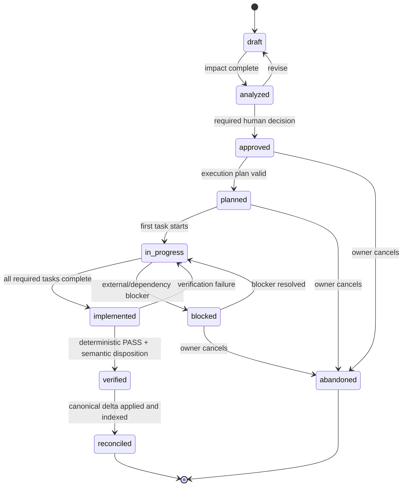

Rules:

- `approved` approves design, not code quality.
- `implemented` means tasks claim completion; it is not verification.
- `verified` requires deterministic evidence and resolved semantic findings.
- `reconciled` is the completion state: canonical knowledge matches verified code and the change is archived.
- An abandoned change never modifies canonical knowledge.

## 6. Workflow: initialize project

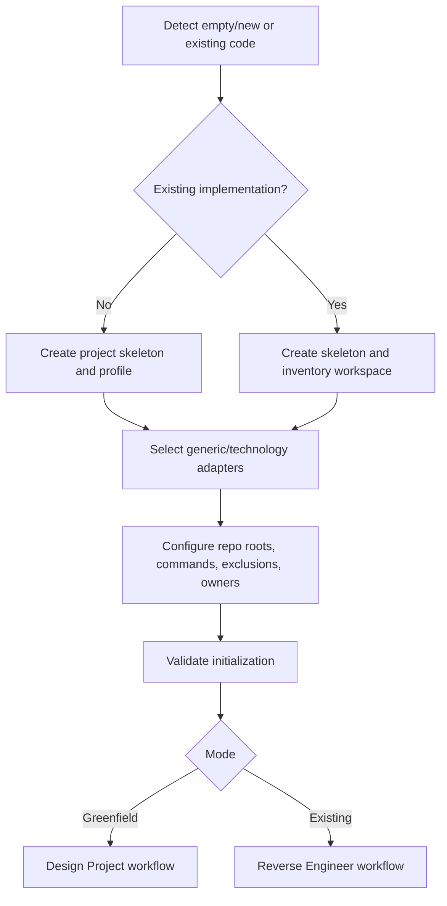

Human gate: confirm discovered repositories/applications and selected adapters. Directory creation and index generation need no separate approval.

## 7. Workflow: design greenfield project

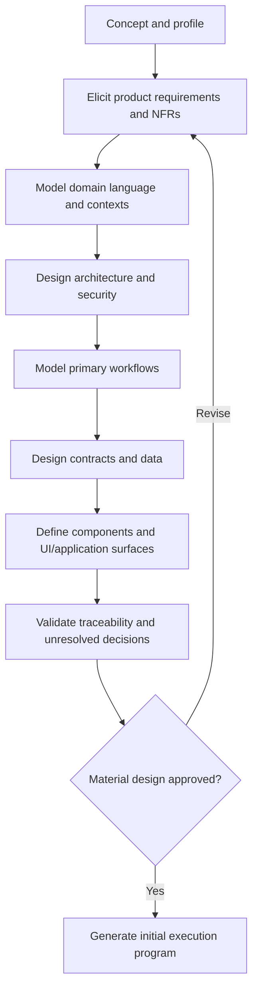

Human gate: one structured product/architecture review rather than approval after every document. Unresolved high-impact decisions block execution planning.

## 8. Workflow: implement initial system

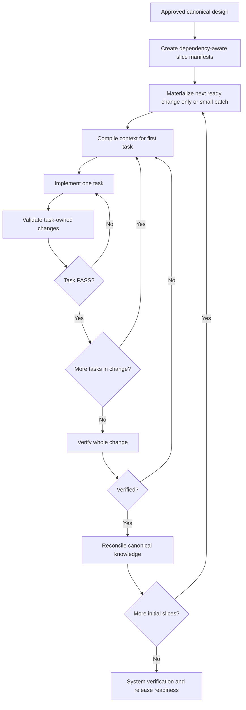

Unlike v1.2, the engine does not materialize every implementation pack before early implementation feedback is available.

## 9. Workflow: add or change feature

Both use the same state machine; “add” seeds no existing feature artifact while “change” begins from existing requirements/workflows/contracts.

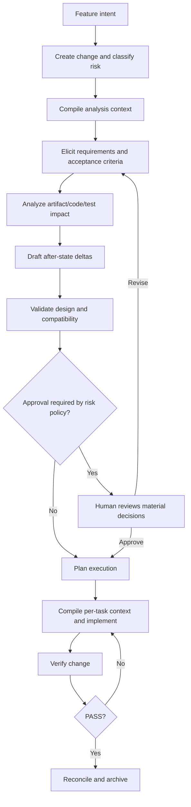

If implementation discovers a material deviation, it stops and returns to delta design/approval. It never silently updates the plan to excuse the code.

## 10. Workflow: bug fix

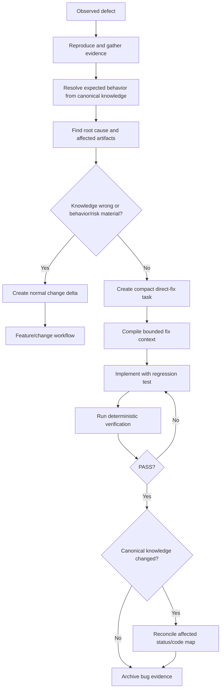

Security, data corruption, public contract change, migration, and irreversible production impact always use the full change path, regardless of file count.

## 11. Workflow: refactor

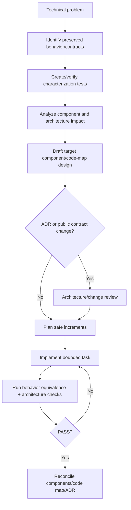

The central invariant is preserved externally observable behavior unless an approved change explicitly says otherwise.

## 12. Workflow: architecture change

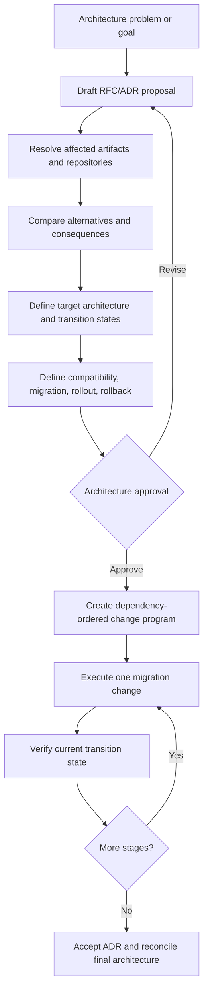

Each stage must leave the repository valid. The ADR is `proposed` until approval and `accepted` only when the decision is approved; implementation status is tracked separately.

## 13. Workflow: reverse engineer

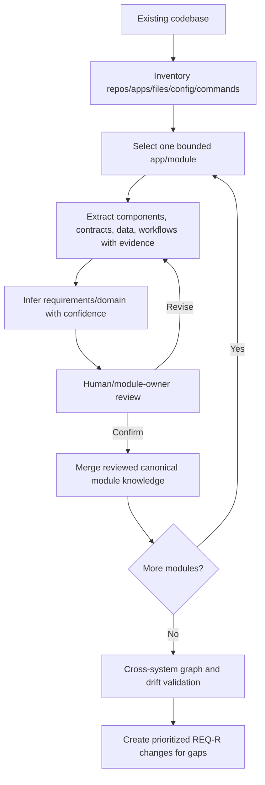

Extraction is incremental and resumable. Every inferred artifact carries evidence, confidence, and review state.

## 14. Workflow: verify implementation

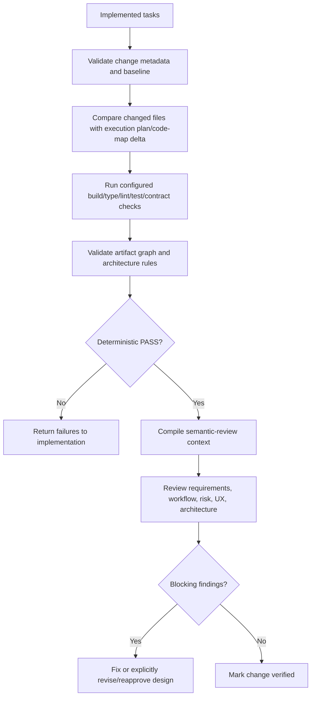

## 15. Workflow: reconcile documentation

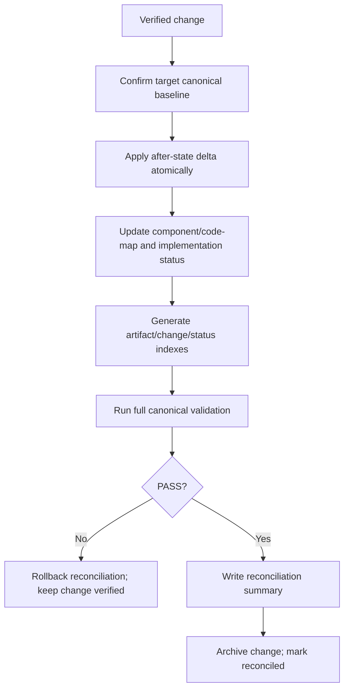

Reconciliation changes current knowledge. Implementation skills do not.

## 16. Human review gates

| Decision | Low risk | Medium risk | High/critical risk |
|----------|----------|-------------|--------------------|
| Requirements/business behavior | May be pre-authorized if acceptance is explicit | Required | Required with named owner |
| Architecture/ADR | Only if architecture changes | Required when boundaries/contracts change | Required with architecture/security owners |
| Implementation start | May be included in approved change | Required after plan | Required after plan and risk review |
| Verification disposition | Tool PASS may proceed | Review blocking semantic findings | Independent reviewer required |
| Reconciliation | May be pre-authorized | Explicit approval or PR merge policy | Explicit owner approval |

Mechanical steps—creating directories, generating indexes, compiling context, and rerunning validators—never need separate approval.

## 17. Agent responsibilities

Roles are responsibilities, not mandatory separate agents:

| Role | Responsibility | Must not do |
|------|----------------|-------------|
| Analyst | Requirements, acceptance, domain language | Invent architecture silently |
| Architect | Boundaries, patterns, ADRs, cross-system impact | Approve own high-risk implementation verification alone |
| Planner | Bounded tasks, dependencies, context manifests | Change approved requirements |
| Implementer | Execute task contract and return evidence | Edit canonical knowledge or unrelated files |
| Verifier/reviewer | Deterministic orchestration and semantic findings | Rewrite implementation to make it pass unless assigned a fix task |
| Reconciler | Apply verified after-state and generate indexes | Reinterpret or broaden the approved delta |

One agent may perform Analyst → Architect → Planner for ordinary work. High-risk verification should use a fresh context/agent or human reviewer to reduce confirmation bias.

## 18. Team and parallel-development model

1. Each change owns one directory and canonical metadata record.
2. No branch manually edits a central change log; indexes are generated after merge/rebase.
3. Change metadata records owner, base revision, affected artifact IDs, affected code paths, and dependencies.
4. The validator detects two active changes claiming exclusive modification of the same artifact/contract/path.
5. Independent changes may run in parallel.
6. A dependent change may be designed against a verified dependency, implemented only when dependency code is available locally, and reconciled only after the dependency is in its target baseline.
7. PR review includes code, change delta, execution evidence, semantic findings, and reconciliation preview.
8. Abandoned changes are marked and archived without touching canonical knowledge.
9. Developer overrides require a recorded reason; material overrides return the change to design/approval.
10. Ownership metadata routes required reviews without embedding a specific Git host in the core engine.

## 19. Workflow implementation format

Each workflow should eventually be declared in a machine-readable Markdown contract:

```yaml
---
name: add-feature
version: 1
entry_states: [none, draft]
states: [draft, analyzed, approved, planned, in-progress, implemented, verified, reconciled, abandoned]
steps:
  - id: understand
    skill: elicit-requirements
  - id: impact
    skill: analyze-change-impact
    requires: [understand]
  - id: design
    skills: [model-domain, model-workflow, design-architecture, design-contracts, design-data]
    conditional: impact.layers
  - id: plan
    skill: plan-execution
  - id: implement
    skill: implement-task
    repeat: execution.tasks
  - id: verify
    skill: verify-change
  - id: reconcile
    skill: reconcile-knowledge
---
```

The CLI validates state transitions and required outputs. The Markdown body explains the workflow to humans and agents.

## 20. Acceptance criteria

- Every workflow step invokes a named skill or deterministic tool action.
- Every skill declares inputs, context, outputs, mutations, invariants, validation, and failure conditions.
- Workflow and skill contracts can be fixture-tested without a real model.
- Project-specific knowledge never appears in reusable skill instructions.
- Low-risk work has fewer gates than high-risk work.
- Implementers cannot mutate canonical knowledge.
- Verification and reconciliation are separate responsibilities.
- Parallel branches do not edit a shared change registry manually.
- Refactor and architecture-change work no longer masquerade as generic feature changes.

