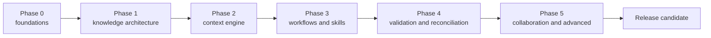

# RoyaScaff v1.3 Delivery, Migration, and Backlog Plan

> Plan component 5 of 6. See [plan index](00-v1.3-plan-index.md). Work begins only after plan approval.

## 1. Delivery strategy

Implement v1.3 incrementally behind versioned schemas and compatibility boundaries. Each phase must leave the package installable and its fixtures valid. Do not rewrite all flows, skills, templates, and CLI behavior in one branch.



Some basic validation lands in Phase 1 because later work must not build on invalid metadata. Phase 4 completes plan/code, adapter, evidence, and reconciliation validation.

## 2. Phase 0 — Cleanup and foundations

### Outcomes

- Protect existing v1.2 behavior with tests before refactoring.
- Separate the CLI entry point from reusable implementation modules.
- Establish v1.3 schema/version/error conventions.
- Resolve known documentation/example inconsistencies that would contaminate migration fixtures.
- Create feature flags or command boundaries so incomplete v1.3 work is not exposed as stable behavior.

### Work

1. Add Node-based unit/integration test infrastructure using the supported Node baseline.
2. Add tests for current `init`, target flags, `--force`, `--git`, error codes, and package contents.
3. Extract CLI parsing/copy logic from `bin/royascaff.js` into testable `lib/` modules without changing behavior.
4. Add a shared diagnostics/result format and safe filesystem helpers.
5. Establish schema version naming and migration version registry.
6. Record the v1.2 PollPulse example's missing pack-blueprint artifacts as a known fixture defect; either repair it before using it as a “valid v1.2” fixture or preserve a separate invalid fixture.
7. Correct version/documentation mismatches as an isolated cleanup change.

### Exit gate

- Current v1.2 install behavior is covered by automated tests.
- `npm pack --dry-run` contents are asserted.
- CLI refactor produces no observable breaking change.
- Valid and intentionally invalid v1.2 fixtures are identified.

## 3. Phase 1 — Knowledge architecture

### Outcomes

- Canonical v1.3 project tree and templates.
- YAML front-matter/artifact parser.
- Versioned metadata schemas.
- Artifact graph and generated indexes.
- System map and layered knowledge model.
- Component, contract, workflow, domain, data, ADR, and code-map artifacts.

### Work

1. Implement front-matter parsing with a maintained YAML parser and JSON Schema validation library; pin selected versions during implementation.
2. Add schemas listed in [validation plan](04-v1.3-validation-and-reconciliation-plan.md).
3. Create generic v1.3 templates and concise reference guidance.
4. Implement artifact discovery, uniqueness, typed relations, ownership, and two-dimensional status validation.
5. Implement generated `artifacts.json`, `artifacts.md`, `status.md`, and `changes.md` indexes.
6. Implement system-map generation/validation.
7. Add `royascaff validate project` and `royascaff index`.
8. Create a small canonical fixture independent of any framework.
9. Write the v1.2-to-v1.3 mapping specification before migration code.

### Exit gate

- A hand-authored v1.3 fixture validates.
- Invalid IDs, references, relation types, statuses, and stale indexes fail with actionable messages.
- A human can navigate system map → artifact → component/code map.
- Generated files are clearly marked and reproducible.

## 4. Phase 2 — Context engine

### Outcomes

- Reference-based Slice Manifests.
- Context Manifest schema and policy engine.
- Artifact dependency resolver.
- Bounded Context Pack compiler.
- Source revision/hash freshness detection.
- Small-model context budgets and task-splitting failure behavior.

### Work

1. Implement graph traversal policies per skill/workflow.
2. Implement exact section extraction by artifact ID.
3. Implement ranking, required/optional classification, file/token budgets, and overflow failure.
4. Implement source hashes and stale-pack validation.
5. Add `royascaff context build --task <id>`.
6. Implement code-map path resolution and exclusions.
7. Create fixtures for feature, bug, refactor, and cross-module context.
8. Test manifests against at least two different agent skill targets without changing project knowledge.

### Exit gate

- Context Packs are reproducible from manifests.
- Required context is never silently truncated.
- Archived changes are excluded by default.
- The Orders approval task compiles below its configured budget with all required relations.

## 5. Phase 3 — Workflows and skills

### Outcomes

- Declarative workflow contracts and common lifecycle.
- Atomic skill contract and initial skill catalog.
- Risk-based gates.
- Explicit greenfield, feature, bug, refactor, architecture-change, reverse-engineer, verify, and reconcile workflows.
- Compatibility aliases for v1.2 commands.

### Work

1. Implement workflow schema and transition validation.
2. Add structured active-change templates and execution task contracts.
3. Create atomic skills in dependency order:
   - route/initialize;
   - requirements/domain/workflow/architecture/contracts/data;
   - impact/context/plan;
   - implement/verify/reconcile;
   - bug/refactor/architecture migration;
   - inventory/reverse engineer.
4. Replace duplicated flow summaries with generated or validated thin entry skills.
5. Implement risk classification and gate policy.
6. Add refactor and architecture-change workflows.
7. Update greenfield execution to materialize only the next ready change/batch.
8. Make reverse engineering module-scoped, evidence-backed, and resumable.

### Exit gate

- Every workflow step names a skill or deterministic action.
- Every skill passes contract/schema fixture tests.
- Low-risk and high-risk scenarios produce different appropriate gates.
- Existing slash-command entry points route safely or provide migration guidance.

## 6. Phase 4 — Validation and reconciliation

### Outcomes

- Evidence-backed verification.
- Plan-to-code and orphan-file checks.
- Architecture and contract validation framework.
- Atomic reconciliation preview/apply/rollback behavior.
- Explicit semantic review schema and finding dispositions.
- Generic adapter plus example-stack adapter.

### Work

1. Add `validate change`, `validate task`, and `validate reconcile`.
2. Implement changed-file collection and planned-path comparison.
3. Implement mandatory code-map classification and blueprint-worthy review marker.
4. Implement evidence capture metadata and verification freshness.
5. Implement dependency/baseline conflict rules.
6. Implement reconciliation preview, clean apply, generated index refresh, final validation, and failure rollback.
7. Add `change create`, `change transition`, and `reconcile` commands.
8. Implement generic technology adapter contract.
9. Implement only the adapter(s) required by PollPulse/example validation.
10. Add semantic review output schemas and disposition checks.

### Exit gate

- A change cannot verify with unexplained changed files or failed commands.
- A verifier cannot mask deterministic failures with semantic approval.
- Reconciliation leaves canonical knowledge valid or applies no canonical mutation.
- Stale verification and stale baselines are rejected.

## 7. Phase 5 — Collaboration and advanced capabilities

### Outcomes

- Parallel ownership/conflict detection.
- Generated change registry with no central branch hot spot.
- Team review/ownership model.
- Migration CLI and complete PollPulse v1.3 example.
- Cross-platform package/release hardening.

### Work

1. Detect active changes that claim overlapping exclusive artifact/path ownership.
2. Enforce design/implementation/reconciliation dependency semantics.
3. Add owner/reviewer and developer-override metadata.
4. Document PR review and branch integration without coupling core to one Git host.
5. Implement preview-first `migrate v1.2-to-v1.3`.
6. Migrate PollPulse and add end-to-end conformance tests.
7. Add package content, clean-install, Windows, and Linux CI coverage.
8. Produce v1.3 user, contributor, migration, schema, CLI, and workflow documentation.
9. Run recorded small-model and strong-model scenario evaluations; use findings to improve context/skill clarity without changing core semantics.

### Exit gate

- Parallel changes do not require manual central-log edits.
- Migration is recoverable and produces a validation report.
- PollPulse satisfies component/contract/code-map and context tests.
- Release candidate installs and validates on supported platforms.

## 8. Prioritized implementation backlog

Complexity: S, M, L, XL. Migration risk: low, medium, high.

| ID | Priority | Purpose | Affected area | Dependencies | Benefit | Complexity | Migration risk |
|----|----------|---------|---------------|--------------|---------|------------|----------------|
| V13-001 | P0 | Protect current CLI behavior with tests | `bin/`, tests, package | — | Safe refactoring baseline | M | low |
| V13-002 | P0 | Extract reusable CLI/runtime modules | `bin/`, new `lib/` | V13-001 | Testable command architecture | M | medium |
| V13-003 | P0 | Define schema/version/diagnostic conventions | new schemas/lib/docs | V13-002 | Stable contracts and actionable errors | S | low |
| V13-004 | P0 | Repair/classify PollPulse fixture defects | `example-v1.2/` | V13-001 | Honest migration/conformance fixture | M | medium |
| V13-005 | P0 | Implement Markdown/front-matter parser | `lib/knowledge` | V13-003 | Machine-readable Markdown | M | low |
| V13-006 | P0 | Implement common and layer schemas | `schemas/` | V13-003, V13-005 | Deterministic artifact validity | L | medium |
| V13-007 | P0 | Define v1.3 canonical templates/tree | `engine/templates`, layout | V13-006 | Complete knowledge architecture | L | high |
| V13-008 | P0 | Build artifact scanner and typed graph | `lib/knowledge` | V13-005, V13-006 | Traceability and lookup | L | medium |
| V13-009 | P0 | Generate indexes and status views | `lib/index`, templates | V13-008 | Remove manual synchronization | L | high |
| V13-010 | P0 | Add `validate project` and `index` commands | CLI/lib | V13-008, V13-009 | Usable enforcement foundation | M | low |
| V13-011 | P1 | Implement system map generator/validator | lib/templates | V13-009 | Progressive entry point | M | medium |
| V13-012 | P1 | Define component/contract/code-map rules | schemas/templates/rules | V13-007 | Account for non-service code | L | medium |
| V13-013 | P1 | Implement Slice/Context Manifest schemas | schemas/templates | V13-008 | Reference-based scope | M | low |
| V13-014 | P1 | Implement context resolver policies | `lib/context` | V13-008, V13-013 | Small sufficient context | L | medium |
| V13-015 | P1 | Implement Context Pack compiler/freshness | `lib/context` | V13-014 | Model-independent execution input | XL | medium |
| V13-016 | P1 | Define workflow and skill schemas | schemas/engine/skills | V13-006 | Composable procedures | M | low |
| V13-017 | P1 | Implement common change state machine | `lib/workflow` | V13-016 | Legal resumable lifecycle | M | medium |
| V13-018 | P1 | Create core analysis/design/planning skills | `skills/` | V13-014, V13-016 | Reusable operations | XL | medium |
| V13-019 | P1 | Create implement/verify/reconcile skills | `skills/` | V13-017, V13-018 | Controlled execution lifecycle | L | high |
| V13-020 | P1 | Rewrite workflows as orchestration contracts | `engine/workflows`, flow router | V13-017..019 | Remove duplicated flow logic | XL | high |
| V13-021 | P1 | Add risk classifier and adaptive gates | workflow/schema/skills | V13-017, V13-020 | Safety without ceremony | M | medium |
| V13-022 | P1 | Add changed-file and plan-scope validator | `lib/validate` | V13-012, V13-017 | Prevent unplanned implementation | L | medium |
| V13-023 | P1 | Add evidence-backed verification | schemas/lib/templates | V13-019, V13-022 | Auditable PASS | L | medium |
| V13-024 | P1 | Implement atomic reconciliation | `lib/reconcile`, CLI | V13-009, V13-017, V13-023 | Canonical current truth | XL | high |
| V13-025 | P2 | Add generic technology adapter | `engine/adapters`, lib | V13-012 | Methodology genericity | M | low |
| V13-026 | P2 | Add example-stack adapter | adapters/tests | V13-025 | Validate real example | M | low |
| V13-027 | P2 | Implement incremental reverse engineering | workflow/skills/adapters | V13-018, V13-025 | Scalable legacy onboarding | XL | medium |
| V13-028 | P2 | Detect parallel ownership conflicts | lib/index/workflow | V13-009, V13-017 | Safer team concurrency | M | low |
| V13-029 | P2 | Implement preview-first migration | `lib/migrate`, CLI | V13-007..012, V13-024 | Safe v1.2 adoption | XL | high |
| V13-030 | P2 | Migrate PollPulse and add E2E tests | example/tests/docs | V13-026, V13-029 | Release conformance proof | L | medium |
| V13-031 | P2 | Update package/install for runtime assets | package/CLI/docs | V13-002, V13-030 | Correct consumer package | M | medium |
| V13-032 | P2 | Complete v1.3 documentation and migration guide | docs/README | all release items | Adoption and maintenance | L | low |
| V13-033 | P2 | Cross-platform and model-scenario evaluation | CI/fixtures/evals | V13-030..032 | Release confidence | L | low |

## 9. Planned repository impact

### New implementation areas

```text
lib/
  cli/
  knowledge/
  graph/
  context/
  workflow/
  validate/
  reconcile/
  migrate/
  adapters/
schemas/
  v1/
engine/
  workflows/
  adapters/
  templates/v1.3/
tests/
  unit/
  fixtures/
  integration/
  e2e/
```

The final naming can be adjusted during Phase 0, but responsibilities must remain separated.

### Existing files requiring revision

| Current area | Planned change |
|--------------|----------------|
| `bin/royascaff.js` | Thin command entry point; retain init compatibility |
| `package.json` | v1.3 version, test scripts, runtime dependencies, packaged `lib`/`schemas`/adapters |
| `engine/flow.md` | New intent/risk router and workflow registry |
| `engine/project-layout.md` | Replace v1.2 layout with canonical layers/change/execution/index contracts |
| `engine/conventions.md` | Artifact metadata, IDs, two-dimensional statuses, generated-index rules |
| `engine/flows/*.md` | Migrate to orchestration contracts; add refactor/architecture/reconcile workflows |
| `engine/rules/*.md` | Split technology-independent core from adapters |
| `engine/templates/*.md` | Add canonical/change/task/context/evidence schemas; retire duplicate status templates |
| `skills/*` | Convert to standard atomic contracts; retain safe aliases |
| `README.md` | v1.3 concept, CLI, migration, supported targets |
| `docs/` | Rewrite user/reference/contributor docs from final contracts |
| `example-v1.2/` | Preserve migration source; add separate migrated v1.3 example or versioned result |

## 10. Migration strategy

### 10.1 Safety model

Migration is preview-first and recoverable:

1. Detect v1.2 structure and repository state.
2. Generate a migration plan and target tree in a staging directory under the project.
3. Never mark inferred artifacts `verified`; use evidence/confidence and `partial` where uncertain.
4. Validate the staged v1.3 tree.
5. Present created, moved, retained, unresolved, and conflicting paths.
6. Apply only after explicit confirmation.
7. Write a rollback manifest and migration report.
8. Preserve legacy change history under an archive namespace.

Do not silently delete v1.2 files. Cleanup/archive is an explicit final migration action and should be recoverable through version control or the rollback manifest.

### 10.2 Mapping

| v1.2 source | v1.3 target |
|-------------|-------------|
| `description.md` | system map/product requirements seeds |
| `profile.md` | v1.3 profile/adapters/commands/repositories |
| `plan/modules.md` | requirements modules + domain contexts + architecture modules |
| `plan/data-model.md` | `data/` persistence records with unresolved conceptual links flagged |
| `rules.md` | requirements constraints, domain invariants, security, architecture rules by classification |
| services specs | components plus method contract candidates |
| endpoints specs | transport/API contracts |
| pages/views specs | UI components plus workflow/requirement candidates |
| action indexes/status | generated artifact/status indexes |
| merged packs | archived change records and provenance |
| drafted/in-progress/verified packs | migrated active changes with state mapping and baseline warning |
| build program | initial execution-plan history or active task program |
| bug log/reports | active/archive bug records |

### 10.3 Uncertain migration facts

The migrator creates findings rather than inventing certainty:

- missing requirement → `needs-review` finding;
- undefined DTO/interface → contract candidate;
- source file without owner → unresolved code-map item;
- service with mixed responsibilities → architecture review finding;
- conflicting main/pack facts → migration conflict, not automatic winner;
- historical pack without self-contained blueprint → provenance warning.

## 11. Release and quality gates

### Per-phase gate

- code and fixtures pass;
- CLI help/reference updated for exposed commands;
- no active v1.2 behavior regression unless an approved breaking decision exists;
- new generated/package assets appear in `npm pack --dry-run`;
- plan acceptance criteria for the phase pass.

### v1.3 release-candidate gate

- clean install test from packed tarball;
- Windows and Linux supported-runtime tests;
- greenfield end-to-end scenario;
- v1.2 migration end-to-end scenario;
- feature/change/bug/refactor/reconcile scenarios;
- context-budget and stale-context tests;
- invalid fixture tests prove validators fail correctly;
- no unevidenced PASS in examples;
- documentation links and version strings validate;
- security review of filesystem operations, command execution, YAML parsing, and evidence redaction;
- package contents are intentional and license/dependency obligations reviewed.

Publishing remains a separate explicit action after the release candidate is accepted.

## 12. Risks and mitigations

| Risk | Impact | Mitigation |
|------|--------|------------|
| Engine becomes a second complex application | High cognitive/maintenance cost | Keep graph lightweight, use Markdown/YAML, ship minimal adapters, measure artifact value |
| Too many artifact types | User confusion | System map, progressive disclosure, module-level files, conditional artifacts, templates |
| Front-matter editing is error-prone | Invalid knowledge | CLI scaffolding, schemas, actionable diagnostics, generated indexes |
| Context compiler omits needed knowledge | Incorrect implementation | Required relation policies, overflow failure, semantic impact review, no silent truncation |
| AI labels files as support to avoid modeling | Hidden architecture | Deterministic classification plus semantic blueprint-worthy review |
| Migration invents false facts | False confidence | evidence/confidence/review states and unresolved findings |
| Core becomes framework-specific again | Reduced genericity | strict adapter boundary and generic fixtures |
| Reconciliation corrupts canonical docs | Loss/drift | preview, baseline hashes, atomic apply, rollback, final full validation |
| Many schema changes destabilize v1.3 | Churn | version schemas, freeze core schemas before workflow rewrite, migration tests |
| Compatibility work delays value | Slow delivery | retain thin aliases, migrate incrementally, prioritize code map/context/validation |
| Model evaluations are nondeterministic | Flaky release process | deterministic tests are blocking; recorded model evals inform quality but do not gate alone |

## 13. Anti-overengineering constraints

v1.3 must not add:

- a graph database or server;
- one Markdown file per trivial artifact;
- mandatory specialized agents for every workflow;
- a custom programming language for workflows;
- broad framework adapters before the generic core and example are proven;
- mandatory human gates for mechanical actions;
- automatic source deletion or Git history rewriting;
- live model calls in deterministic test suites;
- duplicated canonical content inside Slice/Context Packs or archived changes.

## 14. Implementation start order after approval

The first implementation change should contain only V13-001 through V13-003: current CLI tests, testable module extraction, and shared schema/diagnostic conventions. It should not change generated project layout or user workflows.

The second change should establish parser/schema fixtures. Only then should canonical templates and migration mappings begin.

