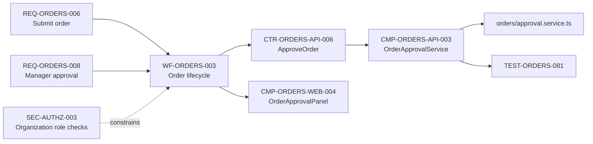
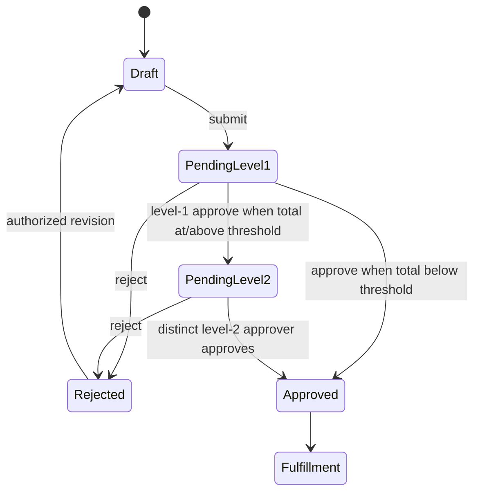
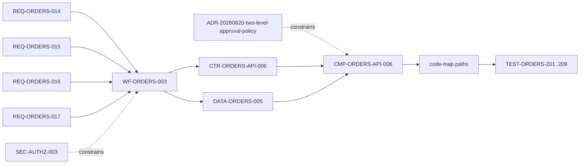

# RoyaScaff v1.3 End-to-End Example

> Plan component 6 of 6. See [plan index](00-v1.3-plan-index.md). This example tests the proposed architecture; the files shown do not yet exist in the active engine.

## Scenario

An existing Orders module allows managers to submit and approve orders. Add organization-level approval with two approval levels:

- orders below SAR 10,000 need one approver;
- orders at or above SAR 10,000 need two distinct approvers;
- the submitter cannot approve their own order;
- every decision must be auditable;
- existing one-level clients must remain compatible during rollout.

The implementation is split between API and web applications. The project is three years old and contains many unrelated modules.

## 1. Existing canonical knowledge

A developer starts at `project/system-map.md`, which points to the Orders module and primary order workflow.

Relevant existing graph:



Relevant files before the change:

```text
project/
  system-map.md
  requirements/modules/orders.md
  requirements/non-functional.md
  architecture/security.md
  architecture/modules/orders.md
  domain/modules/orders.md
  workflows/orders/order-lifecycle.md
  contracts/api/orders.md
  data/api/orders.md
  implementation/components/api/orders.md
  implementation/components/web/orders.md
  implementation/code-map/api/orders.md
  implementation/code-map/web/orders.md
  decisions/ADR-20260110-order-approval.md
  indexes/artifacts.json
```

The model does not load all of these yet. They are discovery sources for impact resolution.

## 2. Create the change

Command concept:

```text
royascaff change create --type feature --module orders --title "two-level order approval"
```

Created file:

```text
project/changes/active/change-20260820-101500-two-level-order-approval/change.md
```

Initial metadata:

```yaml
schema: royascaff/change/v1
id: CHG-20260820-101500
title: Two-level organization order approval
type: feature
state: draft
owner: team-commerce
base_revision: 7f3c21a
target_modules: [orders]
target_apps: [api, web]
risk:
  level: high
  reasons: [authorization, money-threshold, public-contract, migration]
depends_on: []
```

Risk is high because the change affects authorization, monetary policy, a public API, and existing stored orders. This requires requirements/architecture approval and independent verification.

## 3. Compile analysis context

The `analyze-change-impact` skill declares its context policy. The resolver seeds from `orders`, approval terminology, and the existing lifecycle.

Created:

```text
change-.../execution/context/impact-manifest.md
change-.../execution/context/impact-pack.md
```

Manifest summary:

```yaml
schema: royascaff/context-manifest/v1
task: analyze-CHG-20260820-101500
skill: analyze-change-impact
source_revision: 7f3c21a
required:
  - REQ-ORDERS-006
  - REQ-ORDERS-008
  - SEC-AUTHZ-003
  - NFR-AUDIT-002
  - ARCH-ORDERS-002
  - DOM-ORDERS-004
  - WF-ORDERS-003
  - CTR-ORDERS-API-006
  - DATA-ORDERS-002
  - CMP-ORDERS-API-003
  - CMP-ORDERS-WEB-004
  - ADR-20260110-order-approval
code:
  - apps/api/src/orders/**
  - apps/api/test/orders/**
  - apps/web/src/orders/approval/**
constraints:
  - archived changes excluded
  - exact security and ADR sections required
budget:
  max_tokens: 18000
  max_files: 24
```

The compiler includes exact relevant artifact sections, one-hop dependency summaries, code-map locations, and existing tests. It does not include inventory, billing, shipping, catalog, or historical order-change packs.

## 4. Requirements and impact analysis

Created:

```text
change-.../impact.md
change-.../delta/requirements/modules/orders.md
```

New requirement candidates:

```text
REQ-ORDERS-014 — Orders below SAR 10,000 require one eligible approval.
REQ-ORDERS-015 — Orders at or above SAR 10,000 require two distinct eligible approvals.
REQ-ORDERS-016 — A submitter cannot approve their own order.
REQ-ORDERS-017 — Every approval/rejection records actor, organization, time, level, and reason.
```

Acceptance criteria are observable and testable. The threshold is not buried only in code; it is a product rule with organization scope and currency semantics.

Impact result:

| Layer | Affected artifacts | Decision |
|-------|--------------------|----------|
| Requirements | existing REQ-006/008, new REQ-014..017 | modify and add |
| Security | SEC-AUTHZ-003 | clarify distinct approver/self-approval rules |
| Architecture | ARCH-ORDERS-002, existing ADR | new policy boundary ADR required |
| Domain | DOM-ORDERS-004 approval policy | add approval-level policy and invariant |
| Workflow | WF-ORDERS-003 | replace one-level transition with two-level after-state |
| Contracts | CTR-ORDERS-API-006 | version-compatible response expansion; new decision DTO |
| Data | DATA-ORDERS-002 | approval records/level; migration/backfill decision |
| Components | API approval service, web panel, audit writer | modify/create |
| Code | 8 expected source/test files | classified in execution plan |
| Rollout | existing clients and existing pending orders | compatibility/feature flag required |

Change transitions `draft → analyzed` after the impact schema and graph validate.

## 5. Design the after-state delta

Created delta tree:

```text
change-.../delta/
  requirements/modules/orders.md
  architecture/security.md
  architecture/modules/orders.md
  domain/modules/orders.md
  workflows/orders/order-lifecycle.md
  contracts/api/orders.md
  data/api/orders.md
  implementation/components/api/orders.md
  implementation/components/web/orders.md
  implementation/code-map/api/orders.md
  implementation/code-map/web/orders.md
  decisions/ADR-20260820-two-level-approval-policy.md
```

Each file contains only affected after-state artifact sections, with metadata declaring create/modify/supersede. It does not copy the whole canonical file.

### Workflow after-state



Invariants:

- submitter cannot be an approver;
- level-2 approver differs from level-1 approver;
- approver belongs to the same organization and has required permission;
- threshold evaluation uses canonical order total/currency conversion policy;
- every transition writes an immutable audit record;
- duplicate requests are idempotent.

### Contract after-state

`CTR-ORDERS-API-006` remains backward compatible. Existing response fields remain; optional fields expose `requiredApprovals`, `completedApprovals`, and `nextApprovalLevel`. A new request DTO includes decision, reason, and expected current version for optimistic concurrency.

### Architecture decision

Proposed ADR chooses a domain approval policy behind an interface rather than embedding threshold and role logic in the controller or UI. It records alternatives, rollout consequences, and future organization-configurable policy implications.

## 6. Human design review

The high-risk review presents decisions, not every generated file:

1. Is SAR 10,000 inclusive for two approvals?
2. Are approval permissions role-based or explicit permissions?
3. What happens to already-pending orders during rollout?
4. Is the threshold globally fixed or organization-configurable?
5. Must rejection return directly to Draft?
6. Is API compatibility approach acceptable?
7. Is feature-flagged rollout required?

After answers are incorporated and deterministic design validation passes, the owner approves. The change becomes `approved`.

## 7. Generate execution plan

Created:

```text
change-.../execution/plan.md
change-.../execution/tasks/
  TASK-CHG-20260820-01-data-migration.md
  TASK-CHG-20260820-02-policy-and-repository.md
  TASK-CHG-20260820-03-api-contract.md
  TASK-CHG-20260820-04-web-approval-ui.md
  TASK-CHG-20260820-05-rollout-and-e2e.md
```

Task order:

| Task | Owns | Depends on | Required verification |
|------|------|------------|-----------------------|
| 01 Data migration | persistence migration and data mapping | — | migration forward/backward fixture |
| 02 Policy/repository | approval policy, audit repository, unit tests | 01 schema contract | unit/integration tests, architecture rule |
| 03 API contract | controller/DTO/serialization and contract tests | 02 | typecheck, API compatibility, auth tests |
| 04 Web UI | approval panel/service/models | 03 contract | component tests, states, accessibility screenshot |
| 05 Rollout/E2E | feature flag, full workflow, compatibility | 01–04 | E2E, rollback/flag-off check |

Change transitions `approved → planned` only after all delta artifacts map to one or more tasks and every task contract validates.

## 8. Compile one implementation context

For Task 02, create:

```text
change-.../execution/context/TASK-CHG-20260820-02-manifest.md
change-.../execution/context/TASK-CHG-20260820-02-pack.md
```

The pack includes:

- task objective and allowed files;
- REQ-014..017 acceptance subset;
- security constraints;
- approved domain policy and workflow after-state;
- policy interface and audit contract;
- data mapping created by Task 01;
- API component architecture rules;
- relevant code-map paths and existing unit tests;
- commands and escalation conditions.

It excludes the web UI, unrelated endpoint details, and other modules. Another model can implement Task 02 without the original conversation.

## 9. Implementation behavior

The implementation agent may modify only task-owned source/test paths. It returns:

```yaml
schema: royascaff/task-result/v1
task: TASK-CHG-20260820-02
source_revision: 91bc220
files:
  created:
    - apps/api/src/orders/approval/two-level-approval.policy.ts
    - apps/api/test/orders/two-level-approval.policy.spec.ts
  modified:
    - apps/api/src/orders/approval/order-approval.service.ts
    - apps/api/src/orders/approval/approval.repository.ts
commands:
  - command: npm test -- orders/approval
    exit_code: 0
    evidence: evidence/task-02-tests.txt
deviations:
  - path: apps/api/src/orders/approval/approval.mapper.ts
    classification: supports
    owner: CMP-ORDERS-API-006
    reason: maps stored approval records to domain decisions
```

The extra mapper is acceptable only after it is classified and added to the code-map delta. If it introduces an independent cross-module mapping boundary, the task stops and returns to design.

The implementer does not edit `project/workflows`, contracts, architecture, or other canonical knowledge.

## 10. Verification

After all tasks finish, deterministic verification checks:

- change/task/context schemas;
- baseline and dependency revisions;
- changed paths against task ownership;
- code-map classification for every changed file;
- contract compatibility;
- migration fixtures;
- architecture dependency rules;
- typecheck/lint/build/tests;
- requirement-to-test links;
- stale Context Packs and evidence.

Semantic review checks:

- two-level behavior and edge cases;
- organization/security semantics;
- audit completeness;
- UI state/permission behavior;
- rollout and rollback safety;
- consistency between approved workflow and implementation evidence.

Created:

```text
change-.../verification.md
change-.../execution/evidence/**
```

The change becomes `verified` only when deterministic checks pass and all blocking/high semantic findings are resolved or explicitly accepted by the correct owner.

## 11. Reconciliation

`royascaff reconcile <change> --dry-run` produces:

- canonical paths and artifact sections to create/replace;
- implementation statuses to update;
- code-map additions/removals;
- ADR state change from proposed to accepted;
- generated indexes/system-map sections that will change;
- baseline conflicts, if any.

After approval, reconciliation:

1. applies the approved after-state deltas atomically;
2. marks implemented artifacts `verified` where evidence supports it;
3. regenerates indexes and the system map;
4. validates the entire canonical graph;
5. writes `reconciliation.md`;
6. moves the change to `changes/archive/2026/` and marks it `reconciled`.

The archived change remains audit evidence. Its delta is no longer read as current truth.

## 12. Canonical state after completion

A developer asking “How does order approval work now?” reads:

```text
system-map.md
  → workflows/orders/order-lifecycle.md#WF-ORDERS-003
  → domain/modules/orders.md#approval-policy
  → contracts/api/orders.md#CTR-ORDERS-API-006
  → implementation/components/api/orders.md#CMP-ORDERS-API-006
```

Those artifacts show two-level approval as the current after-state. The developer does not need the historical change directory.

The artifact graph now includes:



## 13. Files by lifecycle stage

| Stage | Canonical files | Active change files | Source files |
|-------|-----------------|---------------------|--------------|
| Intent | unchanged | `change.md` | unchanged |
| Analysis | unchanged/read-only | impact context + `impact.md` | read-only |
| Design | unchanged/read-only | `delta/**`, proposed ADR | read-only |
| Approval | unchanged | approval metadata | unchanged |
| Planning | unchanged | execution plan/tasks/context manifests | unchanged |
| Implementation | unchanged | task results/evidence/code-map delta | modified by task ownership |
| Verification | unchanged | `verification.md`, evidence | read-only except assigned fixes |
| Reconciliation preview | unchanged | preview/reconciliation candidate | unchanged |
| Reconciled | after-state applied | archived summary/evidence | verified implementation remains |

## 14. Scenario success test

This example proves the v1.3 architecture only if:

- analysis finds requirements, security, workflow, contracts, data, components, ADRs, code, and tests through typed relations;
- no whole-project context is required;
- another model can execute a task from its compiled Context Pack;
- an extra implementation file cannot disappear from the blueprint;
- public compatibility and migration are decided before code;
- material deviations force design revision rather than silent documentation edits;
- deterministic evidence is required before verification;
- canonical after-state is readable without historical changes;
- the archived change preserves rationale and audit history without competing with current truth.

