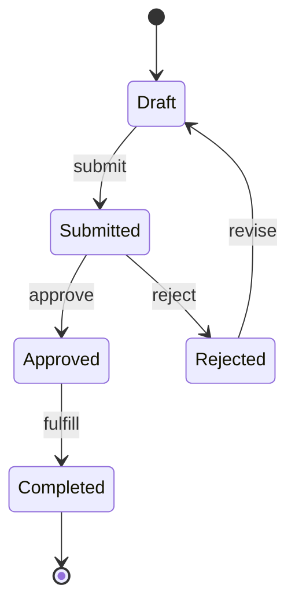
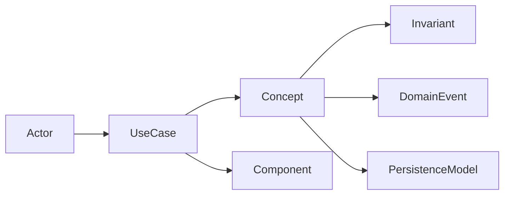

# RoyaScaff v1.3 — Blueprint Model and Flow Revision Proposal

> **Status:** Draft for review and study. This document is not part of the active engine contract and does not change the v1.2 flows.

## Purpose

This proposal addresses three connected problems in RoyaScaff v1.2:

1. The blueprint has no explicit **conceptual model** of the product and its domain.
2. Code files that are not modeled as services, endpoints, pages, or views can exist without a durable place in the main blueprint.
3. Architecture, design patterns, interfaces, DTOs, provider requests/responses, events, jobs, and other contracts are described only indirectly or not at all.

It also addresses the broader v1.2 disadvantages: manual synchronization, subjective verification, excessive ceremony for small work, weak parallel-work semantics, and divergence between flows, templates, skills, and documentation.

The goal is not to document every line of code. The goal is to make every important product concept, runtime component, contract, and source file either:

- represented in the blueprint;
- attached to a represented owner; or
- explicitly classified as generated, test-only, vendor, or intentionally excluded.

No significant runtime file should be an unexplained orphan.

---

## 1. Root-cause analysis

### 1.1 The current blueprint starts too late

The v1.2 traceability chain is:

```text
Data Model → Services → Endpoints → Pages/Views
```

This begins with the persistence model. It does not explicitly describe:

- the language used by the business;
- actors and their goals;
- use cases and workflows;
- domain concepts that are not database entities;
- business invariants and state transitions;
- domain events;
- boundaries between business areas.

As a result, a database table can be well documented while the business meaning behind it remains implicit.

### 1.2 “Service” is being used as a substitute for “component”

The current blueprint gives first-class records to services, endpoints, pages, and views. The engine rules also expect many other implementation types:

- controllers;
- repositories;
- schemas and models;
- DTOs and validators;
- interfaces and ports;
- integration adapters and providers;
- guards, middleware, interceptors, filters, and pipes;
- jobs, consumers, schedulers, and event handlers;
- mappers and serializers;
- frontend hooks, stores, feature services, shared components, and layouts;
- configuration, migrations, and application bootstrap files.

These files may be listed temporarily in a pack's `impact.md`, but there is no mandatory main-blueprint destination for them at merge. The pack remembers that the files were changed; the main blueprint forgets why they exist and what owns them.

### 1.3 The current data model combines different meanings of “model”

The following are different artifacts and must not be treated as one data model:

| Model kind | Describes | Example |
|------------|-----------|---------|
| Conceptual model | Business meaning and relationships | A Customer places Orders |
| Domain model | Behavior, invariants, value objects, lifecycle | An Order cannot be paid twice |
| Persistence model | Stored shape, keys, indexes, relations | `orders.status`, `customer_id` |
| Transport model | API input/output shape | `CreateOrderDto`, `OrderResponse` |
| Integration model | External provider payload | `PaymentProviderRequest` |
| View model | UI-specific shape | `OrderListItemViewModel` |

v1.2 has a persistence-oriented `data-model.md`, while DTO and interface names appear inside service and endpoint text without a canonical definition.

### 1.4 The architecture exists as generic rules, not as a project decision

The engine recommends layered architecture and several patterns, but the generated project does not record:

- which architecture style this project selected;
- where its boundaries are;
- which dependency directions are allowed;
- which patterns are actually used;
- why exceptions exist;
- which files participate in each pattern;
- which interface separates a component from its implementation.

Generic engine guidance cannot replace a project-specific architecture model.

---

## 2. Design principles for v1.3

The revision should follow these principles:

1. **Concept before storage** — business meaning comes before database shape.
2. **Component, not filename convention** — an artifact is modeled by responsibility, not whether its name ends in `Service`.
3. **Contracts are first-class** — interfaces, DTOs, events, and provider payloads have stable definitions and owners.
4. **Every significant file is accounted for** — mapped to a component, attached as support, or explicitly excluded.
5. **One canonical fact, many generated views** — logs and dashboards should not be manually synchronized copies.
6. **Evidence over assertion** — verification PASS requires traceable evidence.
7. **Progressive detail** — small projects can use one file per area; large projects can split by module without changing the model.
8. **Describe actual architecture** — patterns are recorded only when selected or observed, not added as decorative labels.
9. **Preserve isolation** — in-flight conceptual, architectural, contract, and code-map changes stay in the pack until merge.
10. **Backward-compatible adoption** — a v1.2 project can add the new layers incrementally.

---

## 3. Proposed blueprint structure

```text
project/
  profile.md
  description.md
  rules.md
  status.md

  concept/
    _index.md
    domain.md
    workflows/
      <workflow>.md

  plan/
    modules.md
    data-model.md
    roles-and-authorization.md

  architecture/
    overview.md
    patterns.md
    components/
      <app-key>/
        _index.md
        <module>.md
    decisions/
      ADR-<ID>-<slug>.md
    code-map/
      <app-key>/
        _index.md
        <module>.md

  contracts/
    <app-key>/
      _index.md
      <module>.md

  actions/
    <app-key>/
      services/
      endpoints/
      pages/
      views/

  changes/
  bugs/
  verify/
  docs/
```

This structure adds four concepts without removing the useful v1.2 artifacts:

- `concept/` explains the business world.
- `architecture/components/` explains the runtime building blocks.
- `contracts/` explains the shapes and interfaces crossing boundaries.
- `architecture/code-map/` accounts for physical source files.

---

## 4. Conceptual model

### 4.1 Purpose

The conceptual model answers:

- What business world does this system represent?
- Who interacts with it?
- What outcomes do they need?
- What concepts exist regardless of storage or framework?
- What relationships and invariants are always true?
- What are the important workflows and state transitions?

It must not contain database types, HTTP routes, framework classes, or source paths.

### 4.2 `concept/_index.md`

The index is a compact map for navigation:

```md
# Concept Index

| ID | Type | Name | Module / context | Status | Definition file |
|----|------|------|------------------|--------|-----------------|
| ACT-SALES-01 | actor | Sales Manager | Sales | done | domain.md |
| CAP-ORDERS-01 | capability | Order Management | Orders | done | domain.md |
| UC-ORDERS-01 | use-case | Place Order | Orders | done | workflows/place-order.md |
| CON-ORDERS-01 | concept | Order | Orders | done | domain.md |
| INV-ORDERS-01 | invariant | Order total is non-negative | Orders | done | domain.md |
| EVT-ORDERS-01 | domain-event | Order Placed | Orders | planned | domain.md |
```

### 4.3 `concept/domain.md`

Recommended sections:

1. **Ubiquitous language** — canonical term, definition, aliases, forbidden ambiguous terms.
2. **Actors** — human or system actors, goals, permissions reference.
3. **Capabilities** — what the business can do.
4. **Use cases** — actor, trigger, outcome, preconditions, failure outcomes.
5. **Concepts** — entities, value objects, policies, external concepts.
6. **Relationships** — ownership, membership, composition, dependency.
7. **Invariants** — statements that must always remain true.
8. **Domain events** — meaningful facts emitted after state changes.
9. **Context boundaries** — which module owns each term and where translation is required.

### 4.4 Complex workflows

Create `concept/workflows/<workflow>.md` only when a workflow has one or more of:

- more than three meaningful states;
- approval or rejection paths;
- asynchronous processing;
- multiple actors or applications;
- retry, timeout, or compensation behavior;
- security-sensitive transitions.

Each workflow records the trigger, preconditions, states, transitions, invariants, emitted events, failure outcomes, and owning components.



### 4.5 Relationship to persistence

The persistence model implements part of the conceptual model; it does not define it.



Every persistent entity in `plan/data-model.md` must reference one or more conceptual IDs. A conceptual item does not need a database entity; policies, calculations, sessions, external identities, and transient workflows are valid concepts.

---

## 5. Architecture and component model

### 5.1 `architecture/overview.md`

This is the project-specific architecture contract. It records:

- architecture style: layered, modular monolith, hexagonal, event-driven, microservices, feature-first frontend, or a deliberate combination;
- application and deployment boundaries;
- module or bounded-context boundaries;
- allowed dependency directions;
- synchronous and asynchronous communication paths;
- data ownership;
- cross-cutting concerns such as authentication, logging, caching, and configuration;
- testing boundaries;
- permitted exceptions with links to ADRs.

Example dependency rule:

```text
controller → application/domain service → port/interface → adapter/repository
page → feature service/store → API client → endpoint
event producer → event contract → consumer
```

The overview must describe what this project actually uses. Generic defaults remain in `engine/rules/`.

### 5.2 Component registry

A **component** is a runtime unit with a distinct responsibility or boundary. It does not have to be called a service.

Supported component kinds include:

| Area | Component kinds |
|------|-----------------|
| Backend entry | controller, resolver, handler, CLI command |
| Business | application service, domain service, policy, strategy, orchestrator |
| Persistence | repository, query object, unit of work, schema/model adapter |
| Integration | adapter, provider, gateway, client, webhook handler |
| Security | guard, middleware, authorization policy, interceptor |
| Async | producer, consumer, job, scheduler, event handler |
| Transformation | mapper, serializer, parser, validator |
| Frontend | page/view, feature service, hook, store, guard, layout, shared component |
| Platform | bootstrap, configuration, health check, logging, cache |

`architecture/components/<app>/<module>.md` uses one record per blueprint-worthy component:

```md
### CMP-AUTH-API-03 · JwtAuthGuard
- Kind: guard
- Status: done
- Responsibility: Reject requests without a valid access token
- Module: Auth
- Layer: security / transport boundary
- Implements contracts: CTR-AUTH-04
- Depends on: CMP-AUTH-API-02, CTR-AUTH-03
- Used by: EP-AUTH-03..08
- Pattern role: PAT-AUTH-01 participant
- Code map: architecture/code-map/api/auth.md
- Tests: test/auth/jwt-auth.guard.spec.ts
```

### 5.3 When a file needs its own component

A source file receives its own `CMP-*` record when any of these is true:

- it contains business rules or workflow orchestration;
- it enforces security or authorization;
- it owns persistence queries or transactions;
- it performs I/O or communicates with an external system;
- it exposes a public or cross-module interface;
- it is a runtime entry point, scheduled job, consumer, or handler;
- it is independently replaceable or testable behind a boundary;
- it is reused across modules and has meaningful behavior.

A file does **not** need its own component when it is a small implementation detail with no independent responsibility. It is attached to an owner as a supporting file. Examples include a local formatter, a private constant file, simple styles, generated types, and a small mapper used only by one component.

This rule prevents both missing architecture and documentation explosion.

### 5.4 Pattern registry

`architecture/patterns.md` records patterns actually selected or discovered:

```md
### PAT-PAYMENTS-01 · Ports and Adapters for Payment Providers
- Status: accepted
- Problem: Domain checkout must not depend on a vendor SDK
- Scope: Payments module
- Participants:
  - Port: CTR-PAYMENTS-05 PaymentGateway
  - Domain caller: CMP-PAYMENTS-API-02 CheckoutService
  - Adapter: CMP-PAYMENTS-API-04 StripePaymentAdapter
- Dependency rule: domain → port; adapter → port; domain never imports adapter
- Evidence: code-map entries linked from each participant
- Consequences: provider can be replaced; mapping layer is required
- Decision: ADR-20260820-payment-port
```

A pattern record must include its problem, participants, dependency rule, consequences, and evidence. Merely naming a pattern is insufficient.

### 5.5 Architecture decisions

Use ADRs only for decisions with lasting consequences, such as architecture style, persistence technology, authentication model, tenancy, provider selection, async processing, or a deliberate rule exception.

Each ADR has: context, decision, alternatives, consequences, status, affected IDs, and superseding ADR if applicable.

---

## 6. Contracts and model types

### 6.1 Purpose

`contracts/` defines information and behavior crossing boundaries. A contract must be understandable without opening its implementation.

Contract kinds:

- service or domain interface;
- repository port;
- integration/provider port;
- request DTO;
- response DTO;
- query/parameter DTO;
- command and query;
- domain or integration event;
- provider request/response;
- frontend API model or view model;
- configuration contract.

### 6.2 Contract record

```md
### CTR-USERS-API-03 · CreateUserRequest
- Kind: request-dto
- Status: done
- Owner: Users
- Used by: EP-USERS-02
- Consumed by: CMP-USERS-API-01
- Maps to: CON-USERS-01, users persistence entity
- Version: 1

| Field | Type | Required | Validation | Sensitive | Maps to |
|-------|------|----------|------------|-----------|---------|
| name | string | yes | 2..100 chars | no | User.name |
| email | email | yes | normalized, unique | PII | User.email |
| role | UserRole | yes | allowed enum | security | User.role |

Errors: duplicate email → 409; invalid role → 422
```

Interface example:

```md
### CTR-PAYMENTS-API-05 · PaymentGateway
- Kind: provider-port
- Status: done
- Owner: Payments
- Implemented by: CMP-PAYMENTS-API-04
- Used by: CMP-PAYMENTS-API-02

| Operation | Input | Output | Errors | Side effects |
|-----------|-------|--------|--------|--------------|
| authorize | AuthorizePaymentCommand | PaymentAuthorization | declined, timeout | remote authorization |
```

### 6.3 Contract rules

1. Endpoint input and return columns reference `CTR-*` IDs, not undefined names.
2. Public service methods reference contract IDs for non-trivial inputs and outputs.
3. Every interface has at least one implementation or is explicitly `planned`.
4. Every implementation states which interface it implements.
5. Provider payloads are separate from domain and public API DTOs.
6. Mapping between transport, domain, persistence, integration, and view models is explicit.
7. Sensitive fields declare their classification and output rules.
8. Breaking changes require a compatibility or migration note.

---

## 7. Code map: accounting for every file

### 7.1 Purpose

The code map is the durable bridge between logical blueprint artifacts and physical files. It solves the problem of files appearing in change packs but disappearing from the main blueprint after merge.

`architecture/code-map/<app>/<module>.md` contains:

```md
# Code Map — API · Auth

| Path | Kind | Blueprint owner | Relationship | Runtime | Status | Notes |
|------|------|-----------------|--------------|---------|--------|-------|
| src/modules/auth/auth.controller.ts | controller | EP-AUTH-01..03 | implements | yes | done | HTTP transport |
| src/modules/auth/auth.service.ts | application-service | CMP-AUTH-API-01 | implements | yes | done | — |
| src/modules/auth/auth.repository.ts | repository | CMP-AUTH-API-02 | implements | yes | done | — |
| src/modules/auth/dto/login.dto.ts | contract | CTR-AUTH-API-01 | defines | yes | done | boundary validation |
| src/modules/auth/jwt.guard.ts | guard | CMP-AUTH-API-03 | implements | yes | done | — |
| src/modules/auth/auth.mapper.ts | mapper | CMP-AUTH-API-01 | supports | yes | done | private mapping helper |
| test/auth/auth.service.spec.ts | test | CMP-AUTH-API-01 | verifies | no | done | — |
```

### 7.2 Allowed relationships

| Relationship | Meaning |
|--------------|---------|
| `implements` | Primary implementation of a component/action |
| `defines` | Defines a contract, schema, route table, or configuration shape |
| `supports` | Private implementation detail owned by another artifact |
| `configures` | Wiring, dependency injection, routing, or bootstrap |
| `verifies` | Test or verification artifact |
| `migrates` | Database or data migration for an artifact |
| `generates` | Generated output from a named source |

### 7.3 Classification invariant

At pack verification and system verification, every created or modified file must satisfy exactly one classification:

1. mapped to a `CMP-*`, `CTR-*`, `EP-*`, `PG-*`, `VW-*`, persistence entity, or architecture record;
2. attached with `supports`, `configures`, `verifies`, or `migrates`;
3. generated, with its generator identified;
4. excluded by an explicit repository-level rule, such as build output or vendor code.

An unexplained file causes verification to fail.

Generated directories, dependencies, caches, and build output are excluded by rules in the app's code-map `_index.md`; exclusions are patterns, not thousands of rows.

---

## 8. Expanded traceability model

The v1.3 traceability chain becomes a graph:


Required integrity rules:

- Every feature maps to a capability or use case.
- Every business rule maps to an invariant or project rule.
- Every action maps to components and contracts.
- Every component maps to code files when `done` or `partial`.
- Every significant runtime file maps back to a blueprint owner.
- Every critical invariant maps to at least one enforcing component and test.
- Every public contract maps to its consumers and implementations.

---

## 9. Change-pack revision

### 9.1 Revised pack blueprint

Packs include only the affected slices:

```text
change-<ID>-<slug>/
  change-request.md
  impact.md
  status.md
  blueprint/
    concept/                  # changed concepts/workflows only
    plan/                     # module, persistence, rule slices
    architecture/
      components/            # changed components
      patterns.md             # only when pattern changes
      decisions/              # only when an ADR is required
      code-map/               # every created/modified file
    contracts/                # changed interfaces/DTOs/events
    actions/                  # changed services/endpoints/pages/views
    _index.md
  verify-code.md
  merge-report.md
```

Not every pack needs every layer. `impact.md` must explicitly say `unchanged` for conceptual, architecture, contract, persistence, action, and code-map impact.

### 9.2 Pack ownership

The pack index tracks logical and physical ownership:

| Artifact kind | ID/path | Change | Target status | Evidence |
|---------------|---------|--------|---------------|----------|
| concept | CON-ORDERS-01 | modify | done | workflow review |
| component | CMP-ORDERS-API-02 | create | done | unit test |
| contract | CTR-ORDERS-API-04 | create | done | typecheck + contract test |
| endpoint | EP-ORDERS-03 | modify | done | API test |
| code file | src/modules/orders/order.mapper.ts | create/supports CMP-ORDERS-API-02 | done | code-map check |

### 9.3 New-file rule

Before a pack may become `verified`:

1. collect created and modified files from the working tree or supplied change list;
2. compare them with pack `impact.md` and pack code-map delta;
3. require a classification for each file;
4. require a component or contract record when the file meets the blueprint-worthy threshold;
5. fail verification for unexplained runtime files.

At merge, the pack code-map delta is merged into the main code map with the rest of the blueprint.

---

## 10. Flow revisions

### 10.1 Router

Classify requests on two dimensions:

- **Intent:** build, change, polish, defect, reverse-engineer, refactor, migration, spike, security/incident, documentation.
- **Risk:** low, medium, high, critical based on security, data, public contracts, cross-app scope, irreversibility, and production impact.

Risk controls the required gates and evidence. Intent controls the artifact path.

### 10.2 Initial Build

Recommended order:

1. Description and profile.
2. Conceptual model and complex workflows.
3. Modules, authorization, and persistence model.
4. Architecture overview and initial decisions.
5. Component and contract plan.
6. Services, endpoints, pages, and views.
7. Vertical REQ-INIT packs.

Do not materialize every pack immediately for a large or uncertain product. Materialize the next one or small dependency-ready batch from the build program so later work can adapt to implementation feedback.

### 10.3 Change Mode

Impact analysis must answer:

- Does business meaning or a workflow change?
- Does a component boundary or architecture decision change?
- Does a public or internal contract change?
- Are there compatibility, migration, security, or deployment effects?
- Which code files are added, modified, removed, generated, or tested?

Use adaptive gates:

| Risk | Minimum gates |
|------|---------------|
| Low | One approval before implementation; merge may be included if verification passes and user pre-authorized it |
| Medium | Request/impact approval, implementation approval, merge approval |
| High/Critical | Architecture/security review, implementation approval, evidence review, merge approval |

### 10.4 Polish

Use three sizes:

- **Micro:** copy, spacing, or token-consistent adjustment; compact pack record and code-map update only if files change.
- **Page:** meaningful page/view redesign; normal polish pack with screenshots and responsive/accessibility evidence.
- **System:** design tokens, design system, global navigation, or cross-app theme; Change Mode with architecture/component impact.

### 10.5 Bug Fix

Choose Path A or B using both scope and risk. Security, data corruption, public contract breakage, migrations, and irreversible behavior always use a full pack regardless of file count.

Path B must include:

- root cause;
- regression test or a documented reason it cannot be automated;
- code-map reconciliation for changed files;
- verification evidence;
- production validation/rollback note when applicable.

### 10.6 Reverse Engineer

Reverse Engineer becomes inventory-first and incremental:

1. Inventory applications and files.
2. Classify components and contracts per module.
3. Attach source evidence and confidence to extracted records.
4. Infer concepts and workflows from behavior.
5. Review one app/module boundary at a time.
6. Run orphan-file, orphan-component, and contract consistency checks.
7. Queue prioritized REQ-R packs.

Extracted facts should carry:

```md
- Confidence: high | medium | low
- Evidence: path:line, test, route registration, runtime config
- Review: confirmed | inferred | disputed
```

Only confirmed or high-confidence implemented artifacts should become `done`. Others remain `partial` until reviewed.

---

## 11. Verification revision

### 11.1 Required verification groups

1. **Concept integrity** — terms, use cases, invariants, and workflows are internally consistent.
2. **Architecture conformance** — dependencies follow the project architecture and accepted ADRs.
3. **Component coverage** — significant runtime responsibilities have component owners.
4. **Contract integrity** — DTOs/interfaces/events exist, have consumers, and match implementations.
5. **Code-map coverage** — no unexplained created or modified files.
6. **Action traceability** — endpoints/pages/views/jobs reference valid components and contracts.
7. **Model mapping** — conceptual, persistence, transport, integration, and view models are not silently conflated.
8. **Evidence** — tests, commands, screenshots, or inspection evidence support PASS.
9. **Status integrity** — canonical status matches implementation and evidence.
10. **Existing v1.2 checks** — security, UI states, layering, naming, auth, and frontend isolation remain.

### 11.2 Evidence-based PASS

`verify-code.md` must include an evidence table:

```md
| Check | Result | Evidence | Command / source | Notes |
|-------|--------|----------|------------------|-------|
| Unit tests | PASS | 42 passed | npm test | — |
| Contract types | PASS | no errors | npm run typecheck | — |
| Code-map coverage | PASS | 17/17 changed files classified | royascaff validate pack | — |
| Acceptance criteria | PASS | AC-1..5 | tests + screenshot links | — |
```

`PASS` without evidence is invalid. A skipped check requires a reason and risk acceptance.

---

## 12. Single-source state and generated indexes

The current engine copies pack status into several files. v1.3 should keep one canonical metadata block per pack and derive indexes from it.

Recommended canonical front matter in `change-request.md`:

```yaml
---
id: change-20260820-101500-order-approval
request_id: REQ-42
status: in-progress
risk: high
depends_on:
  - change-20260819-140000-order-foundation
artifacts_done: 4
artifacts_total: 7
updated_at: 2026-08-20T10:45:00+03:00
---
```

Then:

- `change-log.md` is generated or validated from pack metadata;
- `build-program.md` reads pack states rather than duplicating them;
- `status.md` is generated from main artifact registries;
- `_index.md` files are generated from canonical artifact records where practical;
- manual edits to a generated summary are rejected or overwritten.

The package remains Markdown-first, but critical fields become machine-readable.

---

## 13. Parallel work and dependency semantics

Datetime IDs solve name collisions, but not central-index merge conflicts or unavailable dependency code.

Recommended rules:

1. A pack may be **designed** when its dependency is `verified`.
2. A pack may be **implemented** only when dependency code is available in its working tree.
3. A pack may be **merged** only when dependencies are merged into the same target baseline.
4. Record `base_revision` and optional dependency revision in pack metadata.
5. Generate the central change log from pack folders after branch merge instead of requiring every branch to edit the same table manually.

---

## 14. Migration from v1.2

Existing v1.2 blueprints remain valid. Migration is incremental:

### Stage 1 — Concept baseline

- Derive terminology, actors, capabilities, concepts, and invariants from description, modules, rules, and implemented workflows.
- Review before marking `done`.

### Stage 2 — Component and contract extraction

- Read service and endpoint specs.
- Scan code by module.
- Create component records for significant responsibilities.
- Create contract records for existing DTOs, interfaces, and events.

### Stage 3 — Code-map reconciliation

- Inventory source files.
- Map each file to an existing artifact or component.
- Attach supporting files to owners.
- Define generated/vendor/build exclusions.
- Queue unresolved or violating files as REQ-R packs.

### Stage 4 — Architecture baseline

- Record the implemented architecture, patterns, and exceptions.
- Create ADRs only for decisions that need an enduring rationale.

Do not rename existing `SVC-*`, `EP-*`, `PG-*`, or `VW-*` IDs. Add the new IDs around them.

---

## 15. How this proposal solves the identified problems

| Problem | Proposed mechanism | Result |
|---------|--------------------|--------|
| No conceptual project model | `concept/` with actors, capabilities, use cases, concepts, invariants, events, and workflows | Blueprint explains business meaning before persistence |
| Non-service files disappear after pack merge | Component registry plus mandatory code map | Every significant file has an owner or explicit classification |
| Interfaces and DTOs are only names in other specs | First-class `contracts/` records | Inputs, outputs, interfaces, events, and provider payloads are traceable |
| Architecture is generic rather than project-specific | Architecture overview, components, patterns, and ADRs | Actual boundaries and dependency rules become enforceable |
| Too many manually synchronized status files | Canonical pack metadata and generated summaries | Reduced drift and merge conflict risk |
| Verification can claim PASS without proof | Required evidence table and code-map reconciliation | PASS becomes auditable |
| Small changes have too much ceremony | Risk-based gates and micro/page/system polish sizes | Process cost matches risk |
| Parallel dependency can use unavailable verified code | Separate design, implementation, and merge dependency gates | Branch behavior becomes explicit |
| Reverse Engineer can overclaim certainty | Evidence, confidence, and incremental review | Extracted blueprint is more trustworthy |

---

## 16. Costs and tradeoffs

This design has real costs:

- The blueprint gains more artifact types and vocabulary.
- Initial migration requires a source inventory.
- Contract and component records can become noisy if the blueprint-worthy threshold is ignored.
- Machine validation requires CLI work rather than prose-only changes.
- Teams must agree on module ownership and model boundaries.
- Architecture records can become stale unless code-map and verification checks are automated.

The proposal controls those costs by:

- allowing supporting files to attach to an owner instead of receiving full specs;
- splitting files only when project size requires it;
- generating summary indexes;
- making pattern and ADR records conditional;
- introducing the new model incrementally.

---

## 17. Decisions required before implementation

The following choices should be confirmed during v1.3 planning:

1. Should the conceptual layer be one `domain.md` for small projects and split by context for large projects?
2. Should structured metadata use YAML front matter inside Markdown, or separate JSON/YAML manifests?
3. Which indexes are generated, and which remain hand-authored?
4. Should existing service records remain separate from components, or become a specialized component kind?
5. Should DTO fields live only in `contracts/`, with endpoints referencing them, or may simple DTOs remain inline?
6. What exact file patterns are excluded from code-map coverage by default?
7. What risk score triggers architecture and security review gates?
8. Is `verified` sufficient to begin dependent implementation when both packs share a branch, or should `merged` always be required?
9. Which validators belong in v1.3 CLI versus later releases?
10. How much of the v1.2 documentation should be generated from canonical flow metadata?

---

## 18. Proposed acceptance criteria for this revision

The design is successful when:

- a new reader can explain the product without reading database schemas or source code;
- every significant runtime file is discoverable from the main blueprint;
- a repository, guard, middleware, job, provider, mapper, or store can be modeled without pretending it is a service;
- every endpoint input/output and non-trivial service boundary references a defined contract;
- architecture rules can be checked against component dependencies and code evidence;
- a pack cannot verify while containing an unexplained new runtime file;
- change logs and status dashboards cannot silently disagree with canonical pack state;
- Reverse Engineer reports evidence and uncertainty instead of presenting every inference as fact;
- small low-risk work remains lightweight while high-risk work gains stronger review.

---

## Recommendation

Adopt the proposal as the conceptual direction for v1.3, but implement it in this order:

1. component registry and code map;
2. contract catalog;
3. conceptual model;
4. project architecture and ADRs;
5. validator and generated indexes;
6. flow and template revisions;
7. v1.2 example migration and conformance tests.

The component/code-map layer should come first because it immediately closes the most dangerous gap: code can exist without a durable blueprint owner. The conceptual and contract layers then give those components business meaning and explicit boundaries.
