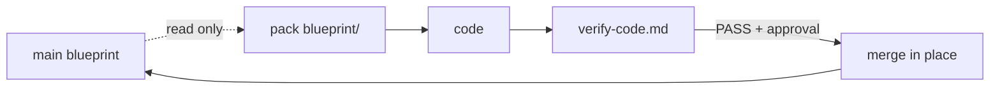

# Concepts and glossary

The vocabulary the engine uses, and the handful of ideas everything else is built on.

## The core concepts

### Engine versus project

The single structural idea in RoyaScaff. There are exactly two zones and they never mix.

| Zone | Shipped | Contains | Changes when |
|------|---------|----------|--------------|
| `royascaff/engine/` | Yes — this is the product | Flows, templates, rules, conventions, the layout contract | You upgrade or customize the engine |
| `project/` | No — generated | Your system's blueprint | Your system changes |

The engine describes **how** to build. The project describes **what** this system is.

### Engine purity

`royascaff/engine/` may never contain system-specific data: no repository names, brand colors, framework versions, product nouns, or paths particular to one system. Those live only in generated `project/profile.md`.

This is enforced by verification check 14 and is the reason you can upgrade the engine with `--force` without losing your blueprint.

### The blueprint

`project/` as a whole — profile, description, plan, actions, rules, status, changes, bugs, and verification reports. It is a *living* blueprint: main describes implemented reality, and `changes/` holds work in flight.

### Main

The blueprint outside `changes/`. Main answers "what is actually built." With two labeled exceptions, main is only updated at merge:

- Initial Build Phase 2 may write full action specs to main with status `planned` — product intent and backlog.
- Phase R may write main with `done`, `partial`, or `planned` reflecting the existing codebase.

Neither exception permits editing main during implementation.

### The rebuild test

The blueprint's acceptance criterion: **after a merge, copying `project/` alone must be enough to understand and rebuild the implemented app.**

If a fact lives only in a chat transcript, a teammate's memory, or the code, the blueprint has failed the test.

### Work pack

A self-contained folder under `project/changes/change-<ID>-<slug>/` holding all in-flight work for one change: the request, the impact analysis, delta specs in `blueprint/`, a per-artifact status dashboard, verification, and eventually a merge report.

Packs are how implementation stays isolated from main and how parallel work stays collision-free.

### The isolation invariant

> During implementation, edit packs — not main. Main receives updates at merge, after verification passes.

Main may be **read** for context at any time. It may not be written while a pack is in flight.



### Delta writing

Packs contain only what the change owns, written as complete **after-state** entries rather than diffs or change logs.

| Layer | In the pack | On merge |
|-------|-------------|----------|
| Data model | After-state of the affected entity plus a short `## Delta` note | In-place update — never an appended change section |
| Services, endpoints, pages | Only artifacts this pack owns, as after-state entries | Rows merged into main module files; `_index.md` refreshed |
| Unchanged main content | Not copied | Untouched |

### Main versus pack versus index

Three layers, each with a defined update trigger.

| Layer | Tracks | Updates |
|-------|--------|---------|
| **Main** — `plan/`, `actions/`, `status.md` | Roadmap plus implemented reality | Phase 0–2 and Phase R write; pack merge updates status |
| **Pack** — `changes/change-<ID>-…/blueprint/` and `status.md` | In-flight specs and per-artifact status | While drafting and implementing |
| **Index** — `changes/change-log.md` | Every pack's `pack-status` and Artifacts done | On every status transition |
| **Build program** — `changes/build-program.md` | Ordered REQ-INIT or REQ-R pack queue | Initial Build 3.0 or Phase R.Done.2 |
| **Bugs index** — `bugs/bug-log.md` | `PENDING`, `DONE`, `ESCALATED` | On every bug transition |

### The traceability chain

```text
Data Model -> Services -> Endpoints -> Pages/Views
```

Generation order runs left to right. Dependency direction runs right to left: pages depend on endpoints, endpoints on services, services on repositories and providers.

Because every artifact has a stable ID, a page can cite `EP-USERS-01` and verification can confirm that endpoint exists with a matching route and method.

### Deviation-only specs

Specs inherit global defaults from [engine/conventions.md](../../engine/conventions.md) and document a value **only when it deviates**. If your auth matches the default JWT bearer model, the endpoint spec does not repeat it — it notes the public routes and custom guards instead.

This keeps specs short enough to actually be read, which is the point.

### Confirmation gates

Fixed stopping points where the flow presents a summary and waits for explicit approval. The engine repeats the same rule at each one: **silence is not confirmation**, and ambiguous replies are not either.

## Glossary

**Acceptance criteria** — numbered, testable outcomes in a change request. Verification checks the code against them.

**Action specs** — the `project/actions/` layer: services, endpoints, pages, and views. The buildable artifacts.

**App key** — the short identifier in the profile's Applications table (`Key` column). It becomes the `target-app` value in change requests and the `project/actions/<key>/` folder name.

**Artifact** — a single buildable unit: one service, endpoint, page, or view. Each has an ID and a status.

**Blocked** — a pack whose `depends-on` is not yet `verified` or `merged`. The flow stops rather than building on an unmerged assumption.

**Bootstrap gate** — the check run before any phase that writes blueprint files. Creates the root skeleton if `project/` is missing; never seeds placeholder READMEs.

**Build program** — `project/changes/build-program.md`. The ordered queue of REQ-INIT or REQ-R packs, with progress and a "Next pack" pointer.

**Change log** — `project/changes/change-log.md`. The live registry of every pack and its `pack-status`. Read first when resuming.

**Change request** — `change-request.md` in a pack. Metadata, scope, description, and acceptance criteria for one change.

**Change type** — the classification in a change request: `new-feature`, `new-module`, `new-app`, `modify-feature`, `modify-endpoint`, `modify-page`, `modify-service`, `modify-data-model`, `refactor`, `bug-fix`, `polish`, `general`.

**Deferred** — an artifact intentionally postponed. Always requires a written reason, and may never be silently deleted.

**Dependency gate** — the check that a pack's `depends-on` is satisfied before implementation. Runs at pack creation and again before Step 5.4.

**Drift** — divergence between the blueprint and the code. Detected by verification checks and, in Phase R, by the drift report.

**Drift report** — `project/verify/reverse-engineer-report.md`. Phase R's output, with an overall status of `CLEAN`, `DRIFT DETECTED`, or `SIGNIFICANT DRIFT`.

**Escalated** — a bug that turned out to need blueprint changes and became a change pack. Its bug-log row links to the pack.

**External service** — a service that wraps a third-party API or SDK. Contrast with internal.

**Fast-track** — the compressed change-mode path (FT-5.0 to FT-5.3), available when all six criteria hold. Same isolation, fewer steps.

**Impact analysis** — `impact.md` in a pack. Code reconnaissance, ripple map, reuse opportunities, risk, and the exact files to be created or modified.

**Implementer load set** — the fixed, small set of files needed to implement a pack: `change-request.md`, `blueprint/`, `impact.md`, `status.md`.

**Index registry** — an `_index.md` in a spec subdirectory. Lists module files with rolled-up status and `Done/Total`. The routing map a reader loads first.

**Internal service** — a service owning business logic and using repositories. Contrast with external.

**Merge report** — `merge-report.md` in a pack. Records the merged date, verifier, main files updated, what was skipped, and post-merge checks.

**Module** — a named grouping of business capability. Defined in `project/plan/modules.md` with scope, entities, dependencies, and features.

**Pack ID** — the local datetime `YYYYMMDD-HHMMSS` minted at pack creation. Never a sequential counter. Same-second collisions append four hex characters.

**Pack status** — a pack's lifecycle state: `drafted`, `in-progress`, `verified`, `merged`, `cancelled`, or `blocked`.

**Partial** — an artifact whose code exists but is incomplete: missing methods, states, validation, or wiring.

**Planned** — an artifact specced with no code yet. The default on creation.

**Polish** — Phase P. Visual, style, copy, spacing, and layout changes only. Hard-forbidden from touching data, endpoints, services, auth, or business rules.

**Profile** — `project/profile.md`. The system identity: applications, repositories, tech stack, brand tokens, environments, integrations. The only place system-specific facts may live.

**REQ-INIT** — the `request-id` for the build program created by Initial Build Step 3.0, slicing Phase 2's planned main into ordered packs.

**REQ-R** — the `request-id` for the build program created by Phase R.Done.2, covering gaps and drift after reverse-engineering.

**Request ID** — a shared identifier across packs that implement one feature (`REQ-7`). Filter the change-log by it to see the whole feature.

**Rollup** — the per-module status computed from its artifacts, shown in `_index.md`. All `done` gives `done`; any `partial` or a mix gives `partial`; all `planned` gives `planned`; all remaining work `deferred` gives `deferred`.

**Skills** — the Cursor slash commands in `.cursor/skills/`. Thin entry points that load the matching engine flow.

**Status dashboard** — `project/status.md`. The system-wide view: per-app snapshot, by module, In Progress, Next Up, Deferred.

**Target app** — the app key a change applies to, resolved against the profile. May also be `backend-only`, `all-apps`, or `new-[name]`.

**Verification report** — `project/verify/verification-report.md`. Initial Build Phase 4's system-level output, `PASS` or `ISSUES FOUND`.

**Verify code** — `verify-code.md` in a pack. The scoped, per-pack verification whose PASS is required before merging.

**Visibility** — a feature's tag in `modules.md`: `frontend`, `backend-only`, or `both`.

## Related

- [Project layout](02-project-layout.md)
- [Status and IDs](03-status-and-ids.md)
- [What is RoyaScaff](../overview/01-what-is-royascaff.md)
- [Conventions](04-conventions.md)
