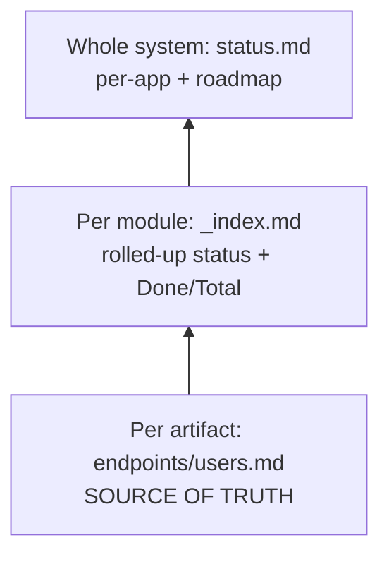
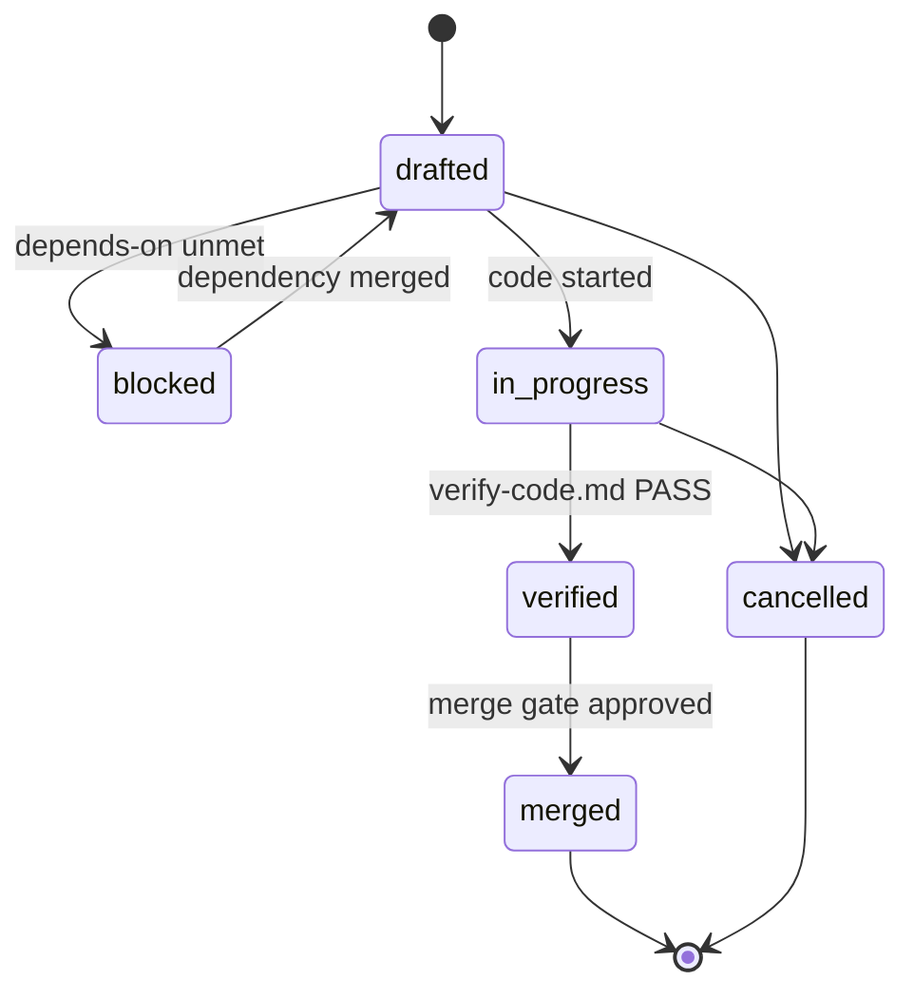

# Status and IDs

Every buildable artifact carries a status, and every artifact, pack, and bug carries an ID. Together they are what let a model — or a person — resume work without re-discovering the whole codebase.

Sources: [engine/conventions.md](../../engine/conventions.md) and [engine/project-layout.md](../../engine/project-layout.md).

## Artifact status

Every service, endpoint, page, and view carries one of four statuses, so any reader can tell at a glance what is built, what is half-built, what is only planned, and what was deliberately postponed.

| Status | Meaning | When to use |
|--------|---------|-------------|
| `planned` | Specced in the blueprint, **no code yet** | Designed but implementation hasn't started |
| `partial` | **Code exists but is incomplete** — missing methods, states, validation, or endpoints wired | Work started and paused, or only part of the spec is implemented |
| `done` | **Implemented and verified** against its spec | Code exists, compiles, and matches the spec |
| `deferred` | **Intentionally postponed** | A decision was made to skip this for now — **must include a reason** in Notes |

### Rules

- **Default on creation is `planned`.** A spec written before code always starts `planned`.
- **`deferred` always needs a reason** — `deferred: post-MVP`, `deferred: waiting on payment provider`. Without a reason, use `planned`.
- **Never delete a `deferred` or `planned` artifact silently.** It is the record of unfinished work, and it leaves only via an explicit change or bug fix.
- Status is **maintained in place** next to the spec. It is never tracked only in a separate log.

### Where status lives



| Level | File | Role |
|-------|------|------|
| Per artifact | `endpoints/<module>.md`, `services/<module>.md`, `pages/<module>.md`, `views/<module>.md` | **Source of truth** |
| Per module | Each subdirectory's `_index.md` | Fast scan map: rolled-up status plus `Done/Total` |
| Whole system | `project/status.md` | Bird's-eye view: per-app snapshot and roadmap |

`project/status.md` and each `_index.md` are **summaries**. They must always agree with the per-artifact status in the main spec files.

### Rollup rule

The per-module status in `_index.md` is computed, not chosen:

| Condition | Module status |
|-----------|---------------|
| All artifacts `done` | `done` |
| Any artifact `partial`, or a mix of `done` and `planned` | `partial` |
| No code started — all `planned` | `planned` |
| All remaining work is `deferred` | `deferred` |

`Done/Total` counts `done` artifacts against the total specced. Deferred artifacts count as not-done.

### Status by phase

| Phase | Status written |
|-------|----------------|
| Initial Build Phase 2 | Everything starts `planned` — no code exists |
| Initial Build Phase 3.x merge | Owned artifacts flip to `done`, `partial`, or `deferred` |
| Phase R.1 | `done` or `partial` only — never `planned`, because if there is no code there is no artifact to extract |
| Phase 5 pack drafting | New artifacts start `planned` **inside the pack** |
| Phase 5 merge | Main artifact statuses updated to reflect the code |

## Pack status

A pack's lifecycle state, tracked in three places that must always agree: the change-log row, the `pack-status` in `change-request.md`, and the pack's `status.md`.

| Status | Meaning |
|--------|---------|
| `drafted` | Request and pack blueprint written; code not started |
| `in-progress` | Implementation started |
| `verified` | `verify-code.md` shows overall PASS; not yet merged |
| `merged` | Main blueprint updated; the pack becomes a historical record |
| `cancelled` | Abandoned; main was never touched |
| `blocked` | Waiting on `depends-on` parts not yet `verified` or `merged` |



### Sync rules

- Creating a change folder adds the row to `change-log.md` immediately, as `drafted`.
- Every transition updates the **same row** — never leave the index stale relative to the pack.
- Mirror the pack's `Done/Total` from `blueprint/_index.md` into the change-log's Artifacts done column.
- Never edit main plan or actions for in-flight work — use the pack `blueprint/`.
- Resume from `change-log.md`, plus `build-program.md` if present. Merged overview comes from `project/status.md`.

## Bug status

Tracked in `project/bugs/bug-log.md`.

| Status | Meaning |
|--------|---------|
| `PENDING` | Path B direct fix, reported and not yet resolved |
| `DONE` | Fixed and confirmed. For Path A, set after the change pack merges |
| `ESCALATED` | Routed to a change pack; the row links to the pack folder and may note its `pack-status` |

## Artifact ID scheme

IDs are stable cross-references across services, endpoints, and pages or views.

| Artifact | Pattern | Example |
|----------|---------|---------|
| Service | `SVC-<MODULE>-NN` | `SVC-USERS-01` |
| Endpoint | `EP-<MODULE>-NN` | `EP-USERS-01` |
| Page | `PG-<MODULE>-NN` | `PG-USERS-01` |
| View | `VW-<MODULE>-NN` | `VW-USERS-01` |
| Custom rule | `RULE-<AREA>-NN` | `RULE-AUTH-01` |

- `<MODULE>` is a short uppercase token from the module name: `Auth` becomes `AUTH`, `Users` becomes `USERS`.
- `NN` is a two-digit sequence **per module file**, starting at `01`.
- **IDs never reuse a number after deletion.** Append the next free number instead.
- Client specs reference endpoints by these IDs, for example `→ EP-USERS-01`.

The no-reuse rule matters: it means an ID in an old change request or merge report always refers to the same artifact, even if that artifact was later removed.

## Pack and bug IDs

> **Never use sequential counters** (`001`, `002`, `change-02`, `bug-01`). Parallel branches allocate the same next number and collide on merge.

`<ID>` is the **local datetime** `YYYYMMDD-HHMMSS` at creation time.

| Kind | Pattern | Example |
|------|---------|---------|
| Change, polish, escalated bug pack | `change-<ID>[-<kind>]-<slug>/` | `change-20260729-125201-billing-api/` |
| Init pack | `change-<ID>-init-<slug>/` | `change-20260729-125205-init-auth/` |
| Reverse-engineer pack | `change-<ID>-r-<slug>/` | `change-20260729-125210-r-billing-gaps/` |
| Direct bug report | `bug-<ID>-<slug>.md` | `bug-20260729-130044-login-500.md` |

Why datetime rather than a short hash: it is lexicographically sortable, human-readable, and unique across branches without any shared counter.

### Generation rules

1. Compute `<ID>` from the machine's local clock.
2. On a same-second collision, including batch creation, append `-` plus four lowercase hex characters: `20260729-125201-a3f2`.
3. Each pack or bug created in one session gets its own unique ID — never reuse.
4. **Never** read a "next number" from the change-log or bug-log. Those counters were removed on purpose.
5. `depends-on` and `blocks` reference a peer by folder stem or full name.
6. **Legacy:** existing `change-<NNN>-*` and `bug-<NNN>-*` folders stay valid. Do not renumber.

## Request IDs and parts

Multi-pack features share a `request-id` in their change-request metadata.

```md
- **request-id**: REQ-7
- **part**: 2/3
- **depends-on**: change-20260804-090012
- **blocks**: change-20260804-093000
```

| Value | Meaning |
|-------|---------|
| `REQ-N` | A user-created feature spanning multiple packs |
| `REQ-INIT` | The greenfield build program, created by Initial Build Step 3.0 |
| `REQ-R` | The gaps-and-drift program, created by Phase R.Done.2 |

Filter the change-log by `request-id` to see an entire feature across its parts.

## Naming conventions

These are the defaults specs and code inherit from [engine/conventions.md](../../engine/conventions.md).

| Item | Convention |
|------|-----------|
| Entities | PascalCase singular — `User`, `Project`, `Dashboard` |
| Collections and tables | lowercase plural — `users`, `projects`, `dashboards` |
| DTOs | PascalCase plus `Dto` — `CreateProjectDto`, `AuthResponseDto` |
| Services | PascalCase plus `Service` — `AuthService`, `ProjectService` |
| Controllers | PascalCase plus `Controller` — `AuthController` |
| Guards | PascalCase plus `Guard` — `JwtAuthGuard`, `WorkspaceRoleGuard` |
| Modules | PascalCase plus `Module` — `AuthModule` |
| Frontend services | PascalCase plus `Service` — `AuthService`, `ProjectApiService` |
| Frontend components | PascalCase plus `Component` — `LoginFormComponent` |

## Related

- [Conventions](04-conventions.md)
- [Project layout](02-project-layout.md)
- [Verification checks](08-verification-checks.md)
- [Working as a team](../guides/05-working-as-a-team.md)
