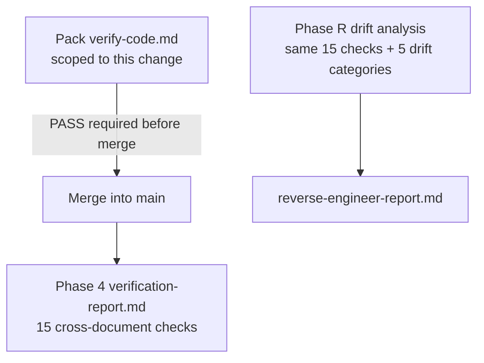

# Verification checks

The engine verifies at two levels: **per pack**, scoped to what one change owns, and **system-wide**, across the whole blueprint and codebase.



## Per-pack verification

**File:** `verify-code.md` inside the pack · **Template:** `verification-template.md` · **Run at:** Phase 5 Step 5.5, Phase P step P.4, and inside each Phase 3.x pack

Five checks, all scoped to what the pack owns:

1. Endpoints in code match the pack
2. Pages and views in code match the pack
3. Backend layering, frontend isolation, and auth are as declared in the pack
4. Acceptance criteria are met, or explicitly deferred in the pack
5. UI screenshots, if any were provided

**PASS** sets `pack-status: verified` in the change-log, the change request, and the pack's status file. It does **not** merge — merging is a separate gate.

**FAIL** means the pack cannot merge. Fix the code and re-verify. If the blueprint itself was wrong, say so explicitly rather than quietly editing it to match the code.

The verification guide also describes an optional pre-build `verify-plan.md`, written during Step 5.3 when a pack is complex — three or more blueprint layers, or new entities.

## The 15 cross-document consistency checks

Run at Initial Build Phase 4 and, adapted, at Phase R.3.1.

### 1. Module-to-feature coverage

Every module in `modules.md` has features, and no features exist outside a module.

### 2. Feature-to-service coverage

Every backend-relevant feature has at least one internal service. Every integration has an external service. No orphaned services.

### 3. Feature-to-endpoint coverage

Every backend-relevant feature has at least one endpoint. No orphaned endpoints.

### 4. Endpoint-to-service linking

Every endpoint declares the services it calls, those services exist, and there are no direct repository or provider references from an endpoint.

### 5. Feature-to-page coverage

Every frontend-visible feature has at least one page. No orphaned pages.

### 6. Entity consistency

Every entity referenced in services, endpoints, or pages is defined in `data-model.md`. All DTOs exist or are derivable from it.

### 7. Endpoint-to-page linking

Every endpoint listed in a page's "Backend Endpoints Used" exists in `endpoints/`, with matching routes and methods.

This is the check the ID scheme exists to make possible.

### 8. Auth coverage

Every protected endpoint declares its auth. Every protected page declares its route guard. The two are consistent across backend and frontend. In Phase R, consistency is also checked against `roles-and-authorization.md`.

### 9. Custom rules compliance

The constraints in `project/rules.md` are reflected in the services, endpoints, pages, and code.

### 10. UI state coverage

Every data-driven page documents loading, empty, error, and success. Forms have validation. Lists have pagination and empty states.

### 11. Path and naming consistency

No dead or stale paths. Names are consistent across all files — and in Phase R, across the `_index.md` registries too.

### 12. Code layering compliance

Backend follows `controller -> service -> repository`. Frontend follows `page -> frontend service -> endpoint`. No business logic in controllers or components. Integration providers are isolated.

### 13. Frontend third-party isolation

Every HTTP call targets the configured `apiUrl`. No hardcoded external URLs. No direct third-party calls from the frontend.

**Zero tolerance.** This is the only check the engine labels that way, because a single direct call from the UI defeats the whole layering model and tends to leak credentials into the bundle.

### 14. Self-contained blueprint

No file in `royascaff/engine/` contains system-specific data. `project/` docs reference only other `project/` docs and `royascaff/engine/rules/`. Copying `project/` alone is enough to rebuild.

This is the rebuild test and engine purity, checked mechanically.

### 15. Build status coverage

Every service, endpoint, page, and view carries a status. Each `_index.md` rollup and `Done/Total` matches the per-artifact statuses. Anything not `done` is `planned`, `partial`, or `deferred` with a reason.

> Code that exists but is spec'd as `planned` is a drift — fix the status.

## Phase 4 verification report

**File:** `project/verify/verification-report.md`

**When to run:** the build program is complete, meaning all non-deferred packs are `merged`, or the user requests a mid-stream audit. Each pack already carries its own scoped verification; Phase 4 is the system-level gate.

Structure:

```markdown
# Verification Report

## Status: [PASS | ISSUES FOUND]

## Module Coverage: [✓ | ✗]
## Feature Coverage: [✓ | ✗]
## Service Coverage: [✓ | ✗]
## Endpoint-Service Linking: [✓ | ✗]
## Entity Consistency: [✓ | ✗]
## Endpoint-Page Linking: [✓ | ✗]
## Auth Coverage: [✓ | ✗]
## Custom Rules Compliance: [✓ | ✗]
## UI State Coverage: [✓ | ✗]
## Path Consistency: [✓ | ✗]
## Code Layering: [✓ | ✗]
## Frontend Third-Party Isolation: [✓ | ✗]
## Self-Contained Blueprint: [✓ | ✗]
## Build Status Coverage: [✓ | ✗]

## Summary
[Overall assessment and recommended fixes]
```

| Overall status | Meaning |
|----------------|---------|
| `PASS` | All checks pass; blueprint and code are consistent |
| `ISSUES FOUND` | Gaps are listed, with recommended fixes in the summary |

Phase 4 also produces `project/status.md` via Step 4.1, rolling per-artifact statuses and `_index.md` counts into the system dashboard.

## Phase R drift report

**File:** `project/verify/reverse-engineer-report.md`

Phase R does not run the standard verification, because there is no greenfield spec to check against. It runs the same 15 consistency checks with a shifted question — *does the generated plan accurately reflect the code?* — and then adds five drift scans.

| Category | What it finds |
|----------|---------------|
| **Undocumented code** | Controllers not in `endpoints/`, services not in `services/`, schemas not in `data-model.md`, pages not in `pages/`, unaccounted utilities, middleware, guards, pipes, interceptors |
| **Incomplete features** | `TODO`, `NotImplementedException`, empty service methods, placeholder pages, unused imports, dead code paths |
| **Architecture violations** | Controllers calling repositories directly, frontend pages making direct HTTP calls, frontend calling external APIs, business logic in controllers, circular dependencies |
| **Stale or dead code** | Unused exports, dead routes, stale schema fields, commented-out blocks, deprecated endpoints |
| **Configuration drift** | Env vars referenced but missing, defined but unused, hardcoded secrets, mismatches across environments |

| Overall status | Meaning |
|----------------|---------|
| `CLEAN` | Minimal or no drift |
| `DRIFT DETECTED` | Some discrepancies |
| `SIGNIFICANT DRIFT` | Major gaps |

The report has nine sections: cross-document consistency, documented and implemented counts, undocumented code, incomplete features, architecture violations with severity from `CRITICAL` to `LOW`, stale and dead code, configuration drift, a reconciliation summary, and recommended next steps. Details are recorded only for failing checks.

### Reconciliation

Each drift item gets exactly one action:

| Action | Effect |
|--------|--------|
| **Add to plan** | The code is valid — the blueprint is updated immediately, including the `_index.md` registries |
| **Fix in code** | Violates the engine rules — becomes a Phase 5 change request |
| **Remove from code** | Dead or stale — becomes a Phase 5 change request |
| **Mark as tech debt** | Known but not urgent — documented in the report only |

Items marked for fixing or removal become REQ-R packs at Step R.Done.2. They are not implemented inside Phase R.

## Where each verification artifact lives

| Artifact | Path | Produced by |
|----------|------|-------------|
| Pack verification | `changes/change-<ID>-<slug>/verify-code.md` | Phase 5 Step 5.5, P.4, 3.x |
| Optional pack plan check | `changes/change-<ID>-<slug>/verify-plan.md` | Phase 5 Step 5.3 |
| System verification | `verify/verification-report.md` | Phase 4 |
| Drift report | `verify/reverse-engineer-report.md` | Phase R.3.2 |
| Merge record | `changes/change-<ID>-<slug>/merge-report.md` | Phase 5 Step 5.6, P.5 |

## Related

- [Engine rules](06-engine-rules.md) — the standard checks 12 and 13 enforce
- [Status and IDs](03-status-and-ids.md) — what check 15 tests
- [Initial build](../flows/01-initial-build.md) — Phase 4
- [Reverse engineer](../flows/05-reverse-engineer.md) — Phase R.3
