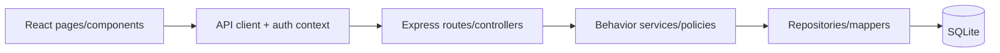
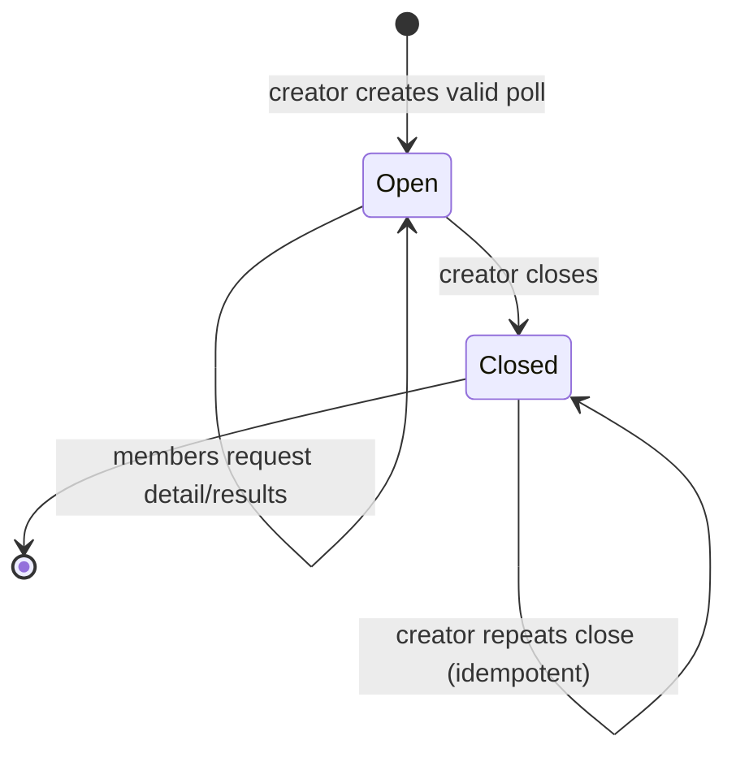

# Generated Context Pack

> Generated view. Do not edit or treat as canonical.

- Manifest: `CTX-POLLPULSE-VOTE-001`
- Role: verifier
- Project hash: `ac409cf54f92a7b9e96550f0f631e70b9f9310284e7c384d2c0f422eea889902`
- Root IDs: `REQ-VOTE-001`, `REQ-VOTE-002`
- Included IDs: `REQ-VOTE-001`, `REQ-VOTE-002`, `INV-VOTE-001`, `INV-VOTE-002`, `WF-POLLS-001`, `CTR-POLLS-VOTE-001`, `CTR-POLLS-DETAIL-001`, `EP-POLLS-04`, `SVC-POLLS-01`, `SVC-POLLS-03`, `DATA-VOTES-001`, `TEST-VOTE-001`, `RISK-TEST-001`
- Overflow policy: fail-and-split

## Document · profile.md

# PollPulse Project Profile

## Applications

| Key | Type | Framework/runtime | Source | Authority |
|-----|------|-------------------|--------|-----------|
| api | HTTP API | Node.js 22.5+, Express 4 | `../example-v1.2/apps/api` | business rules and persistence |
| web | browser UI | React 18, Vite 5, Tailwind 3 | `../example-v1.2/apps/web` | interaction and presentation |

## Data and authentication

- SQLite through built-in `node:sqlite`; runtime file `apps/api/data/pollpulse.db` is generated and not present in source.
- Bearer JWT expires in 7 days; API secret from `JWT_SECRET` with an unsafe development fallback.
- Web stores JWT in `localStorage`; this is recorded as accepted migration debt, not a recommended engine default.

## Commands observed

| App | Purpose | Command |
|-----|---------|---------|
| api | start | `npm start` |
| api | development | `npm run dev` |
| web | development | `npm run dev` |
| web | build | `npm run build` |

Neither package declares automated tests, lint, typecheck, security scan, or deploy commands.

## Environments and configuration

- API: `PORT`, `JWT_SECRET`, `CORS_ORIGIN`; default port 3001.
- Web: `VITE_API_URL`; default `http://localhost:3001`; dev port 5173.
- Documented environments: development and production. No production deployment manifest is present.

## Integrations and exclusions

- No external product integrations.
- `node_modules/`, generated build output, and runtime SQLite data are excluded from source inventory.
- `package-lock.json` is classified as generated dependency lock state in the code map.

## Brand

Indigo primary `#6366f1`, violet secondary `#8b5cf6`, slate background/text, Inter/system sans, medium radius.
## Document · knowledge/04-design/architecture/overview.md

# Solution Architecture

PollPulse is a two-application local/demo system: a React SPA consumes an Express JSON API; the API owns a single SQLite database.



Allowed directions:

- UI page/component → web API/auth client → HTTP action.
- Express route/controller → behavior service → repository → SQLite.
- Shared error/auth middleware may be used by route boundaries.
- Business voting/close/cardinality rules belong in `SVC-POLLS-01`; database uniqueness is defense-in-depth.

### ARCH-POLLPULSE-001 · Two-app modular layered boundary

- **Kind:** architecture-rule
- **Knowledge status:** approved
- **Implementation status:** implemented
- **Owner:** pollpulse-demo
- **Constrained by:** `NFR-MAINT-001`
- **Realized by:** `ADR-POLLPULSE-001`, `CMP-WEB-API-001`, `CMP-API-BOOT-001`, `SVC-AUTH-01`, `SVC-POLLS-01`
- **Verified by:** `TEST-ARCH-001`

The browser owns interaction/presentation and never SQL/business authority; API behavior services own rules; repositories own persistence mapping. The small demo does not use dependency injection or interface ports.

## Decisions

- [Web/API separation](../../knowledge/04-design/architecture/decisions/ADR-001-web-api.md): `ADR-POLLPULSE-001`.
- [SQLite persistence](../../knowledge/04-design/architecture/decisions/ADR-002-sqlite.md): `ADR-POLLPULSE-002`.
- [JWT browser session](../../knowledge/04-design/architecture/decisions/ADR-003-jwt-session.md): `ADR-POLLPULSE-003` with known debt.

## Runtime and limitations

Single API process and browser dev/static build; no queue/cache/external integration/deployment topology. SQLite schema creation is inline at startup rather than versioned migrations. Observability is console error plus health endpoint only.
## Document · knowledge/05-implementation/code-map/api.md

# API Code Map

| Path | Kind | Blueprint owner | Relationship | Runtime | Status | Notes |
|------|------|-----------------|--------------|---------|--------|-------|
| `../example-v1.2/apps/api/.env.example` | configuration example | `CMP-API-BOOT-001` | defines | no | implemented | PORT, JWT secret, CORS origin |
| `../example-v1.2/apps/api/package.json` | package config | `CMP-API-BOOT-001` | configures | no | implemented | runtime/scripts/dependencies |
| `../example-v1.2/apps/api/package-lock.json` | dependency lock | `CMP-API-BOOT-001` | generated | no | implemented | npm lock state |
| `../example-v1.2/apps/api/src/config.js` | runtime config | `CMP-API-BOOT-001` | supports | yes | implemented | env/defaults |
| `../example-v1.2/apps/api/src/database.js` | persistence/bootstrap | `SVC-FOUND-01` | implements | yes | implemented | connection + DDL |
| `../example-v1.2/apps/api/src/index.js` | runtime entry | `CMP-API-BOOT-001` | implements | yes | implemented | Express composition/listener |
| `../example-v1.2/apps/api/src/common/errors.js` | error boundary | `CMP-API-ERROR-001` | implements | yes | implemented | AppError + handler |
| `../example-v1.2/apps/api/src/common/middleware/auth.js` | auth middleware | `CMP-API-AUTH-MW-001` | implements | yes | implemented | token/member resolution |
| `../example-v1.2/apps/api/src/modules/auth/auth.controller.js` | controller | `CMP-AUTH-CTRL-001` | implements | yes | implemented | register/login/me |
| `../example-v1.2/apps/api/src/modules/auth/auth.repository.js` | repository/mapper | `SVC-AUTH-02` | implements | yes | implemented | user SQL + safe DTO |
| `../example-v1.2/apps/api/src/modules/auth/auth.routes.js` | router | `CMP-AUTH-ROUTES-001` | implements | yes | implemented | auth route table |
| `../example-v1.2/apps/api/src/modules/auth/auth.service.js` | application service | `SVC-AUTH-01` | implements | yes | implemented | credential/session rules |
| `../example-v1.2/apps/api/src/modules/polls/polls.controller.js` | controller | `CMP-POLLS-CTRL-001` | implements | yes | implemented | poll HTTP mapping |
| `../example-v1.2/apps/api/src/modules/polls/polls.repository.js` | repository/mapper | `SVC-POLLS-02` | implements | yes | implemented | poll SQL/results mapping |
| `../example-v1.2/apps/api/src/modules/polls/polls.routes.js` | router | `CMP-POLLS-ROUTES-001` | implements | yes | implemented | protected poll routes |
| `../example-v1.2/apps/api/src/modules/polls/polls.service.js` | application service | `SVC-POLLS-01` | implements | yes | implemented | poll/vote/close rules |
| `../example-v1.2/apps/api/src/modules/polls/votes.repository.js` | repository | `SVC-POLLS-03` | implements | yes | implemented | vote insert/lookup |

Coverage: 17/17 files under the API source root for configured extensions.
## Artifact · REQ-VOTE-001

_Source: `knowledge/02-requirements/functional.md:112`_

### REQ-VOTE-001 · Cast at most one vote

- **Kind:** requirement
- **Knowledge status:** approved
- **Implementation status:** implemented
- **Owner:** pollpulse-demo
- **Satisfies:** `CAP-VOTING-001`
- **Constrained by:** `INV-VOTE-001`
- **Described by:** `WF-POLLS-001`
- **Realized by:** `EP-POLLS-04`, `PG-POLLS-03`, `SVC-POLLS-01`, `SVC-POLLS-03`
- **Verified by:** `TEST-VOTE-001`

Acceptance: first valid choice persists; another vote by the same member/poll is rejected and the original cannot be changed.
## Artifact · REQ-VOTE-002

_Source: `knowledge/02-requirements/functional.md:126`_

### REQ-VOTE-002 · Accept only an option of an open target poll

- **Kind:** requirement
- **Knowledge status:** approved
- **Implementation status:** implemented
- **Owner:** pollpulse-demo
- **Satisfies:** `CAP-VOTING-001`
- **Constrained by:** `INV-VOTE-002`
- **Realized by:** `EP-POLLS-04`, `SVC-POLLS-01`
- **Verified by:** `TEST-VOTE-001`

Acceptance: closed/missing poll, missing option, or option from a different poll is rejected without a vote.
## Artifact · INV-VOTE-001

_Source: `knowledge/03-domain/model.md:99`_

### INV-VOTE-001 · One permanent vote per member and poll

- **Kind:** invariant
- **Knowledge status:** approved
- **Implementation status:** implemented
- **Owner:** pollpulse-demo
- **Realized by:** `SVC-POLLS-01`, `SVC-POLLS-03`, `DATA-VOTES-001`
- **Verified by:** `TEST-VOTE-001`

At most one vote exists for `(poll, member)` and the system exposes no vote-change operation.
## Artifact · INV-VOTE-002

_Source: `knowledge/03-domain/model.md:110`_

### INV-VOTE-002 · Vote targets a valid option of an open poll

- **Kind:** invariant
- **Knowledge status:** approved
- **Implementation status:** implemented
- **Owner:** pollpulse-demo
- **Realized by:** `SVC-POLLS-01`
- **Verified by:** `TEST-VOTE-001`

Vote option belongs to the target poll and poll status is open when insertion occurs.
## Artifact · WF-POLLS-001

_Source: `knowledge/03-domain/workflows/poll-lifecycle.md:12`_

### WF-POLLS-001 · Create, vote, view results, and close

- **Kind:** workflow
- **Knowledge status:** approved
- **Implementation status:** implemented
- **Owner:** pollpulse-demo
- **Satisfies:** `REQ-POLLS-001`, `REQ-POLLS-003`, `REQ-POLLS-004`, `REQ-VOTE-001`, `REQ-VOTE-002`, `REQ-RESULTS-001`
- **Constrained by:** `INV-POLLS-001`, `INV-POLLS-002`, `INV-POLLS-003`, `INV-VOTE-001`, `INV-VOTE-002`, `INV-RESULTS-001`
- **Realized by:** `SVC-POLLS-01`, `SVC-POLLS-02`, `SVC-POLLS-03`, `PG-POLLS-02`, `PG-POLLS-03`
- **Verified by:** `TEST-POLLS-001`, `TEST-POLLS-002`, `TEST-VOTE-001`, `TEST-RESULTS-001`



```mermaid
sequenceDiagram
    actor Creator
    actor Voter
    participant Web
    participant API
    participant DB
    Creator->>Web: submit poll with 2–5 options
    Web->>API: POST /polls
    API->>DB: transaction: poll + options
    Voter->>API: POST /polls/:id/vote
    API->>DB: check poll, prior vote, option; insert vote
    API-->>Voter: detail with results and userVote
    Creator->>API: POST /polls/:id/close
    API->>DB: verify creator; set closed + closedAt
    API-->>Creator: closed detail
```

Failure outcomes: missing poll 404; closed poll/invalid option 400; duplicate vote 409; non-creator close 403. Vote insertion also relies on database uniqueness for concurrent duplicates.
## Artifact · CTR-POLLS-VOTE-001

_Source: `knowledge/04-design/contracts/polls.md:23`_

### CTR-POLLS-VOTE-001 · Cast vote request

- **Kind:** request-contract
- **Knowledge status:** approved
- **Implementation status:** implemented
- **Owner:** pollpulse-demo
- **Exposes:** `EP-POLLS-04`
- **Maps to:** `CON-VOTE-001`

`{ optionId: string }`; target poll ID is route parameter and authenticated member ID comes from middleware.
## Artifact · CTR-POLLS-DETAIL-001

_Source: `knowledge/04-design/contracts/polls.md:56`_

### CTR-POLLS-DETAIL-001 · Poll detail and results

- **Kind:** response-contract
- **Knowledge status:** approved
- **Implementation status:** implemented
- **Owner:** pollpulse-demo
- **Exposes:** `EP-POLLS-01`, `EP-POLLS-03`, `EP-POLLS-04`, `EP-POLLS-05`
- **Maps to:** `CON-POLL-001`, `CON-OPTION-001`, `CON-VOTE-001`

Poll fields plus `totalVotes`, nullable `userVote: {optionId}`, `isOwner`, and ordered options `{id,label,sortOrder,voteCount,percentage}`.

## Status/error behavior

| Action | Success | Expected errors |
|--------|---------|-----------------|
| create | 201 detail | 400 validation |
| list/detail/vote/close | 200 | 401 auth; 404 missing poll; 400 closed/invalid option; 409 duplicate vote; 403 non-owner close |

All errors use `CTR-ERROR-001`.
## Artifact · EP-POLLS-04

_Source: `knowledge/05-implementation/actions/api.md:106`_

### EP-POLLS-04 · POST /polls/:id/vote

- **Kind:** http-action
- **Knowledge status:** approved
- **Implementation status:** implemented
- **Owner:** pollpulse-demo
- **Satisfies:** `REQ-VOTE-001`, `REQ-VOTE-002`
- **Accepts:** `CTR-POLLS-VOTE-001`
- **Returns:** `CTR-POLLS-DETAIL-001`, `CTR-ERROR-001`
- **Realized by:** `CMP-POLLS-ROUTES-001`, `CMP-POLLS-CTRL-001`, `SVC-POLLS-01`, `SVC-POLLS-03`
- **Verified by:** `TEST-VOTE-001`

Authenticated; success 200; invalid state/option 400; duplicate 409.
## Artifact · SVC-POLLS-01

_Source: `knowledge/05-implementation/components/polls.md:12`_

### SVC-POLLS-01 · Poll behavior service

- **Kind:** application-service
- **Knowledge status:** approved
- **Implementation status:** implemented
- **Owner:** pollpulse-demo
- **Implements:** `WF-POLLS-001`, `INV-POLLS-001`, `INV-POLLS-002`, `INV-POLLS-003`, `INV-VOTE-001`, `INV-VOTE-002`
- **Depends on:** `SVC-POLLS-02`, `SVC-POLLS-03`
- **Verified by:** `TEST-POLLS-001`, `TEST-POLLS-002`, `TEST-VOTE-001`

Creates/lists/loads polls, validates/casts vote, authorizes/idempotently closes, and assembles detail through repositories.
## Artifact · SVC-POLLS-03

_Source: `knowledge/05-implementation/components/polls.md:36`_

### SVC-POLLS-03 · Vote repository

- **Kind:** repository
- **Knowledge status:** approved
- **Implementation status:** implemented
- **Owner:** pollpulse-demo
- **Implements:** `DATA-VOTES-001`, `INV-VOTE-001`
- **Depends on:** `SVC-FOUND-01`
- **Verified by:** `TEST-VOTE-001`

Creates vote and finds prior member vote for a poll.
## Artifact · DATA-VOTES-001

_Source: `knowledge/04-design/data/model.md:51`_

### DATA-VOTES-001 · votes table

- **Kind:** persistence-model
- **Knowledge status:** approved
- **Implementation status:** implemented
- **Owner:** pollpulse-demo
- **Maps to:** `CON-VOTE-001`, `SVC-POLLS-03`
- **Constrained by:** `INV-VOTE-001`, `INV-VOTE-002`

`id`, poll/option/user FKs, created time; unique `(poll_id,user_id)` plus poll index. The database does not independently assert option belongs to poll; service validation supplies that invariant.

## Lifecycle and migration

DDL runs idempotently at API startup. Poll+options creation is an explicit immediate transaction. No versioned migration, backup/restore, retention, or delete feature exists. Runtime database file is excluded from source control/inventory.
## Artifact · TEST-VOTE-001

_Source: `knowledge/05-implementation/tests/catalog.md:53`_

### TEST-VOTE-001 · Single valid vote under failures and concurrency

- **Kind:** integration-test
- **Knowledge status:** approved
- **Implementation status:** planned
- **Owner:** pollpulse-demo
- **Satisfies:** `REQ-VOTE-001`, `REQ-VOTE-002`, `INV-VOTE-001`, `INV-VOTE-002`

Required first/duplicate/concurrent/closed/missing/wrong-option cases. No test script/file exists.
## Artifact · RISK-TEST-001

_Source: `knowledge/06-quality/accepted-risks.md:32`_

### RISK-TEST-001 · v1.2 verification lacks executable evidence

- **Kind:** quality-debt
- **Knowledge status:** approved
- **Implementation status:** not-applicable
- **Owner:** pollpulse-demo
- **Affects:** `QUAL-POLLPULSE-001`, `TEST-FOUND-001`, `TEST-AUTH-001`, `TEST-POLLS-001`, `TEST-POLLS-002`, `TEST-VOTE-001`, `TEST-RESULTS-001`, `TEST-SEC-001`, `TEST-PERF-001`, `TEST-UX-001`

Risk: regressions or misunderstood behavior can pass a prose checklist. v1.3 maps behavior to implemented, not verified. Remediation: add isolated API unit/integration tests, web component/E2E/accessibility tests, and evidence capture.

## Manifest source

`contexts/manifests/poll-voting.manifest.md`
