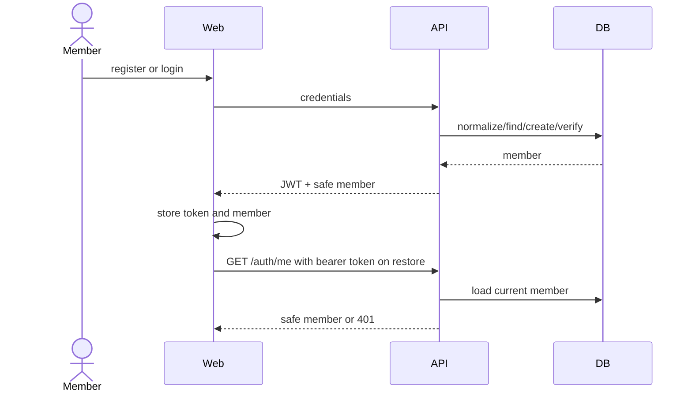

# Authentication Workflow

### WF-AUTH-001 · Register, authenticate, and restore session

- **Kind:** workflow
- **Knowledge status:** approved
- **Implementation status:** implemented
- **Owner:** pollpulse-demo
- **Satisfies:** `REQ-AUTH-001`, `REQ-AUTH-002`, `REQ-AUTH-003`
- **Constrained by:** `INV-AUTH-001`, `NFR-SEC-001`
- **Realized by:** `EP-AUTH-01`, `EP-AUTH-02`, `EP-AUTH-03`, `CMP-WEB-AUTH-001`
- **Verified by:** `TEST-AUTH-001`, `TEST-SEC-001`

Failures: invalid registration returns validation/conflict; invalid credentials are generic; missing/invalid token returns 401 and the web clears it. Token expiry is fixed at 7 days; no refresh flow exists.

