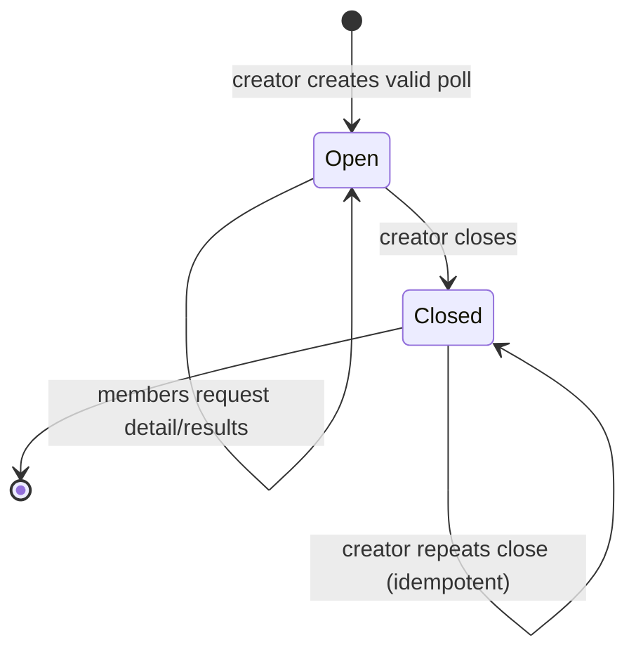

# Poll Lifecycle Workflow

### WF-POLLS-001 · Create, vote, view results, and close

- **Kind:** workflow
- **Knowledge status:** approved
- **Implementation status:** implemented
- **Owner:** pollpulse-demo
- **Satisfies:** `REQ-POLLS-001`, `REQ-POLLS-003`, `REQ-POLLS-004`, `REQ-VOTE-001`, `REQ-VOTE-002`, `REQ-RESULTS-001`
- **Constrained by:** `INV-POLLS-001`, `INV-POLLS-002`, `INV-POLLS-003`, `INV-VOTE-001`, `INV-VOTE-002`, `INV-RESULTS-001`
- **Realized by:** `SVC-POLLS-01`, `SVC-POLLS-02`, `SVC-POLLS-03`, `PG-POLLS-02`, `PG-POLLS-03`
- **Verified by:** `TEST-POLLS-001`, `TEST-POLLS-002`, `TEST-VOTE-001`, `TEST-RESULTS-001`



```mermaid
sequenceDiagram
    actor Creator
    actor Voter
    participant Web
    participant API
    participant DB
    Creator->>Web: submit poll with 2–5 options
    Web->>API: POST /polls
    API->>DB: transaction: poll + options
    Voter->>API: POST /polls/:id/vote
    API->>DB: check poll, prior vote, option; insert vote
    API-->>Voter: detail with results and userVote
    Creator->>API: POST /polls/:id/close
    API->>DB: verify creator; set closed + closedAt
    API-->>Creator: closed detail
```

Failure outcomes: missing poll 404; closed poll/invalid option 400; duplicate vote 409; non-creator close 403. Vote insertion also relies on database uniqueness for concurrent duplicates.

