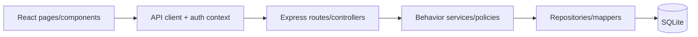

---

## document_id: DOC-POLLPULSE-ARCHITECTURE
title: PollPulse solution architecture
layer: design
schema_version: 1
document_status: approved
owners: [pollpulse-demo]

# Solution Architecture

PollPulse is a two-application local/demo system: a React SPA consumes an Express JSON API; the API owns a single SQLite database.

Allowed directions:

- UI page/component → web API/auth client → HTTP action.
- Express route/controller → behavior service → repository → SQLite.
- Shared error/auth middleware may be used by route boundaries.
- Business voting/close/cardinality rules belong in `SVC-POLLS-01`; database uniqueness is defense-in-depth.

### ARCH-POLLPULSE-001 · Two-app modular layered boundary

- **Kind:** architecture-rule
- **Knowledge status:** approved
- **Implementation status:** implemented
- **Owner:** pollpulse-demo
- **Constrained by:** `NFR-MAINT-001`
- **Realized by:** `ADR-POLLPULSE-001`, `CMP-WEB-API-001`, `CMP-API-BOOT-001`, `SVC-AUTH-01`, `SVC-POLLS-01`
- **Verified by:** `TEST-ARCH-001`

The browser owns interaction/presentation and never SQL/business authority; API behavior services own rules; repositories own persistence mapping. The small demo does not use dependency injection or interface ports.

## Decisions

- [Web/API separation](decisions/ADR-001-web-api.md): `ADR-POLLPULSE-001`.
- [SQLite persistence](decisions/ADR-002-sqlite.md): `ADR-POLLPULSE-002`.
- [JWT browser session](decisions/ADR-003-jwt-session.md): `ADR-POLLPULSE-003` with known debt.

## Runtime and limitations

Single API process and browser dev/static build; no queue/cache/external integration/deployment topology. SQLite schema creation is inline at startup rather than versioned migrations. Observability is console error plus health endpoint only.