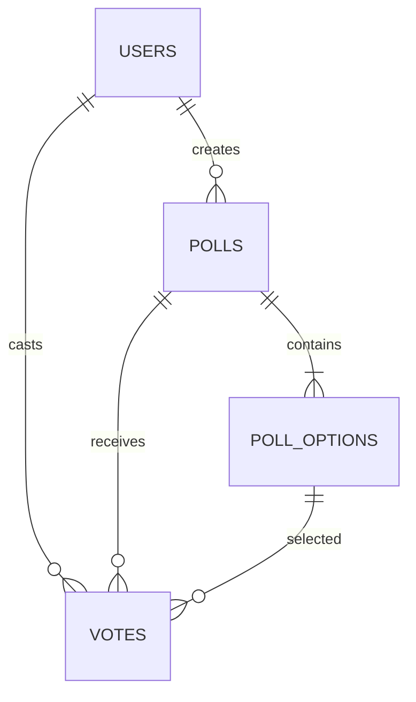

# Persistence Data Model

### DATA-USERS-001 · users table

- **Kind:** persistence-model
- **Knowledge status:** approved
- **Implementation status:** implemented
- **Owner:** pollpulse-demo
- **Maps to:** `CON-USER-001`, `SVC-AUTH-02`

`id TEXT PK`, required `name`, unique normalized `email`, required `password_hash`, automatic `created_at`.

### DATA-POLLS-001 · polls table

- **Kind:** persistence-model
- **Knowledge status:** approved
- **Implementation status:** implemented
- **Owner:** pollpulse-demo
- **Maps to:** `CON-POLL-001`, `SVC-POLLS-02`

`id`, title, optional description, checked open/closed status, creator FK, created/closed timestamps; indexes on status and creator.

### DATA-OPTIONS-001 · poll_options table

- **Kind:** persistence-model
- **Knowledge status:** approved
- **Implementation status:** implemented
- **Owner:** pollpulse-demo
- **Maps to:** `CON-OPTION-001`, `SVC-POLLS-02`

`id`, poll FK with cascade delete, label, zero-based sort order; index by poll.

### DATA-VOTES-001 · votes table

- **Kind:** persistence-model
- **Knowledge status:** approved
- **Implementation status:** implemented
- **Owner:** pollpulse-demo
- **Maps to:** `CON-VOTE-001`, `SVC-POLLS-03`
- **Constrained by:** `INV-VOTE-001`, `INV-VOTE-002`

`id`, poll/option/user FKs, created time; unique `(poll_id,user_id)` plus poll index. The database does not independently assert option belongs to poll; service validation supplies that invariant.

## Lifecycle and migration

DDL runs idempotently at API startup. Poll+options creation is an explicit immediate transaction. No versioned migration, backup/restore, retention, or delete feature exists. Runtime database file is excluded from source control/inventory.

