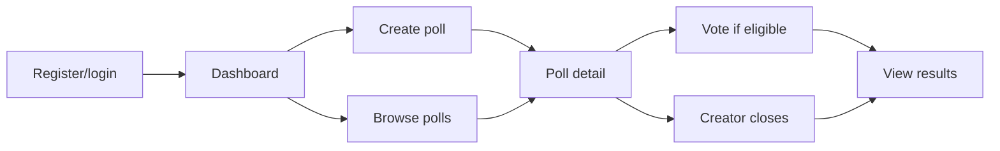

# Experience and Journeys

### JRN-POLLPULSE-001 · Member decision journey

- **Kind:** user-journey
- **Knowledge status:** approved
- **Implementation status:** implemented
- **Owner:** pollpulse-demo
- **Satisfies:** `OUT-POLLPULSE-001`
- **Described by:** `WF-AUTH-001`, `WF-POLLS-001`
- **Realized by:** `PG-AUTH-02`, `PG-AUTH-01`, `PG-FOUND-02`, `PG-POLLS-02`, `PG-POLLS-01`, `PG-POLLS-03`, `PG-POLLS-04`
- **Verified by:** `TEST-UX-001`

Public routes are login/register; `/app/*` is guarded. The authenticated shell exposes dashboard, polls, create, current member, and logout. Detail shows vote choices only for open/unvoted members; otherwise results. Creator sees close only while open.

## Interface states

- Login/register/create: required fields, visible API/validation error, disabled/loading submit.
- Dashboard/list: loading, error, empty; list paginates when needed.
- Detail: loading/fatal error, operation error, voting/closing disabled state, conditional results.
- Responsive styling is present through utility classes; no recorded viewport, keyboard, contrast, or screen-reader evidence.

