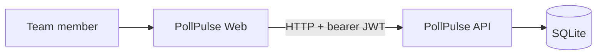
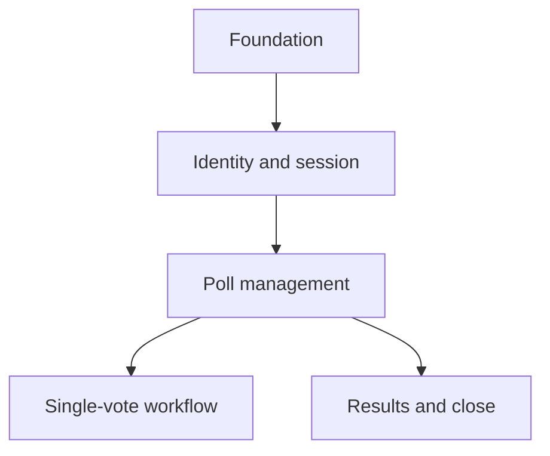

# PollPulse System Map

## Purpose

PollPulse helps small teams make quick decisions with lightweight authenticated polls. A member registers, creates a poll with 2–5 options, other members cast one immutable vote, and authenticated members view results. The creator may close voting.

Primary outcome: `OUT-POLLPULSE-001`.

## Actors and systems

- **Team member:** registers, logs in, creates polls, votes, sees results, closes own polls.
- **PollPulse Web:** React browser interface.
- **PollPulse API:** Express application that owns authentication and poll rules.
- **SQLite:** local persistence owned by the API.

## Applications and boundaries

| App | Responsibility | Source |
|-----|----------------|--------|
| Web | routes, forms, session client, poll/results presentation | `../example-v1.2/apps/web/` |
| API | validation, authentication, authorization, workflows, persistence mapping | `../example-v1.2/apps/api/` |
| SQLite | users, polls, options, votes, uniqueness/foreign keys | created by API runtime |

The API is authoritative for business rules. The browser never calls SQLite or an external provider.

## Capabilities and modules

- Identity: `CAP-IDENTITY-001`.
- Poll management: `CAP-POLLS-001`.
- Voting: `CAP-VOTING-001`.
- Results: `CAP-RESULTS-001`.

## Key workflows

- [Authentication](knowledge/03-domain/workflows/authentication.md): `WF-AUTH-001`.
- [Poll lifecycle](knowledge/03-domain/workflows/poll-lifecycle.md): `WF-POLLS-001`.

## Current posture

- Business/domain/design knowledge is approved from the original blueprint plus source inspection.
- Runtime artifacts are `implemented`; application behavior is not upgraded to `verified` because automated test evidence is absent.
- All 40 declared demo files are classified in the code map.
- Known security/test limitations are in [accepted risks](knowledge/06-quality/accepted-risks.md).

## Next layers

- [Business](knowledge/01-business/brd.md) → [requirements](knowledge/02-requirements/functional.md) → [domain](knowledge/03-domain/model.md).
- [Architecture](knowledge/04-design/architecture/overview.md) → [contracts](knowledge/04-design/contracts/polls.md) → [implementation](knowledge/05-implementation/components/polls.md).
- [Tests](knowledge/05-implementation/tests/catalog.md) → [quality](knowledge/06-quality/strategy.md) → [operations](knowledge/07-operations/deployment.md).

