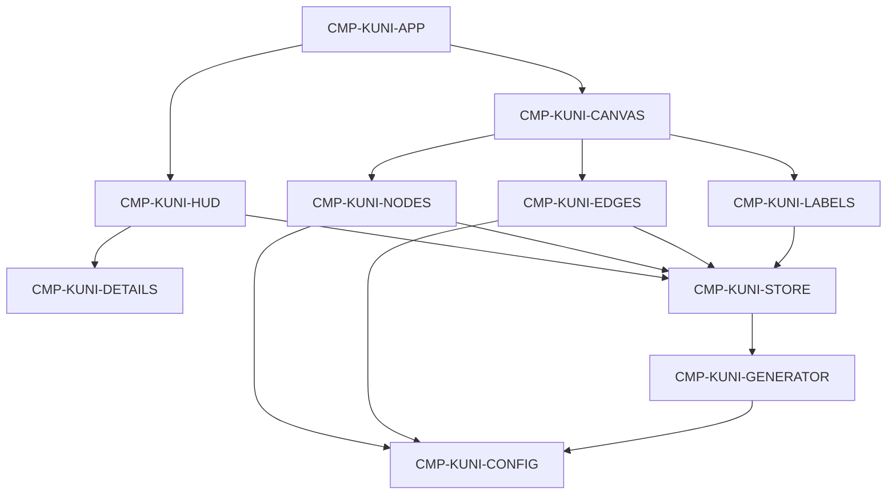

# Generated Context Pack

> Generated view. Do not edit or treat as canonical.

- Manifest: `CTX-KUNI-TASK-001`
- Role: implementer
- Context tier: standard
- Project hash: `a6a7407b1109ae4b1b85dd29565aaa1d7efab20ee88dd24373eb0e0fbb218d57`
- Root IDs: `TASK-KUNI-001`
- Included IDs: `TASK-KUNI-001`, `CRIT-KUNI-001`, `CRIT-KUNI-020`, `CRIT-KUNI-023`, `DEC-KUNI-002`, `PAT-KUNI-001`, `RDR-KUNI-001`, `REQ-KUNI-001`, `NFR-KUNI-006`, `CMP-KUNI-APP`, `TEST-KUNI-001`, `TEST-KUNI-005`, `REV-KUNI-SQR-001`
- Review IDs: `REV-KUNI-SQR-001`
- Overflow policy: fail-and-split

## Document · profile.md

# Profile

Knowledge Universe is a browser application whose first milestone is a polished, full-screen 3D knowledge/network visualization driven by local dummy data.

This profile records project identity, adapters, and stakeholder technology constraints. Application source does not yet exist; `source_roots` stays empty until an approved implementation slice creates it.

## Applications and runtimes

- Single-page web client.
- Desktop browsers are the primary runtime. Laptop and tablet must remain usable. Mobile may be basic.

## Stakeholder technology constraints

These are confirmed stakeholder choices, not engine defaults. See `DEC-KUNI-002`.

- React with TypeScript
- Vite
- Three.js rendered through React Three Fiber
- Drei helpers
- Zustand for transient graph and chrome state
- Tailwind CSS for surrounding UI
- Framer Motion for 2D chrome motion
- Angular and Vue are forbidden

## Selected adapters

- `generic` — baseline discovery, criteria, and evidence contracts
- `web-ui` — browser surface, first-view focus, visual evidence, responsive and interaction questions

`web-api` is rejected for this milestone because there is no backend, API, or persistence.

## Ownership

- Knowledge and product direction: `product-owner`
- First-slice implementation: `knowledge-universe-team`

## Reviewer rules

- First milestone is a local visual prototype. No authentication, backend, persistence, or real knowledge ingestion.
- Material visual quality is owner-adjudicated against the brief and `docs/reference/3d-network-reference.png`.
- New public behavior outside the approved first-milestone requirements returns to analysis.
## Document · knowledge/04-design/architecture/overview.md

# Architecture

Single-page browser client. No server process. Dummy graph data is generated in memory and rendered by a WebGL canvas. Surrounding chrome is HTML.

This is the first visual slice only. Path finding, timelines, search execution, and persistence are not in this architecture.

## Style

- Client-only application.
- Feature folder for the graph.
- Visual constants live in configuration modules.
- Transient UI state is separate from graph data.

## Dependency direction

Allowed: chrome and renderers read the store, graph value, and config.  
Forbidden: putting the Three.js scene into application state.  
Forbidden: renderer branches on specific dummy labels.

## Runtime

- Vite development server and static production build.
- React owns HTML chrome and the canvas host.
- React Three Fiber owns the scene graph.
- Three.js remains the rendering engine.
- Zustand holds attention flags and the current graph value. See `PAT-KUNI-002`.
- Drei supplies orbit controls and HTML label anchors.
- Tailwind styles chrome. Framer Motion eases the details panel and quiet HUD motion.

## Data ownership

- `CMP-KUNI-GENERATOR` creates a graph instance.
- `CMP-KUNI-STORE` holds the current instance and explorer flags.
- Renderers never own source data.

## Security and privacy

- No authentication, secrets, cookies for identity, or network knowledge calls.
- Dummy public-topic names only. No personal data collection.
- No public API contract.

## Cross-cutting

- Logging is browser console only if needed for defects.
- Testing boundary: typecheck plus observed launch, graph, interaction, and visual review.
- Operations: local `npm run dev`, `npm run build`, `npm run typecheck`, `npm run preview`.

## Foundation-before-optional

1. App foundation and canvas host
2. Types, config, and seeded generator
3. Nodes and edges
4. Camera
5. Hover and selection
6. Labels and details
7. Specified HUD
8. Environment polish
9. Optional: search-placeholder finish, select-to-focus, growth-oriented instancing refinement

## Camera constants

| Setting | Value |
|---------|-------|
| Home position | approximately `(0, 12, 42)` looking at origin |
| Min distance | 8 |
| Max distance | 80 |
| Damping | on, about 0.08 |
| Auto-rotate default | off |
| Auto-rotate speed | Drei/Three `autoRotateSpeed` 0.4 |

## First-pass risks

- Bloom set too high and washing out type color
- Label count creeping up on the default view
- Per-node React meshes defeating `PAT-KUNI-003`
- Chrome covering the graph center on tablet

Residual visual taste remains owner-adjudicated (`CRIT-KUNI-016`).

## Pattern links

`PAT-KUNI-001` through `PAT-KUNI-010` on `CHG-KUNI-001`.
## Artifact · TASK-KUNI-001

_Source: `changes/active/CHG-KUNI-001/execution-plan.md:29`_

### TASK-KUNI-001 · Create the client foundation

- **Kind:** execution-task
- **Knowledge status:** in-review
- **Implementation status:** planned
- **Owner:** knowledge-universe-team
- **Goal:** A Vite React TypeScript Tailwind app opens into a full-screen dark canvas host with no backend.
- **Task class:** foundation
- **Context tier:** standard
- **Escalation:** Stop and return to design when a material decision is missing.
- **Depends on:** []
- **Preconditions:** empty application source; SQR still current
- **Inputs:** `DEC-KUNI-002`, `PAT-KUNI-001`, `profile.md`, `knowledge/04-design/architecture/overview.md`
- **Allowed paths:** `src`, `index.html`, `package.json`, `vite.config.ts`, `tsconfig.json`, `tsconfig.app.json`, `tsconfig.node.json`, `tailwind.config.js`, `postcss.config.js`, `public`
- **Forbidden inventions:** Angular, Vue, backend, auth, extra routes, admin dashboard, putting a scene into Zustand
- **Outputs:** runnable Vite client, `CMP-KUNI-APP` shell, full-bleed canvas host
- **Checks:** `npm run typecheck` exits 0; first painted view is a full-bleed dark canvas not a form
- **Done when:** `CRIT-KUNI-001` host exists; `CRIT-KUNI-023` typecheck passes; `CRIT-KUNI-020` no server or identity client
- **Recovery:** remove generated app files and recreate from this task only
- **Handoff:** `TASK-KUNI-002` may add types and the generator
- **Implements:** `CRIT-KUNI-001`, `CRIT-KUNI-020`, `CRIT-KUNI-023`, `DEC-KUNI-002`, `PAT-KUNI-001`, `RDR-KUNI-001`, `CMP-KUNI-APP`
- **Verified by:** `TEST-KUNI-001`, `TEST-KUNI-005`

Steps:

1. Initialize React + TypeScript + Vite. Enable strict TypeScript. Add Tailwind. Do not add Angular or Vue.
2. Mount `CMP-KUNI-APP` as a full-viewport shell. No router and no marketing page.
3. Reserve a full-bleed canvas host. Background tokens `#070B14` to `#10182A`.
4. Confirm there is no API client, auth, or persistence dependency.
5. Run `npm run typecheck`.
## Artifact · CRIT-KUNI-001

_Source: `changes/active/CHG-KUNI-001/quality-design-contract.md:95`_

### CRIT-KUNI-001 · First view is the universe

- **Kind:** quality-criterion
- **Knowledge status:** in-review
- **Implementation status:** planned
- **Owner:** product-owner
- **Priority:** must
- **Foundation:** yes
- **Outcome:** After launch, the first painted view is a full-screen 3D network. No marketing page, form, or empty shell appears first. The canvas occupies the viewport.
- **Threshold authority:** owner
- **Method:** launch the app in a desktop browser and photograph the first stable view at 1440×900
- **Authority class:** implementer-self-check
- **Supports:** `REQ-KUNI-001`
## Artifact · CRIT-KUNI-020

_Source: `changes/active/CHG-KUNI-001/quality-design-contract.md:361`_

### CRIT-KUNI-020 · No future-platform surfaces ship

- **Kind:** quality-criterion
- **Knowledge status:** in-review
- **Implementation status:** planned
- **Owner:** product-owner
- **Priority:** must
- **Foundation:** yes
- **Outcome:** The running application has no authentication, backend, database, API, persistence, or real search behavior.
- **Threshold authority:** owner
- **Method:** dependency and runtime review; confirm the search field does not query or filter
- **Authority class:** implementer-self-check
- **Supports:** `NFR-KUNI-006`, `DEC-KUNI-001`, `DEC-KUNI-003`
## Artifact · CRIT-KUNI-023

_Source: `changes/active/CHG-KUNI-001/quality-design-contract.md:403`_

### CRIT-KUNI-023 · The client typechecks strictly

- **Kind:** quality-criterion
- **Knowledge status:** in-review
- **Implementation status:** planned
- **Owner:** product-owner
- **Priority:** must
- **Foundation:** yes
- **Outcome:** Application TypeScript is strict and `npm run typecheck` exits 0 with no `any`.
- **Threshold authority:** owner
- **Method:** run `npm run typecheck`
- **Authority class:** deterministic-runner
- **Supports:** `NFR-KUNI-004`
## Artifact · DEC-KUNI-002

_Source: `changes/active/CHG-KUNI-001/change.md:163`_

### DEC-KUNI-002 · Client stack

- **Kind:** decision
- **Knowledge status:** in-review
- **Implementation status:** planned
- **Owner:** product-owner
- **Decision status:** decided
- **Materiality:** material
- **Authority:** product-owner
- **Source:** stakeholder-brief-2026-08-20
- **Statement:** use React, TypeScript, Vite, Three.js, React Three Fiber, Drei, Zustand, Tailwind CSS, and Framer Motion. Do not use Angular or Vue. Do not add unnecessary frameworks.
## Artifact · PAT-KUNI-001

_Source: `changes/active/CHG-KUNI-001/pattern-decisions.md:17`_

### PAT-KUNI-001 · React Three Fiber scene with HTML chrome

- **Kind:** pattern-decision
- **Knowledge status:** in-review
- **Implementation status:** planned
- **Owner:** knowledge-universe-team
- **Decision status:** decided
- **Materiality:** material
- **Authority:** product-owner
- **Adapter provenance:** web-ui
- **Problem:** Own a full-screen WebGL universe and readable product chrome without two competing application frameworks.
- **Forces:** scene organization, readable HUD, stakeholder stack, later extensibility
- **Choice:** One Vite React client. React Three Fiber owns the Three.js scene. HTML/CSS owns chrome and glass overlays.
- **Rationale:** The stakeholder forbade Angular and Vue and asked for R3F so the scene can be composed without putting the scene graph into application state.
- **Alternatives:** raw Three.js in a canvas manager, Vue Three wrapper, Angular
- **Constraints:** DEC-KUNI-002, no scene objects in Zustand, local dummy only
- **Failure modes:** remounting the canvas on every hover, mixing HUD into the WebGL scene, adding a second framework
- **Validation:** architecture review plus launch showing one full-bleed canvas and HTML chrome
- **Supports:** `CRIT-KUNI-001`, `CRIT-KUNI-019`, `DEC-KUNI-002`
- **Realized by:** `CMP-KUNI-APP`, `CMP-KUNI-CANVAS`, `CMP-KUNI-HUD`
## Artifact · RDR-KUNI-001

_Source: `changes/active/CHG-KUNI-001/reference-decisions.md:122`_

### RDR-KUNI-001 · Graph occupies the visual field

- **Kind:** reference-decision
- **Knowledge status:** in-review
- **Implementation status:** planned
- **Owner:** product-owner
- **Decision status:** decided
- **Materiality:** material
- **Authority:** product-owner
- **Source:** `docs/reference/3d-network-reference.png`
- **Source aspect:** composition
- **Disposition:** retain
- **Observation:** Inside the embed, the network fills the canvas. There is no first-party form or dashboard over the graph.
- **Interpretation:** The product’s first view must be the universe itself.
- **Rationale:** Matches `DEC-KUNI-009` and the brief’s “graph is the product” rule.
- **Confidence:** high
- **Unacceptable opposite:** Landing on marketing chrome, a table, or a graph that is a small inset.
- **Supports:** `CRIT-KUNI-001`, `DEC-KUNI-009`
## Artifact · REQ-KUNI-001

_Source: `knowledge/02-requirements/requirements.md:59`_

### REQ-KUNI-001 · Open into a full-screen 3D graph

- **Kind:** requirement
- **Knowledge status:** in-review
- **Implementation status:** planned
- **Owner:** product-owner
- **Priority:** must
- **Source:** stakeholder-brief-2026-08-20
- **Rationale:** the graph is the product; the explorer must not land on a marketing page or empty shell.
- **Actor:** Explorer
- **Trigger:** application launch
- **Statement:** the application opens directly into a full-screen 3D knowledge network with depth, perspective, and a dark immersive environment.
- **Acceptance:** `CRIT-KUNI-001`, `CRIT-KUNI-006`
- **Satisfies:** `CAP-KUNI-001`
- **Supports:** `UC-KUNI-001`
- **Constrained by:** `NFR-KUNI-001`
## Artifact · NFR-KUNI-006

_Source: `knowledge/02-requirements/nfr.md:90`_

### NFR-KUNI-006 · Local dummy data only

- **Kind:** nfr
- **Knowledge status:** in-review
- **Implementation status:** planned
- **Owner:** product-owner
- **Priority:** must
- **Quality area:** security / privacy / operations
- **Source:** stakeholder-brief-2026-08-20
- **Target:** no authentication, backend, database, API, or persistence in this slice.
- **Scope:** whole application
- **Measurement:** dependency and runtime review shows no server or identity integration
- **Threshold authority:** owner
- **Constrained by:** `CRIT-KUNI-020`
## Artifact · CMP-KUNI-APP

_Source: `knowledge/05-implementation/components/components.md:14`_

### CMP-KUNI-APP · Application shell

- **Kind:** component
- **Knowledge status:** in-review
- **Implementation status:** planned
- **Owner:** knowledge-universe-team
- **Responsibility:** mount the full-screen graph and overlay chrome.
- **Runtime:** web client
- **Depends on:** `CMP-KUNI-CANVAS`, `CMP-KUNI-HUD`, `CMP-KUNI-STORE`
- **Implements:** `REQ-KUNI-001`, `REQ-KUNI-016`
- **Constrained by:** `PAT-KUNI-001`
## Artifact · TEST-KUNI-001

_Source: `knowledge/05-implementation/tests/tests.md:14`_

### TEST-KUNI-001 · Launch and chrome

- **Kind:** test
- **Knowledge status:** in-review
- **Implementation status:** planned
- **Owner:** knowledge-universe-team
- **Method:** launch at 1440×900 and 1024×768; photograph first view and HUD regions
- **Covers:** `CRIT-KUNI-001`, `CRIT-KUNI-019`, `CRIT-KUNI-021`, `CRIT-KUNI-022`
## Artifact · TEST-KUNI-005

_Source: `knowledge/05-implementation/tests/tests.md:50`_

### TEST-KUNI-005 · Static quality and locality

- **Kind:** test
- **Knowledge status:** in-review
- **Implementation status:** planned
- **Owner:** knowledge-universe-team
- **Method:** `npm run typecheck`; review dependencies for no backend or identity; orbit 10 seconds
- **Covers:** `CRIT-KUNI-017`, `CRIT-KUNI-020`, `CRIT-KUNI-023`, `CRIT-KUNI-025`
## Artifact · REV-KUNI-SQR-001

_Source: `changes/active/CHG-KUNI-001/solution-quality-review.md:19`_

### REV-KUNI-SQR-001 · Solution quality review

- **Kind:** review
- **Knowledge status:** in-review
- **Implementation status:** not-applicable
- **Owner:** product-owner
- **Review type:** solution-quality
- **Disposition:** pass-with-conditions
- **Authority class:** fresh-context-reviewer
- **Reviewer:** fresh-context-reviewer
- **Timestamp:** 2026-08-20T17:52:00+03:00
- **Change:** `CHG-KUNI-001`
- **Reviewed inputs:** `OUT-KUNI-001`, `REQ-KUNI-001`, `REQ-KUNI-002`, `REQ-KUNI-003`, `REQ-KUNI-004`, `REQ-KUNI-005`, `REQ-KUNI-006`, `REQ-KUNI-007`, `REQ-KUNI-008`, `REQ-KUNI-009`, `REQ-KUNI-010`, `REQ-KUNI-011`, `REQ-KUNI-012`, `REQ-KUNI-013`, `REQ-KUNI-014`, `REQ-KUNI-015`, `REQ-KUNI-016`, `REQ-KUNI-017`, `REQ-KUNI-018`, `NFR-KUNI-001`, `NFR-KUNI-002`, `NFR-KUNI-003`, `NFR-KUNI-004`, `NFR-KUNI-005`, `NFR-KUNI-006`, `CRIT-KUNI-001`, `CRIT-KUNI-002`, `CRIT-KUNI-003`, `CRIT-KUNI-004`, `CRIT-KUNI-005`, `CRIT-KUNI-006`, `CRIT-KUNI-007`, `CRIT-KUNI-008`, `CRIT-KUNI-009`, `CRIT-KUNI-010`, `CRIT-KUNI-011`, `CRIT-KUNI-012`, `CRIT-KUNI-013`, `CRIT-KUNI-014`, `CRIT-KUNI-015`, `CRIT-KUNI-016`, `CRIT-KUNI-017`, `CRIT-KUNI-018`, `CRIT-KUNI-019`, `CRIT-KUNI-020`, `CRIT-KUNI-021`, `CRIT-KUNI-022`, `CRIT-KUNI-023`, `CRIT-KUNI-024`, `CRIT-KUNI-025`, `DEC-KUNI-001`, `DEC-KUNI-002`, `DEC-KUNI-003`, `DEC-KUNI-004`, `DEC-KUNI-005`, `DEC-KUNI-006`, `DEC-KUNI-007`, `DEC-KUNI-008`, `DEC-KUNI-009`, `DEC-KUNI-010`, `DEC-KUNI-011`, `DEC-KUNI-012`, `DEC-KUNI-013`, `DEC-KUNI-014`, `DEC-KUNI-015`, `DEC-KUNI-016`, `DEC-KUNI-017`, `ASM-KUNI-001`, `ASM-KUNI-002`, `ASM-KUNI-003`, `ASM-KUNI-004`, `ASM-KUNI-005`, `ASM-KUNI-006`, `INV-KUNI-001`, `INV-KUNI-002`, `INV-KUNI-003`, `INV-KUNI-004`, `INV-KUNI-005`, `INV-KUNI-006`, `INV-KUNI-007`, `INV-KUNI-008`, `INV-KUNI-009`, `INV-KUNI-010`, `RDR-KUNI-001`, `RDR-KUNI-002`, `RDR-KUNI-003`, `RDR-KUNI-004`, `RDR-KUNI-005`, `RDR-KUNI-006`, `RDR-KUNI-007`, `RDR-KUNI-008`, `RDR-KUNI-009`, `RDR-KUNI-010`, `RDR-KUNI-011`, `RDR-KUNI-012`, `RDR-KUNI-013`, `RDR-KUNI-014`, `RDR-KUNI-015`, `RDR-KUNI-016`, `RDR-KUNI-017`, `PAT-KUNI-001`, `PAT-KUNI-002`, `PAT-KUNI-003`, `PAT-KUNI-004`, `PAT-KUNI-005`, `PAT-KUNI-006`, `PAT-KUNI-007`, `PAT-KUNI-008`, `PAT-KUNI-009`, `PAT-KUNI-010`, `WF-KUNI-EXPLORE`, `WF-KUNI-INSPECT`, `WF-KUNI-CONTROL`
- **Input fingerprint:** `8fc2fb9fe970631b5a5e3de9f24d52d19a01d8ea37113a1c7905ff0a906de4d6`
- **Reference fingerprint:** `sha256:3e9816da3280619d1cf21dec4e56c24645e7bee392a91cb4466a82489b77f679`
- **Limitation:** this review judges design coherence and decision completeness. It does not award `CRIT-KUNI-016`. Same-session design work cannot close owner taste.

## Verdict

The proposed solution matches the first visual milestone. It does not smuggle in auth, backend, AI, live search, path finding, or a timeline. Material patterns have alternatives, constraints, and failure modes. The quality bar stays with the owner.

Disposition is **pass-with-conditions**, not pass, because cinematic quality and the 30 fps floor still need later evidence.

## Intent and reference fidelity

- Outcome `OUT-KUNI-001` is still “judge a product-grade dummy universe,” not a knowledge platform.
- Audience and priority order match the QDC.
- RDRs retain density, hierarchy, depth, and thin edges; they reject flat black, pictograms, Reddit chrome, literal entities, and persistent `RELATED_TO` captions.
- Experience and `PAT-KUNI-008` / `PAT-KUNI-006` follow those dispositions.
- Unacceptable outcomes are explicit and not reinterpreted as a numeric taste score.

## Coherence

- Domain, workflows, requirements, and actions tell the same explore / inspect / control story.
- Neighborhood is first-degree and direction-agnostic in domain, pattern, and panel math.
- Foundation criteria omit search polish, select-to-focus, and later instancing refinement. Architecture orders those after the universe works.
- Adapters `generic` and `web-ui` compose. `web-api` stays rejected. No adapter conflict.

## Feasibility

- 100–300 nodes and 200–800 edges with shared or instanced drawing is a known browser pattern.
- Local seeded generation avoids data and migration risk.
- HTML labels and HUD are the right tool for glass readability.
- Likely first-pass failures remain bloom, label count, per-node meshes, and tablet chrome overlap. Those are already named in architecture and patterns.

## Quality-bar authority

- Count, copy, and type rules are owner-sourced from the brief.
- 30 fps, viewports, and B+/A are approved assumptions, not silent model bars.
- `CRIT-KUNI-016` stays `stakeholder-owner`.
- High-judgment polish is not marked implementer-closed.

## Completeness

Material `PAT-*` records include problem, forces, choice, alternatives, constraints, failure modes, and validation.

Closed in owning sources before this fingerprint, not in this report:

1. Search presence (must chrome) versus search polish (should) was contradictory. Fixed in `REQ-KUNI-016` and the QDC optional list.
2. Eight neon edge colors were an implementer-invention risk. Fixed in experience: one quiet cool-white edge treatment.
3. Connection count was unspecified. Fixed as undirected degree in experience and data.
4. Generation-failure copy was unspecified. Fixed as “Could not create the universe.”

No finding remains that requires `revise`.

## Conditions

Conditions are residual evidence, not hidden redesign.

1. **Owner visual adjudication**
   - Owner: product-owner
   - Destination: `TEST-KUNI-006` / `CRIT-KUNI-016`
   - Closure: fresh visual evidence against the reference and the unacceptable-outcome list
2. **Performance assumption review**
   - Owner: knowledge-universe-team
   - Destination: `TEST-KUNI-005` / `ASM-KUNI-001`
   - Closure: 10-second orbit evidence; if the floor is wrong, update the assumption rather than silently lowering it

## Not in this review

Task compilation, Context Packs, and implementation. Those follow only while this fingerprint remains current. A material edit to a reviewed input makes this review stale.

## Manifest source

`contexts/manifests/CTX-KUNI-TASK-001.md`
