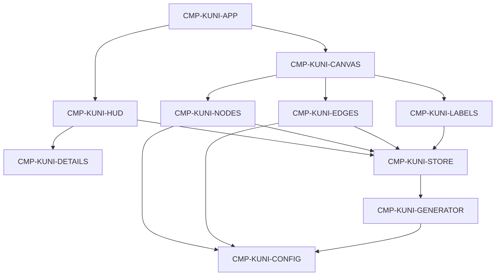

# Generated Context Pack

> Generated view. Do not edit or treat as canonical.

- Manifest: `CTX-KUNI-TASK-003`
- Role: implementer
- Context tier: standard
- Project hash: `a6a7407b1109ae4b1b85dd29565aaa1d7efab20ee88dd24373eb0e0fbb218d57`
- Root IDs: `TASK-KUNI-003`
- Included IDs: `TASK-KUNI-003`, `CRIT-KUNI-004`, `CRIT-KUNI-005`, `CRIT-KUNI-006`, `CRIT-KUNI-016`, `CRIT-KUNI-017`, `NFR-KUNI-001`, `NFR-KUNI-002`, `ASM-KUNI-001`, `PAT-KUNI-003`, `PAT-KUNI-008`, `RDR-KUNI-003`, `RDR-KUNI-005`, `RDR-KUNI-006`, `RDR-KUNI-007`, `RDR-KUNI-008`, `RDR-KUNI-009`, `RDR-KUNI-010`, `RDR-KUNI-015`, `CMP-KUNI-CANVAS`, `CMP-KUNI-NODES`, `CMP-KUNI-EDGES`, `TEST-KUNI-002`, `TEST-KUNI-006`
- Review IDs: `REV-KUNI-SQR-001`
- Overflow policy: fail-and-split

## Document · knowledge/04-design/experience/experience.md

# Experience

Inspiration file: `docs/reference/3d-network-reference.png`. Do not copy it. Produce a cleaner, more cinematic result using `RDR-KUNI-001` through `RDR-KUNI-017`.

Do not reinterpret the quality bar. Observable anti-patterns stay in `CRIT-KUNI-016` and `NFR-KUNI-001`.

## Principles

1. The graph is the product. Chrome is subordinate.
2. Hierarchy is readable before a panel opens.
3. Attention adds light. The rest dims. Nothing vanishes.
4. Motion is damped. Nothing snaps unless the explorer resets.
5. Glow is restrained. Type color stays identifiable.

## Journey

1. Explorer lands in a dark universe of clustered nodes.
2. They orbit and notice hubs, colors, and faint stars.
3. Hover brightens a neighborhood and reveals a glass label.
4. Click opens a glass details panel and dims the rest. The camera may ease in.
5. Controls reset, relabel, rotate, or generate another universe.
6. Search field is visible and does nothing.

## First-view focus

Full-bleed 3D graph. Title is visible but quiet. No onboarding modal.

## Information

- Title: Knowledge Universe
- Subtitle: Interactive 3D Network
- Search placeholder: Search knowledge...
- Details: name, type, description, connection count. Connection count is undirected degree: distinct neighboring nodes one hop away in either direction.
- Legend: one mark per node type
- Controls: Reset View, Randomize, Toggle Labels, Toggle Auto Rotate

## Screen

One screen. Full-bleed canvas. Overlay chrome. See `PAT-KUNI-009`.

| Region | Content |
|--------|---------|
| Top left | Title and subtitle |
| Top center | Search placeholder |
| Top right | Reset View, Randomize, Toggle Labels, Toggle Auto Rotate |
| Bottom left | Type legend |
| Bottom right | Details panel when a node is selected |

On tablet, chrome may stack; the canvas stays full-bleed. Search may sit under the title. Controls remain tappable.

## Interaction states

| State | Canvas | Chrome |
|-------|--------|--------|
| Default | All visible, important labels only | Search inert, no details |
| Hover | Focus node scaled and brighter, neighbors lit, others slightly dim | Cursor indicates a target |
| Selected | Neighborhood emphasized, others dimmed | Details panel open |
| Focused | Camera eases toward the selected node | Details remain |
| Labels off | Importance labels hidden | Hover and selection labels remain |

Hover and selected may overlap. Selected wins for the panel. Empty-canvas click clears selection.

## Interface states

- Loading: brief if needed; generation is local and expected to succeed.
- Empty: not expected after generation. If generation failed, show the chrome line “Could not create the universe.” Do not leave a silent broken canvas.
- Success: graph visible.
- Unauthorized: not applicable.
- Validation: not applicable. Search does not validate or submit.

## Motion

- Camera damping on orbit. See `PAT-KUNI-010`.
- Smooth intensity and scale changes on hover and selection. No instant pops.
- Details panel eases in with Framer Motion.
- Auto-rotate is slow and opt-in.

## Typography

- Geometric sans-serif, Inter or the system UI stack.
- Title small and light, not a hero headline.
- Labels: one primary line, 13 px CSS, truncate after 28 characters.
- Type names in the panel may be uppercase tracking.

## Color and form

Deep navy space, not flat black (`RDR-KUNI-006`). Category color is restrained (`RDR-KUNI-007`). No pictograms (`RDR-KUNI-009`).

| Token | Value |
|-------|-------|
| Space near | `#070B14` |
| Space far | `#10182A` |
| Star | cool white at very low opacity |
| Edge default | cool white, opacity about 0.18 |
| Edge emphasized | same hue, opacity about 0.55 |
| Glass fill | `#10182A` at 50% with blur 12px |
| Glass stroke | white at 8% |

| Node type | Form | Hue | Base radius |
|-----------|------|-----|-------------|
| person | sphere | `#4F8F8A` | 0.28 |
| organization | sphere plus thin ring | `#4A6FA5` | 0.38 |
| concept | emissive sphere | `#6B5B8C` | 0.32 |
| technology | octahedron | `#3D8B9A` | 0.28 |
| place | sphere plus wider dim ring | `#A4844A` | 0.28 |
| event | short diamond / octahedron flattened on Y | `#A45B6A` | 0.26 |
| document | small rounded box | `#8A8478` | 0.20 |

Radius after importance: `baseRadius * (0.75 + 0.55 * importance)`. Do not invent other hues.

Hover scale: 1.12. Selected scale: 1.18. Hover/select ring radius is 1.35 times the drawn radius. Unrelated dim: multiply emissive and edge opacity by 0.28. Neighborhood stays at full emphasis.

Star particles: 280. Star opacity: 0.12. Fog color: `#070B14`. Fog near 18, far 90. Bloom strength 0.22, threshold 0.82, radius 0.4. Vignette is CSS or post, opacity about 0.18.

Default labels: importance ≥ 0.72 or among the 12 highest-importance nodes, whichever is fewer. Nearby labels: camera distance < 14. Hit area: 1.8 times visible radius.

Details panel: width 300px, bottom 24px, right 24px.

Auto-rotate: Drei/Three `autoRotateSpeed` 0.4. A 10-second watch is not a full spin.

Title: 13px, weight 500, color `#D7DCE6`. Subtitle: 11px, color `#8B93A7`.

Relationship types share the default thin cool-white edge `#C8D0DC` at opacity 0.18. Emphasized opacity 0.55. Do not assign a distinct neon color to each type.

## Labels

Glass background, upright, tracking the node. Default: important nodes only. Nearby nodes may appear when the camera approaches. Hovered and selected always show a label. No persistent edge captions (`RDR-KUNI-011`).

## Pointer

Node hit area is larger than the visible core so small peripherals remain pickable. Cursor becomes a pointer over a node.

## Accessibility and responsive

- Desktop 1440×900 is the visual target.
- Tablet 1024×768 keeps a full-bleed canvas and reachable controls.
- Contrast on labels and chrome must stay readable on the dark scene.
- HUD controls are keyboard-reachable. The canvas is pointer-first.
- No WCAG AA claim this slice (`ASM-KUNI-004`).

## Content tone

Dummy knowledge-topic names are illustrative fiction. They must not look like a copied political-media graph from the reference (`RDR-KUNI-014`). Descriptions are short and generic.

## Unacceptable

Engineering-demo finish, flat black void, excessive neon or bloom, labels on every node, thick edges, random scatter, admin dashboard, Reddit chrome, reference pictograms, persistent RELATED_TO captions.

## Evidence

Visual reviews record viewport, state (default hover selected), source revision, the reference file, expected criterion, reviewer, and limitations. See `CRIT-KUNI-016`.
## Document · knowledge/04-design/architecture/overview.md

# Architecture

Single-page browser client. No server process. Dummy graph data is generated in memory and rendered by a WebGL canvas. Surrounding chrome is HTML.

This is the first visual slice only. Path finding, timelines, search execution, and persistence are not in this architecture.

## Style

- Client-only application.
- Feature folder for the graph.
- Visual constants live in configuration modules.
- Transient UI state is separate from graph data.

## Dependency direction

Allowed: chrome and renderers read the store, graph value, and config.  
Forbidden: putting the Three.js scene into application state.  
Forbidden: renderer branches on specific dummy labels.

## Runtime

- Vite development server and static production build.
- React owns HTML chrome and the canvas host.
- React Three Fiber owns the scene graph.
- Three.js remains the rendering engine.
- Zustand holds attention flags and the current graph value. See `PAT-KUNI-002`.
- Drei supplies orbit controls and HTML label anchors.
- Tailwind styles chrome. Framer Motion eases the details panel and quiet HUD motion.

## Data ownership

- `CMP-KUNI-GENERATOR` creates a graph instance.
- `CMP-KUNI-STORE` holds the current instance and explorer flags.
- Renderers never own source data.

## Security and privacy

- No authentication, secrets, cookies for identity, or network knowledge calls.
- Dummy public-topic names only. No personal data collection.
- No public API contract.

## Cross-cutting

- Logging is browser console only if needed for defects.
- Testing boundary: typecheck plus observed launch, graph, interaction, and visual review.
- Operations: local `npm run dev`, `npm run build`, `npm run typecheck`, `npm run preview`.

## Foundation-before-optional

1. App foundation and canvas host
2. Types, config, and seeded generator
3. Nodes and edges
4. Camera
5. Hover and selection
6. Labels and details
7. Specified HUD
8. Environment polish
9. Optional: search-placeholder finish, select-to-focus, growth-oriented instancing refinement

## Camera constants

| Setting | Value |
|---------|-------|
| Home position | approximately `(0, 12, 42)` looking at origin |
| Min distance | 8 |
| Max distance | 80 |
| Damping | on, about 0.08 |
| Auto-rotate default | off |
| Auto-rotate speed | Drei/Three `autoRotateSpeed` 0.4 |

## First-pass risks

- Bloom set too high and washing out type color
- Label count creeping up on the default view
- Per-node React meshes defeating `PAT-KUNI-003`
- Chrome covering the graph center on tablet

Residual visual taste remains owner-adjudicated (`CRIT-KUNI-016`).

## Pattern links

`PAT-KUNI-001` through `PAT-KUNI-010` on `CHG-KUNI-001`.
## Artifact · TASK-KUNI-003

_Source: `changes/active/CHG-KUNI-001/execution-plan.md:92`_

### TASK-KUNI-003 · Render the universe

- **Kind:** execution-task
- **Knowledge status:** in-review
- **Implementation status:** planned
- **Owner:** knowledge-universe-team
- **Goal:** The explorer sees a cinematic clustered 3D network with distinct types, thin edges, and depth.
- **Task class:** foundation
- **Context tier:** standard
- **Escalation:** Stop and return to design when a material decision is missing.
- **Depends on:** `TASK-KUNI-002`
- **Preconditions:** `TASK-KUNI-002` done
- **Inputs:** `knowledge/04-design/experience/experience.md`, `docs/reference/3d-network-reference.png`, `PAT-KUNI-003`, `PAT-KUNI-008`
- **Allowed paths:** `src/features/graph/components`, `src/lib/three`
- **Forbidden inventions:** flat black clear color, heavy bloom, thick tubes, one React mesh per edge, pictograms, eight neon edge colors, persistent RELATED_TO labels, copying the reference scene
- **Outputs:** `CMP-KUNI-CANVAS` `CMP-KUNI-NODES` `CMP-KUNI-EDGES` drawing the current graph
- **Checks:** types are distinguishable; edges are thin; background is navy with subtle stars not flat black; orbit 10 seconds remains interactive
- **Done when:** `CRIT-KUNI-004` `CRIT-KUNI-005` `CRIT-KUNI-006` `CRIT-KUNI-017` hold. `CRIT-KUNI-016` is prepared for owner review not self-closed
- **Recovery:** reduce bloom and label-less default; switch to shared or instanced drawing if fps is poor
- **Handoff:** `TASK-KUNI-004` may add orbit controls
- **Implements:** `CRIT-KUNI-004`, `CRIT-KUNI-005`, `CRIT-KUNI-006`, `CRIT-KUNI-016`, `CRIT-KUNI-017`, `NFR-KUNI-001`, `NFR-KUNI-002`, `PAT-KUNI-003`, `PAT-KUNI-008`, `RDR-KUNI-003`, `RDR-KUNI-005`, `RDR-KUNI-006`, `RDR-KUNI-007`, `RDR-KUNI-008`, `RDR-KUNI-009`, `RDR-KUNI-010`, `RDR-KUNI-015`, `CMP-KUNI-CANVAS`, `CMP-KUNI-NODES`, `CMP-KUNI-EDGES`
- **Verified by:** `TEST-KUNI-002`, `TEST-KUNI-006`

Steps:

1. Create the R3F canvas on the host. Clear color and gradient follow space tokens.
2. Add sparse star particles, light fog, modest bloom, subtle vignette. Bloom stays subordinate to the graph.
3. Draw nodes from generic objects with shared or instanced geometry. Copy experience hues, base radii, and the importance radius formula into `CMP-KUNI-CONFIG`. Do not invent other colors.
4. Draw thin buffer-backed edges in `#C8D0DC` at opacity 0.18. Use experience bloom fog and star constants. Do not raise bloom above 0.22.
5. Do not add HUD labels or selection yet unless needed to debug.
6. Carry SQR condition: record a 10-second orbit note for `ASM-KUNI-001`. Do not award `CRIT-KUNI-016`.
## Artifact · CRIT-KUNI-004

_Source: `changes/active/CHG-KUNI-001/quality-design-contract.md:137`_

### CRIT-KUNI-004 · Node types are distinguishable

- **Kind:** quality-criterion
- **Knowledge status:** in-review
- **Implementation status:** planned
- **Owner:** product-owner
- **Priority:** must
- **Foundation:** yes
- **Outcome:** Person, organization, concept, technology, place, event, and document are visually distinguishable by color and or form. A legend lists the types. Important nodes read as larger than peripherals.
- **Threshold authority:** owner
- **Method:** compare one node of each type in the first view against the legend
- **Authority class:** implementer-self-check
- **Supports:** `REQ-KUNI-003`
## Artifact · CRIT-KUNI-005

_Source: `changes/active/CHG-KUNI-001/quality-design-contract.md:151`_

### CRIT-KUNI-005 · Edges are thin and readable

- **Kind:** quality-criterion
- **Knowledge status:** in-review
- **Implementation status:** planned
- **Owner:** product-owner
- **Priority:** must
- **Foundation:** yes
- **Outcome:** Edges are thin, slightly glowing, and readable against the dark scene. They do not appear as thick tubes or a solid scribble.
- **Threshold authority:** owner
- **Method:** visual review of the default graph at 1440×900
- **Authority class:** fresh-context-reviewer
- **Supports:** `REQ-KUNI-004`
## Artifact · CRIT-KUNI-006

_Source: `changes/active/CHG-KUNI-001/quality-design-contract.md:165`_

### CRIT-KUNI-006 · The scene has depth

- **Kind:** quality-criterion
- **Knowledge status:** in-review
- **Implementation status:** planned
- **Owner:** product-owner
- **Priority:** must
- **Foundation:** yes
- **Outcome:** Distant nodes read smaller than near nodes. The background is deep navy or near-black with a subtle gradient or particles, not a flat unvaried black.
- **Threshold authority:** owner
- **Method:** compare the first view with `docs/reference/3d-network-reference.png`, noting background and perspective
- **Authority class:** fresh-context-reviewer
- **Supports:** `REQ-KUNI-001`, `DEC-KUNI-010`
## Artifact · CRIT-KUNI-016

_Source: `changes/active/CHG-KUNI-001/quality-design-contract.md:305`_

### CRIT-KUNI-016 · The result is more cinematic than the reference

- **Kind:** quality-criterion
- **Knowledge status:** in-review
- **Implementation status:** planned
- **Owner:** product-owner
- **Priority:** must
- **Foundation:** yes
- **Outcome:** On a 1440×900 desktop view, the first framing is darker and more spatially layered than the reference, with a non-flat background, restrained glow, no thick edges, and no all-node labeling. A reviewer would not classify it as a generic Three.js demo.
- **Threshold authority:** owner
- **Method:** side-by-side visual review with `docs/reference/3d-network-reference.png` against the unacceptable-outcome list
- **Authority class:** stakeholder-owner
- **Supports:** `NFR-KUNI-001`, `DEC-KUNI-010`, `FND-KUNI-005`
## Artifact · CRIT-KUNI-017

_Source: `changes/active/CHG-KUNI-001/quality-design-contract.md:319`_

### CRIT-KUNI-017 · The first graph stays interactive

- **Kind:** quality-criterion
- **Knowledge status:** in-review
- **Implementation status:** planned
- **Owner:** product-owner
- **Priority:** must
- **Foundation:** yes
- **Outcome:** Orbiting the default 100–300 node graph for at least 10 seconds remains interactive on a typical desktop GPU, with a verification floor of 30 frames per second.
- **Threshold authority:** approved-assumption
- **Method:** orbit the default graph for at least 10 seconds and record whether motion stays interactive; measure frames per second when a runner exists
- **Authority class:** implementer-self-check
- **Supports:** `NFR-KUNI-002`, `ASM-KUNI-001`
## Artifact · NFR-KUNI-001

_Source: `knowledge/02-requirements/nfr.md:12`_

### NFR-KUNI-001 · Cinematic readable polish

- **Kind:** nfr
- **Knowledge status:** in-review
- **Implementation status:** planned
- **Owner:** product-owner
- **Priority:** must
- **Quality area:** usability / visual quality
- **Source:** stakeholder-brief-2026-08-20
- **Rationale:** a technically correct graph that looks like a demo fails the milestone.
- **Target:** dark futuristic presentation with depth, restrained glow, readable hierarchy, and no excessive neon, bloom, huge labels, or thick edges. The reference image is inspiration only; the result must look cleaner and more cinematic.
- **Scope:** canvas, nodes, edges, labels, HUD
- **Measurement:** visual review against `REQ-KUNI-001`, `REQ-KUNI-004`, `REQ-KUNI-016` and `docs/reference/3d-network-reference.png`
- **Threshold authority:** owner
- **Constrained by:** `CRIT-KUNI-016`
## Artifact · NFR-KUNI-002

_Source: `knowledge/02-requirements/nfr.md:28`_

### NFR-KUNI-002 · Interactive performance on the first-milestone graph

- **Kind:** nfr
- **Knowledge status:** in-review
- **Implementation status:** planned
- **Owner:** product-owner
- **Priority:** must
- **Quality area:** performance
- **Source:** stakeholder-brief-2026-08-20
- **Rationale:** later graphs may grow; the first graph must already feel fluid.
- **Target:** 100–300 nodes and 200–800 edges remain interactive while orbiting on a typical desktop GPU. Numeric floor used for verification is 30 frames per second; see `ASM-KUNI-001`.
- **Scope:** graph rendering and camera motion
- **Measurement:** orbit the default graph for at least 10 seconds and observe sustained interactivity
- **Threshold authority:** approved-assumption
- **Constrained by:** `CRIT-KUNI-017`
## Artifact · ASM-KUNI-001

_Source: `changes/active/CHG-KUNI-001/change.md:355`_

### ASM-KUNI-001 · Thirty frame-per-second verification floor

- **Kind:** assumption
- **Knowledge status:** in-review
- **Implementation status:** not-applicable
- **Owner:** product-owner
- **Decision status:** approved-assumption
- **Materiality:** material
- **Authority:** product-owner
- **Source:** recommendation authorized 2026-08-20
- **Consequence:** verification may fail a graph that looks correct but stutters below this floor while orbiting on a typical desktop GPU.
- **Review point:** first visual verification of `CHG-KUNI-001`, or earlier if hardware class is specified.
- **Statement:** the first-milestone graph stays interactive while orbiting, with a verification floor of 30 frames per second.
## Artifact · PAT-KUNI-003

_Source: `changes/active/CHG-KUNI-001/pattern-decisions.md:59`_

### PAT-KUNI-003 · Shared geometry for repeated nodes and edges

- **Kind:** pattern-decision
- **Knowledge status:** in-review
- **Implementation status:** planned
- **Owner:** knowledge-universe-team
- **Decision status:** decided
- **Materiality:** material
- **Authority:** product-owner
- **Adapter provenance:** generic
- **Problem:** Hundreds of nodes and edges must stay interactive and later grow.
- **Forces:** first-graph performance, later capacity, interaction updates
- **Choice:** Repeated node forms use InstancedMesh or shared geometries. Edges use a small number of buffer-backed line objects. Hover and selection update attributes or instance state rather than remounting the scene.
- **Rationale:** NFR-KUNI-002 and NFR-KUNI-003 require a first graph that feels fluid and a structure that can grow.
- **Alternatives:** one React mesh component per node and edge, thick tube meshes per edge, unique materials per dummy name
- **Constraints:** 100-300 nodes, 200-800 edges, 30 fps floor
- **Failure modes:** remount on hover, unique heavy object per edge, GPU overdraw from thick tubes
- **Validation:** orbit the default graph for 10 seconds; review that node forms are instanced or shared
- **Supports:** `CRIT-KUNI-017`, `CRIT-KUNI-025`, `NFR-KUNI-003`
- **Realized by:** `CMP-KUNI-NODES`, `CMP-KUNI-EDGES`
## Artifact · PAT-KUNI-008

_Source: `changes/active/CHG-KUNI-001/pattern-decisions.md:164`_

### PAT-KUNI-008 · Restrained environment and bloom

- **Kind:** pattern-decision
- **Knowledge status:** in-review
- **Implementation status:** planned
- **Owner:** knowledge-universe-team
- **Decision status:** decided
- **Materiality:** material
- **Authority:** product-owner
- **Adapter provenance:** web-ui
- **Problem:** The scene needs depth without becoming a neon effects reel.
- **Forces:** cinematic depth, readability, CRIT-KUNI-016
- **Choice:** Deep navy radial background, sparse star particles, light fog, modest bloom, and a subtle vignette. Bloom stays subordinate to the graph.
- **Rationale:** RDR-KUNI-006 rejects flat black. The brief forbids excessive bloom.
- **Alternatives:** flat black clear color, heavy bloom, photographic HDR environment
- **Constraints:** RDR-KUNI-006, NFR-KUNI-001
- **Failure modes:** washed-out nodes, star field competing with labels, copying the reference void
- **Validation:** side-by-side with the reference at 1440x900; background is not flat black and glow is restrained
- **Supports:** `CRIT-KUNI-006`, `CRIT-KUNI-016`, `RDR-KUNI-006`
- **Realized by:** `CMP-KUNI-CANVAS`
## Artifact · RDR-KUNI-003

_Source: `changes/active/CHG-KUNI-001/reference-decisions.md:160`_

### RDR-KUNI-003 · Size hierarchy

- **Kind:** reference-decision
- **Knowledge status:** in-review
- **Implementation status:** planned
- **Owner:** product-owner
- **Decision status:** decided
- **Materiality:** material
- **Authority:** product-owner
- **Source:** `docs/reference/3d-network-reference.png`
- **Source aspect:** hierarchy
- **Disposition:** retain
- **Observation:** Larger nodes sit among smaller satellites. See `FND-KUNI-011`.
- **Interpretation:** Importance and centrality must be readable from size before a panel opens.
- **Rationale:** The brief already requires important nodes to be larger.
- **Confidence:** high
- **Unacceptable opposite:** Uniform node size, or size used only for decoration.
- **Supports:** `CRIT-KUNI-004`, `DEC-KUNI-005`
## Artifact · RDR-KUNI-005

_Source: `changes/active/CHG-KUNI-001/reference-decisions.md:198`_

### RDR-KUNI-005 · Perspective depth

- **Kind:** reference-decision
- **Knowledge status:** in-review
- **Implementation status:** planned
- **Owner:** product-owner
- **Decision status:** decided
- **Materiality:** material
- **Authority:** product-owner
- **Source:** `docs/reference/3d-network-reference.png`
- **Source aspect:** scale
- **Disposition:** retain
- **Observation:** Distant nodes shrink and soften. The camera is perspective, slightly angled.
- **Interpretation:** The universe must read as volume, not a flat diagram.
- **Rationale:** The brief requires depth and perspective; the still confirms the desired spatial feeling.
- **Confidence:** high
- **Unacceptable opposite:** Orthographic flatness or no size change with distance.
- **Supports:** `CRIT-KUNI-006`
## Artifact · RDR-KUNI-006

_Source: `changes/active/CHG-KUNI-001/reference-decisions.md:217`_

### RDR-KUNI-006 · Flat black void

- **Kind:** reference-decision
- **Knowledge status:** in-review
- **Implementation status:** planned
- **Owner:** product-owner
- **Decision status:** decided
- **Materiality:** material
- **Authority:** product-owner
- **Source:** `docs/reference/3d-network-reference.png`
- **Source aspect:** color
- **Disposition:** reject
- **Observation:** The field behind nodes is flat near-black. See `FND-KUNI-010`.
- **Interpretation:** Keep a dark immersive field, but not this unvaried void.
- **Rationale:** The brief forbids a completely flat black background and asks for navy, gradient, and subtle particles.
- **Confidence:** high
- **Unacceptable opposite:** Copying the reference’s flat black, or a bright/busy sky that competes with the graph.
- **Supports:** `CRIT-KUNI-006`, `CRIT-KUNI-016`, `DEC-KUNI-010`
## Artifact · RDR-KUNI-007

_Source: `changes/active/CHG-KUNI-001/reference-decisions.md:236`_

### RDR-KUNI-007 · Neon category colors

- **Kind:** reference-decision
- **Knowledge status:** in-review
- **Implementation status:** planned
- **Owner:** product-owner
- **Decision status:** decided
- **Materiality:** material
- **Authority:** product-owner
- **Source:** `docs/reference/3d-network-reference.png`
- **Source aspect:** color
- **Disposition:** adapt
- **Observation:** Categories use saturated neon green, blue, red, and yellow.
- **Interpretation:** Keep color as a type signal. Lower saturation and brightness so glow stays restrained.
- **Rationale:** Type identity is required; excessive neon is an unacceptable outcome.
- **Confidence:** high
- **Unacceptable opposite:** One color for every type, or unreadable neon bloom.
- **Supports:** `CRIT-KUNI-004`, `CRIT-KUNI-016`, `NFR-KUNI-001`
## Artifact · RDR-KUNI-008

_Source: `changes/active/CHG-KUNI-001/reference-decisions.md:255`_

### RDR-KUNI-008 · Circular nodes and optional rings

- **Kind:** reference-decision
- **Knowledge status:** in-review
- **Implementation status:** planned
- **Owner:** product-owner
- **Decision status:** decided
- **Materiality:** material
- **Authority:** product-owner
- **Source:** `docs/reference/3d-network-reference.png`
- **Source aspect:** hierarchy
- **Disposition:** adapt
- **Observation:** Nodes are circular; some important ones have a thin outer ring. See `FND-KUNI-011`.
- **Interpretation:** Spheres or slightly geometric 3D forms may replace flat discs. Subtle rings may mark important or selected nodes.
- **Rationale:** The brief asks for glowing spheres or futuristic geometry and allows some outer rings. Flat 2D discs are named as something to avoid.
- **Confidence:** high
- **Unacceptable opposite:** Literal flat billboard dots only, or rings on every node.
- **Supports:** `CRIT-KUNI-004`, `REQ-KUNI-003`
## Artifact · RDR-KUNI-009

_Source: `changes/active/CHG-KUNI-001/reference-decisions.md:274`_

### RDR-KUNI-009 · Pictograms inside nodes

- **Kind:** reference-decision
- **Knowledge status:** in-review
- **Implementation status:** planned
- **Owner:** product-owner
- **Decision status:** decided
- **Materiality:** material
- **Authority:** product-owner
- **Source:** `docs/reference/3d-network-reference.png`
- **Source aspect:** content
- **Disposition:** reject
- **Observation:** Large nodes contain white icons, such as a building on Government.
- **Interpretation:** Those icons are another author’s asset language and are not required by the brief.
- **Rationale:** Rights limit copying. Type identity will come from color, form, size, and the legend.
- **Confidence:** high
- **Unacceptable opposite:** Reusing the reference pictograms, or requiring icons to recognize a type.
- **Supports:** `CRIT-KUNI-004`, `DEC-KUNI-010`
## Artifact · RDR-KUNI-010

_Source: `changes/active/CHG-KUNI-001/reference-decisions.md:293`_

### RDR-KUNI-010 · Thin low-contrast edges

- **Kind:** reference-decision
- **Knowledge status:** in-review
- **Implementation status:** planned
- **Owner:** product-owner
- **Decision status:** decided
- **Materiality:** material
- **Authority:** product-owner
- **Source:** `docs/reference/3d-network-reference.png`
- **Source aspect:** density
- **Disposition:** retain
- **Observation:** Edges are thin, straight, and gray-white. See `FND-KUNI-012`.
- **Interpretation:** Keep thin, slightly glowing lines that stay visible without becoming tubes or a scribble.
- **Rationale:** Matches the brief and `CRIT-KUNI-005`.
- **Confidence:** high
- **Unacceptable opposite:** Thick tubes, invisible hairlines, or a solid mid-field scribble.
- **Supports:** `CRIT-KUNI-005`
## Artifact · RDR-KUNI-015

_Source: `changes/active/CHG-KUNI-001/reference-decisions.md:388`_

### RDR-KUNI-015 · Engineering-demo tone

- **Kind:** reference-decision
- **Knowledge status:** in-review
- **Implementation status:** planned
- **Owner:** product-owner
- **Decision status:** decided
- **Materiality:** critical
- **Authority:** product-owner
- **Source:** `docs/reference/3d-network-reference.png`
- **Source aspect:** tone
- **Disposition:** reject
- **Observation:** The post asks for UI feedback on a Three.js prototype. The still looks like a technical demo: flat black, neon, raw labels, no product chrome.
- **Interpretation:** Use the spatial idea, not the demo finish.
- **Rationale:** `CRIT-KUNI-016` requires a more cinematic, product-like first view.
- **Confidence:** high
- **Unacceptable opposite:** A result a reviewer would classify as a generic Three.js demo.
- **Supports:** `CRIT-KUNI-016`, `NFR-KUNI-001`, `FND-KUNI-005`
## Artifact · CMP-KUNI-CANVAS

_Source: `knowledge/05-implementation/components/components.md:26`_

### CMP-KUNI-CANVAS · Graph canvas

- **Kind:** component
- **Knowledge status:** in-review
- **Implementation status:** planned
- **Owner:** knowledge-universe-team
- **Responsibility:** host the WebGL scene, camera, lights, fog, stars, and restrained post-process.
- **Runtime:** web client
- **Depends on:** `CMP-KUNI-NODES`, `CMP-KUNI-EDGES`, `CMP-KUNI-LABELS`
- **Implements:** `REQ-KUNI-001`, `REQ-KUNI-006`
- **Constrained by:** `NFR-KUNI-001`, `NFR-KUNI-002`, `PAT-KUNI-008`, `PAT-KUNI-010`
## Artifact · CMP-KUNI-NODES

_Source: `knowledge/05-implementation/components/components.md:38`_

### CMP-KUNI-NODES · Node renderer

- **Kind:** component
- **Knowledge status:** in-review
- **Implementation status:** planned
- **Owner:** knowledge-universe-team
- **Responsibility:** draw nodes from generic objects using centralized type configuration and shared or instanced geometry. Handle pointer hit testing.
- **Depends on:** `CMP-KUNI-CONFIG`, `CMP-KUNI-STORE`
- **Implements:** `REQ-KUNI-003`, `REQ-KUNI-007`, `REQ-KUNI-008`, `REQ-KUNI-017`
- **Constrained by:** `INV-KUNI-001`, `INV-KUNI-005`, `PAT-KUNI-003`
## Artifact · CMP-KUNI-EDGES

_Source: `knowledge/05-implementation/components/components.md:49`_

### CMP-KUNI-EDGES · Edge renderer

- **Kind:** component
- **Knowledge status:** in-review
- **Implementation status:** planned
- **Owner:** knowledge-universe-team
- **Responsibility:** draw thin glowing connections from generic edges using buffer-backed lines and type configuration.
- **Depends on:** `CMP-KUNI-CONFIG`, `CMP-KUNI-STORE`
- **Implements:** `REQ-KUNI-004`
- **Constrained by:** `PAT-KUNI-003`, `RDR-KUNI-010`
## Artifact · TEST-KUNI-002

_Source: `knowledge/05-implementation/tests/tests.md:23`_

### TEST-KUNI-002 · Graph structure

- **Kind:** test
- **Knowledge status:** in-review
- **Implementation status:** planned
- **Owner:** knowledge-universe-team
- **Method:** count nodes edges and types; visually confirm clusters and size hierarchy
- **Covers:** `CRIT-KUNI-002`, `CRIT-KUNI-003`, `CRIT-KUNI-004`, `CRIT-KUNI-018`
## Artifact · TEST-KUNI-006

_Source: `knowledge/05-implementation/tests/tests.md:59`_

### TEST-KUNI-006 · Visual polish versus reference

- **Kind:** test
- **Knowledge status:** in-review
- **Implementation status:** planned
- **Owner:** product-owner
- **Method:** side-by-side 1440×900 review with `docs/reference/3d-network-reference.png` against unacceptable outcomes
- **Covers:** `CRIT-KUNI-005`, `CRIT-KUNI-006`, `CRIT-KUNI-016`
- **Authority class:** stakeholder-owner

## Manifest source

`contexts/manifests/CTX-KUNI-TASK-003.md`
