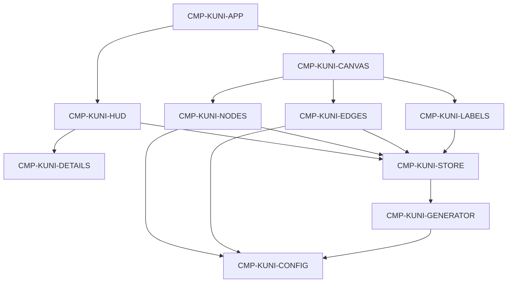

# Generated Context Pack

> Generated view. Do not edit or treat as canonical.

- Manifest: `CTX-KUNI-TASK-004`
- Role: implementer
- Context tier: standard
- Project hash: `a6a7407b1109ae4b1b85dd29565aaa1d7efab20ee88dd24373eb0e0fbb218d57`
- Root IDs: `TASK-KUNI-004`
- Included IDs: `TASK-KUNI-004`, `CRIT-KUNI-007`, `CRIT-KUNI-015`, `DEC-KUNI-015`, `PAT-KUNI-010`, `RDR-KUNI-016`, `ACT-KUNI-ORBIT`, `ACT-KUNI-ROTATE`, `TEST-KUNI-003`
- Review IDs: `REV-KUNI-SQR-001`
- Overflow policy: fail-and-split

## Document · knowledge/04-design/architecture/overview.md

# Architecture

Single-page browser client. No server process. Dummy graph data is generated in memory and rendered by a WebGL canvas. Surrounding chrome is HTML.

This is the first visual slice only. Path finding, timelines, search execution, and persistence are not in this architecture.

## Style

- Client-only application.
- Feature folder for the graph.
- Visual constants live in configuration modules.
- Transient UI state is separate from graph data.

## Dependency direction

Allowed: chrome and renderers read the store, graph value, and config.  
Forbidden: putting the Three.js scene into application state.  
Forbidden: renderer branches on specific dummy labels.

## Runtime

- Vite development server and static production build.
- React owns HTML chrome and the canvas host.
- React Three Fiber owns the scene graph.
- Three.js remains the rendering engine.
- Zustand holds attention flags and the current graph value. See `PAT-KUNI-002`.
- Drei supplies orbit controls and HTML label anchors.
- Tailwind styles chrome. Framer Motion eases the details panel and quiet HUD motion.

## Data ownership

- `CMP-KUNI-GENERATOR` creates a graph instance.
- `CMP-KUNI-STORE` holds the current instance and explorer flags.
- Renderers never own source data.

## Security and privacy

- No authentication, secrets, cookies for identity, or network knowledge calls.
- Dummy public-topic names only. No personal data collection.
- No public API contract.

## Cross-cutting

- Logging is browser console only if needed for defects.
- Testing boundary: typecheck plus observed launch, graph, interaction, and visual review.
- Operations: local `npm run dev`, `npm run build`, `npm run typecheck`, `npm run preview`.

## Foundation-before-optional

1. App foundation and canvas host
2. Types, config, and seeded generator
3. Nodes and edges
4. Camera
5. Hover and selection
6. Labels and details
7. Specified HUD
8. Environment polish
9. Optional: search-placeholder finish, select-to-focus, growth-oriented instancing refinement

## Camera constants

| Setting | Value |
|---------|-------|
| Home position | approximately `(0, 12, 42)` looking at origin |
| Min distance | 8 |
| Max distance | 80 |
| Damping | on, about 0.08 |
| Auto-rotate default | off |
| Auto-rotate speed | Drei/Three `autoRotateSpeed` 0.4 |

## First-pass risks

- Bloom set too high and washing out type color
- Label count creeping up on the default view
- Per-node React meshes defeating `PAT-KUNI-003`
- Chrome covering the graph center on tablet

Residual visual taste remains owner-adjudicated (`CRIT-KUNI-016`).

## Pattern links

`PAT-KUNI-001` through `PAT-KUNI-010` on `CHG-KUNI-001`.
## Artifact · TASK-KUNI-004

_Source: `changes/active/CHG-KUNI-001/execution-plan.md:124`_

### TASK-KUNI-004 · Add damped camera exploration

- **Kind:** execution-task
- **Knowledge status:** in-review
- **Implementation status:** planned
- **Owner:** knowledge-universe-team
- **Goal:** The explorer can orbit zoom and pan smoothly and recover later via a stored home pose.
- **Task class:** foundation
- **Context tier:** standard
- **Escalation:** Stop and return to design when a material decision is missing.
- **Depends on:** `TASK-KUNI-003`
- **Preconditions:** `TASK-KUNI-003` done
- **Inputs:** `PAT-KUNI-010`, architecture camera constants
- **Allowed paths:** `src/features/graph/components`, `src/features/graph/hooks`
- **Forbidden inventions:** default auto-spin, free-fly camera, instant snaps, infinite zoom
- **Outputs:** orbit controls with home framing; auto-rotate off and interruptible
- **Checks:** rotate zoom pan are damped; min distance 8; max distance 80; auto-rotate is off at launch
- **Done when:** `CRIT-KUNI-007` and `CRIT-KUNI-015` behavior exist. The HUD toggle may arrive in `TASK-KUNI-006`
- **Recovery:** reset home to `(0, 12, 42)` looking at origin
- **Handoff:** `TASK-KUNI-005` may pick nodes
- **Implements:** `CRIT-KUNI-007`, `CRIT-KUNI-015`, `DEC-KUNI-015`, `PAT-KUNI-010`, `RDR-KUNI-016`, `ACT-KUNI-ORBIT`, `ACT-KUNI-ROTATE`
- **Verified by:** `TEST-KUNI-003`

Steps:

1. Add OrbitControls with damping about 0.08, min 8, max 80, home about `(0, 12, 42)`.
2. Store home framing for Reset View.
3. Keep auto-rotate off. If enabled later, yield to pointer input and use `autoRotateSpeed` 0.4.
4. Support mouse and basic touch orbit.
## Artifact · CRIT-KUNI-007

_Source: `changes/active/CHG-KUNI-001/quality-design-contract.md:179`_

### CRIT-KUNI-007 · Camera exploration is smooth

- **Kind:** quality-criterion
- **Knowledge status:** in-review
- **Implementation status:** planned
- **Owner:** product-owner
- **Priority:** must
- **Foundation:** yes
- **Outcome:** Mouse and touch can orbit, zoom, and pan with damping. Zoom cannot enter the graph or fly infinitely far. Motion is not snappy or slippery.
- **Threshold authority:** owner
- **Method:** perform rotate, zoom, and pan on desktop; perform a basic touch orbit on tablet
- **Authority class:** implementer-self-check
- **Supports:** `REQ-KUNI-006`
## Artifact · CRIT-KUNI-015

_Source: `changes/active/CHG-KUNI-001/quality-design-contract.md:291`_

### CRIT-KUNI-015 · Auto Rotate is subtle and opt-in

- **Kind:** quality-criterion
- **Knowledge status:** in-review
- **Implementation status:** planned
- **Owner:** product-owner
- **Priority:** must
- **Foundation:** yes
- **Outcome:** Auto-rotate is off until the explorer opts in. When on, rotation is slow and stops or yields when the explorer moves the camera.
- **Threshold authority:** owner
- **Method:** observe the first 5 seconds after launch, enable the toggle, then interrupt with pointer input
- **Authority class:** implementer-self-check
- **Supports:** `REQ-KUNI-014`, `DEC-KUNI-015`
## Artifact · DEC-KUNI-015

_Source: `changes/active/CHG-KUNI-001/change.md:319`_

### DEC-KUNI-015 · Auto-rotate is opt-in

- **Kind:** decision
- **Knowledge status:** in-review
- **Implementation status:** planned
- **Owner:** product-owner
- **Decision status:** decided
- **Materiality:** material
- **Authority:** product-owner
- **Source:** recommendation authorized 2026-08-20
- **Statement:** auto-rotate is off by default. When enabled it is slow, interruptible by pointer input, and must not feel aggressive.
## Artifact · PAT-KUNI-010

_Source: `changes/active/CHG-KUNI-001/pattern-decisions.md:206`_

### PAT-KUNI-010 · Home camera and optional focus

- **Kind:** pattern-decision
- **Knowledge status:** in-review
- **Implementation status:** planned
- **Owner:** knowledge-universe-team
- **Decision status:** decided
- **Materiality:** material
- **Authority:** product-owner
- **Adapter provenance:** web-ui
- **Problem:** Explorers must orbit naturally and recover from deep views.
- **Forces:** damping, distance limits, Reset View, optional focus
- **Choice:** Orbit controls with damping, min and max distance, and a stored home framing. Selection may lerp the camera toward the node. Auto-rotate is off until opted in and yields to pointer input.
- **Rationale:** REQ-KUNI-006 and DEC-KUNI-015 DEC-KUNI-016.
- **Alternatives:** free-fly camera, default auto-spin, instant camera snaps
- **Constraints:** DEC-KUNI-014, INV-KUNI-010, INV-KUNI-009
- **Failure modes:** camera inside a node, infinite zoom-out, aggressive spin, snap cuts
- **Validation:** orbit zoom pan reset and optional select-focus
- **Supports:** `CRIT-KUNI-007`, `CRIT-KUNI-012`, `CRIT-KUNI-015`, `CRIT-KUNI-024`
- **Realized by:** `CMP-KUNI-CANVAS`, `ACT-KUNI-ORBIT`, `ACT-KUNI-RESET`
## Artifact · RDR-KUNI-016

_Source: `changes/active/CHG-KUNI-001/reference-decisions.md:407`_

### RDR-KUNI-016 · Implied GIF motion

- **Kind:** reference-decision
- **Knowledge status:** in-review
- **Implementation status:** planned
- **Owner:** product-owner
- **Decision status:** decided
- **Materiality:** material
- **Authority:** product-owner
- **Source:** `docs/reference/3d-network-reference.png`
- **Source aspect:** motion
- **Disposition:** adapt
- **Observation:** A GIF badge implies the graph moves. Speed and idle behavior are not visible. See `FND-KUNI-016`.
- **Interpretation:** Motion comes from damped orbit, zoom, and pan, plus opt-in auto-rotate. Do not invent an aggressive default spin from the badge.
- **Rationale:** Already decided in `DEC-KUNI-015` and `CRIT-KUNI-007`.
- **Confidence:** medium
- **Unacceptable opposite:** Uncontrollable auto-spin, or a static image with no camera.
- **Supports:** `CRIT-KUNI-007`, `CRIT-KUNI-015`, `DEC-KUNI-015`
## Artifact · ACT-KUNI-ORBIT

_Source: `knowledge/05-implementation/actions/actions.md:73`_

### ACT-KUNI-ORBIT · Explore with the camera

- **Kind:** action
- **Knowledge status:** in-review
- **Implementation status:** planned
- **Owner:** knowledge-universe-team
- **Trigger:** pointer or touch drag wheel or pinch
- **Actor:** Explorer
- **Output:** new camera framing within min and max distance
- **Called components:** `CMP-KUNI-CANVAS`
- **Success:** CameraMoved; motion is damped
- **Side effects:** interrupts auto-rotate
- **Implements:** `REQ-KUNI-006`, `PAT-KUNI-010`
## Artifact · ACT-KUNI-ROTATE

_Source: `knowledge/05-implementation/actions/actions.md:126`_

### ACT-KUNI-ROTATE · Toggle auto-rotate

- **Kind:** action
- **Knowledge status:** in-review
- **Implementation status:** planned
- **Owner:** knowledge-universe-team
- **Trigger:** Toggle Auto Rotate control
- **Actor:** Explorer
- **Output:** autoRotate flag flipped
- **Called components:** `CMP-KUNI-STORE`, `CMP-KUNI-CANVAS`
- **Success:** AutoRotateToggled; default remains off for a new session
- **Implements:** `REQ-KUNI-014`, `INV-KUNI-010`
## Artifact · TEST-KUNI-003

_Source: `knowledge/05-implementation/tests/tests.md:32`_

### TEST-KUNI-003 · Interaction

- **Kind:** test
- **Knowledge status:** in-review
- **Implementation status:** planned
- **Owner:** knowledge-universe-team
- **Method:** hover three types; select a hub and a peripheral; click empty canvas; observe panel fields
- **Covers:** `CRIT-KUNI-007`, `CRIT-KUNI-008`, `CRIT-KUNI-009`, `CRIT-KUNI-010`, `CRIT-KUNI-024`

## Manifest source

`contexts/manifests/CTX-KUNI-TASK-004.md`
